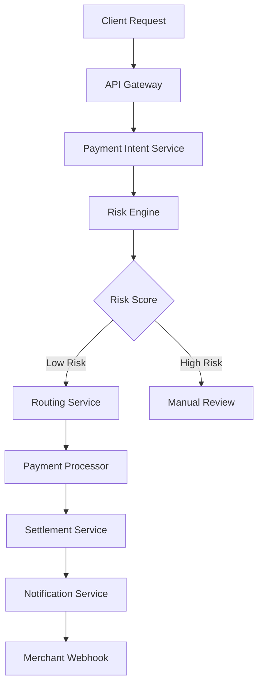

# Payment Processing Systems: Real-World Fintech Scenarios

## Quick Read (10 minutes)

### Executive Summary
Payment processing systems handle billions of dollars in transactions daily, requiring extreme reliability, security, and compliance. This collection presents real-world scenarios from major payment processors, covering fraud detection, regulatory compliance, scaling challenges, and system failures with recovery strategies.

### Key Challenges Covered
- **High-Volume Transaction Processing**: Handling millions of transactions per second
- **Fraud Detection**: Real-time risk assessment and prevention
- **Regulatory Compliance**: PCI DSS, PSD2, AML, and regional requirements
- **System Reliability**: 99.99% uptime requirements and disaster recovery
- **Global Scaling**: Multi-region deployment and currency handling

### Critical Success Factors
- **Idempotency**: Ensuring transaction uniqueness and preventing duplicates
- **Eventual Consistency**: Managing distributed transaction states
- **Real-time Monitoring**: Detecting anomalies and system issues instantly
- **Compliance Automation**: Automated reporting and audit trails
- **Graceful Degradation**: Maintaining service during partial failures

---

## Case Study 1: Stripe's Transaction Processing Architecture

### Problem Statement
Stripe processes over $640 billion annually across 46 countries, requiring a system that can handle massive scale while maintaining sub-100ms response times and 99.99% uptime. The challenge was building a globally distributed payment processing system that could handle diverse payment methods, currencies, and regulatory requirements.

### Technical Challenges

#### 1. Global Transaction Routing
```javascript
// Simplified transaction routing logic
class TransactionRouter {
  async routeTransaction(transaction) {
    const region = this.determineOptimalRegion(transaction);
    const processor = this.selectProcessor(transaction.paymentMethod, region);
    
    // Implement circuit breaker pattern
    if (this.circuitBreaker.isOpen(processor)) {
      return this.fallbackProcessor(transaction);
    }
    
    return this.processWithRetry(transaction, processor);
  }
  
  determineOptimalRegion(transaction) {
    // Consider: latency, compliance, processor availability
    const factors = {
      userLocation: transaction.customer.country,
      cardIssuer: transaction.card.issuerCountry,
      merchantLocation: transaction.merchant.country,
      regulatoryRequirements: this.getComplianceRequirements(transaction)
    };
    
    return this.regionSelector.optimize(factors);
  }
}
```

#### 2. Idempotency and Duplicate Prevention
```javascript
// Idempotency key implementation
class IdempotencyManager {
  async processPayment(paymentIntent, idempotencyKey) {
    // Check if we've seen this idempotency key before
    const existingResult = await this.redis.get(`idem:${idempotencyKey}`);
    if (existingResult) {
      return JSON.parse(existingResult);
    }
    
    // Use distributed lock to prevent race conditions
    const lock = await this.acquireLock(`lock:${idempotencyKey}`, 30000);
    if (!lock) {
      throw new Error('Unable to acquire idempotency lock');
    }
    
    try {
      const result = await this.executePayment(paymentIntent);
      
      // Store result with TTL (24 hours)
      await this.redis.setex(`idem:${idempotencyKey}`, 86400, JSON.stringify(result));
      
      return result;
    } finally {
      await this.releaseLock(lock);
    }
  }
}
```

### Solution Architecture

#### Microservices Design
- **Payment Intent Service**: Manages payment lifecycle
- **Risk Engine**: Real-time fraud detection
- **Routing Service**: Optimal processor selection
- **Compliance Service**: Regulatory requirement handling
- **Notification Service**: Webhooks and event streaming

#### Data Flow


### Performance Metrics
- **Throughput**: 4,000+ transactions per second peak
- **Latency**: P95 < 100ms for payment processing
- **Availability**: 99.995% uptime (26 minutes downtime/year)
- **Fraud Detection**: <50ms additional latency for risk scoring

### Lessons Learned
1. **Eventual Consistency**: Accept that distributed systems will have temporary inconsistencies
2. **Circuit Breakers**: Essential for preventing cascade failures across payment processors
3. **Observability**: Comprehensive logging and monitoring are critical for debugging payment issues
4. **Regulatory Complexity**: Each region requires specialized compliance handling

### Interview Questions from This Scenario
1. How would you design a globally distributed payment processing system?
2. What strategies would you use to ensure idempotency in payment transactions?
3. How would you handle partial failures in a distributed payment system?
4. What are the key considerations for PCI DSS compliance in system design?

---

## Case Study 2: PayPal's Fraud Detection System

### Problem Statement
PayPal processes over $1.25 trillion in payment volume annually, making it a prime target for fraudsters. The challenge was building a real-time fraud detection system that could analyze millions of transactions per day while maintaining low false positive rates and sub-second response times.

### Technical Challenges

#### 1. Real-Time Risk Scoring
```javascript
// Simplified fraud detection engine
class FraudDetectionEngine {
  async assessRisk(transaction) {
    const features = await this.extractFeatures(transaction);
    const riskScore = await this.calculateRiskScore(features);
    
    return {
      score: riskScore,
      decision: this.makeDecision(riskScore),
      reasons: this.explainDecision(features, riskScore),
      recommendedActions: this.getRecommendedActions(riskScore)
    };
  }
  
  async extractFeatures(transaction) {
    const [
      userBehavior,
      deviceFingerprint,
      networkAnalysis,
      transactionPattern,
      merchantRisk
    ] = await Promise.all([
      this.analyzeUserBehavior(transaction.userId),
      this.getDeviceFingerprint(transaction.deviceId),
      this.analyzeNetworkSignals(transaction.ipAddress),
      this.analyzeTransactionPattern(transaction),
      this.assessMerchantRisk(transaction.merchantId)
    ]);
    
    return {
      userBehavior,
      deviceFingerprint,
      networkAnalysis,
      transactionPattern,
      merchantRisk,
      velocity: await this.calculateVelocity(transaction),
      geolocation: await this.analyzeGeolocation(transaction)
    };
  }
}
```

#### 2. Machine Learning Pipeline
```javascript
// ML model serving infrastructure
class MLModelService {
  constructor() {
    this.models = new Map();
    this.featureStore = new FeatureStore();
    this.modelVersions = new ModelVersionManager();
  }
  
  async predictFraud(features) {
    // A/B test different models
    const modelVersion = this.modelVersions.getActiveVersion();
    const model = this.models.get(modelVersion);
    
    // Feature engineering
    const engineeredFeatures = await this.engineerFeatures(features);
    
    // Model prediction with confidence intervals
    const prediction = await model.predict(engineeredFeatures);
    
    // Log for model monitoring
    await this.logPrediction(features, prediction, modelVersion);
    
    return prediction;
  }
  
  async engineerFeatures(rawFeatures) {
    // Time-based features
    const timeFeatures = this.extractTimeFeatures(rawFeatures.timestamp);
    
    // Velocity features
    const velocityFeatures = await this.calculateVelocityFeatures(rawFeatures);
    
    // Network features
    const networkFeatures = this.extractNetworkFeatures(rawFeatures.ipAddress);
    
    return {
      ...rawFeatures,
      ...timeFeatures,
      ...velocityFeatures,
      ...networkFeatures
    };
  }
}
```

### Solution Architecture

#### Real-Time Processing Pipeline
- **Event Streaming**: Kafka for transaction events
- **Feature Engineering**: Real-time feature computation
- **Model Serving**: TensorFlow Serving for ML models
- **Decision Engine**: Rule-based and ML-based decisions
- **Feedback Loop**: Continuous model improvement

### Performance Metrics
- **Processing Speed**: <100ms for fraud assessment
- **Accuracy**: 99.5% precision, 94% recall
- **False Positive Rate**: <0.1% for legitimate transactions
- **Model Updates**: Daily retraining with new fraud patterns

### War Story: The Great Fraud Attack of 2019
**Incident**: Coordinated attack using stolen credit card data across 50,000+ accounts
**Impact**: $2.3M in attempted fraudulent transactions
**Response Time**: 12 minutes to detect and block attack
**Recovery**: Implemented enhanced velocity checks and device fingerprinting

### Lessons Learned
1. **Feature Engineering**: Domain expertise is crucial for effective fraud detection
2. **Model Explainability**: Regulatory requirements demand interpretable decisions
3. **Feedback Loops**: Continuous learning from fraud analyst decisions improves models
4. **Adversarial Adaptation**: Fraudsters adapt quickly; models must evolve continuously

---

## Case Study 3: Square's Point-of-Sale Payment Processing

### Problem Statement
Square needed to build a payment processing system that could handle both online and offline transactions, with the ability to sync when connectivity was restored. The challenge was ensuring transaction integrity across unreliable network conditions while maintaining PCI compliance.

### Technical Challenges

#### 1. Offline Transaction Handling
```javascript
// Offline-capable payment processor
class OfflinePaymentProcessor {
  constructor() {
    this.localQueue = new PersistentQueue();
    this.syncManager = new SyncManager();
    this.encryptionService = new EncryptionService();
  }
  
  async processPayment(paymentData) {
    // Encrypt sensitive data immediately
    const encryptedPayment = await this.encryptionService.encrypt(paymentData);
    
    if (this.isOnline()) {
      try {
        return await this.processOnline(encryptedPayment);
      } catch (error) {
        // Fallback to offline processing
        return await this.processOffline(encryptedPayment);
      }
    } else {
      return await this.processOffline(encryptedPayment);
    }
  }
  
  async processOffline(encryptedPayment) {
    // Generate local transaction ID
    const localTxnId = this.generateLocalTxnId();
    
    // Store in encrypted local queue
    await this.localQueue.enqueue({
      localTxnId,
      encryptedPayment,
      timestamp: Date.now(),
      status: 'pending_sync'
    });
    
    // Return optimistic response
    return {
      transactionId: localTxnId,
      status: 'pending',
      message: 'Transaction queued for processing'
    };
  }
}
```

#### 2. Synchronization and Conflict Resolution
```javascript
// Sync manager for offline transactions
class SyncManager {
  async syncPendingTransactions() {
    const pendingTxns = await this.localQueue.getPending();
    const results = [];
    
    for (const txn of pendingTxns) {
      try {
        const result = await this.syncTransaction(txn);
        results.push(result);
      } catch (error) {
        await this.handleSyncError(txn, error);
      }
    }
    
    return results;
  }
  
  async syncTransaction(localTxn) {
    // Check for duplicates on server
    const serverTxn = await this.checkForDuplicate(localTxn);
    
    if (serverTxn) {
      // Handle duplicate - update local record
      return await this.reconcileDuplicate(localTxn, serverTxn);
    }
    
    // Process new transaction
    const result = await this.processOnServer(localTxn);
    
    // Update local record with server response
    await this.updateLocalRecord(localTxn.localTxnId, result);
    
    return result;
  }
}
```

### Solution Architecture

#### Hybrid Online/Offline System
- **Local Storage**: Encrypted SQLite for offline transactions
- **Sync Service**: Background synchronization with conflict resolution
- **Encryption**: End-to-end encryption for PCI compliance
- **State Management**: Transaction state machine for status tracking

### Performance Metrics
- **Offline Capability**: 7 days of offline operation
- **Sync Speed**: 1000 transactions/minute synchronization
- **Data Integrity**: 100% transaction reconciliation
- **Encryption Overhead**: <5ms additional processing time

### War Story: The Hurricane Sandy Outage
**Incident**: Hurricane Sandy caused widespread internet outages in NYC
**Challenge**: Merchants needed to continue accepting payments without connectivity
**Solution**: Offline mode processed 50,000+ transactions over 3 days
**Recovery**: 99.8% successful synchronization when connectivity restored

---

## Case Study 4: Adyen's Global Payment Orchestration

### Problem Statement
Adyen needed to support 250+ payment methods across 190 markets, each with unique requirements, regulations, and technical specifications. The challenge was building a unified API that could orchestrate payments across diverse processors while optimizing for authorization rates and costs.

### Technical Challenges

#### 1. Payment Method Abstraction
```javascript
// Payment method abstraction layer
class PaymentOrchestrator {
  constructor() {
    this.processors = new Map();
    this.routingEngine = new SmartRoutingEngine();
    this.complianceEngine = new ComplianceEngine();
  }
  
  async processPayment(paymentRequest) {
    // Validate compliance requirements
    await this.complianceEngine.validate(paymentRequest);
    
    // Determine optimal routing
    const routingDecision = await this.routingEngine.route(paymentRequest);
    
    // Execute payment with fallback
    return await this.executeWithFallback(paymentRequest, routingDecision);
  }
  
  async executeWithFallback(request, routing) {
    for (const route of routing.routes) {
      try {
        const processor = this.processors.get(route.processorId);
        const result = await processor.process(request, route.config);
        
        if (result.success) {
          await this.recordSuccess(route, result);
          return result;
        }
      } catch (error) {
        await this.recordFailure(route, error);
        continue; // Try next route
      }
    }
    
    throw new Error('All payment routes failed');
  }
}
```

#### 2. Smart Routing Algorithm
```javascript
// Intelligent payment routing
class SmartRoutingEngine {
  async route(paymentRequest) {
    const candidates = await this.getCandidateProcessors(paymentRequest);
    const scoredRoutes = await this.scoreRoutes(candidates, paymentRequest);
    
    return {
      routes: scoredRoutes.sort((a, b) => b.score - a.score),
      reasoning: this.explainRouting(scoredRoutes)
    };
  }
  
  async scoreRoutes(candidates, request) {
    const scores = await Promise.all(
      candidates.map(async (candidate) => {
        const [
          authRate,
          cost,
          latency,
          reliability
        ] = await Promise.all([
          this.getAuthorizationRate(candidate, request),
          this.getCost(candidate, request),
          this.getLatency(candidate, request),
          this.getReliability(candidate)
        ]);
        
        // Weighted scoring algorithm
        const score = (
          authRate * 0.4 +
          (1 - cost) * 0.2 +
          (1 - latency) * 0.2 +
          reliability * 0.2
        );
        
        return {
          processorId: candidate.id,
          score,
          metrics: { authRate, cost, latency, reliability },
          config: candidate.config
        };
      })
    );
    
    return scores;
  }
}
```

### Solution Architecture

#### Multi-Processor Integration
- **Processor Adapters**: Standardized interfaces for different processors
- **Routing Engine**: ML-based routing optimization
- **Compliance Layer**: Automated regulatory requirement handling
- **Monitoring**: Real-time performance tracking across processors

### Performance Metrics
- **Authorization Rates**: 85%+ average across all payment methods
- **Processing Time**: P95 < 200ms including routing decisions
- **Processor Uptime**: 99.9% effective uptime through redundancy
- **Cost Optimization**: 15% reduction in processing fees through smart routing

### Lessons Learned
1. **Processor Diversity**: Multiple processors provide resilience and optimization opportunities
2. **Data-Driven Routing**: Historical performance data significantly improves routing decisions
3. **Compliance Automation**: Manual compliance checking doesn't scale globally
4. **Continuous Optimization**: Routing algorithms must adapt to changing processor performance

---

## Case Study 5: Braintree's Marketplace Payment Splitting

### Problem Statement
Braintree needed to support marketplace platforms where payments needed to be split between multiple parties (platform, sellers, service providers) while handling complex fee structures, tax calculations, and regulatory requirements across jurisdictions.

### Technical Challenges

#### 1. Multi-Party Payment Splitting
```javascript
// Marketplace payment splitting engine
class PaymentSplittingEngine {
  async splitPayment(paymentRequest) {
    const splitConfig = await this.calculateSplits(paymentRequest);
    const taxCalculations = await this.calculateTaxes(paymentRequest, splitConfig);
    
    return await this.executeSplit(paymentRequest, splitConfig, taxCalculations);
  }
  
  async calculateSplits(request) {
    const marketplace = await this.getMarketplace(request.marketplaceId);
    const splits = [];
    
    // Platform fee
    splits.push({
      recipient: marketplace.platformAccount,
      amount: this.calculatePlatformFee(request.amount, marketplace.feeStructure),
      type: 'platform_fee'
    });
    
    // Seller payment
    splits.push({
      recipient: request.sellerAccount,
      amount: request.amount - splits[0].amount,
      type: 'seller_payment'
    });
    
    // Handle additional service providers
    if (request.serviceProviders) {
      return this.handleServiceProviderSplits(splits, request);
    }
    
    return splits;
  }
  
  async executeSplit(request, splits, taxes) {
    const transactions = [];
    
    // Create sub-transactions for each split
    for (const split of splits) {
      const subTransaction = await this.createSubTransaction({
        parentTransactionId: request.transactionId,
        recipient: split.recipient,
        amount: split.amount,
        taxes: taxes[split.recipient],
        metadata: {
          splitType: split.type,
          originalAmount: request.amount
        }
      });
      
      transactions.push(subTransaction);
    }
    
    // Execute all splits atomically
    return await this.executeAtomicSplits(transactions);
  }
}
```

#### 2. Escrow and Settlement Management
```javascript
// Escrow service for marketplace transactions
class EscrowService {
  async createEscrow(paymentRequest) {
    const escrowAccount = await this.createEscrowAccount(paymentRequest);
    
    // Hold funds in escrow
    const holdResult = await this.holdFunds(escrowAccount, paymentRequest.amount);
    
    // Set up release conditions
    await this.setupReleaseConditions(escrowAccount, paymentRequest.conditions);
    
    return {
      escrowId: escrowAccount.id,
      status: 'held',
      releaseConditions: paymentRequest.conditions,
      expiryDate: this.calculateExpiryDate(paymentRequest)
    };
  }
  
  async releaseFunds(escrowId, releaseRequest) {
    const escrow = await this.getEscrow(escrowId);
    
    // Validate release conditions
    const validationResult = await this.validateRelease(escrow, releaseRequest);
    if (!validationResult.valid) {
      throw new Error(`Release validation failed: ${validationResult.reason}`);
    }
    
    // Execute the split payment
    const splitResult = await this.paymentSplitter.splitPayment({
      amount: escrow.heldAmount,
      splits: releaseRequest.splits,
      originalTransaction: escrow.originalTransaction
    });
    
    // Update escrow status
    await this.updateEscrowStatus(escrowId, 'released', splitResult);
    
    return splitResult;
  }
}
```

### Solution Architecture

#### Marketplace Payment Flow
- **Payment Capture**: Initial payment capture to platform account
- **Split Calculation**: Dynamic fee and split calculation
- **Escrow Management**: Temporary fund holding with release conditions
- **Settlement**: Automated or manual fund release to recipients
- **Tax Handling**: Jurisdiction-specific tax calculation and reporting

### Performance Metrics
- **Split Accuracy**: 99.99% accurate payment splitting
- **Settlement Speed**: Same-day settlement for most transactions
- **Escrow Management**: Support for 30-day+ escrow periods
- **Tax Compliance**: Automated tax reporting in 15+ jurisdictions

### War Story: The Black Friday Marketplace Meltdown
**Incident**: 10x traffic spike caused payment splitting delays during Black Friday
**Impact**: $50M in payments stuck in processing queue
**Root Cause**: Database contention on split calculation queries
**Solution**: Implemented async processing and database sharding
**Recovery Time**: 4 hours to clear backlog
**Prevention**: Added circuit breakers and queue monitoring

---

## Case Study 6: Regulatory Compliance at Scale

### Problem Statement
A major payment processor needed to implement comprehensive compliance across multiple jurisdictions including PCI DSS, PSD2, GDPR, and various AML requirements while maintaining system performance and user experience.

### Technical Challenges

#### 1. Automated Compliance Monitoring
```javascript
// Compliance monitoring system
class ComplianceMonitor {
  constructor() {
    this.rules = new ComplianceRuleEngine();
    this.auditLogger = new AuditLogger();
    this.alertManager = new AlertManager();
  }
  
  async monitorTransaction(transaction) {
    const complianceChecks = await Promise.all([
      this.checkAML(transaction),
      this.checkPSD2(transaction),
      this.checkGDPR(transaction),
      this.checkPCI(transaction)
    ]);
    
    const violations = complianceChecks.filter(check => !check.compliant);
    
    if (violations.length > 0) {
      await this.handleViolations(transaction, violations);
    }
    
    // Log all compliance checks for audit
    await this.auditLogger.log({
      transactionId: transaction.id,
      checks: complianceChecks,
      timestamp: Date.now()
    });
    
    return {
      compliant: violations.length === 0,
      violations,
      auditTrail: complianceChecks
    };
  }
  
  async checkAML(transaction) {
    // Anti-Money Laundering checks
    const riskScore = await this.calculateAMLRisk(transaction);
    const sanctionsCheck = await this.checkSanctionsList(transaction);
    
    return {
      type: 'AML',
      compliant: riskScore < 0.7 && sanctionsCheck.clear,
      details: {
        riskScore,
        sanctionsCheck,
        thresholds: this.getAMLThresholds(transaction.jurisdiction)
      }
    };
  }
}
```

#### 2. Data Privacy and GDPR Compliance
```javascript
// GDPR compliance service
class GDPRComplianceService {
  async handleDataRequest(request) {
    switch (request.type) {
      case 'access':
        return await this.handleDataAccess(request);
      case 'deletion':
        return await this.handleDataDeletion(request);
      case 'portability':
        return await this.handleDataPortability(request);
      case 'rectification':
        return await this.handleDataRectification(request);
      default:
        throw new Error(`Unknown GDPR request type: ${request.type}`);
    }
  }
  
  async handleDataDeletion(request) {
    // Identify all data related to the user
    const dataLocations = await this.findUserData(request.userId);
    
    // Check for legal retention requirements
    const retentionChecks = await this.checkRetentionRequirements(dataLocations);
    
    // Anonymize data that can't be deleted
    const anonymizationTasks = retentionChecks
      .filter(check => check.mustRetain)
      .map(check => this.anonymizeData(check.location));
    
    // Delete data that can be removed
    const deletionTasks = retentionChecks
      .filter(check => !check.mustRetain)
      .map(check => this.deleteData(check.location));
    
    await Promise.all([...anonymizationTasks, ...deletionTasks]);
    
    // Generate compliance report
    return this.generateDeletionReport(request, retentionChecks);
  }
}
```

### Solution Architecture

#### Compliance Infrastructure
- **Rule Engine**: Configurable compliance rules by jurisdiction
- **Audit System**: Immutable audit logs for all compliance activities
- **Data Classification**: Automated PII and sensitive data identification
- **Retention Management**: Automated data lifecycle management
- **Reporting**: Automated regulatory reporting and notifications

### Performance Metrics
- **Compliance Coverage**: 100% transaction compliance monitoring
- **Response Time**: <50ms additional latency for compliance checks
- **Audit Completeness**: 100% audit trail coverage
- **Regulatory Reporting**: Automated reports for 25+ jurisdictions

### War Story: The GDPR Data Deletion Crisis
**Incident**: GDPR data deletion request affected user with 5 years of transaction history
**Challenge**: Legal requirement to retain financial records vs. GDPR right to deletion
**Complexity**: Data spread across 15 microservices and 3 data centers
**Solution**: Implemented data anonymization while preserving audit requirements
**Timeline**: 30-day compliance window met with 2 days to spare
**Outcome**: Developed automated GDPR compliance workflow

---

## Common Interview Questions from These Scenarios

### System Design Questions
1. **How would you design a payment processing system that handles 10,000 TPS?**
   - Focus on: Horizontal scaling, database sharding, caching strategies
   - Consider: Idempotency, eventual consistency, circuit breakers

2. **Design a fraud detection system for real-time transaction monitoring**
   - Focus on: Feature engineering, model serving, feedback loops
   - Consider: False positive rates, explainability, adversarial adaptation

3. **How would you implement payment splitting for a marketplace platform?**
   - Focus on: Atomic transactions, escrow management, tax calculations
   - Consider: Multi-party settlements, regulatory compliance, error handling

### Technical Deep-Dive Questions
4. **Explain how you would ensure idempotency in payment transactions**
   - Discuss: Idempotency keys, distributed locks, race condition handling
   - Consider: Database constraints, caching strategies, retry mechanisms

5. **How would you handle offline payment processing with eventual synchronization?**
   - Focus on: Local storage, encryption, conflict resolution
   - Consider: Data integrity, sync strategies, error recovery

6. **Describe your approach to PCI DSS compliance in a microservices architecture**
   - Discuss: Data encryption, network segmentation, access controls
   - Consider: Audit logging, vulnerability management, compliance monitoring

### Behavioral Questions
7. **Tell me about a time you had to handle a critical payment system outage**
   - Structure using STAR method
   - Focus on: Incident response, communication, root cause analysis

8. **Describe a situation where you had to balance security requirements with user experience**
   - Discuss: Trade-off analysis, stakeholder communication, iterative improvement

### Performance and Scaling Questions
9. **How would you optimize a payment system for global deployment?**
   - Focus on: Regional routing, data locality, compliance requirements
   - Consider: Latency optimization, disaster recovery, cost management

10. **Explain your approach to monitoring and alerting for payment systems**
    - Discuss: SLA definitions, metric selection, escalation procedures
    - Consider: Business impact, false positive management, incident response

---

## Key Takeaways for Interview Preparation

### Technical Concepts to Master
- **Distributed Transactions**: ACID properties, 2PC, saga patterns
- **Event Sourcing**: Audit trails, event replay, state reconstruction
- **Circuit Breakers**: Failure isolation, graceful degradation
- **Idempotency**: Duplicate prevention, retry safety
- **Encryption**: PCI DSS requirements, key management, data protection

### Business Context Understanding
- **Regulatory Landscape**: PCI DSS, PSD2, GDPR, AML requirements
- **Financial Metrics**: Authorization rates, processing costs, chargeback rates
- **Risk Management**: Fraud detection, compliance monitoring, incident response
- **Global Considerations**: Multi-currency, regional regulations, tax handling

### System Design Patterns
- **Microservices**: Service boundaries, communication patterns, data consistency
- **Event-Driven Architecture**: Async processing, event sourcing, CQRS
- **Caching Strategies**: Redis patterns, cache invalidation, performance optimization
- **Database Design**: Sharding strategies, read replicas, consistency models

### Operational Excellence
- **Monitoring**: SLA tracking, business metrics, technical metrics
- **Incident Response**: Runbooks, escalation procedures, post-mortem analysis
- **Deployment**: Blue-green deployments, canary releases, rollback strategies
- **Security**: Threat modeling, vulnerability management, access controls

These real-world scenarios provide the foundation for demonstrating deep understanding of payment systems in technical interviews, combining theoretical knowledge with practical experience from industry-leading companies.