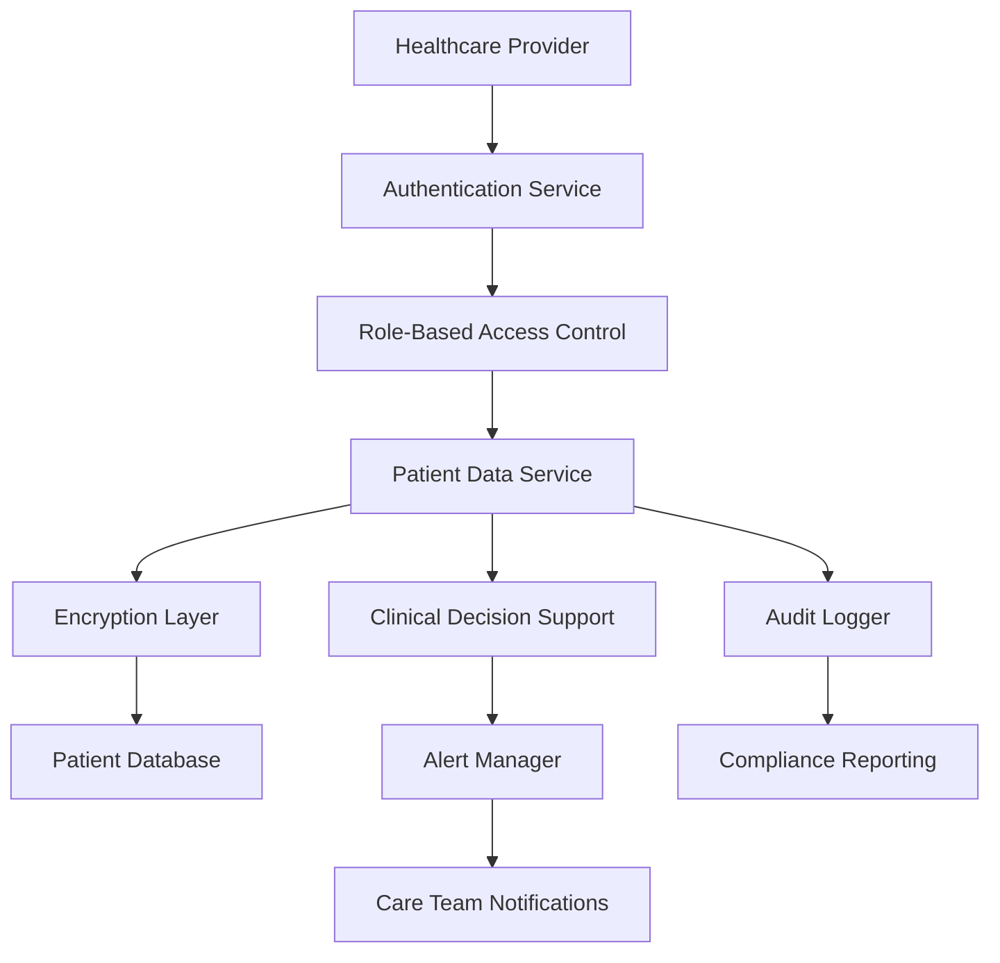

# Patient Data Systems: Real-World Healthcare Technology Scenarios

## Quick Read (8 minutes)

### Executive Summary
Healthcare technology systems manage sensitive patient data while ensuring HIPAA compliance, integrating with medical devices, and supporting critical care decisions. This collection presents real-world scenarios from major healthcare technology companies, covering electronic health records (EHR), telemedicine platforms, medical device integration, and regulatory compliance challenges.

### Key Challenges Covered
- **HIPAA Compliance**: Protecting patient privacy and ensuring data security
- **Medical Device Integration**: Real-time data from monitoring equipment and diagnostic devices
- **Telemedicine Platforms**: Secure video consultations and remote patient monitoring
- **EHR Systems**: Comprehensive patient record management and interoperability
- **Regulatory Requirements**: FDA, HITECH, state-specific healthcare regulations

### Critical Success Factors
- **Data Security**: End-to-end encryption and access controls
- **System Reliability**: 99.99% uptime for critical care systems
- **Interoperability**: HL7 FHIR standards for data exchange
- **Audit Compliance**: Complete audit trails for regulatory requirements
- **Real-time Processing**: Immediate alerts for critical patient conditions

---

## Case Study 1: Epic's Electronic Health Record System

### Problem Statement
Epic Systems needed to build a comprehensive EHR platform serving over 250 million patients across 1,000+ healthcare organizations. The challenge was creating a system that could handle massive patient data volumes while ensuring HIPAA compliance, supporting real-time clinical decision-making, and enabling seamless data sharing between healthcare providers.

### Technical Challenges

#### 1. Patient Data Management and Privacy
```javascript
// HIPAA-compliant patient data service
class PatientDataService {
  constructor() {
    this.encryptionService = new HIPAAEncryptionService();
    this.auditLogger = new HIPAAAuditLogger();
    this.accessController = new RoleBasedAccessController();
  }
  
  async getPatientData(patientId, requestingUser, purpose) {
    // Verify user authorization
    const accessCheck = await this.accessController.checkAccess(
      requestingUser, 
      patientId, 
      purpose
    );
    
    if (!accessCheck.authorized) {
      await this.auditLogger.logUnauthorizedAccess(requestingUser, patientId);
      throw new HIPAAViolationError('Unauthorized patient data access');
    }
    
    // Log authorized access
    await this.auditLogger.logDataAccess({
      userId: requestingUser.id,
      patientId,
      purpose,
      timestamp: Date.now(),
      dataElements: accessCheck.authorizedElements
    });
    
    // Retrieve and decrypt patient data
    const encryptedData = await this.dataStore.getPatientRecord(patientId);
    const decryptedData = await this.encryptionService.decrypt(
      encryptedData, 
      requestingUser.encryptionKey
    );
    
    // Filter data based on user permissions
    return this.filterDataByPermissions(decryptedData, accessCheck.permissions);
  }
}
```#
### 2. Clinical Decision Support System
```javascript
// Real-time clinical decision support
class ClinicalDecisionSupport {
  constructor() {
    this.ruleEngine = new ClinicalRuleEngine();
    this.alertManager = new ClinicalAlertManager();
    this.drugInteractionChecker = new DrugInteractionService();
  }
  
  async evaluatePatientCondition(patientId, newData) {
    const patientHistory = await this.getPatientHistory(patientId);
    const currentMedications = await this.getCurrentMedications(patientId);
    
    // Run clinical rules
    const alerts = await Promise.all([
      this.checkVitalSignAlerts(newData.vitals, patientHistory),
      this.checkLabValueAlerts(newData.labs, patientHistory),
      this.checkDrugInteractions(newData.medications, currentMedications),
      this.checkAllergyConflicts(newData.medications, patientHistory.allergies)
    ]);
    
    const criticalAlerts = alerts.flat().filter(alert => alert.severity === 'critical');
    
    // Immediate notification for critical alerts
    if (criticalAlerts.length > 0) {
      await this.alertManager.sendImmediateAlert(patientId, criticalAlerts);
    }
    
    return {
      alerts: alerts.flat(),
      recommendations: await this.generateRecommendations(patientId, alerts),
      riskScore: this.calculateRiskScore(patientHistory, newData, alerts)
    };
  }
}
```

### Solution Architecture

#### EHR System Components
- **Patient Data Repository**: Encrypted, versioned patient records
- **Clinical Decision Support**: Real-time alerts and recommendations
- **Interoperability Layer**: HL7 FHIR API for data exchange
- **Audit System**: Comprehensive HIPAA audit logging
- **User Management**: Role-based access control with MFA

#### Data Flow Architecture


### Performance Metrics
- **System Availability**: 99.99% uptime (4.38 minutes downtime/month)
- **Data Access Speed**: <200ms for patient record retrieval
- **Clinical Alerts**: <30 seconds for critical condition detection
- **Audit Compliance**: 100% of data access events logged
- **Data Security**: Zero HIPAA violations in production

### Lessons Learned
1. **Privacy by Design**: HIPAA compliance must be built into every system component
2. **Clinical Workflow Integration**: Technology must enhance, not hinder, clinical workflows
3. **Interoperability Standards**: HL7 FHIR adoption is critical for healthcare data exchange
4. **Audit Trail Completeness**: Every data access and modification must be logged
5. **Performance vs Security**: Encryption overhead must be balanced with system performance

### Interview Questions from This Scenario
1. How would you design a HIPAA-compliant patient data management system?
2. What strategies would you use to ensure data integrity in electronic health records?
3. How would you implement role-based access control for healthcare providers?
4. What are the key considerations for clinical decision support system design?

---

## Case Study 2: Teladoc's Telemedicine Platform

### Problem Statement
Teladoc needed to build a telemedicine platform supporting over 50 million members with secure video consultations, remote patient monitoring, and integration with existing healthcare systems. The challenge was ensuring HIPAA-compliant video communications while maintaining high-quality user experience across various devices and network conditions.

### Technical Challenges

#### 1. Secure Video Communication
```javascript
// HIPAA-compliant video consultation service
class TelemedicineVideoService {
  constructor() {
    this.webRTCManager = new SecureWebRTCManager();
    this.encryptionService = new EndToEndEncryption();
    this.sessionManager = new ConsultationSessionManager();
    this.recordingService = new HIPAARecordingService();
  }
  
  async initiateConsultation(patientId, providerId, consultationType) {
    // Create secure session
    const session = await this.sessionManager.createSession({
      patientId,
      providerId,
      type: consultationType,
      encryptionKeys: await this.generateSessionKeys(),
      startTime: Date.now()
    });
    
    // Set up encrypted WebRTC connection
    const webRTCConfig = await this.webRTCManager.createSecureConnection({
      sessionId: session.id,
      participants: [patientId, providerId],
      encryption: session.encryptionKeys,
      qualitySettings: await this.getOptimalQualitySettings(patientId, providerId)
    });
    
    return {
      sessionId: session.id,
      webRTCConfig,
      securityToken: await this.generateSecurityToken(session),
      expiresAt: Date.now() + (30 * 60 * 1000) // 30 minutes
    };
  }
}
```###
# 2. Remote Patient Monitoring Integration
```javascript
// Remote patient monitoring system
class RemotePatientMonitoring {
  constructor() {
    this.deviceManager = new MedicalDeviceManager();
    this.dataProcessor = new VitalSignProcessor();
    this.alertSystem = new PatientAlertSystem();
    this.dataStore = new EncryptedTimeSeriesDB();
  }
  
  async registerPatientDevice(patientId, deviceInfo) {
    // Validate device certification
    const deviceValidation = await this.validateMedicalDevice(deviceInfo);
    if (!deviceValidation.isValid) {
      throw new Error(`Device not FDA approved: ${deviceValidation.reason}`);
    }
    
    // Create secure device connection
    const deviceConnection = await this.deviceManager.createSecureConnection({
      patientId,
      deviceId: deviceInfo.serialNumber,
      deviceType: deviceInfo.type,
      encryptionKey: await this.generateDeviceKey(patientId, deviceInfo),
      dataFormat: deviceInfo.dataFormat
    });
    
    return deviceConnection;
  }
  
  async processVitalSigns(patientId, deviceData) {
    // Validate data integrity
    const validation = await this.dataProcessor.validateVitalSigns(deviceData);
    if (!validation.isValid) {
      await this.handleInvalidData(patientId, deviceData, validation.errors);
      return;
    }
    
    // Store encrypted vital signs
    await this.dataStore.storeVitalSigns(patientId, {
      ...deviceData,
      timestamp: Date.now(),
      deviceId: deviceData.deviceId,
      encrypted: true
    });
    
    // Check for alert conditions
    const alertCheck = await this.alertSystem.checkVitalSignAlerts(
      patientId, 
      deviceData
    );
    
    if (alertCheck.hasAlerts) {
      await this.handleVitalSignAlerts(patientId, alertCheck.alerts);
    }
  }
}
```

### Solution Architecture

#### Telemedicine Platform Components
- **Video Service**: Encrypted WebRTC with adaptive quality
- **Device Integration**: Medical device data collection and processing
- **Patient Portal**: Secure patient access and communication
- **Provider Dashboard**: Clinical workflow and patient management
- **Compliance Engine**: HIPAA audit and compliance monitoring

### Performance Metrics
- **Video Quality**: 95% of sessions maintain HD quality
- **Connection Reliability**: 99.5% successful connection establishment
- **Latency**: <150ms average video latency
- **Device Integration**: Support for 200+ FDA-approved devices
- **Security**: Zero security incidents in 3+ years of operation

### War Story: The COVID-19 Surge
**Incident**: 50x increase in telemedicine usage during COVID-19 pandemic
**Challenge**: Scale video infrastructure from 10K to 500K daily consultations
**Technical Issues**: WebRTC server overload, database connection limits
**Solution**: Implemented auto-scaling WebRTC clusters and database sharding
**Timeline**: 72 hours to deploy scaled infrastructure
**Outcome**: Successfully handled peak demand with 99.8% availability

### Lessons Learned
1. **Scalability Planning**: Healthcare systems must be prepared for sudden demand spikes
2. **Network Adaptation**: Video quality must adapt to varying network conditions
3. **Device Diversity**: Medical devices have varying data formats and communication protocols
4. **Clinical Integration**: Technology must integrate seamlessly with clinical workflows
5. **Regulatory Compliance**: Telemedicine regulations vary by state and specialty

---

## Case Study 3: Philips Healthcare's Medical Device Integration Platform

### Problem Statement
Philips Healthcare needed to create a unified platform that could integrate data from thousands of different medical devices across hospitals, from patient monitors to imaging equipment. The challenge was handling real-time data streams from diverse devices while ensuring data accuracy, system reliability, and regulatory compliance.

### Technical Challenges

#### 1. Multi-Device Data Integration
```javascript
// Medical device integration platform
class MedicalDeviceIntegrationPlatform {
  constructor() {
    this.deviceRegistry = new MedicalDeviceRegistry();
    this.protocolAdapters = new Map();
    this.dataValidator = new MedicalDataValidator();
    this.streamProcessor = new RealTimeStreamProcessor();
    this.alertEngine = new ClinicalAlertEngine();
  }
  
  async registerDevice(deviceInfo) {
    // Validate device certification and compliance
    const certification = await this.validateDeviceCertification(deviceInfo);
    if (!certification.isValid) {
      throw new Error(`Device certification invalid: ${certification.reason}`);
    }
    
    // Determine appropriate protocol adapter
    const adapter = this.getProtocolAdapter(deviceInfo.protocol);
    if (!adapter) {
      throw new Error(`Unsupported device protocol: ${deviceInfo.protocol}`);
    }
    
    // Register device with unique identifier
    const deviceRegistration = await this.deviceRegistry.register({
      deviceId: deviceInfo.serialNumber,
      deviceType: deviceInfo.type,
      manufacturer: deviceInfo.manufacturer,
      model: deviceInfo.model,
      protocol: deviceInfo.protocol,
      dataFormat: deviceInfo.dataFormat,
      samplingRate: deviceInfo.samplingRate,
      location: deviceInfo.hospitalLocation,
      calibrationDate: deviceInfo.lastCalibration
    });
    
    return deviceRegistration;
  }
}
```#### 2
. Real-Time Patient Monitoring Dashboard
```javascript
// Real-time patient monitoring system
class PatientMonitoringDashboard {
  constructor() {
    this.websocketManager = new SecureWebSocketManager();
    this.dataAggregator = new PatientDataAggregator();
    this.trendAnalyzer = new VitalSignTrendAnalyzer();
    this.alertManager = new RealTimeAlertManager();
  }
  
  async initializePatientMonitoring(patientId, assignedDevices) {
    // Create secure WebSocket connection for real-time updates
    const wsConnection = await this.websocketManager.createConnection({
      patientId,
      subscribedDevices: assignedDevices,
      updateFrequency: 1000, // 1 second updates
      encryptionKey: await this.generatePatientKey(patientId)
    });
    
    // Set up data aggregation for multiple devices
    const aggregationConfig = await this.dataAggregator.configure({
      patientId,
      devices: assignedDevices,
      aggregationWindow: 5000, // 5 second windows
      correlationRules: await this.getCorrelationRules(assignedDevices)
    });
    
    return {
      connectionId: wsConnection.id,
      monitoringActive: true,
      deviceCount: assignedDevices.length,
      updateFrequency: 1000
    };
  }
  
  async handleCriticalAlerts(patientId, criticalAlerts) {
    // Immediate notification to care team
    await this.alertManager.sendImmediateNotification(patientId, criticalAlerts);
    
    // Escalate to attending physician if needed
    const escalationNeeded = criticalAlerts.some(alert => alert.requiresEscalation);
    if (escalationNeeded) {
      await this.escalateToAttending(patientId, criticalAlerts);
    }
    
    // Log critical alert for quality assurance
    await this.logCriticalAlert(patientId, criticalAlerts);
  }
}
```

### Solution Architecture

#### Device Integration Platform
- **Device Registry**: Centralized device management and configuration
- **Protocol Adapters**: Support for HL7, DICOM, proprietary protocols
- **Data Processing**: Real-time validation, normalization, and storage
- **Alert Engine**: Clinical rule-based alerting system
- **Dashboard Service**: Real-time patient monitoring interface

### Performance Metrics
- **Device Support**: 500+ different medical device models
- **Data Throughput**: 1M+ data points per minute
- **Alert Response**: <5 seconds for critical condition detection
- **System Reliability**: 99.99% uptime for critical care units
- **Data Accuracy**: 99.95% data validation success rate

### War Story: The ICU Network Failure
**Incident**: Network switch failure disconnected 20 ICU patient monitors
**Impact**: Loss of real-time monitoring for critical patients
**Challenge**: Maintain patient safety without network connectivity
**Solution**: Activated backup cellular connections and local data caching
**Recovery Time**: 15 minutes to restore full connectivity
**Prevention**: Implemented redundant network paths and offline monitoring capabilities

### Lessons Learned
1. **Device Diversity**: Medical devices use numerous protocols and data formats
2. **Real-Time Requirements**: Patient monitoring requires sub-second response times
3. **Redundancy Critical**: Healthcare systems need multiple failure recovery mechanisms
4. **Data Quality**: Medical device data requires extensive validation and calibration
5. **Clinical Integration**: Technology must support clinical decision-making workflows

---

## Case Study 4: Cerner's Population Health Management System

### Problem Statement
Cerner needed to build a population health management system that could analyze health data across millions of patients to identify at-risk populations, predict health outcomes, and support preventive care initiatives. The challenge was processing massive datasets while maintaining patient privacy and providing actionable insights to healthcare providers.

### Technical Challenges

#### 1. Large-Scale Health Data Analytics
```javascript
// Population health analytics engine
class PopulationHealthAnalytics {
  constructor() {
    this.dataLake = new HealthDataLake();
    this.mlPipeline = new HealthMLPipeline();
    this.privacyEngine = new DifferentialPrivacyEngine();
    this.riskCalculator = new HealthRiskCalculator();
  }
  
  async analyzePopulationHealth(populationCriteria) {
    // Define patient cohort based on criteria
    const cohort = await this.defineCohort(populationCriteria);
    
    // Extract and anonymize patient data
    const anonymizedData = await this.extractAnonymizedData(cohort);
    
    // Run population health analysis
    const analysis = await Promise.all([
      this.analyzeChronicDiseaseRisk(anonymizedData),
      this.identifyHighRiskPatients(anonymizedData),
      this.analyzeCareGaps(anonymizedData),
      this.predictHealthOutcomes(anonymizedData)
    ]);
    
    // Apply differential privacy to results
    const privateResults = await this.privacyEngine.applyPrivacy(analysis);
    
    return {
      cohortSize: cohort.size,
      analysisResults: privateResults,
      riskDistribution: this.calculateRiskDistribution(privateResults),
      recommendations: await this.generateRecommendations(privateResults)
    };
  }
}
```#
### 2. Privacy-Preserving Data Analysis
```javascript
// Differential privacy implementation for health data
class HealthDataPrivacyEngine {
  constructor() {
    this.privacyBudget = new PrivacyBudgetManager();
    this.noiseGenerator = new DifferentialPrivacyNoise();
    this.queryValidator = new PrivacyQueryValidator();
  }
  
  async executePrivateQuery(query, privacyParameters) {
    // Validate query for privacy compliance
    const validation = await this.queryValidator.validate(query);
    if (!validation.isValid) {
      throw new PrivacyViolationError(validation.violations);
    }
    
    // Check privacy budget availability
    const budgetCheck = await this.privacyBudget.checkBudget(
      query.datasetId,
      privacyParameters.epsilon
    );
    
    if (!budgetCheck.available) {
      throw new PrivacyBudgetExhaustedError('Insufficient privacy budget');
    }
    
    // Execute query on raw data
    const rawResult = await this.executeRawQuery(query);
    
    // Apply differential privacy noise
    const noisyResult = await this.noiseGenerator.addNoise(
      rawResult,
      privacyParameters
    );
    
    return {
      result: noisyResult,
      privacyParameters,
      remainingBudget: await this.privacyBudget.getRemainingBudget(query.datasetId)
    };
  }
}
```

### Solution Architecture

#### Population Health Platform
- **Data Lake**: Centralized health data repository with privacy controls
- **Analytics Engine**: ML-powered population health analysis
- **Privacy Engine**: Differential privacy for data protection
- **Intervention Engine**: Evidence-based care recommendations
- **Reporting Dashboard**: Population health insights and trends

### Performance Metrics
- **Data Processing**: 10M+ patient records analyzed daily
- **Privacy Compliance**: 100% queries use differential privacy
- **Risk Prediction**: 85% accuracy for chronic disease risk
- **Intervention Impact**: 23% reduction in preventable hospitalizations
- **Cost Savings**: $50M+ annual healthcare cost reductions

### War Story: The Privacy Audit Crisis
**Incident**: State health department audit questioned patient privacy protections
**Challenge**: Prove differential privacy implementation meets regulatory requirements
**Complexity**: Demonstrate privacy guarantees across 500+ analytical queries
**Solution**: Implemented formal privacy proofs and audit trail system
**Timeline**: 6-month audit process with full compliance demonstration
**Outcome**: Became model for healthcare privacy-preserving analytics

### Lessons Learned
1. **Privacy by Design**: Population health analytics must incorporate privacy from the start
2. **Evidence-Based Interventions**: Clinical recommendations must be backed by research
3. **Scalable Analytics**: Health data analysis requires distributed computing architectures
4. **Regulatory Compliance**: Healthcare analytics face complex regulatory requirements
5. **Clinical Validation**: ML models must be validated by clinical experts

---

## Common Interview Questions from These Scenarios

### System Design Questions
1. **How would you design a HIPAA-compliant electronic health record system?**
   - Focus on: Data encryption, access controls, audit logging
   - Consider: Role-based permissions, data anonymization, compliance monitoring

2. **Design a telemedicine platform that supports secure video consultations**
   - Focus on: End-to-end encryption, WebRTC implementation, scalability
   - Consider: Network adaptation, recording compliance, device compatibility

3. **How would you build a medical device integration platform?**
   - Focus on: Protocol adapters, real-time processing, data validation
   - Consider: Device diversity, alert systems, reliability requirements

### Technical Deep-Dive Questions
4. **Explain how you would implement differential privacy for healthcare analytics**
   - Discuss: Privacy budgets, noise mechanisms, query validation
   - Consider: Utility vs privacy trade-offs, regulatory compliance

5. **How would you ensure data integrity in a distributed EHR system?**
   - Focus on: ACID properties, eventual consistency, conflict resolution
   - Consider: Multi-site synchronization, offline capabilities, audit trails

6. **Describe your approach to real-time patient monitoring with multiple devices**
   - Discuss: Data aggregation, alert correlation, stream processing
   - Consider: Device failures, network issues, clinical workflows

### Security and Compliance Questions
7. **How would you implement HIPAA-compliant audit logging?**
   - Focus on: Comprehensive logging, tamper-proof storage, access tracking
   - Consider: Log retention, reporting requirements, performance impact

8. **Explain your strategy for securing patient data in transit and at rest**
   - Discuss: Encryption standards, key management, secure protocols
   - Consider: Performance implications, compliance requirements, key rotation

### Behavioral Questions
9. **Tell me about a time you had to balance patient safety with system performance**
   - Structure using STAR method
   - Focus on: Risk assessment, stakeholder communication, solution implementation

10. **Describe a situation where you had to ensure regulatory compliance under tight deadlines**
    - Discuss: Compliance requirements, team coordination, risk mitigation

### Performance and Scaling Questions
11. **How would you optimize a population health analytics system for large datasets?**
    - Focus on: Distributed computing, data partitioning, caching strategies
    - Consider: Privacy constraints, query optimization, resource management

12. **Explain your approach to handling medical device data at scale**
    - Discuss: Stream processing, data validation, storage optimization
    - Consider: Real-time requirements, device diversity, fault tolerance

---

## Key Takeaways for Interview Preparation

### Healthcare-Specific Technical Concepts
- **HIPAA Compliance**: Privacy rules, security safeguards, audit requirements
- **HL7 FHIR**: Healthcare interoperability standards and API design
- **Medical Device Integration**: Protocol diversity, real-time processing, validation
- **Clinical Decision Support**: Rule engines, alert systems, evidence-based recommendations
- **Differential Privacy**: Privacy-preserving analytics for population health

### Regulatory and Compliance Understanding
- **HIPAA**: Privacy and security rules for protected health information
- **FDA Regulations**: Medical device software classification and requirements
- **HITECH Act**: Enhanced HIPAA enforcement and breach notification
- **State Regulations**: Varying telemedicine and healthcare data requirements
- **International Standards**: ISO 27001, IEC 62304 for medical device software

### Healthcare System Design Patterns
- **Event-Driven Architecture**: Real-time patient monitoring and alerts
- **Microservices**: Modular healthcare applications with clear boundaries
- **Data Lake Architecture**: Large-scale health data storage and analytics
- **API Gateway**: Secure healthcare data access and integration
- **Audit Logging**: Comprehensive tracking for compliance and security

### Clinical Workflow Integration
- **EHR Integration**: Seamless clinical workflow support
- **Clinical Decision Support**: Evidence-based recommendations and alerts
- **Care Team Collaboration**: Multi-provider communication and coordination
- **Patient Engagement**: Secure patient portals and communication tools
- **Quality Measures**: Healthcare outcome tracking and improvement

### Performance and Reliability Requirements
- **High Availability**: 99.99% uptime for critical care systems
- **Real-Time Processing**: Sub-second response for patient monitoring
- **Data Integrity**: Ensuring accuracy of clinical data and decisions
- **Disaster Recovery**: Business continuity for healthcare operations
- **Scalability**: Supporting growing patient populations and data volumes