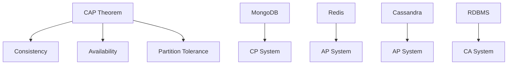
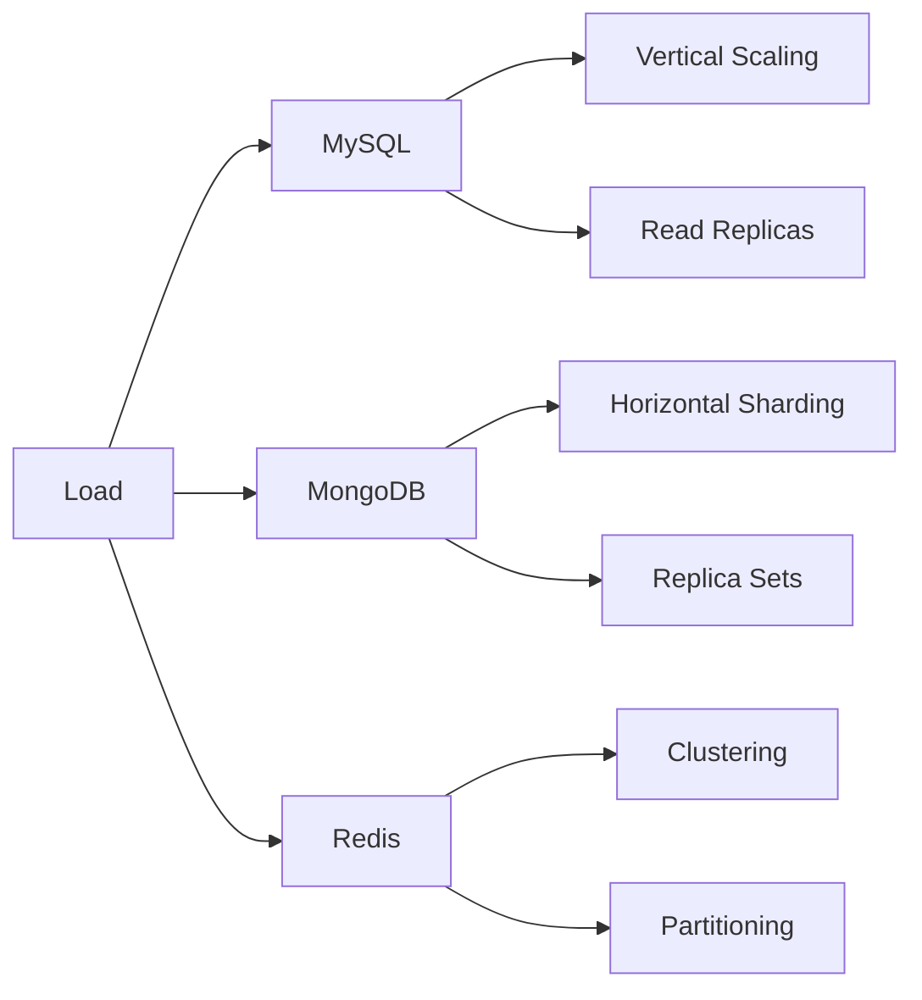

# NoSQL Databases: MongoDB & Redis Comprehensive Guide

## Introduction

NoSQL databases provide flexible, scalable alternatives to traditional relational databases. This comprehensive guide covers two major NoSQL paradigms: **document stores** (MongoDB) and **key-value stores** (Redis), with practical examples, design patterns, and performance considerations for senior backend engineers.

## Table of Contents

1. [NoSQL Fundamentals](#nosql-fundamentals)
2. [MongoDB: Document Store](#mongodb-document-store)
3. [Redis: Key-Value Store](#redis-key-value-store)
4. [Data Modeling Strategies](#data-modeling-strategies)
5. [Aggregation Pipelines](#aggregation-pipelines)
6. [Caching Strategies](#caching-strategies)
7. [Performance Comparisons](#performance-comparisons)
8. [Interview Questions](#interview-questions)

## NoSQL Fundamentals

### CAP Theorem and NoSQL



### NoSQL Database Types

| Type | Examples | Use Cases | Strengths |
|------|----------|-----------|-----------|
| Document | MongoDB, CouchDB | Content management, catalogs | Flexible schema, rich queries |
| Key-Value | Redis, DynamoDB | Caching, sessions | High performance, simple model |
| Column-Family | Cassandra, HBase | Time-series, analytics | Horizontal scaling, compression |
| Graph | Neo4j, Amazon Neptune | Social networks, recommendations | Relationship queries, traversals |

## MongoDB: Document Store

### Core Concepts

MongoDB stores data in flexible, JSON-like documents within collections. Documents can have varying structures, making it ideal for evolving schemas.

```javascript
// Example document structure
{
  "_id": ObjectId("507f1f77bcf86cd799439011"),
  "name": "John Doe",
  "email": "john@example.com",
  "profile": {
    "age": 30,
    "location": "San Francisco",
    "skills": ["JavaScript", "Python", "MongoDB"]
  },
  "orders": [
    {
      "orderId": "ORD-001",
      "amount": 299.99,
      "date": ISODate("2024-01-15T10:30:00Z")
    }
  ],
  "createdAt": ISODate("2024-01-01T00:00:00Z"),
  "updatedAt": ISODate("2024-01-15T10:30:00Z")
}
```

### MongoDB Data Modeling Patterns

#### 1. Embedding vs. Referencing

```javascript
// Embedding Pattern (One-to-Few)
// Good for: User profiles with addresses
{
  "_id": ObjectId("..."),
  "name": "John Doe",
  "addresses": [
    {
      "type": "home",
      "street": "123 Main St",
      "city": "San Francisco",
      "zipCode": "94105"
    },
    {
      "type": "work",
      "street": "456 Market St",
      "city": "San Francisco",
      "zipCode": "94102"
    }
  ]
}

// Referencing Pattern (One-to-Many)
// Good for: Blog posts with comments
// Posts collection
{
  "_id": ObjectId("post1"),
  "title": "Introduction to MongoDB",
  "content": "MongoDB is a document database...",
  "author": ObjectId("user1"),
  "createdAt": ISODate("2024-01-01T00:00:00Z")
}

// Comments collection
{
  "_id": ObjectId("comment1"),
  "postId": ObjectId("post1"),
  "author": ObjectId("user2"),
  "content": "Great article!",
  "createdAt": ISODate("2024-01-02T10:00:00Z")
}
```

#### 2. Polymorphic Pattern

```javascript
// E-commerce product catalog with different product types
{
  "_id": ObjectId("..."),
  "name": "MacBook Pro",
  "price": 2399,
  "category": "electronics",
  "type": "laptop",
  "specifications": {
    "processor": "M2 Pro",
    "memory": "16GB",
    "storage": "512GB SSD"
  }
}

{
  "_id": ObjectId("..."),
  "name": "Organic Cotton T-Shirt",
  "price": 29.99,
  "category": "clothing",
  "type": "apparel",
  "specifications": {
    "material": "100% Organic Cotton",
    "sizes": ["S", "M", "L", "XL"],
    "colors": ["white", "black", "navy"]
  }
}
```

#### 3. Bucket Pattern (Time-Series Data)

```javascript
// IoT sensor data bucketed by hour
{
  "_id": ObjectId("..."),
  "sensorId": "TEMP_001",
  "timestamp": ISODate("2024-01-15T10:00:00Z"),
  "measurements": [
    {
      "time": ISODate("2024-01-15T10:00:00Z"),
      "temperature": 22.5,
      "humidity": 45.2
    },
    {
      "time": ISODate("2024-01-15T10:01:00Z"),
      "temperature": 22.7,
      "humidity": 45.1
    }
    // ... up to 60 measurements per hour
  ],
  "count": 60,
  "minTemp": 22.1,
  "maxTemp": 23.2,
  "avgTemp": 22.6
}
```

### MongoDB Operations and Indexing

#### Complex Queries

```javascript
// Find users with specific criteria
db.users.find({
  "profile.age": { $gte: 25, $lte: 35 },
  "profile.skills": { $in: ["JavaScript", "Python"] },
  "orders.amount": { $gt: 100 }
}).sort({ "createdAt": -1 }).limit(10);

// Update operations
db.users.updateOne(
  { "_id": ObjectId("...") },
  {
    $set: { "profile.location": "New York" },
    $push: { "profile.skills": "React" },
    $inc: { "loginCount": 1 }
  }
);

// Upsert operation
db.users.updateOne(
  { "email": "jane@example.com" },
  {
    $set: { "name": "Jane Smith", "updatedAt": new Date() },
    $setOnInsert: { "createdAt": new Date() }
  },
  { upsert: true }
);
```

#### Indexing Strategies

```javascript
// Compound index for common query patterns
db.users.createIndex({ 
  "profile.location": 1, 
  "profile.age": 1, 
  "createdAt": -1 
});

// Text index for search functionality
db.products.createIndex({ 
  "name": "text", 
  "description": "text" 
});

// Partial index for active users only
db.users.createIndex(
  { "email": 1 },
  { 
    partialFilterExpression: { "status": "active" },
    unique: true 
  }
);

// TTL index for session data
db.sessions.createIndex(
  { "createdAt": 1 },
  { expireAfterSeconds: 3600 }
);
```

## Redis: Key-Value Store

### Core Data Structures

Redis provides multiple data structures, each optimized for specific use cases:

#### 1. Strings

```javascript
// Basic string operations
await redis.set('user:1001:name', 'John Doe');
await redis.setex('session:abc123', 3600, JSON.stringify(sessionData));
await redis.incr('page:views:homepage');

// Atomic operations
await redis.mset('user:1001:email', 'john@example.com', 'user:1001:status', 'active');
const userData = await redis.mget('user:1001:name', 'user:1001:email');
```

#### 2. Hashes

```javascript
// User profile as hash
await redis.hset('user:1001', {
  'name': 'John Doe',
  'email': 'john@example.com',
  'age': '30',
  'location': 'San Francisco'
});

await redis.hincrby('user:1001', 'loginCount', 1);
const userProfile = await redis.hgetall('user:1001');
```

#### 3. Lists

```javascript
// Activity feed using lists
await redis.lpush('user:1001:feed', JSON.stringify({
  type: 'post',
  content: 'Just deployed a new feature!',
  timestamp: Date.now()
}));

// Get recent activities (latest 10)
const recentActivities = await redis.lrange('user:1001:feed', 0, 9);

// Queue implementation
await redis.rpush('job:queue', JSON.stringify(jobData));
const job = await redis.blpop('job:queue', 30); // Blocking pop with timeout
```

#### 4. Sets

```javascript
// User interests and recommendations
await redis.sadd('user:1001:interests', 'technology', 'music', 'travel');
await redis.sadd('user:1002:interests', 'technology', 'sports', 'cooking');

// Find common interests
const commonInterests = await redis.sinter('user:1001:interests', 'user:1002:interests');

// Unique visitors tracking
await redis.sadd('page:homepage:visitors:2024-01-15', 'user:1001');
const uniqueVisitors = await redis.scard('page:homepage:visitors:2024-01-15');
```

#### 5. Sorted Sets

```javascript
// Leaderboard implementation
await redis.zadd('leaderboard:game1', 1500, 'player1', 1200, 'player2', 1800, 'player3');

// Get top 10 players
const topPlayers = await redis.zrevrange('leaderboard:game1', 0, 9, 'WITHSCORES');

// Get player rank
const playerRank = await redis.zrevrank('leaderboard:game1', 'player1');

// Time-based data with scores as timestamps
await redis.zadd('user:1001:activities', Date.now(), JSON.stringify(activityData));
```

### Redis Advanced Patterns

#### 1. Distributed Locking

```javascript
class RedisDistributedLock {
  constructor(redis, key, ttl = 10000) {
    this.redis = redis;
    this.key = `lock:${key}`;
    this.ttl = ttl;
    this.identifier = Math.random().toString(36);
  }

  async acquire() {
    const result = await this.redis.set(
      this.key, 
      this.identifier, 
      'PX', this.ttl, 
      'NX'
    );
    return result === 'OK';
  }

  async release() {
    const script = `
      if redis.call("get", KEYS[1]) == ARGV[1] then
        return redis.call("del", KEYS[1])
      else
        return 0
      end
    `;
    return await this.redis.eval(script, 1, this.key, this.identifier);
  }
}

// Usage
const lock = new RedisDistributedLock(redis, 'critical-section');
if (await lock.acquire()) {
  try {
    // Critical section code
    await performCriticalOperation();
  } finally {
    await lock.release();
  }
}
```

#### 2. Rate Limiting

```javascript
class RedisRateLimiter {
  constructor(redis) {
    this.redis = redis;
  }

  async isAllowed(key, limit, window) {
    const now = Date.now();
    const pipeline = this.redis.pipeline();
    
    // Sliding window rate limiter
    pipeline.zremrangebyscore(key, 0, now - window);
    pipeline.zcard(key);
    pipeline.zadd(key, now, `${now}-${Math.random()}`);
    pipeline.expire(key, Math.ceil(window / 1000));
    
    const results = await pipeline.exec();
    const currentCount = results[1][1];
    
    return currentCount < limit;
  }
}

// Usage
const rateLimiter = new RedisRateLimiter(redis);
const allowed = await rateLimiter.isAllowed('api:user:1001', 100, 60000); // 100 requests per minute
```

## Data Modeling Strategies

### MongoDB vs. SQL Data Modeling

#### E-commerce Example: SQL Approach

```sql
-- Normalized SQL schema
CREATE TABLE users (
  id INT PRIMARY KEY AUTO_INCREMENT,
  email VARCHAR(255) UNIQUE NOT NULL,
  name VARCHAR(255) NOT NULL,
  created_at TIMESTAMP DEFAULT CURRENT_TIMESTAMP
);

CREATE TABLE orders (
  id INT PRIMARY KEY AUTO_INCREMENT,
  user_id INT NOT NULL,
  total_amount DECIMAL(10,2) NOT NULL,
  status ENUM('pending', 'processing', 'shipped', 'delivered') NOT NULL,
  created_at TIMESTAMP DEFAULT CURRENT_TIMESTAMP,
  FOREIGN KEY (user_id) REFERENCES users(id)
);

CREATE TABLE order_items (
  id INT PRIMARY KEY AUTO_INCREMENT,
  order_id INT NOT NULL,
  product_id INT NOT NULL,
  quantity INT NOT NULL,
  price DECIMAL(10,2) NOT NULL,
  FOREIGN KEY (order_id) REFERENCES orders(id)
);
```

#### E-commerce Example: MongoDB Approach

```javascript
// Denormalized MongoDB schema
{
  "_id": ObjectId("..."),
  "email": "john@example.com",
  "name": "John Doe",
  "profile": {
    "preferences": ["electronics", "books"],
    "shippingAddresses": [
      {
        "type": "home",
        "street": "123 Main St",
        "city": "San Francisco",
        "zipCode": "94105",
        "isDefault": true
      }
    ]
  },
  "orders": [
    {
      "orderId": "ORD-2024-001",
      "status": "delivered",
      "totalAmount": 299.99,
      "items": [
        {
          "productId": ObjectId("..."),
          "name": "Wireless Headphones",
          "quantity": 1,
          "price": 299.99,
          "category": "electronics"
        }
      ],
      "shippingAddress": {
        "street": "123 Main St",
        "city": "San Francisco",
        "zipCode": "94105"
      },
      "createdAt": ISODate("2024-01-15T10:30:00Z"),
      "deliveredAt": ISODate("2024-01-18T14:20:00Z")
    }
  ],
  "createdAt": ISODate("2024-01-01T00:00:00Z"),
  "lastLoginAt": ISODate("2024-01-20T09:15:00Z")
}
```

### When to Choose NoSQL vs. SQL

| Scenario | SQL | NoSQL | Reasoning |
|----------|-----|-------|-----------|
| Financial transactions | ✅ | ❌ | ACID compliance critical |
| Content management | ❌ | ✅ | Flexible schema needed |
| Real-time analytics | ❌ | ✅ | High write throughput |
| Complex reporting | ✅ | ❌ | Complex joins required |
| Caching layer | ❌ | ✅ | Key-value access pattern |
| User sessions | ❌ | ✅ | TTL and fast access |

## Aggregation Pipelines

### MongoDB Aggregation Framework

The aggregation pipeline processes documents through multiple stages, each transforming the data:

#### Basic Pipeline Operations

```javascript
// Sales analytics pipeline
db.orders.aggregate([
  // Stage 1: Match orders from last 30 days
  {
    $match: {
      createdAt: { 
        $gte: new Date(Date.now() - 30 * 24 * 60 * 60 * 1000) 
      },
      status: { $in: ["completed", "shipped"] }
    }
  },
  
  // Stage 2: Unwind order items
  { $unwind: "$items" },
  
  // Stage 3: Group by product category
  {
    $group: {
      _id: "$items.category",
      totalRevenue: { $sum: { $multiply: ["$items.quantity", "$items.price"] } },
      totalQuantity: { $sum: "$items.quantity" },
      orderCount: { $sum: 1 },
      avgOrderValue: { $avg: "$totalAmount" }
    }
  },
  
  // Stage 4: Sort by revenue
  { $sort: { totalRevenue: -1 } },
  
  // Stage 5: Add calculated fields
  {
    $addFields: {
      revenuePercentage: {
        $multiply: [
          { $divide: ["$totalRevenue", { $sum: "$totalRevenue" }] },
          100
        ]
      }
    }
  }
]);
```

#### Advanced Aggregation Patterns

```javascript
// Customer segmentation pipeline
db.users.aggregate([
  // Lookup orders for each user
  {
    $lookup: {
      from: "orders",
      localField: "_id",
      foreignField: "userId",
      as: "orders"
    }
  },
  
  // Calculate customer metrics
  {
    $addFields: {
      totalSpent: { $sum: "$orders.totalAmount" },
      orderCount: { $size: "$orders" },
      avgOrderValue: { $avg: "$orders.totalAmount" },
      lastOrderDate: { $max: "$orders.createdAt" },
      daysSinceLastOrder: {
        $divide: [
          { $subtract: [new Date(), { $max: "$orders.createdAt" }] },
          1000 * 60 * 60 * 24
        ]
      }
    }
  },
  
  // Segment customers
  {
    $addFields: {
      segment: {
        $switch: {
          branches: [
            {
              case: { 
                $and: [
                  { $gte: ["$totalSpent", 1000] },
                  { $lte: ["$daysSinceLastOrder", 30] }
                ]
              },
              then: "VIP"
            },
            {
              case: { 
                $and: [
                  { $gte: ["$totalSpent", 500] },
                  { $lte: ["$daysSinceLastOrder", 60] }
                ]
              },
              then: "Regular"
            },
            {
              case: { $gt: ["$daysSinceLastOrder", 90] },
              then: "At Risk"
            }
          ],
          default: "New"
        }
      }
    }
  },
  
  // Group by segment
  {
    $group: {
      _id: "$segment",
      count: { $sum: 1 },
      avgSpent: { $avg: "$totalSpent" },
      avgOrders: { $avg: "$orderCount" }
    }
  }
]);
```

#### Time-Series Aggregation

```javascript
// Website analytics - daily page views
db.pageViews.aggregate([
  {
    $match: {
      timestamp: {
        $gte: ISODate("2024-01-01T00:00:00Z"),
        $lt: ISODate("2024-02-01T00:00:00Z")
      }
    }
  },
  {
    $group: {
      _id: {
        year: { $year: "$timestamp" },
        month: { $month: "$timestamp" },
        day: { $dayOfMonth: "$timestamp" },
        page: "$page"
      },
      views: { $sum: 1 },
      uniqueUsers: { $addToSet: "$userId" }
    }
  },
  {
    $addFields: {
      uniqueUserCount: { $size: "$uniqueUsers" },
      date: {
        $dateFromParts: {
          year: "$_id.year",
          month: "$_id.month",
          day: "$_id.day"
        }
      }
    }
  },
  {
    $project: {
      _id: 0,
      date: 1,
      page: "$_id.page",
      views: 1,
      uniqueUsers: "$uniqueUserCount"
    }
  },
  { $sort: { date: 1, page: 1 } }
]);
```

## Caching Strategies

### Redis Caching Patterns

#### 1. Cache-Aside Pattern

```javascript
class CacheAsideService {
  constructor(redis, database) {
    this.redis = redis;
    this.database = database;
  }

  async getUser(userId) {
    const cacheKey = `user:${userId}`;
    
    // Try cache first
    let user = await this.redis.get(cacheKey);
    if (user) {
      return JSON.parse(user);
    }
    
    // Cache miss - fetch from database
    user = await this.database.users.findById(userId);
    if (user) {
      // Store in cache with TTL
      await this.redis.setex(cacheKey, 3600, JSON.stringify(user));
    }
    
    return user;
  }

  async updateUser(userId, userData) {
    // Update database
    const user = await this.database.users.findByIdAndUpdate(userId, userData, { new: true });
    
    // Invalidate cache
    await this.redis.del(`user:${userId}`);
    
    return user;
  }
}
```

#### 2. Write-Through Pattern

```javascript
class WriteThroughCache {
  constructor(redis, database) {
    this.redis = redis;
    this.database = database;
  }

  async setUser(userId, userData) {
    // Write to database first
    const user = await this.database.users.findByIdAndUpdate(
      userId, 
      userData, 
      { new: true, upsert: true }
    );
    
    // Write to cache
    const cacheKey = `user:${userId}`;
    await this.redis.setex(cacheKey, 3600, JSON.stringify(user));
    
    return user;
  }
}
```

#### 3. Write-Behind (Write-Back) Pattern

```javascript
class WriteBehindCache {
  constructor(redis, database) {
    this.redis = redis;
    this.database = database;
    this.writeQueue = [];
    this.batchSize = 100;
    this.flushInterval = 5000; // 5 seconds
    
    this.startBatchWriter();
  }

  async setUser(userId, userData) {
    const cacheKey = `user:${userId}`;
    
    // Write to cache immediately
    await this.redis.setex(cacheKey, 3600, JSON.stringify(userData));
    
    // Queue for database write
    this.writeQueue.push({ userId, userData, timestamp: Date.now() });
    
    return userData;
  }

  startBatchWriter() {
    setInterval(async () => {
      if (this.writeQueue.length > 0) {
        const batch = this.writeQueue.splice(0, this.batchSize);
        await this.flushBatch(batch);
      }
    }, this.flushInterval);
  }

  async flushBatch(batch) {
    const operations = batch.map(item => ({
      updateOne: {
        filter: { _id: item.userId },
        update: { $set: item.userData },
        upsert: true
      }
    }));
    
    await this.database.users.bulkWrite(operations);
  }
}
```

### Multi-Level Caching

```javascript
class MultiLevelCache {
  constructor(l1Cache, l2Cache, database) {
    this.l1Cache = l1Cache; // In-memory cache (Node.js Map)
    this.l2Cache = l2Cache; // Redis cache
    this.database = database;
  }

  async get(key) {
    // L1 Cache (fastest)
    if (this.l1Cache.has(key)) {
      return this.l1Cache.get(key);
    }
    
    // L2 Cache (Redis)
    const l2Value = await this.l2Cache.get(key);
    if (l2Value) {
      const data = JSON.parse(l2Value);
      this.l1Cache.set(key, data);
      return data;
    }
    
    // Database (slowest)
    const dbValue = await this.database.findByKey(key);
    if (dbValue) {
      // Populate both cache levels
      this.l1Cache.set(key, dbValue);
      await this.l2Cache.setex(key, 3600, JSON.stringify(dbValue));
    }
    
    return dbValue;
  }

  async invalidate(key) {
    this.l1Cache.delete(key);
    await this.l2Cache.del(key);
  }
}
```

## Performance Comparisons

### Read Performance Comparison

```javascript
// Benchmark: User profile retrieval
const benchmarkResults = {
  "MySQL (Indexed)": {
    "Single Record": "2.3ms",
    "100 Records": "45ms",
    "1000 Records": "180ms",
    "Complex Join": "25ms"
  },
  "MongoDB": {
    "Single Document": "1.8ms",
    "100 Documents": "35ms", 
    "1000 Documents": "140ms",
    "Embedded Data": "1.2ms"
  },
  "Redis": {
    "Single Key": "0.1ms",
    "100 Keys (Pipeline)": "2ms",
    "1000 Keys (Pipeline)": "15ms",
    "Hash Fields": "0.08ms"
  }
};
```

### Write Performance Comparison

```javascript
// E-commerce order processing benchmark
const writePerformance = {
  scenario: "Process 1000 orders with items",
  results: {
    "MySQL (Transactions)": {
      throughput: "450 orders/sec",
      latency: "22ms avg",
      consistency: "Strong",
      durability: "Guaranteed"
    },
    "MongoDB (Replica Set)": {
      throughput: "850 orders/sec", 
      latency: "12ms avg",
      consistency: "Eventually consistent",
      durability: "Configurable"
    },
    "Redis (Persistence)": {
      throughput: "2500 orders/sec",
      latency: "4ms avg", 
      consistency: "Eventually consistent",
      durability: "Configurable"
    }
  }
};
```

### Storage Efficiency

```javascript
// Data size comparison for user profiles
const storageComparison = {
  "1M User Profiles": {
    "MySQL (Normalized)": {
      size: "180MB",
      indexes: "45MB", 
      total: "225MB"
    },
    "MongoDB (Embedded)": {
      size: "320MB",
      indexes: "80MB",
      total: "400MB"
    },
    "Redis (Hash)": {
      size: "450MB",
      overhead: "90MB",
      total: "540MB"
    }
  }
};
```

### Scaling Characteristics



## Real-World Use Cases

### Healthcare Data Management

#### Patient Records in MongoDB

```javascript
// Patient document with embedded medical history
{
  "_id": ObjectId("..."),
  "patientId": "P-2024-001",
  "personalInfo": {
    "name": "Jane Smith",
    "dateOfBirth": ISODate("1985-03-15T00:00:00Z"),
    "gender": "female",
    "contactInfo": {
      "phone": "+1-555-0123",
      "email": "jane.smith@email.com",
      "address": {
        "street": "789 Health St",
        "city": "Medical City",
        "state": "CA",
        "zipCode": "90210"
      }
    }
  },
  "medicalHistory": [
    {
      "visitId": "V-2024-001",
      "date": ISODate("2024-01-15T10:30:00Z"),
      "provider": "Dr. Johnson",
      "diagnosis": ["Hypertension", "Type 2 Diabetes"],
      "medications": [
        {
          "name": "Metformin",
          "dosage": "500mg",
          "frequency": "twice daily",
          "startDate": ISODate("2024-01-15T00:00:00Z")
        }
      ],
      "vitals": {
        "bloodPressure": "140/90",
        "heartRate": 78,
        "temperature": 98.6,
        "weight": 165
      },
      "notes": "Patient responding well to treatment"
    }
  ],
  "allergies": ["Penicillin", "Shellfish"],
  "emergencyContact": {
    "name": "John Smith",
    "relationship": "spouse",
    "phone": "+1-555-0124"
  },
  "createdAt": ISODate("2024-01-01T00:00:00Z"),
  "updatedAt": ISODate("2024-01-15T10:30:00Z")
}
```

#### Session Management with Redis

```javascript
// Healthcare application session management
class HealthcareSessionManager {
  constructor(redis) {
    this.redis = redis;
    this.sessionTTL = 3600; // 1 hour
  }

  async createSession(userId, userRole, permissions) {
    const sessionId = `session:${Date.now()}-${Math.random().toString(36)}`;
    const sessionData = {
      userId,
      userRole,
      permissions,
      createdAt: Date.now(),
      lastActivity: Date.now(),
      ipAddress: req.ip,
      userAgent: req.get('User-Agent')
    };

    await this.redis.setex(sessionId, this.sessionTTL, JSON.stringify(sessionData));
    
    // Track active sessions per user
    await this.redis.sadd(`user:${userId}:sessions`, sessionId);
    
    return sessionId;
  }

  async validateSession(sessionId) {
    const sessionData = await this.redis.get(sessionId);
    if (!sessionData) {
      return null;
    }

    const session = JSON.parse(sessionData);
    
    // Update last activity
    session.lastActivity = Date.now();
    await this.redis.setex(sessionId, this.sessionTTL, JSON.stringify(session));
    
    return session;
  }

  async revokeUserSessions(userId) {
    const sessions = await this.redis.smembers(`user:${userId}:sessions`);
    if (sessions.length > 0) {
      await this.redis.del(...sessions);
      await this.redis.del(`user:${userId}:sessions`);
    }
  }
}
```

### E-commerce Platform

#### Product Catalog and Inventory

```javascript
// MongoDB product catalog with Redis caching
class EcommerceService {
  constructor(mongodb, redis) {
    this.db = mongodb;
    this.cache = redis;
  }

  async getProduct(productId) {
    const cacheKey = `product:${productId}`;
    
    // Check cache first
    let product = await this.cache.get(cacheKey);
    if (product) {
      return JSON.parse(product);
    }

    // Fetch from MongoDB with related data
    product = await this.db.products.aggregate([
      { $match: { _id: ObjectId(productId) } },
      {
        $lookup: {
          from: "reviews",
          localField: "_id",
          foreignField: "productId",
          as: "reviews"
        }
      },
      {
        $lookup: {
          from: "inventory",
          localField: "_id", 
          foreignField: "productId",
          as: "inventory"
        }
      },
      {
        $addFields: {
          avgRating: { $avg: "$reviews.rating" },
          reviewCount: { $size: "$reviews" },
          inStock: { $gt: [{ $arrayElemAt: ["$inventory.quantity", 0] }, 0] }
        }
      }
    ]).next();

    if (product) {
      // Cache for 1 hour
      await this.cache.setex(cacheKey, 3600, JSON.stringify(product));
    }

    return product;
  }

  async updateInventory(productId, quantity) {
    // Update MongoDB
    await this.db.inventory.updateOne(
      { productId: ObjectId(productId) },
      { 
        $set: { 
          quantity,
          lastUpdated: new Date()
        }
      }
    );

    // Invalidate product cache
    await this.cache.del(`product:${productId}`);
    
    // Update real-time inventory in Redis
    await this.cache.hset(`inventory:${productId}`, {
      quantity,
      lastUpdated: Date.now()
    });
  }
}
```

## Interview Questions

### MongoDB Questions

#### 1. **Data Modeling & Schema Design**

**Q: How would you model a social media platform with users, posts, comments, and likes in MongoDB? Discuss embedding vs referencing strategies.**

**Answer:**
```javascript
// Hybrid approach - optimal for social media
// Users collection (reference pattern)
{
  "_id": ObjectId("user1"),
  "username": "johndoe",
  "email": "john@example.com",
  "profile": {
    "displayName": "John Doe",
    "bio": "Software Engineer",
    "avatar": "https://cdn.example.com/avatars/john.jpg",
    "followers": 1250,
    "following": 890
  },
  "createdAt": ISODate("2024-01-01T00:00:00Z")
}

// Posts collection (embedded comments, referenced likes)
{
  "_id": ObjectId("post1"),
  "authorId": ObjectId("user1"),
  "content": "Just deployed a new feature!",
  "media": [
    {
      "type": "image",
      "url": "https://cdn.example.com/posts/image1.jpg",
      "alt": "Screenshot of new feature"
    }
  ],
  "comments": [
    {
      "_id": ObjectId("comment1"),
      "authorId": ObjectId("user2"),
      "content": "Looks great!",
      "createdAt": ISODate("2024-01-15T10:30:00Z"),
      "likes": 5
    }
  ],
  "likeCount": 42,
  "commentCount": 8,
  "createdAt": ISODate("2024-01-15T09:00:00Z"),
  "updatedAt": ISODate("2024-01-15T10:30:00Z")
}

// Likes collection (for analytics and user activity tracking)
{
  "_id": ObjectId("like1"),
  "userId": ObjectId("user2"),
  "targetType": "post", // or "comment"
  "targetId": ObjectId("post1"),
  "createdAt": ISODate("2024-01-15T10:15:00Z")
}
```

**Reasoning:**
- **Users**: Separate collection for clean user management and authentication
- **Posts**: Embed comments (typically few per post) but reference likes (potentially thousands)
- **Likes**: Separate collection enables user activity feeds and prevents document growth
- **Indexes**: Create compound indexes on `(authorId, createdAt)` for user feeds

#### 2. **Aggregation Pipeline Optimization**

**Q: Write an aggregation pipeline to find the top 10 most engaging posts (likes + comments) from the last 30 days, including author information.**

**Answer:**
```javascript
db.posts.aggregate([
  // Stage 1: Filter recent posts
  {
    $match: {
      createdAt: { 
        $gte: new Date(Date.now() - 30 * 24 * 60 * 60 * 1000) 
      }
    }
  },
  
  // Stage 2: Calculate engagement score
  {
    $addFields: {
      engagementScore: { 
        $add: [
          "$likeCount", 
          { $multiply: ["$commentCount", 2] } // Weight comments higher
        ]
      }
    }
  },
  
  // Stage 3: Lookup author information
  {
    $lookup: {
      from: "users",
      localField: "authorId",
      foreignField: "_id",
      as: "author",
      pipeline: [
        {
          $project: {
            username: 1,
            "profile.displayName": 1,
            "profile.avatar": 1
          }
        }
      ]
    }
  },
  
  // Stage 4: Unwind author array
  { $unwind: "$author" },
  
  // Stage 5: Sort by engagement
  { $sort: { engagementScore: -1 } },
  
  // Stage 6: Limit to top 10
  { $limit: 10 },
  
  // Stage 7: Project final structure
  {
    $project: {
      content: 1,
      likeCount: 1,
      commentCount: 1,
      engagementScore: 1,
      createdAt: 1,
      "author.username": 1,
      "author.profile.displayName": 1,
      "author.profile.avatar": 1
    }
  }
]);
```

#### 3. **Sharding Strategy**

**Q: How would you design a sharding strategy for a MongoDB collection storing IoT sensor data with 1 billion documents?**

**Answer:**
```javascript
// Compound shard key strategy
{
  sensorType: "temperature", // Low cardinality for even distribution
  timestamp: ISODate("2024-01-15T10:30:00Z"), // High cardinality for range queries
  sensorId: "TEMP_001" // Unique identifier
}

// Sharding configuration
sh.shardCollection("iot.sensorData", {
  "sensorType": 1,
  "timestamp": 1,
  "sensorId": 1
});

// Zone-based sharding for time-series data
sh.addShardToZone("shard01", "recent");
sh.addShardToZone("shard02", "archive");

sh.updateZoneKeyRange(
  "iot.sensorData",
  { "sensorType": MinKey, "timestamp": new Date("2024-01-01") },
  { "sensorType": MaxKey, "timestamp": new Date("2024-12-31") },
  "recent"
);
```

**Benefits:**
- **Even distribution**: sensorType provides good initial distribution
- **Range queries**: timestamp enables efficient time-based queries
- **Uniqueness**: sensorId prevents hotspots
- **Zone sharding**: Recent data on faster storage, archived data on cheaper storage

### Redis Questions

#### 4. **Distributed Caching Architecture**

**Q: Design a distributed caching system using Redis for a microservices architecture. How would you handle cache invalidation across services?**

**Answer:**
```javascript
// Event-driven cache invalidation
class DistributedCacheManager {
  constructor(redis, eventBus) {
    this.redis = redis;
    this.eventBus = eventBus;
    this.setupEventHandlers();
  }

  setupEventHandlers() {
    // Listen for data change events
    this.eventBus.on('user.updated', async (userId) => {
      await this.invalidateUserCache(userId);
    });
    
    this.eventBus.on('product.updated', async (productId) => {
      await this.invalidateProductCache(productId);
    });
  }

  async invalidateUserCache(userId) {
    const pattern = `*user:${userId}*`;
    const keys = await this.redis.keys(pattern);
    if (keys.length > 0) {
      await this.redis.del(...keys);
    }
    
    // Publish invalidation event to other services
    await this.redis.publish('cache:invalidate', JSON.stringify({
      type: 'user',
      id: userId,
      timestamp: Date.now()
    }));
  }

  async getWithTags(key, tags, fetcher, ttl = 3600) {
    // Check cache
    let data = await this.redis.get(key);
    if (data) {
      return JSON.parse(data);
    }

    // Fetch data
    data = await fetcher();
    
    // Store with tags for invalidation
    const pipeline = this.redis.pipeline();
    pipeline.setex(key, ttl, JSON.stringify(data));
    
    // Add to tag sets for bulk invalidation
    tags.forEach(tag => {
      pipeline.sadd(`tag:${tag}`, key);
      pipeline.expire(`tag:${tag}`, ttl + 300); // Slightly longer TTL
    });
    
    await pipeline.exec();
    return data;
  }

  async invalidateByTag(tag) {
    const keys = await this.redis.smembers(`tag:${tag}`);
    if (keys.length > 0) {
      await this.redis.del(...keys);
      await this.redis.del(`tag:${tag}`);
    }
  }
}
```

#### 5. **Redis Data Structure Selection**

**Q: You need to implement a real-time leaderboard, rate limiting, and session management. Which Redis data structures would you use and why?**

**Answer:**

```javascript
// 1. Real-time Leaderboard - Sorted Sets
class GameLeaderboard {
  constructor(redis) {
    this.redis = redis;
  }

  async updateScore(gameId, playerId, score) {
    await this.redis.zadd(`leaderboard:${gameId}`, score, playerId);
  }

  async getTopPlayers(gameId, count = 10) {
    return await this.redis.zrevrange(
      `leaderboard:${gameId}`, 
      0, count - 1, 
      'WITHSCORES'
    );
  }

  async getPlayerRank(gameId, playerId) {
    return await this.redis.zrevrank(`leaderboard:${gameId}`, playerId);
  }
}

// 2. Rate Limiting - Sorted Sets (Sliding Window)
class RateLimiter {
  constructor(redis) {
    this.redis = redis;
  }

  async checkLimit(key, limit, windowMs) {
    const now = Date.now();
    const pipeline = this.redis.pipeline();
    
    // Remove expired entries
    pipeline.zremrangebyscore(key, 0, now - windowMs);
    
    // Count current requests
    pipeline.zcard(key);
    
    // Add current request
    pipeline.zadd(key, now, `${now}-${Math.random()}`);
    
    // Set expiration
    pipeline.expire(key, Math.ceil(windowMs / 1000));
    
    const results = await pipeline.exec();
    const currentCount = results[1][1];
    
    return currentCount < limit;
  }
}

// 3. Session Management - Hashes
class SessionManager {
  constructor(redis) {
    this.redis = redis;
  }

  async createSession(userId, sessionData, ttl = 3600) {
    const sessionId = `session:${Date.now()}-${Math.random().toString(36)}`;
    
    await this.redis.hset(sessionId, {
      userId,
      createdAt: Date.now(),
      ...sessionData
    });
    
    await this.redis.expire(sessionId, ttl);
    
    // Track user sessions
    await this.redis.sadd(`user:${userId}:sessions`, sessionId);
    
    return sessionId;
  }

  async getSession(sessionId) {
    return await this.redis.hgetall(sessionId);
  }
}
```

#### 6. **Redis Persistence and High Availability**

**Q: Explain Redis persistence options and design a high-availability Redis setup for a critical application.**

**Answer:**

**Persistence Options:**
1. **RDB (Redis Database)**: Point-in-time snapshots
2. **AOF (Append Only File)**: Log of write operations
3. **Hybrid**: Both RDB and AOF for maximum durability

```bash
# Redis configuration for high availability
# Master configuration
save 900 1      # Save if at least 1 key changed in 900 seconds
save 300 10     # Save if at least 10 keys changed in 300 seconds
save 60 10000   # Save if at least 10000 keys changed in 60 seconds

appendonly yes
appendfsync everysec
auto-aof-rewrite-percentage 100
auto-aof-rewrite-min-size 64mb

# Replication
replica-read-only yes
replica-serve-stale-data yes
```

**High Availability Architecture:**
```javascript
// Redis Sentinel configuration
const redis = require('ioredis');

const sentinel = new redis({
  sentinels: [
    { host: 'sentinel1', port: 26379 },
    { host: 'sentinel2', port: 26379 },
    { host: 'sentinel3', port: 26379 }
  ],
  name: 'mymaster',
  role: 'master',
  retryDelayOnFailover: 100,
  maxRetriesPerRequest: 3
});

// Redis Cluster for horizontal scaling
const cluster = new redis.Cluster([
  { host: 'redis1', port: 7000 },
  { host: 'redis2', port: 7000 },
  { host: 'redis3', port: 7000 }
], {
  redisOptions: {
    password: 'your-password'
  },
  enableOfflineQueue: false
});
```

### NoSQL Design Pattern Questions

#### 7. **Polyglot Persistence**

**Q: Design a data architecture for an e-commerce platform using multiple NoSQL databases. Justify your choices.**

**Answer:**

```javascript
// Multi-database architecture
const dataArchitecture = {
  // MongoDB - Product catalog and user profiles
  productCatalog: {
    database: "MongoDB",
    reasoning: "Flexible schema for diverse product types, rich queries for search",
    collections: ["products", "categories", "users", "reviews"]
  },
  
  // Redis - Caching and sessions
  caching: {
    database: "Redis", 
    reasoning: "High-performance caching, session management, real-time features",
    useCases: ["product cache", "user sessions", "shopping carts", "rate limiting"]
  },
  
  // Cassandra - Order history and analytics
  analytics: {
    database: "Cassandra",
    reasoning: "Time-series data, high write throughput, horizontal scaling",
    tables: ["order_events", "user_activity", "product_views"]
  },
  
  // Elasticsearch - Search and recommendations
  search: {
    database: "Elasticsearch",
    reasoning: "Full-text search, faceted search, recommendation engine",
    indices: ["products", "users", "search_logs"]
  }
};

// Data flow example
class EcommerceDataService {
  constructor(mongodb, redis, cassandra, elasticsearch) {
    this.mongodb = mongodb;
    this.redis = redis;
    this.cassandra = cassandra;
    this.elasticsearch = elasticsearch;
  }

  async createOrder(orderData) {
    // 1. Store order in MongoDB
    const order = await this.mongodb.orders.insertOne(orderData);
    
    // 2. Cache order for quick access
    await this.redis.setex(
      `order:${order.insertedId}`, 
      3600, 
      JSON.stringify(orderData)
    );
    
    // 3. Record analytics event in Cassandra
    await this.cassandra.execute(
      'INSERT INTO order_events (user_id, order_id, event_type, timestamp) VALUES (?, ?, ?, ?)',
      [orderData.userId, order.insertedId, 'order_created', new Date()]
    );
    
    // 4. Update search index
    await this.elasticsearch.index({
      index: 'orders',
      id: order.insertedId,
      body: {
        userId: orderData.userId,
        totalAmount: orderData.totalAmount,
        items: orderData.items,
        createdAt: new Date()
      }
    });
    
    return order;
  }
}
```

#### 8. **Event Sourcing with NoSQL**

**Q: Implement an event sourcing pattern using MongoDB for a banking application. How would you handle account balance calculations?**

**Answer:**

```javascript
// Event sourcing implementation
class BankingEventStore {
  constructor(mongodb) {
    this.db = mongodb;
    this.events = this.db.collection('account_events');
    this.snapshots = this.db.collection('account_snapshots');
  }

  async appendEvent(accountId, eventType, eventData) {
    const event = {
      accountId,
      eventType,
      eventData,
      timestamp: new Date(),
      version: await this.getNextVersion(accountId)
    };
    
    const result = await this.events.insertOne(event);
    
    // Create snapshot every 100 events
    if (event.version % 100 === 0) {
      await this.createSnapshot(accountId);
    }
    
    return result;
  }

  async getAccountBalance(accountId) {
    // Try to get latest snapshot
    const snapshot = await this.snapshots.findOne(
      { accountId },
      { sort: { version: -1 } }
    );
    
    let balance = snapshot ? snapshot.balance : 0;
    let fromVersion = snapshot ? snapshot.version + 1 : 1;
    
    // Apply events since snapshot
    const events = await this.events.find({
      accountId,
      version: { $gte: fromVersion }
    }).sort({ version: 1 }).toArray();
    
    for (const event of events) {
      balance = this.applyEvent(balance, event);
    }
    
    return balance;
  }

  applyEvent(balance, event) {
    switch (event.eventType) {
      case 'deposit':
        return balance + event.eventData.amount;
      case 'withdrawal':
        return balance - event.eventData.amount;
      case 'transfer_out':
        return balance - event.eventData.amount;
      case 'transfer_in':
        return balance + event.eventData.amount;
      default:
        return balance;
    }
  }

  async createSnapshot(accountId) {
    const balance = await this.getAccountBalance(accountId);
    const version = await this.getCurrentVersion(accountId);
    
    await this.snapshots.replaceOne(
      { accountId },
      {
        accountId,
        balance,
        version,
        createdAt: new Date()
      },
      { upsert: true }
    );
  }

  async getNextVersion(accountId) {
    const lastEvent = await this.events.findOne(
      { accountId },
      { sort: { version: -1 } }
    );
    return lastEvent ? lastEvent.version + 1 : 1;
  }
}

// Usage example
const eventStore = new BankingEventStore(mongodb);

// Deposit money
await eventStore.appendEvent('account123', 'deposit', { 
  amount: 1000, 
  description: 'Initial deposit' 
});

// Transfer money
await eventStore.appendEvent('account123', 'transfer_out', { 
  amount: 250, 
  toAccount: 'account456',
  description: 'Transfer to savings' 
});

// Get current balance
const balance = await eventStore.getAccountBalance('account123');
console.log(`Current balance: $${balance}`); // $750
```

### Performance and Optimization Questions

#### 9. **MongoDB Index Optimization**

**Q: You have a MongoDB collection with 10 million documents. Queries are slow on compound filters. How would you optimize?**

**Answer:**

```javascript
// Problem: Slow query
db.orders.find({
  "customer.location": "San Francisco",
  "status": "completed", 
  "totalAmount": { $gte: 100 },
  "createdAt": { $gte: ISODate("2024-01-01") }
}).sort({ "createdAt": -1 });

// Solution 1: Compound index with proper field order
db.orders.createIndex({
  "customer.location": 1,  // Equality first
  "status": 1,             // Equality second  
  "createdAt": -1,         // Sort field last
  "totalAmount": 1         // Range last
});

// Solution 2: Partial index for active orders only
db.orders.createIndex(
  {
    "customer.location": 1,
    "createdAt": -1,
    "totalAmount": 1
  },
  {
    partialFilterExpression: { 
      "status": { $in: ["pending", "processing", "completed"] }
    }
  }
);

// Solution 3: Use aggregation with $match early
db.orders.aggregate([
  // Move $match to beginning for index usage
  {
    $match: {
      "customer.location": "San Francisco",
      "status": "completed",
      "createdAt": { $gte: ISODate("2024-01-01") }
    }
  },
  {
    $match: {
      "totalAmount": { $gte: 100 }
    }
  },
  { $sort: { "createdAt": -1 } },
  { $limit: 20 }
]);

// Monitor index usage
db.orders.find({...}).explain("executionStats");
```

#### 10. **Redis Memory Optimization**

**Q: Your Redis instance is using too much memory. What strategies would you implement to optimize memory usage?**

**Answer:**

```javascript
// Memory optimization strategies

// 1. Use appropriate data structures
// Instead of storing JSON strings
await redis.set('user:1001', JSON.stringify({
  name: 'John',
  email: 'john@example.com',
  age: 30
}));

// Use hashes for structured data
await redis.hset('user:1001', {
  'name': 'John',
  'email': 'john@example.com', 
  'age': '30'
});

// 2. Implement data compression
const zlib = require('zlib');

class CompressedRedisClient {
  constructor(redis) {
    this.redis = redis;
  }

  async setCompressed(key, data, ttl) {
    const compressed = zlib.gzipSync(JSON.stringify(data));
    await this.redis.setex(key, ttl, compressed);
  }

  async getCompressed(key) {
    const compressed = await this.redis.getBuffer(key);
    if (!compressed) return null;
    
    const decompressed = zlib.gunzipSync(compressed);
    return JSON.parse(decompressed.toString());
  }
}

// 3. Use TTL for automatic cleanup
await redis.setex('temp:data', 3600, data); // 1 hour TTL

// 4. Implement LRU eviction policy
// redis.conf
// maxmemory 2gb
// maxmemory-policy allkeys-lru

// 5. Monitor memory usage
const memoryInfo = await redis.memory('usage', 'user:1001');
console.log(`Key uses ${memoryInfo} bytes`);

// 6. Use Redis modules for specific use cases
// RedisJSON for JSON data
await redis.call('JSON.SET', 'user:1001', '$', JSON.stringify(userData));

// RedisBloom for probabilistic data structures
await redis.call('BF.ADD', 'user:emails', 'john@example.com');
```

### System Design Questions

#### 11. **Design a Chat Application Backend**

**Q: Design the backend for a real-time chat application supporting 1 million concurrent users. Use appropriate NoSQL databases.**

**Answer:**

```javascript
// Architecture Overview
const chatArchitecture = {
  // MongoDB - User profiles and chat metadata
  userManagement: {
    collections: ['users', 'chat_rooms', 'user_room_memberships'],
    sharding: 'userId-based'
  },
  
  // Redis - Real-time messaging and presence
  realTime: {
    structures: ['pub/sub', 'sorted sets', 'hashes'],
    clustering: 'hash-based partitioning'
  },
  
  // Cassandra - Message history storage
  messageHistory: {
    tables: ['messages_by_room', 'messages_by_user'],
    partitioning: 'room_id + time_bucket'
  }
};

// Implementation
class ChatService {
  constructor(mongodb, redis, cassandra) {
    this.mongodb = mongodb;
    this.redis = redis;
    this.cassandra = cassandra;
  }

  async sendMessage(roomId, userId, message) {
    const messageId = new ObjectId();
    const timestamp = new Date();
    
    // 1. Store in Cassandra for history
    await this.cassandra.execute(`
      INSERT INTO messages_by_room (room_id, message_id, user_id, content, timestamp)
      VALUES (?, ?, ?, ?, ?)
    `, [roomId, messageId, userId, message, timestamp]);
    
    // 2. Publish to Redis for real-time delivery
    const messageData = {
      messageId,
      roomId,
      userId,
      content: message,
      timestamp: timestamp.toISOString()
    };
    
    await this.redis.publish(`room:${roomId}`, JSON.stringify(messageData));
    
    // 3. Update room activity
    await this.redis.zadd('active:rooms', Date.now(), roomId);
    
    // 4. Update user presence
    await this.redis.setex(`presence:${userId}`, 300, 'online');
    
    return messageId;
  }

  async getMessageHistory(roomId, limit = 50, before = null) {
    let query = 'SELECT * FROM messages_by_room WHERE room_id = ?';
    const params = [roomId];
    
    if (before) {
      query += ' AND message_id < ?';
      params.push(before);
    }
    
    query += ' ORDER BY timestamp DESC LIMIT ?';
    params.push(limit);
    
    const result = await this.cassandra.execute(query, params);
    return result.rows.reverse(); // Return in chronological order
  }

  async getUserPresence(userIds) {
    const pipeline = this.redis.pipeline();
    userIds.forEach(userId => {
      pipeline.get(`presence:${userId}`);
    });
    
    const results = await pipeline.exec();
    return userIds.reduce((presence, userId, index) => {
      presence[userId] = results[index][1] || 'offline';
      return presence;
    }, {});
  }
}

// WebSocket handler for real-time communication
class ChatWebSocketHandler {
  constructor(chatService, redis) {
    this.chatService = chatService;
    this.redis = redis;
    this.subscribers = new Map();
  }

  async handleConnection(ws, userId) {
    // Subscribe to user's rooms
    const userRooms = await this.getUserRooms(userId);
    
    for (const roomId of userRooms) {
      const subscriber = this.redis.duplicate();
      subscriber.subscribe(`room:${roomId}`);
      
      subscriber.on('message', (channel, message) => {
        if (ws.readyState === WebSocket.OPEN) {
          ws.send(message);
        }
      });
      
      this.subscribers.set(`${userId}:${roomId}`, subscriber);
    }
    
    // Update presence
    await this.redis.setex(`presence:${userId}`, 300, 'online');
  }

  async handleDisconnection(userId) {
    // Cleanup subscriptions
    for (const [key, subscriber] of this.subscribers) {
      if (key.startsWith(`${userId}:`)) {
        subscriber.unsubscribe();
        subscriber.quit();
        this.subscribers.delete(key);
      }
    }
    
    // Update presence
    await this.redis.del(`presence:${userId}`);
  }
}
```

#### 12. **Design a Content Delivery Network (CDN) Cache**

**Q: Design a distributed caching system for a CDN using Redis. Handle cache warming, invalidation, and geographic distribution.**

**Answer:**

```javascript
// CDN Cache Architecture
class CDNCacheManager {
  constructor(redisCluster, geoLocations) {
    this.redis = redisCluster;
    this.geoLocations = geoLocations;
  }

  async getContent(contentId, userLocation) {
    // 1. Determine closest cache region
    const region = this.getClosestRegion(userLocation);
    const cacheKey = `content:${contentId}:${region}`;
    
    // 2. Try regional cache first
    let content = await this.redis.get(cacheKey);
    if (content) {
      // Update access statistics
      await this.redis.zincrby('content:popularity', 1, contentId);
      return JSON.parse(content);
    }
    
    // 3. Try global cache
    const globalKey = `content:${contentId}:global`;
    content = await this.redis.get(globalKey);
    if (content) {
      // Replicate to regional cache
      await this.redis.setex(cacheKey, 3600, content);
      return JSON.parse(content);
    }
    
    // 4. Cache miss - fetch from origin
    content = await this.fetchFromOrigin(contentId);
    if (content) {
      await this.cacheContent(contentId, content, region);
    }
    
    return content;
  }

  async cacheContent(contentId, content, region, ttl = 3600) {
    const contentStr = JSON.stringify(content);
    const pipeline = this.redis.pipeline();
    
    // Cache in multiple regions based on content type
    if (content.type === 'static') {
      // Static content - cache globally
      pipeline.setex(`content:${contentId}:global`, ttl * 24, contentStr);
    } else {
      // Dynamic content - cache regionally
      pipeline.setex(`content:${contentId}:${region}`, ttl, contentStr);
    }
    
    // Update metadata
    pipeline.hset(`content:${contentId}:meta`, {
      'lastCached': Date.now(),
      'region': region,
      'size': Buffer.byteLength(contentStr),
      'type': content.type
    });
    
    await pipeline.exec();
  }

  async invalidateContent(contentId, regions = null) {
    const pipeline = this.redis.pipeline();
    
    if (regions) {
      // Invalidate specific regions
      regions.forEach(region => {
        pipeline.del(`content:${contentId}:${region}`);
      });
    } else {
      // Invalidate all regions
      const pattern = `content:${contentId}:*`;
      const keys = await this.redis.keys(pattern);
      if (keys.length > 0) {
        pipeline.del(...keys);
      }
    }
    
    // Publish invalidation event
    pipeline.publish('cdn:invalidate', JSON.stringify({
      contentId,
      regions,
      timestamp: Date.now()
    }));
    
    await pipeline.exec();
  }

  async warmCache(contentIds, regions) {
    // Batch warm popular content
    const warmingJobs = [];
    
    for (const contentId of contentIds) {
      for (const region of regions) {
        warmingJobs.push(
          this.warmSingleContent(contentId, region)
        );
      }
    }
    
    await Promise.allSettled(warmingJobs);
  }

  async warmSingleContent(contentId, region) {
    try {
      const content = await this.fetchFromOrigin(contentId);
      if (content) {
        await this.cacheContent(contentId, content, region, 86400); // 24h TTL
      }
    } catch (error) {
      console.error(`Failed to warm cache for ${contentId} in ${region}:`, error);
    }
  }

  getClosestRegion(userLocation) {
    // Simplified geolocation logic
    const distances = this.geoLocations.map(location => ({
      region: location.region,
      distance: this.calculateDistance(userLocation, location.coordinates)
    }));
    
    return distances.sort((a, b) => a.distance - b.distance)[0].region;
  }

  calculateDistance(point1, point2) {
    // Haversine formula for geographic distance
    const R = 6371; // Earth's radius in km
    const dLat = this.toRadians(point2.lat - point1.lat);
    const dLon = this.toRadians(point2.lon - point1.lon);
    
    const a = Math.sin(dLat/2) * Math.sin(dLat/2) +
              Math.cos(this.toRadians(point1.lat)) * Math.cos(this.toRadians(point2.lat)) *
              Math.sin(dLon/2) * Math.sin(dLon/2);
    
    const c = 2 * Math.atan2(Math.sqrt(a), Math.sqrt(1-a));
    return R * c;
  }

  toRadians(degrees) {
    return degrees * (Math.PI / 180);
  }
}
```

## Best Practices and Anti-Patterns

### MongoDB Best Practices

1. **Schema Design**
   - Embed for one-to-few relationships
   - Reference for one-to-many relationships
   - Consider query patterns when designing schema
   - Use polymorphic patterns for varied document structures

2. **Indexing**
   - Create indexes based on query patterns
   - Use compound indexes with proper field order
   - Monitor index usage with explain()
   - Use partial indexes for filtered queries

3. **Performance**
   - Limit document size (16MB max, aim for <1MB)
   - Use projection to return only needed fields
   - Implement proper pagination with skip/limit alternatives
   - Use aggregation pipeline for complex queries

### Redis Best Practices

1. **Data Structure Selection**
   - Use hashes for objects with multiple fields
   - Use sorted sets for rankings and time-series data
   - Use sets for unique collections and intersections
   - Use lists for queues and activity feeds

2. **Memory Management**
   - Set appropriate TTLs for temporary data
   - Use compression for large values
   - Monitor memory usage and set maxmemory policies
   - Use Redis modules for specialized use cases

3. **High Availability**
   - Implement Redis Sentinel for automatic failover
   - Use Redis Cluster for horizontal scaling
   - Configure proper persistence (RDB + AOF)
   - Monitor replication lag and connection health

### Common Anti-Patterns

1. **MongoDB Anti-Patterns**
   - Treating MongoDB like a relational database
   - Creating too many indexes (impacts write performance)
   - Using large arrays that grow unbounded
   - Not considering shard key distribution

2. **Redis Anti-Patterns**
   - Using Redis as primary database for persistent data
   - Storing large objects without compression
   - Not setting TTLs for temporary data
   - Using blocking operations in single-threaded applications

## Conclusion

NoSQL databases provide powerful solutions for modern application requirements, offering flexibility, scalability, and performance advantages over traditional relational databases. Understanding when and how to use document stores like MongoDB and key-value stores like Redis is crucial for building robust, scalable systems.

Key takeaways:
- **Choose the right tool**: Match database characteristics to use case requirements
- **Design for scale**: Consider sharding, replication, and caching strategies early
- **Monitor performance**: Use profiling tools and metrics to optimize queries and operations
- **Plan for failure**: Implement proper backup, recovery, and high availability strategies
- **Security first**: Implement authentication, authorization, and encryption

The combination of MongoDB's flexible document model and Redis's high-performance caching creates a powerful foundation for modern web applications, enabling developers to build systems that can handle millions of users while maintaining excellent performance and reliability.