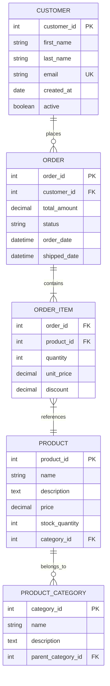

# SQL Comprehensive Guide for Senior Engineers

## Introduction

This comprehensive guide covers advanced SQL concepts, database design patterns, and optimization techniques essential for senior backend engineers. It includes extensive interview questions, real-world examples, and industry best practices for MySQL and PostgreSQL.

## Advanced Database Design

### Entity-Relationship Modeling



### Advanced Normalization Techniques

#### Fourth Normal Form (4NF) - Multi-valued Dependencies

```sql
-- ❌ Violates 4NF - Multi-valued dependencies
CREATE TABLE employee_skills_projects (
    employee_id INT,
    skill VARCHAR(50),
    project VARCHAR(50),
    PRIMARY KEY (employee_id, skill, project)
);

-- ✅ 4NF Compliant - Separate multi-valued dependencies
CREATE TABLE employee_skills (
    employee_id INT,
    skill VARCHAR(50),
    PRIMARY KEY (employee_id, skill),
    FOREIGN KEY (employee_id) REFERENCES employees(id)
);

CREATE TABLE employee_projects (
    employee_id INT,
    project VARCHAR(50),
    PRIMARY KEY (employee_id, project),
    FOREIGN KEY (employee_id) REFERENCES employees(id)
);
```

#### Fifth Normal Form (5NF) - Join Dependencies

```sql
-- Healthcare system example with complex relationships
CREATE TABLE doctor_patient_treatment (
    doctor_id INT,
    patient_id INT,
    treatment_id INT,
    PRIMARY KEY (doctor_id, patient_id, treatment_id),
    FOREIGN KEY (doctor_id) REFERENCES doctors(id),
    FOREIGN KEY (patient_id) REFERENCES patients(id),
    FOREIGN KEY (treatment_id) REFERENCES treatments(id)
);

-- Decomposed to eliminate join dependencies
CREATE TABLE doctor_specializations (
    doctor_id INT,
    treatment_id INT,
    PRIMARY KEY (doctor_id, treatment_id)
);

CREATE TABLE patient_conditions (
    patient_id INT,
    treatment_id INT,
    PRIMARY KEY (patient_id, treatment_id)
);

CREATE TABLE appointments (
    doctor_id INT,
    patient_id INT,
    appointment_date DATETIME,
    PRIMARY KEY (doctor_id, patient_id, appointment_date)
);
```

## Advanced Query Patterns and Optimization

### Complex Window Functions

```sql
-- Advanced analytics with multiple window functions
WITH sales_analysis AS (
    SELECT 
        sales_rep_id,
        region,
        sale_date,
        amount,
        -- Running totals
        SUM(amount) OVER (
            PARTITION BY sales_rep_id 
            ORDER BY sale_date 
            ROWS UNBOUNDED PRECEDING
        ) as running_total,
        
        -- Moving averages
        AVG(amount) OVER (
            PARTITION BY sales_rep_id 
            ORDER BY sale_date 
            ROWS BETWEEN 6 PRECEDING AND CURRENT ROW
        ) as seven_day_avg,
        
        -- Percentile rankings
        PERCENT_RANK() OVER (
            PARTITION BY region 
            ORDER BY amount
        ) as percentile_rank,
        
        -- Lead/Lag for trend analysis
        LAG(amount, 1) OVER (
            PARTITION BY sales_rep_id 
            ORDER BY sale_date
        ) as prev_sale,
        
        LEAD(amount, 1) OVER (
            PARTITION BY sales_rep_id 
            ORDER BY sale_date
        ) as next_sale,
        
        -- First/Last values in window
        FIRST_VALUE(amount) OVER (
            PARTITION BY sales_rep_id 
            ORDER BY sale_date 
            ROWS BETWEEN UNBOUNDED PRECEDING AND UNBOUNDED FOLLOWING
        ) as first_sale,
        
        LAST_VALUE(amount) OVER (
            PARTITION BY sales_rep_id 
            ORDER BY sale_date 
            ROWS BETWEEN UNBOUNDED PRECEDING AND UNBOUNDED FOLLOWING
        ) as last_sale
    FROM sales
    WHERE sale_date >= '2024-01-01'
),
trend_analysis AS (
    SELECT 
        *,
        CASE 
            WHEN amount > prev_sale THEN 'UP'
            WHEN amount < prev_sale THEN 'DOWN'
            ELSE 'STABLE'
        END as trend,
        
        (amount - seven_day_avg) / seven_day_avg * 100 as deviation_from_avg
    FROM sales_analysis
)
SELECT 
    sales_rep_id,
    region,
    COUNT(*) as total_sales,
    SUM(amount) as total_revenue,
    AVG(deviation_from_avg) as avg_deviation,
    COUNT(CASE WHEN trend = 'UP' THEN 1 END) as upward_trends,
    MAX(running_total) as final_total
FROM trend_analysis
GROUP BY sales_rep_id, region
ORDER BY total_revenue DESC;
```

### Advanced CTE Patterns

```sql
-- Recursive CTE for organizational hierarchy with depth limits
WITH RECURSIVE org_hierarchy AS (
    -- Base case: CEO and direct reports
    SELECT 
        employee_id,
        name,
        manager_id,
        title,
        salary,
        1 as level,
        ARRAY[employee_id] as path,
        CAST(name AS VARCHAR(1000)) as hierarchy_path
    FROM employees 
    WHERE manager_id IS NULL
    
    UNION ALL
    
    -- Recursive case with cycle detection
    SELECT 
        e.employee_id,
        e.name,
        e.manager_id,
        e.title,
        e.salary,
        oh.level + 1,
        oh.path || e.employee_id,
        oh.hierarchy_path || ' -> ' || e.name
    FROM employees e
    INNER JOIN org_hierarchy oh ON e.manager_id = oh.employee_id
    WHERE e.employee_id != ALL(oh.path)  -- Prevent cycles
    AND oh.level < 10  -- Prevent infinite recursion
),
-- Calculate team metrics
team_metrics AS (
    SELECT 
        manager_id,
        COUNT(*) as direct_reports,
        AVG(salary) as avg_team_salary,
        SUM(salary) as total_team_cost,
        MAX(level) as max_depth
    FROM org_hierarchy
    WHERE manager_id IS NOT NULL
    GROUP BY manager_id
)
SELECT 
    oh.employee_id,
    oh.name,
    oh.title,
    oh.level,
    oh.hierarchy_path,
    oh.salary,
    COALESCE(tm.direct_reports, 0) as team_size,
    COALESCE(tm.avg_team_salary, 0) as avg_team_salary,
    COALESCE(tm.total_team_cost, 0) as total_team_budget
FROM org_hierarchy oh
LEFT JOIN team_metrics tm ON oh.employee_id = tm.manager_id
ORDER BY oh.level, oh.name;
```

## Advanced Indexing Strategies

### Composite Index Design

```sql
-- E-commerce order analysis - optimal index design
CREATE TABLE orders (
    id BIGINT PRIMARY KEY,
    customer_id INT NOT NULL,
    status VARCHAR(20) NOT NULL,
    order_date TIMESTAMP NOT NULL,
    total_amount DECIMAL(12,2) NOT NULL,
    shipping_address_id INT,
    created_at TIMESTAMP DEFAULT CURRENT_TIMESTAMP,
    updated_at TIMESTAMP DEFAULT CURRENT_TIMESTAMP ON UPDATE CURRENT_TIMESTAMP
);

-- Strategic index design based on query patterns
-- 1. Customer order history (most common query)
CREATE INDEX idx_orders_customer_date ON orders(customer_id, order_date DESC);

-- 2. Status-based reporting
CREATE INDEX idx_orders_status_date ON orders(status, order_date DESC);

-- 3. High-value order analysis
CREATE INDEX idx_orders_amount_date ON orders(total_amount DESC, order_date DESC);

-- 4. Covering index for dashboard queries
CREATE INDEX idx_orders_dashboard ON orders(status, order_date DESC) 
INCLUDE (customer_id, total_amount);

-- 5. Partial index for active orders only (PostgreSQL)
CREATE INDEX idx_orders_active ON orders(customer_id, order_date DESC) 
WHERE status IN ('pending', 'processing', 'shipped');
```

### Advanced Index Types

```sql
-- PostgreSQL specific advanced indexes

-- 1. GIN index for full-text search
CREATE INDEX idx_products_search ON products 
USING GIN(to_tsvector('english', name || ' ' || description));

-- 2. GiST index for geometric data
CREATE INDEX idx_stores_location ON stores USING GIST(location);

-- 3. Hash index for equality lookups
CREATE INDEX idx_users_email_hash ON users USING HASH(email);

-- 4. Expression index
CREATE INDEX idx_users_lower_email ON users(LOWER(email));
CREATE INDEX idx_orders_month ON orders(EXTRACT(MONTH FROM order_date));

-- 5. Multi-column partial index
CREATE INDEX idx_orders_recent_high_value ON orders(customer_id, total_amount) 
WHERE order_date >= CURRENT_DATE - INTERVAL '30 days' 
AND total_amount > 1000;
```

## Query Performance Optimization

### Advanced Query Rewriting

```sql
-- Subquery optimization techniques

-- ❌ Correlated subquery (slow)
SELECT 
    c.customer_id,
    c.name,
    (SELECT COUNT(*) FROM orders o WHERE o.customer_id = c.customer_id) as order_count,
    (SELECT MAX(total_amount) FROM orders o WHERE o.customer_id = c.customer_id) as max_order
FROM customers c
WHERE c.active = true;

-- ✅ Window function optimization
SELECT DISTINCT
    c.customer_id,
    c.name,
    COUNT(o.id) OVER (PARTITION BY c.customer_id) as order_count,
    MAX(o.total_amount) OVER (PARTITION BY c.customer_id) as max_order
FROM customers c
LEFT JOIN orders o ON c.customer_id = o.customer_id
WHERE c.active = true;

-- ✅ Even better: Aggregated join
SELECT 
    c.customer_id,
    c.name,
    COALESCE(os.order_count, 0) as order_count,
    COALESCE(os.max_order, 0) as max_order
FROM customers c
LEFT JOIN (
    SELECT 
        customer_id,
        COUNT(*) as order_count,
        MAX(total_amount) as max_order
    FROM orders
    GROUP BY customer_id
) os ON c.customer_id = os.customer_id
WHERE c.active = true;
```

### Partition Management

```sql
-- Range partitioning for time-series data
CREATE TABLE sales_data (
    id BIGINT,
    sale_date DATE NOT NULL,
    customer_id INT,
    product_id INT,
    amount DECIMAL(10,2),
    region VARCHAR(50)
) PARTITION BY RANGE (sale_date);

-- Create monthly partitions
CREATE TABLE sales_data_2024_01 PARTITION OF sales_data
FOR VALUES FROM ('2024-01-01') TO ('2024-02-01');

CREATE TABLE sales_data_2024_02 PARTITION OF sales_data
FOR VALUES FROM ('2024-02-01') TO ('2024-03-01');

-- Hash partitioning for even distribution
CREATE TABLE user_activities (
    id BIGINT,
    user_id INT NOT NULL,
    activity_type VARCHAR(50),
    activity_data JSONB,
    created_at TIMESTAMP
) PARTITION BY HASH (user_id);

-- Create hash partitions
CREATE TABLE user_activities_0 PARTITION OF user_activities
FOR VALUES WITH (MODULUS 4, REMAINDER 0);

CREATE TABLE user_activities_1 PARTITION OF user_activities
FOR VALUES WITH (MODULUS 4, REMAINDER 1);

-- Automated partition management
CREATE OR REPLACE FUNCTION create_monthly_partition(table_name TEXT, start_date DATE)
RETURNS VOID AS $$
DECLARE
    partition_name TEXT;
    end_date DATE;
BEGIN
    partition_name := table_name || '_' || to_char(start_date, 'YYYY_MM');
    end_date := start_date + INTERVAL '1 month';
    
    EXECUTE format('CREATE TABLE %I PARTITION OF %I FOR VALUES FROM (%L) TO (%L)',
                   partition_name, table_name, start_date, end_date);
    
    EXECUTE format('CREATE INDEX ON %I (sale_date)', partition_name);
    EXECUTE format('CREATE INDEX ON %I (customer_id)', partition_name);
END;
$$ LANGUAGE plpgsql;
```

## Real-World Industry Examples

### Healthcare Data Management

```sql
-- Patient data with HIPAA compliance considerations
CREATE TABLE patients (
    patient_id UUID PRIMARY KEY DEFAULT gen_random_uuid(),
    medical_record_number VARCHAR(20) UNIQUE NOT NULL,
    first_name_encrypted BYTEA,
    last_name_encrypted BYTEA,
    date_of_birth_encrypted BYTEA,
    ssn_hash VARCHAR(64), -- Hashed for lookup
    created_at TIMESTAMP DEFAULT CURRENT_TIMESTAMP,
    updated_at TIMESTAMP DEFAULT CURRENT_TIMESTAMP
);

-- Medical encounters with audit trail
CREATE TABLE medical_encounters (
    encounter_id UUID PRIMARY KEY DEFAULT gen_random_uuid(),
    patient_id UUID REFERENCES patients(patient_id),
    provider_id UUID REFERENCES healthcare_providers(provider_id),
    encounter_date TIMESTAMP NOT NULL,
    encounter_type VARCHAR(50) NOT NULL,
    diagnosis_codes TEXT[], -- Array of ICD-10 codes
    procedure_codes TEXT[], -- Array of CPT codes
    notes_encrypted BYTEA,
    created_by UUID REFERENCES users(user_id),
    created_at TIMESTAMP DEFAULT CURRENT_TIMESTAMP
);

-- Complex healthcare analytics query
WITH patient_risk_analysis AS (
    SELECT 
        p.patient_id,
        COUNT(me.encounter_id) as total_encounters,
        COUNT(CASE WHEN me.encounter_date >= CURRENT_DATE - INTERVAL '30 days' 
              THEN 1 END) as recent_encounters,
        
        -- Check for high-risk conditions
        CASE WHEN 'E11' = ANY(
            SELECT unnest(diagnosis_codes) 
            FROM medical_encounters 
            WHERE patient_id = p.patient_id
        ) THEN true ELSE false END as has_diabetes,
        
        -- Calculate readmission risk
        COUNT(CASE WHEN me.encounter_type = 'INPATIENT' 
                   AND me.encounter_date >= CURRENT_DATE - INTERVAL '30 days'
              THEN 1 END) as recent_admissions
              
    FROM patients p
    LEFT JOIN medical_encounters me ON p.patient_id = me.patient_id
    WHERE me.encounter_date >= CURRENT_DATE - INTERVAL '2 years'
    GROUP BY p.patient_id
)
SELECT 
    patient_id,
    total_encounters,
    recent_encounters,
    has_diabetes,
    recent_admissions,
    CASE 
        WHEN recent_admissions > 1 THEN 'HIGH'
        WHEN has_diabetes AND recent_encounters > 5 THEN 'MEDIUM'
        ELSE 'LOW'
    END as readmission_risk
FROM patient_risk_analysis
WHERE recent_encounters > 0
ORDER BY recent_admissions DESC, recent_encounters DESC;
```

### Financial Services Schema

```sql
-- Banking transaction system with regulatory compliance
CREATE TABLE accounts (
    account_id UUID PRIMARY KEY DEFAULT gen_random_uuid(),
    account_number VARCHAR(20) UNIQUE NOT NULL,
    customer_id UUID REFERENCES customers(customer_id),
    account_type VARCHAR(20) NOT NULL CHECK (account_type IN ('CHECKING', 'SAVINGS', 'CREDIT')),
    balance DECIMAL(15,2) NOT NULL DEFAULT 0.00,
    currency_code CHAR(3) NOT NULL DEFAULT 'USD',
    status VARCHAR(20) NOT NULL DEFAULT 'ACTIVE',
    opened_date DATE NOT NULL,
    closed_date DATE,
    created_at TIMESTAMP DEFAULT CURRENT_TIMESTAMP
);

CREATE TABLE transactions (
    transaction_id UUID PRIMARY KEY DEFAULT gen_random_uuid(),
    account_id UUID REFERENCES accounts(account_id),
    transaction_type VARCHAR(20) NOT NULL,
    amount DECIMAL(15,2) NOT NULL,
    currency_code CHAR(3) NOT NULL,
    description TEXT,
    reference_number VARCHAR(50),
    counterparty_account_id UUID REFERENCES accounts(account_id),
    transaction_date TIMESTAMP NOT NULL,
    posted_date TIMESTAMP,
    status VARCHAR(20) NOT NULL DEFAULT 'PENDING',
    created_at TIMESTAMP DEFAULT CURRENT_TIMESTAMP
) PARTITION BY RANGE (transaction_date);

-- Anti-money laundering (AML) monitoring
WITH suspicious_activity AS (
    SELECT 
        t.account_id,
        COUNT(*) as transaction_count,
        SUM(ABS(t.amount)) as total_volume,
        COUNT(DISTINCT DATE(t.transaction_date)) as active_days,
        
        -- Large cash transactions
        COUNT(CASE WHEN ABS(t.amount) > 10000 
                   AND t.transaction_type IN ('CASH_DEPOSIT', 'CASH_WITHDRAWAL')
              THEN 1 END) as large_cash_transactions,
        
        -- Rapid succession transactions
        COUNT(CASE WHEN EXISTS (
            SELECT 1 FROM transactions t2 
            WHERE t2.account_id = t.account_id 
            AND t2.transaction_date BETWEEN t.transaction_date - INTERVAL '1 hour' 
                                        AND t.transaction_date + INTERVAL '1 hour'
            AND t2.transaction_id != t.transaction_id
        ) THEN 1 END) as rapid_transactions,
        
        -- Round number bias (potential structuring)
        COUNT(CASE WHEN t.amount % 1000 = 0 AND ABS(t.amount) >= 5000 
              THEN 1 END) as round_amount_transactions
        
    FROM transactions t
    WHERE t.transaction_date >= CURRENT_DATE - INTERVAL '30 days'
    AND t.status = 'POSTED'
    GROUP BY t.account_id
),
risk_scoring AS (
    SELECT 
        sa.*,
        a.customer_id,
        c.customer_type,
        
        -- Calculate risk score
        (CASE WHEN large_cash_transactions > 5 THEN 25 ELSE 0 END +
         CASE WHEN total_volume > 100000 THEN 20 ELSE 0 END +
         CASE WHEN rapid_transactions > 10 THEN 15 ELSE 0 END +
         CASE WHEN round_amount_transactions > 3 THEN 10 ELSE 0 END +
         CASE WHEN transaction_count / active_days > 20 THEN 10 ELSE 0 END
        ) as risk_score
        
    FROM suspicious_activity sa
    JOIN accounts a ON sa.account_id = a.account_id
    JOIN customers c ON a.customer_id = c.customer_id
)
SELECT 
    customer_id,
    account_id,
    transaction_count,
    total_volume,
    large_cash_transactions,
    rapid_transactions,
    round_amount_transactions,
    risk_score,
    CASE 
        WHEN risk_score >= 50 THEN 'HIGH'
        WHEN risk_score >= 25 THEN 'MEDIUM'
        ELSE 'LOW'
    END as risk_level
FROM risk_scoring
WHERE risk_score > 0
ORDER BY risk_score DESC;
```

## Interview Questions and Answers

### Question 1: Database Design and Normalization
**Q: Design a database schema for a multi-tenant SaaS application with proper normalization. How would you handle tenant isolation?**

**Answer:**
```sql
-- Multi-tenant schema with row-level security
CREATE TABLE tenants (
    tenant_id UUID PRIMARY KEY DEFAULT gen_random_uuid(),
    tenant_name VARCHAR(100) NOT NULL,
    subscription_tier VARCHAR(20) NOT NULL,
    created_at TIMESTAMP DEFAULT CURRENT_TIMESTAMP,
    is_active BOOLEAN DEFAULT true
);

CREATE TABLE users (
    user_id UUID PRIMARY KEY DEFAULT gen_random_uuid(),
    tenant_id UUID REFERENCES tenants(tenant_id),
    email VARCHAR(255) UNIQUE NOT NULL,
    password_hash VARCHAR(255) NOT NULL,
    role VARCHAR(50) NOT NULL,
    created_at TIMESTAMP DEFAULT CURRENT_TIMESTAMP
);

-- Enable Row Level Security
ALTER TABLE users ENABLE ROW LEVEL SECURITY;

-- Create policy for tenant isolation
CREATE POLICY tenant_isolation ON users
    FOR ALL TO application_role
    USING (tenant_id = current_setting('app.current_tenant_id')::UUID);

-- Application data with tenant isolation
CREATE TABLE projects (
    project_id UUID PRIMARY KEY DEFAULT gen_random_uuid(),
    tenant_id UUID REFERENCES tenants(tenant_id),
    name VARCHAR(200) NOT NULL,
    description TEXT,
    owner_id UUID REFERENCES users(user_id),
    created_at TIMESTAMP DEFAULT CURRENT_TIMESTAMP
);

ALTER TABLE projects ENABLE ROW LEVEL SECURITY;
CREATE POLICY tenant_isolation ON projects
    FOR ALL TO application_role
    USING (tenant_id = current_setting('app.current_tenant_id')::UUID);
```

**Key Points:**
- Use UUID for global uniqueness across tenants
- Implement Row Level Security (RLS) for automatic tenant isolation
- Include tenant_id in all tenant-specific tables
- Consider partitioning by tenant_id for large datasets
- Use connection pooling with tenant context

### Question 2: Query Optimization
**Q: You have a slow query that joins multiple large tables. Walk me through your optimization process.**

**Answer:**
```sql
-- Original slow query
SELECT 
    u.name,
    COUNT(o.id) as order_count,
    SUM(oi.quantity * oi.price) as total_spent
FROM users u
LEFT JOIN orders o ON u.id = o.user_id
LEFT JOIN order_items oi ON o.id = oi.order_id
WHERE u.created_at >= '2023-01-01'
GROUP BY u.id, u.name;

-- Step 1: Analyze execution plan
EXPLAIN (ANALYZE, BUFFERS) [query];

-- Step 2: Add appropriate indexes
CREATE INDEX idx_users_created_at ON users(created_at);
CREATE INDEX idx_orders_user_id ON orders(user_id);
CREATE INDEX idx_order_items_order_id ON order_items(order_id);

-- Step 3: Rewrite with pre-aggregation
WITH order_totals AS (
    SELECT 
        o.user_id,
        COUNT(o.id) as order_count,
        SUM(oi.quantity * oi.price) as total_spent
    FROM orders o
    JOIN order_items oi ON o.id = oi.order_id
    GROUP BY o.user_id
)
SELECT 
    u.name,
    COALESCE(ot.order_count, 0) as order_count,
    COALESCE(ot.total_spent, 0) as total_spent
FROM users u
LEFT JOIN order_totals ot ON u.id = ot.user_id
WHERE u.created_at >= '2023-01-01';

-- Step 4: Consider materialized view for frequent queries
CREATE MATERIALIZED VIEW user_order_summary AS
SELECT 
    u.id as user_id,
    u.name,
    COUNT(o.id) as order_count,
    SUM(oi.quantity * oi.price) as total_spent,
    MAX(o.created_at) as last_order_date
FROM users u
LEFT JOIN orders o ON u.id = o.user_id
LEFT JOIN order_items oi ON o.id = oi.order_id
GROUP BY u.id, u.name;

CREATE UNIQUE INDEX ON user_order_summary(user_id);
```

**Optimization Process:**
1. **Analyze**: Use EXPLAIN ANALYZE to identify bottlenecks
2. **Index**: Add indexes on join columns and WHERE clauses
3. **Rewrite**: Use CTEs or subqueries to reduce data processed
4. **Cache**: Consider materialized views for complex aggregations
5. **Monitor**: Track query performance over time

### Question 3: Concurrency and Locking
**Q: Explain different isolation levels and when you'd use each. How do you handle deadlocks?**

**Answer:**

**Isolation Levels:**

1. **READ UNCOMMITTED**: Allows dirty reads
   - Use case: Analytics on non-critical data where speed > accuracy
   
2. **READ COMMITTED** (Default in PostgreSQL): Prevents dirty reads
   - Use case: Most OLTP applications
   
3. **REPEATABLE READ**: Prevents dirty and non-repeatable reads
   - Use case: Financial calculations, reporting
   
4. **SERIALIZABLE**: Highest isolation, prevents all phenomena
   - Use case: Critical financial transactions

```sql
-- Deadlock prevention strategies

-- 1. Consistent lock ordering
BEGIN;
-- Always lock accounts in ID order
SELECT * FROM accounts WHERE id IN (100, 200) ORDER BY id FOR UPDATE;
-- Perform operations
COMMIT;

-- 2. Use advisory locks for application-level coordination
SELECT pg_advisory_lock(12345);
-- Critical section
SELECT pg_advisory_unlock(12345);

-- 3. Timeout configuration
SET lock_timeout = '5s';
SET deadlock_timeout = '1s';

-- 4. Retry logic in application
CREATE OR REPLACE FUNCTION transfer_funds(
    from_account_id INT,
    to_account_id INT,
    amount DECIMAL
) RETURNS BOOLEAN AS $$
DECLARE
    retry_count INT := 0;
    max_retries INT := 3;
BEGIN
    LOOP
        BEGIN
            -- Ensure consistent lock ordering
            IF from_account_id < to_account_id THEN
                PERFORM * FROM accounts WHERE id = from_account_id FOR UPDATE;
                PERFORM * FROM accounts WHERE id = to_account_id FOR UPDATE;
            ELSE
                PERFORM * FROM accounts WHERE id = to_account_id FOR UPDATE;
                PERFORM * FROM accounts WHERE id = from_account_id FOR UPDATE;
            END IF;
            
            -- Perform transfer
            UPDATE accounts SET balance = balance - amount WHERE id = from_account_id;
            UPDATE accounts SET balance = balance + amount WHERE id = to_account_id;
            
            RETURN TRUE;
            
        EXCEPTION WHEN deadlock_detected THEN
            retry_count := retry_count + 1;
            IF retry_count >= max_retries THEN
                RAISE;
            END IF;
            -- Exponential backoff
            PERFORM pg_sleep(0.1 * (2 ^ retry_count));
        END;
    END LOOP;
END;
$$ LANGUAGE plpgsql;
```

### Question 4: Database Scaling Strategies
**Q: How would you scale a database that's becoming a bottleneck? Discuss read replicas, sharding, and partitioning.**

**Answer:**

**1. Read Replicas (Vertical Scaling)**
```sql
-- Master-slave configuration
-- Master: Write operations
-- Slaves: Read operations

-- Application routing logic
class DatabaseRouter:
    def route_query(self, query_type, query):
        if query_type == 'SELECT' and not self.requires_fresh_data(query):
            return self.read_replica.execute(query)
        else:
            return self.master.execute(query)
```

**2. Horizontal Partitioning/Sharding**
```sql
-- Shard by user_id hash
CREATE TABLE users_shard_0 (
    LIKE users INCLUDING ALL,
    CHECK (user_id % 4 = 0)
);

CREATE TABLE users_shard_1 (
    LIKE users INCLUDING ALL,
    CHECK (user_id % 4 = 1)
);

-- Application sharding logic
def get_shard(user_id):
    return f"users_shard_{user_id % 4}"

-- Cross-shard queries require application-level aggregation
def get_user_stats_across_shards():
    results = []
    for shard in range(4):
        result = execute_on_shard(shard, "SELECT COUNT(*) FROM users")
        results.append(result)
    return sum(results)
```

**3. Vertical Partitioning**
```sql
-- Split frequently accessed from rarely accessed columns
CREATE TABLE users_core (
    user_id INT PRIMARY KEY,
    email VARCHAR(255),
    created_at TIMESTAMP
);

CREATE TABLE users_profile (
    user_id INT PRIMARY KEY REFERENCES users_core(user_id),
    bio TEXT,
    preferences JSONB,
    last_login TIMESTAMP
);
```

**Scaling Decision Matrix:**
- **< 1M records**: Single database with proper indexing
- **1M - 10M records**: Read replicas + caching
- **10M - 100M records**: Partitioning + read replicas
- **> 100M records**: Sharding + microservices architecture

### Question 5: Advanced Performance Tuning
**Q: A query that was fast yesterday is now slow. How do you diagnose and fix it?**

**Answer:**

**Diagnostic Process:**
```sql
-- 1. Check current execution plan
EXPLAIN (ANALYZE, BUFFERS, FORMAT JSON) 
SELECT * FROM orders WHERE created_at >= '2024-01-01';

-- 2. Compare with historical plans (if available)
-- Use pg_stat_statements extension
SELECT 
    query,
    calls,
    total_time,
    mean_time,
    rows
FROM pg_stat_statements 
WHERE query LIKE '%orders%created_at%'
ORDER BY mean_time DESC;

-- 3. Check for statistics staleness
SELECT 
    schemaname,
    tablename,
    last_analyze,
    last_autoanalyze
FROM pg_stat_user_tables 
WHERE tablename = 'orders';

-- 4. Manual statistics update
ANALYZE orders;

-- 5. Check for index bloat
SELECT 
    schemaname,
    tablename,
    indexname,
    pg_size_pretty(pg_relation_size(indexrelid)) as size,
    idx_scan,
    idx_tup_read,
    idx_tup_fetch
FROM pg_stat_user_indexes 
WHERE tablename = 'orders';

-- 6. Rebuild bloated indexes
REINDEX INDEX CONCURRENTLY idx_orders_created_at;

-- 7. Check for lock contention
SELECT 
    blocked_locks.pid AS blocked_pid,
    blocked_activity.usename AS blocked_user,
    blocking_locks.pid AS blocking_pid,
    blocking_activity.usename AS blocking_user,
    blocked_activity.query AS blocked_statement,
    blocking_activity.query AS current_statement_in_blocking_process
FROM pg_catalog.pg_locks blocked_locks
JOIN pg_catalog.pg_stat_activity blocked_activity ON blocked_activity.pid = blocked_locks.pid
JOIN pg_catalog.pg_locks blocking_locks ON blocking_locks.locktype = blocked_locks.locktype
JOIN pg_catalog.pg_stat_activity blocking_activity ON blocking_activity.pid = blocking_locks.pid
WHERE NOT blocked_locks.granted;
```

**Common Causes and Solutions:**
1. **Stale Statistics**: Run ANALYZE
2. **Index Bloat**: REINDEX CONCURRENTLY
3. **Plan Changes**: Use pg_hint_plan or query hints
4. **Lock Contention**: Optimize transaction scope
5. **Data Growth**: Partition large tables
6. **Hardware Issues**: Check I/O, memory, CPU

## Key Takeaways for Senior Engineers

1. **Design for Scale**: Consider future growth in schema design
2. **Monitor Continuously**: Use tools like pg_stat_statements, slow query logs
3. **Understand Trade-offs**: Normalization vs. performance, consistency vs. availability
4. **Security First**: Implement proper access controls, encryption, audit trails
5. **Test Everything**: Load testing, failover scenarios, backup/restore procedures
6. **Document Decisions**: Architecture decisions, index strategies, partition schemes

## Next Steps

- Study [Database Optimization and Design](./database-optimization-design.md)
- Learn [NoSQL Database Patterns](./nosql-comprehensive.md)
- Explore [Database Security Best Practices](./database-security.md)
### Ques
tion 6: ACID Properties and Transactions
**Q: Explain ACID properties and how they're implemented in PostgreSQL vs MySQL. When might you relax these constraints?**

**Answer:**

**ACID Properties:**

1. **Atomicity**: All operations in a transaction succeed or fail together
2. **Consistency**: Database remains in valid state after transaction
3. **Isolation**: Concurrent transactions don't interfere with each other
4. **Durability**: Committed changes survive system failures

**Implementation Differences:**

```sql
-- PostgreSQL: Full ACID compliance by default
BEGIN;
INSERT INTO accounts (id, balance) VALUES (1, 1000);
UPDATE accounts SET balance = balance - 100 WHERE id = 1;
INSERT INTO transactions (account_id, amount) VALUES (1, -100);
COMMIT; -- All or nothing

-- MySQL: Engine-dependent
-- InnoDB: Full ACID support
-- MyISAM: No transaction support, faster for read-heavy workloads

-- When to relax ACID:
-- 1. Analytics/Reporting (eventual consistency acceptable)
-- 2. High-throughput logging (durability can be relaxed)
-- 3. Caching layers (consistency can be eventual)

-- Example: Relaxed durability for performance
SET synchronous_commit = off; -- PostgreSQL
-- Or use async replication for non-critical data
```

### Question 7: Database Replication and High Availability
**Q: Design a high-availability database setup for a critical e-commerce application. Explain your replication strategy.**

**Answer:**

```sql
-- Master-Slave Replication Setup
-- Primary (Master) Database Configuration

-- 1. Streaming replication setup
-- postgresql.conf
wal_level = replica
max_wal_senders = 3
wal_keep_segments = 64
synchronous_standby_names = 'standby1,standby2'

-- 2. Standby server configuration
-- recovery.conf (PostgreSQL < 12)
standby_mode = 'on'
primary_conninfo = 'host=primary-db port=5432 user=replicator'
trigger_file = '/tmp/postgresql.trigger'

-- 3. Application-level routing
class DatabaseConnection:
    def __init__(self):
        self.primary = connect_to_primary()
        self.replicas = [connect_to_replica(host) for host in replica_hosts]
        
    def execute_read(self, query):
        # Load balance across replicas
        replica = random.choice(self.replicas)
        return replica.execute(query)
        
    def execute_write(self, query):
        return self.primary.execute(query)

-- 4. Failover automation
-- Use tools like Patroni, repmgr, or cloud-native solutions
-- Automatic promotion of standby to primary
-- DNS/Load balancer updates for seamless failover
```

**High Availability Architecture:**
- **Synchronous replication** for zero data loss
- **Asynchronous replication** for performance
- **Connection pooling** (PgBouncer, pgpool-II)
- **Monitoring and alerting** (Prometheus, Grafana)
- **Automated failover** (Patroni, Kubernetes operators)

### Question 8: Complex JOIN Operations and Performance
**Q: Explain different JOIN algorithms and when each is optimal. How do you optimize complex multi-table JOINs?**

**Answer:**

**JOIN Algorithms:**

1. **Nested Loop Join**: Good for small datasets or when one table is much smaller
2. **Hash Join**: Optimal when one table fits in memory
3. **Merge Join**: Best for pre-sorted data or when both tables are large

```sql
-- Force specific join algorithms for testing
SET enable_nestloop = off;
SET enable_hashjoin = off;
SET enable_mergejoin = on;

-- Complex multi-table join optimization
-- ❌ Inefficient: Cartesian product risk
SELECT 
    u.name,
    p.title as product_title,
    c.name as category_name,
    o.order_date,
    oi.quantity
FROM users u
JOIN orders o ON u.id = o.user_id
JOIN order_items oi ON o.id = oi.order_id
JOIN products p ON oi.product_id = p.id
JOIN categories c ON p.category_id = c.id
WHERE u.created_at >= '2024-01-01'
AND o.status = 'completed';

-- ✅ Optimized: Filter early, join strategically
WITH recent_users AS (
    SELECT id, name 
    FROM users 
    WHERE created_at >= '2024-01-01'
),
completed_orders AS (
    SELECT id, user_id, order_date
    FROM orders 
    WHERE status = 'completed'
    AND order_date >= '2024-01-01'
)
SELECT 
    ru.name,
    p.title as product_title,
    c.name as category_name,
    co.order_date,
    oi.quantity
FROM recent_users ru
JOIN completed_orders co ON ru.id = co.user_id
JOIN order_items oi ON co.id = oi.order_id
JOIN products p ON oi.product_id = p.id
JOIN categories c ON p.category_id = c.id;

-- Index strategy for optimal joins
CREATE INDEX idx_orders_status_date ON orders(status, order_date) 
WHERE status = 'completed';
CREATE INDEX idx_users_created_at ON users(created_at);
CREATE INDEX idx_order_items_covering ON order_items(order_id, product_id) 
INCLUDE (quantity);
```

### Question 9: Data Warehousing and OLAP
**Q: Design a data warehouse schema for business intelligence. Explain star vs snowflake schema trade-offs.**

**Answer:**

**Star Schema Design:**
```sql
-- Fact table (center of star)
CREATE TABLE sales_fact (
    sale_id BIGINT PRIMARY KEY,
    date_key INT REFERENCES date_dimension(date_key),
    product_key INT REFERENCES product_dimension(product_key),
    customer_key INT REFERENCES customer_dimension(customer_key),
    store_key INT REFERENCES store_dimension(store_key),
    
    -- Measures
    quantity INT NOT NULL,
    unit_price DECIMAL(10,2) NOT NULL,
    total_amount DECIMAL(12,2) NOT NULL,
    cost_amount DECIMAL(12,2) NOT NULL,
    profit_amount DECIMAL(12,2) NOT NULL
);

-- Dimension tables
CREATE TABLE date_dimension (
    date_key INT PRIMARY KEY,
    full_date DATE NOT NULL,
    year INT NOT NULL,
    quarter INT NOT NULL,
    month INT NOT NULL,
    day_of_week INT NOT NULL,
    is_weekend BOOLEAN NOT NULL,
    is_holiday BOOLEAN NOT NULL
);

CREATE TABLE product_dimension (
    product_key INT PRIMARY KEY,
    product_id VARCHAR(50) NOT NULL,
    product_name VARCHAR(200) NOT NULL,
    category VARCHAR(100) NOT NULL,
    subcategory VARCHAR(100) NOT NULL,
    brand VARCHAR(100) NOT NULL,
    unit_cost DECIMAL(10,2) NOT NULL
);

-- OLAP queries with CUBE and ROLLUP
SELECT 
    COALESCE(d.year::TEXT, 'All Years') as year,
    COALESCE(p.category, 'All Categories') as category,
    COALESCE(c.region, 'All Regions') as region,
    SUM(sf.total_amount) as total_sales,
    SUM(sf.profit_amount) as total_profit,
    COUNT(*) as transaction_count
FROM sales_fact sf
JOIN date_dimension d ON sf.date_key = d.date_key
JOIN product_dimension p ON sf.product_key = p.product_key
JOIN customer_dimension c ON sf.customer_key = c.customer_key
WHERE d.year >= 2023
GROUP BY CUBE(d.year, p.category, c.region)
ORDER BY d.year, p.category, c.region;
```

**Snowflake Schema (Normalized):**
```sql
-- More normalized approach
CREATE TABLE product_dimension (
    product_key INT PRIMARY KEY,
    product_id VARCHAR(50) NOT NULL,
    product_name VARCHAR(200) NOT NULL,
    subcategory_key INT REFERENCES subcategory_dimension(subcategory_key),
    brand_key INT REFERENCES brand_dimension(brand_key)
);

CREATE TABLE subcategory_dimension (
    subcategory_key INT PRIMARY KEY,
    subcategory_name VARCHAR(100) NOT NULL,
    category_key INT REFERENCES category_dimension(category_key)
);

CREATE TABLE category_dimension (
    category_key INT PRIMARY KEY,
    category_name VARCHAR(100) NOT NULL
);
```

**Trade-offs:**
- **Star Schema**: Faster queries, more storage, denormalized
- **Snowflake Schema**: Less storage, slower queries, normalized
- **Galaxy Schema**: Multiple fact tables, complex relationships

### Question 10: Database Security and Compliance
**Q: Implement a comprehensive security strategy for a financial database handling PII and PCI data.**

**Answer:**

```sql
-- 1. Role-based access control
CREATE ROLE financial_analyst;
CREATE ROLE customer_service;
CREATE ROLE dba_admin;

-- 2. Column-level security
CREATE TABLE customers (
    customer_id UUID PRIMARY KEY,
    email VARCHAR(255) NOT NULL,
    first_name VARCHAR(100),
    last_name VARCHAR(100),
    ssn_encrypted BYTEA, -- Encrypted at application level
    phone_hash VARCHAR(64), -- Hashed for lookup
    created_at TIMESTAMP DEFAULT CURRENT_TIMESTAMP
);

-- 3. Row-level security policies
ALTER TABLE customers ENABLE ROW LEVEL SECURITY;

CREATE POLICY customer_access_policy ON customers
    FOR SELECT TO customer_service
    USING (
        customer_id IN (
            SELECT customer_id FROM customer_assignments 
            WHERE agent_id = current_user_id()
        )
    );

-- 4. Audit logging
CREATE TABLE audit_log (
    log_id UUID PRIMARY KEY DEFAULT gen_random_uuid(),
    table_name VARCHAR(100) NOT NULL,
    operation VARCHAR(10) NOT NULL,
    user_name VARCHAR(100) NOT NULL,
    timestamp TIMESTAMP DEFAULT CURRENT_TIMESTAMP,
    old_values JSONB,
    new_values JSONB,
    client_ip INET
);

-- Audit trigger function
CREATE OR REPLACE FUNCTION audit_trigger_function()
RETURNS TRIGGER AS $$
BEGIN
    INSERT INTO audit_log (
        table_name, 
        operation, 
        user_name, 
        old_values, 
        new_values,
        client_ip
    ) VALUES (
        TG_TABLE_NAME,
        TG_OP,
        current_user,
        CASE WHEN TG_OP = 'DELETE' THEN row_to_json(OLD) ELSE NULL END,
        CASE WHEN TG_OP IN ('INSERT', 'UPDATE') THEN row_to_json(NEW) ELSE NULL END,
        inet_client_addr()
    );
    
    RETURN COALESCE(NEW, OLD);
END;
$$ LANGUAGE plpgsql;

-- Apply audit trigger to sensitive tables
CREATE TRIGGER customers_audit_trigger
    AFTER INSERT OR UPDATE OR DELETE ON customers
    FOR EACH ROW EXECUTE FUNCTION audit_trigger_function();

-- 5. Data masking for non-production environments
CREATE OR REPLACE FUNCTION mask_ssn(ssn TEXT)
RETURNS TEXT AS $$
BEGIN
    RETURN 'XXX-XX-' || RIGHT(ssn, 4);
END;
$$ LANGUAGE plpgsql;

-- 6. Encryption at rest and in transit
-- Configure SSL/TLS for connections
-- Use transparent data encryption (TDE) where available
-- Implement application-level encryption for sensitive fields

-- 7. Connection security
-- postgresql.conf
ssl = on
ssl_cert_file = 'server.crt'
ssl_key_file = 'server.key'
ssl_ca_file = 'ca.crt'
ssl_crl_file = 'ca.crl'

-- pg_hba.conf - require SSL and certificate authentication
hostssl all financial_users 0.0.0.0/0 cert clientcert=1
```

### Question 11: Database Backup and Recovery Strategies
**Q: Design a comprehensive backup and disaster recovery strategy for a 24/7 global application.**

**Answer:**

```sql
-- 1. Continuous archiving setup (PostgreSQL)
-- postgresql.conf
archive_mode = on
archive_command = 'cp %p /backup/archive/%f'
wal_level = replica

-- 2. Base backup strategy
-- Full backup script
#!/bin/bash
BACKUP_DIR="/backup/base/$(date +%Y%m%d_%H%M%S)"
pg_basebackup -D $BACKUP_DIR -Ft -z -P -U backup_user -h localhost

-- 3. Point-in-time recovery setup
-- Create recovery configuration
cat > recovery.conf << EOF
restore_command = 'cp /backup/archive/%f %p'
recovery_target_time = '2024-01-15 14:30:00'
EOF

-- 4. Logical backup for specific data
-- Custom backup with specific tables
pg_dump -h localhost -U backup_user \
    --table=critical_transactions \
    --table=user_accounts \
    --format=custom \
    --compress=9 \
    --file=critical_data_$(date +%Y%m%d).backup \
    production_db

-- 5. Cross-region replication for DR
-- Streaming replication to different geographic region
-- standby server in different data center
primary_conninfo = 'host=primary.us-east.company.com port=5432 user=replicator'
```

**Recovery Testing:**
```sql
-- Regular recovery drills
-- 1. Restore to test environment
-- 2. Validate data integrity
-- 3. Test application connectivity
-- 4. Measure recovery time objectives (RTO)
-- 5. Verify recovery point objectives (RPO)

-- Automated backup verification
SELECT 
    schemaname,
    tablename,
    n_tup_ins + n_tup_upd + n_tup_del as total_changes
FROM pg_stat_user_tables
WHERE last_vacuum > CURRENT_TIMESTAMP - INTERVAL '1 day';
```

### Question 12: Database Monitoring and Performance Metrics
**Q: What key metrics would you monitor for database health? How would you set up alerting for performance degradation?**

**Answer:**

```sql
-- 1. Query performance monitoring
-- Enable pg_stat_statements extension
CREATE EXTENSION IF NOT EXISTS pg_stat_statements;

-- Monitor slow queries
SELECT 
    query,
    calls,
    total_time,
    mean_time,
    stddev_time,
    rows,
    100.0 * shared_blks_hit / nullif(shared_blks_hit + shared_blks_read, 0) AS hit_percent
FROM pg_stat_statements
WHERE mean_time > 1000  -- Queries taking more than 1 second on average
ORDER BY mean_time DESC
LIMIT 10;

-- 2. Connection monitoring
SELECT 
    state,
    COUNT(*) as connection_count,
    MAX(EXTRACT(EPOCH FROM (now() - query_start))) as longest_query_seconds
FROM pg_stat_activity
WHERE state IS NOT NULL
GROUP BY state;

-- 3. Lock monitoring
SELECT 
    blocked_locks.pid AS blocked_pid,
    blocked_activity.usename AS blocked_user,
    blocking_locks.pid AS blocking_pid,
    blocking_activity.usename AS blocking_user,
    blocked_activity.query AS blocked_statement
FROM pg_catalog.pg_locks blocked_locks
JOIN pg_catalog.pg_stat_activity blocked_activity ON blocked_activity.pid = blocked_locks.pid
JOIN pg_catalog.pg_locks blocking_locks ON blocking_locks.locktype = blocked_locks.locktype
JOIN pg_catalog.pg_stat_activity blocking_activity ON blocking_activity.pid = blocking_locks.pid
WHERE NOT blocked_locks.granted;

-- 4. Database size and growth monitoring
SELECT 
    schemaname,
    tablename,
    pg_size_pretty(pg_total_relation_size(schemaname||'.'||tablename)) as size,
    pg_size_pretty(pg_relation_size(schemaname||'.'||tablename)) as table_size,
    pg_size_pretty(pg_total_relation_size(schemaname||'.'||tablename) - pg_relation_size(schemaname||'.'||tablename)) as index_size
FROM pg_tables
WHERE schemaname NOT IN ('information_schema', 'pg_catalog')
ORDER BY pg_total_relation_size(schemaname||'.'||tablename) DESC;

-- 5. Index usage monitoring
SELECT 
    schemaname,
    tablename,
    indexname,
    idx_scan,
    idx_tup_read,
    idx_tup_fetch,
    pg_size_pretty(pg_relation_size(indexrelid)) as index_size
FROM pg_stat_user_indexes
WHERE idx_scan = 0  -- Unused indexes
ORDER BY pg_relation_size(indexrelid) DESC;

-- 6. Cache hit ratio monitoring
SELECT 
    'Buffer Cache Hit Ratio' as metric,
    ROUND(
        100.0 * sum(blks_hit) / (sum(blks_hit) + sum(blks_read)), 2
    ) as percentage
FROM pg_stat_database
WHERE datname = current_database()
UNION ALL
SELECT 
    'Index Cache Hit Ratio' as metric,
    ROUND(
        100.0 * sum(idx_blks_hit) / (sum(idx_blks_hit) + sum(idx_blks_read)), 2
    ) as percentage
FROM pg_statio_user_indexes;
```

**Alerting Thresholds:**
- **Connection count** > 80% of max_connections
- **Cache hit ratio** < 95%
- **Average query time** > baseline + 2 standard deviations
- **Lock wait time** > 30 seconds
- **Disk space** > 85% full
- **Replication lag** > 1 minute

### Question 13: Database Migration Strategies
**Q: Plan a zero-downtime migration from MySQL to PostgreSQL for a high-traffic application.**

**Answer:**

**Migration Strategy:**

```sql
-- Phase 1: Schema Migration
-- 1. Analyze MySQL schema
SHOW CREATE TABLE users;
SHOW CREATE TABLE orders;

-- 2. Convert to PostgreSQL equivalent
-- MySQL to PostgreSQL type mappings:
-- TINYINT -> SMALLINT
-- MEDIUMINT -> INTEGER  
-- BIGINT -> BIGINT
-- DATETIME -> TIMESTAMP
-- TEXT -> TEXT
-- ENUM -> CHECK constraint or custom type

-- MySQL schema
CREATE TABLE users (
    id INT AUTO_INCREMENT PRIMARY KEY,
    email VARCHAR(255) UNIQUE NOT NULL,
    created_at DATETIME DEFAULT CURRENT_TIMESTAMP,
    status ENUM('active', 'inactive', 'suspended') DEFAULT 'active'
);

-- PostgreSQL equivalent
CREATE TABLE users (
    id SERIAL PRIMARY KEY,
    email VARCHAR(255) UNIQUE NOT NULL,
    created_at TIMESTAMP DEFAULT CURRENT_TIMESTAMP,
    status VARCHAR(20) CHECK (status IN ('active', 'inactive', 'suspended')) DEFAULT 'active'
);

-- Phase 2: Dual-write setup
-- Application writes to both databases
class DatabaseManager:
    def __init__(self):
        self.mysql_conn = mysql_connection()
        self.postgres_conn = postgres_connection()
        
    def create_user(self, user_data):
        # Write to MySQL (primary)
        mysql_result = self.mysql_conn.execute(
            "INSERT INTO users (email, status) VALUES (%s, %s)",
            (user_data['email'], user_data['status'])
        )
        
        # Write to PostgreSQL (secondary)
        try:
            postgres_result = self.postgres_conn.execute(
                "INSERT INTO users (email, status) VALUES (%s, %s)",
                (user_data['email'], user_data['status'])
            )
        except Exception as e:
            # Log discrepancy for later reconciliation
            log_sync_error(user_data, str(e))
            
        return mysql_result

-- Phase 3: Data synchronization
-- Initial bulk copy
pg_dump --host=mysql-host --port=3306 --username=user \
    --format=custom --no-owner --no-privileges \
    --table=users --table=orders \
    mysql_db | pg_restore --host=postgres-host --port=5432 \
    --username=user --dbname=postgres_db

-- Ongoing sync with change data capture
-- Use tools like Debezium, Maxwell, or custom triggers

-- Phase 4: Validation and reconciliation
-- Data consistency checks
WITH mysql_counts AS (
    SELECT 'users' as table_name, COUNT(*) as count FROM mysql.users
    UNION ALL
    SELECT 'orders' as table_name, COUNT(*) as count FROM mysql.orders
),
postgres_counts AS (
    SELECT 'users' as table_name, COUNT(*) as count FROM postgres.users
    UNION ALL
    SELECT 'orders' as table_name, COUNT(*) as count FROM postgres.orders
)
SELECT 
    m.table_name,
    m.count as mysql_count,
    p.count as postgres_count,
    m.count - p.count as difference
FROM mysql_counts m
JOIN postgres_counts p ON m.table_name = p.table_name;

-- Phase 5: Gradual read migration
-- Route read traffic to PostgreSQL gradually
class ReadRouter:
    def __init__(self, postgres_percentage=0):
        self.postgres_percentage = postgres_percentage
        
    def route_read(self, query):
        if random.randint(1, 100) <= self.postgres_percentage:
            return self.postgres_conn.execute(query)
        else:
            return self.mysql_conn.execute(query)

-- Phase 6: Final cutover
-- 1. Stop writes to MySQL
-- 2. Final sync of any remaining data
-- 3. Switch all reads to PostgreSQL
-- 4. Monitor for issues
-- 5. Keep MySQL as backup for rollback
```

### Question 14: Database Testing Strategies
**Q: How would you implement comprehensive database testing for a complex application?**

**Answer:**

```sql
-- 1. Unit Testing for Database Functions
-- Test stored procedures and functions
CREATE OR REPLACE FUNCTION calculate_order_total(order_id INT)
RETURNS DECIMAL(10,2) AS $$
DECLARE
    total DECIMAL(10,2);
BEGIN
    SELECT SUM(quantity * unit_price) INTO total
    FROM order_items
    WHERE order_id = calculate_order_total.order_id;
    
    RETURN COALESCE(total, 0);
END;
$$ LANGUAGE plpgsql;

-- Unit test for the function
DO $$
DECLARE
    test_order_id INT;
    expected_total DECIMAL(10,2) := 150.00;
    actual_total DECIMAL(10,2);
BEGIN
    -- Setup test data
    INSERT INTO orders (id, customer_id) VALUES (999, 1);
    INSERT INTO order_items (order_id, product_id, quantity, unit_price) 
    VALUES (999, 1, 2, 50.00), (999, 2, 1, 50.00);
    
    -- Execute function
    SELECT calculate_order_total(999) INTO actual_total;
    
    -- Assert result
    IF actual_total != expected_total THEN
        RAISE EXCEPTION 'Test failed: expected %, got %', expected_total, actual_total;
    END IF;
    
    -- Cleanup
    DELETE FROM order_items WHERE order_id = 999;
    DELETE FROM orders WHERE id = 999;
    
    RAISE NOTICE 'Test passed: calculate_order_total';
END $$;

-- 2. Integration Testing
-- Test complex queries and transactions
BEGIN;
    -- Test transaction rollback
    INSERT INTO accounts (id, balance) VALUES (1001, 1000);
    INSERT INTO accounts (id, balance) VALUES (1002, 500);
    
    -- Simulate transfer
    UPDATE accounts SET balance = balance - 200 WHERE id = 1001;
    UPDATE accounts SET balance = balance + 200 WHERE id = 1002;
    
    -- Verify balances
    ASSERT (SELECT balance FROM accounts WHERE id = 1001) = 800;
    ASSERT (SELECT balance FROM accounts WHERE id = 1002) = 700;
    
ROLLBACK; -- Clean up test data

-- 3. Performance Testing
-- Load testing with realistic data volumes
-- Generate test data
INSERT INTO users (email, created_at)
SELECT 
    'user' || generate_series || '@test.com',
    CURRENT_TIMESTAMP - (random() * INTERVAL '365 days')
FROM generate_series(1, 100000);

-- Test query performance under load
EXPLAIN (ANALYZE, BUFFERS)
SELECT u.email, COUNT(o.id) as order_count
FROM users u
LEFT JOIN orders o ON u.id = o.user_id
WHERE u.created_at >= CURRENT_DATE - INTERVAL '30 days'
GROUP BY u.id, u.email
HAVING COUNT(o.id) > 5;

-- 4. Data Quality Testing
-- Constraint validation tests
-- Test referential integrity
INSERT INTO orders (customer_id) VALUES (99999); -- Should fail

-- Test check constraints
INSERT INTO products (price) VALUES (-10); -- Should fail if price > 0 constraint exists

-- Test unique constraints
INSERT INTO users (email) VALUES ('existing@email.com'); -- Should fail if duplicate

-- 5. Backup and Recovery Testing
-- Automated backup validation
CREATE OR REPLACE FUNCTION test_backup_integrity()
RETURNS BOOLEAN AS $$
DECLARE
    backup_checksum TEXT;
    current_checksum TEXT;
BEGIN
    -- Calculate checksum of critical tables
    SELECT md5(string_agg(md5(t.*::text), '' ORDER BY id))
    INTO current_checksum
    FROM (
        SELECT * FROM users 
        UNION ALL 
        SELECT * FROM orders::text
    ) t;
    
    -- Compare with backup checksum (stored separately)
    -- Return true if checksums match
    RETURN current_checksum = get_backup_checksum();
END;
$$ LANGUAGE plpgsql;

-- 6. Security Testing
-- Test SQL injection prevention
-- Parameterized query test
PREPARE user_lookup (TEXT) AS
    SELECT * FROM users WHERE email = $1;

EXECUTE user_lookup('test@example.com');
EXECUTE user_lookup('test@example.com; DROP TABLE users; --'); -- Should be safe

-- Test access controls
SET ROLE limited_user;
SELECT * FROM sensitive_table; -- Should fail with permission denied

-- 7. Concurrency Testing
-- Test for race conditions and deadlocks
-- Simulate concurrent transactions
BEGIN;
    SELECT * FROM accounts WHERE id = 1 FOR UPDATE;
    -- Simulate processing time
    SELECT pg_sleep(1);
    UPDATE accounts SET balance = balance - 100 WHERE id = 1;
COMMIT;
```

### Question 15: Database Optimization for Specific Use Cases
**Q: Optimize a database for a real-time analytics dashboard that needs to handle both OLTP and OLAP workloads.**

**Answer:**

```sql
-- Hybrid OLTP/OLAP Architecture Design

-- 1. Partitioned fact table for time-series data
CREATE TABLE events (
    event_id BIGINT,
    user_id INT,
    event_type VARCHAR(50),
    event_data JSONB,
    created_at TIMESTAMP NOT NULL,
    processed_at TIMESTAMP
) PARTITION BY RANGE (created_at);

-- Create monthly partitions
CREATE TABLE events_2024_01 PARTITION OF events
FOR VALUES FROM ('2024-01-01') TO ('2024-02-01');

CREATE TABLE events_2024_02 PARTITION OF events
FOR VALUES FROM ('2024-02-01') TO ('2024-03-01');

-- 2. Materialized views for pre-aggregated analytics
CREATE MATERIALIZED VIEW hourly_user_activity AS
SELECT 
    DATE_TRUNC('hour', created_at) as hour,
    user_id,
    event_type,
    COUNT(*) as event_count,
    COUNT(DISTINCT user_id) as unique_users
FROM events
WHERE created_at >= CURRENT_DATE - INTERVAL '7 days'
GROUP BY DATE_TRUNC('hour', created_at), user_id, event_type;

-- Create indexes for fast dashboard queries
CREATE INDEX idx_hourly_activity_time ON hourly_user_activity(hour);
CREATE INDEX idx_hourly_activity_user ON hourly_user_activity(user_id);

-- 3. Real-time aggregation with window functions
CREATE VIEW real_time_metrics AS
WITH recent_events AS (
    SELECT 
        event_type,
        created_at,
        user_id,
        LAG(created_at) OVER (PARTITION BY user_id ORDER BY created_at) as prev_event_time
    FROM events
    WHERE created_at >= CURRENT_TIMESTAMP - INTERVAL '1 hour'
),
session_analysis AS (
    SELECT 
        user_id,
        event_type,
        COUNT(*) as events_in_session,
        EXTRACT(EPOCH FROM (MAX(created_at) - MIN(created_at))) as session_duration_seconds
    FROM recent_events
    WHERE prev_event_time IS NULL 
       OR created_at - prev_event_time > INTERVAL '30 minutes'
    GROUP BY user_id, event_type
)
SELECT 
    event_type,
    COUNT(DISTINCT user_id) as active_users,
    AVG(events_in_session) as avg_events_per_session,
    AVG(session_duration_seconds) as avg_session_duration
FROM session_analysis
GROUP BY event_type;

-- 4. Columnar storage simulation with arrays
-- For analytical queries on large datasets
CREATE TABLE user_metrics_columnar (
    date_key DATE PRIMARY KEY,
    user_ids INT[],
    page_views INT[],
    session_durations INTERVAL[],
    conversion_flags BOOLEAN[]
);

-- Analytical query on columnar data
SELECT 
    date_key,
    array_length(user_ids, 1) as total_users,
    (SELECT AVG(duration) FROM unnest(session_durations) as duration) as avg_session_duration,
    (SELECT COUNT(*) FROM unnest(conversion_flags) as flag WHERE flag = true) as conversions
FROM user_metrics_columnar
WHERE date_key >= CURRENT_DATE - INTERVAL '30 days';

-- 5. Read replica optimization for analytics
-- Configure read replica with different settings
-- On read replica:
-- postgresql.conf optimizations for analytics
shared_buffers = '4GB'          -- Larger buffer for analytical queries
work_mem = '256MB'              -- More memory for sorting/hashing
maintenance_work_mem = '1GB'    -- Faster index builds
effective_cache_size = '12GB'   -- Assume more OS cache available
random_page_cost = 1.1          -- SSD optimization

-- 6. Query optimization for dashboard
-- Pre-computed dashboard metrics
CREATE TABLE dashboard_cache (
    metric_name VARCHAR(100),
    time_period VARCHAR(50),
    metric_value DECIMAL(15,2),
    last_updated TIMESTAMP DEFAULT CURRENT_TIMESTAMP,
    PRIMARY KEY (metric_name, time_period)
);

-- Refresh dashboard cache procedure
CREATE OR REPLACE FUNCTION refresh_dashboard_metrics()
RETURNS VOID AS $$
BEGIN
    -- Daily active users
    INSERT INTO dashboard_cache (metric_name, time_period, metric_value)
    SELECT 
        'daily_active_users',
        'today',
        COUNT(DISTINCT user_id)
    FROM events
    WHERE DATE(created_at) = CURRENT_DATE
    ON CONFLICT (metric_name, time_period) 
    DO UPDATE SET 
        metric_value = EXCLUDED.metric_value,
        last_updated = CURRENT_TIMESTAMP;
    
    -- Revenue metrics
    INSERT INTO dashboard_cache (metric_name, time_period, metric_value)
    SELECT 
        'daily_revenue',
        'today',
        SUM(amount)
    FROM transactions
    WHERE DATE(created_at) = CURRENT_DATE
    AND status = 'completed'
    ON CONFLICT (metric_name, time_period) 
    DO UPDATE SET 
        metric_value = EXCLUDED.metric_value,
        last_updated = CURRENT_TIMESTAMP;
END;
$$ LANGUAGE plpgsql;

-- Schedule cache refresh
-- Use pg_cron or external scheduler
SELECT cron.schedule('refresh-dashboard', '*/5 * * * *', 'SELECT refresh_dashboard_metrics();');

-- 7. Connection pooling for mixed workloads
-- PgBouncer configuration for different connection pools
-- pgbouncer.ini
[databases]
oltp_pool = host=localhost dbname=mydb pool_size=20 pool_mode=transaction
olap_pool = host=localhost dbname=mydb pool_size=5 pool_mode=session

[pgbouncer]
listen_port = 6432
auth_type = md5
pool_mode = transaction
server_reset_query = DISCARD ALL
max_client_conn = 1000
default_pool_size = 25
```

**Performance Monitoring for Hybrid Workload:**
```sql
-- Monitor query patterns
SELECT 
    query_type,
    COUNT(*) as query_count,
    AVG(total_time) as avg_time,
    MAX(total_time) as max_time
FROM (
    SELECT 
        CASE 
            WHEN query LIKE 'SELECT%COUNT%GROUP BY%' THEN 'ANALYTICAL'
            WHEN query LIKE 'INSERT%' OR query LIKE 'UPDATE%' THEN 'TRANSACTIONAL'
            ELSE 'OTHER'
        END as query_type,
        total_time
    FROM pg_stat_statements
) categorized_queries
GROUP BY query_type;
```