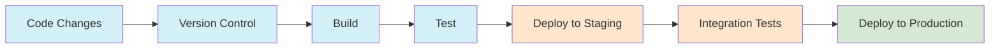
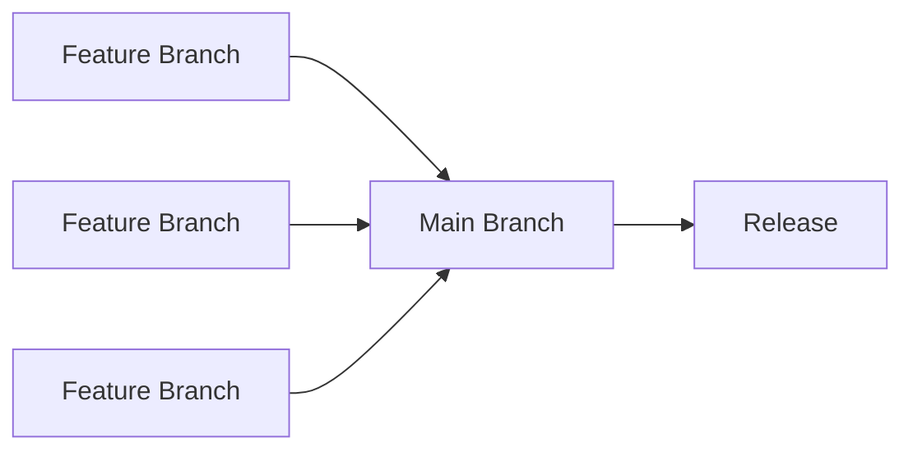
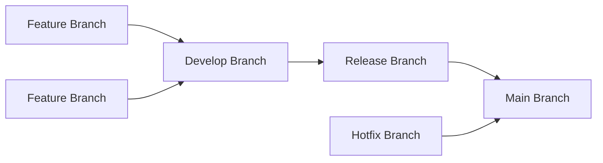
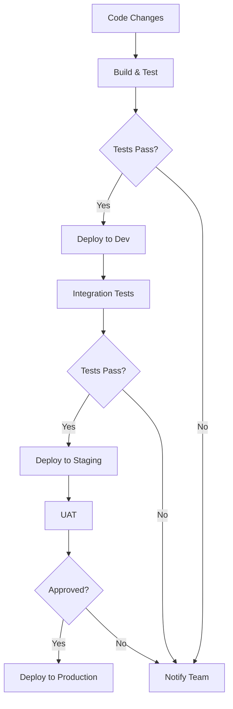
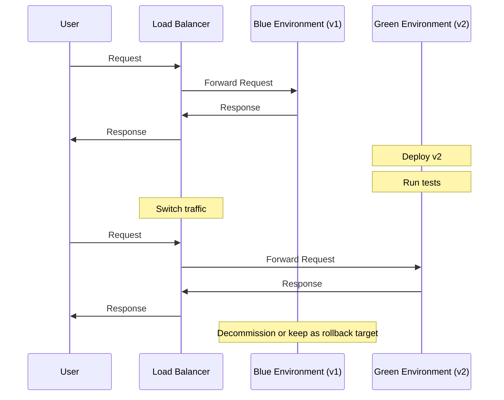
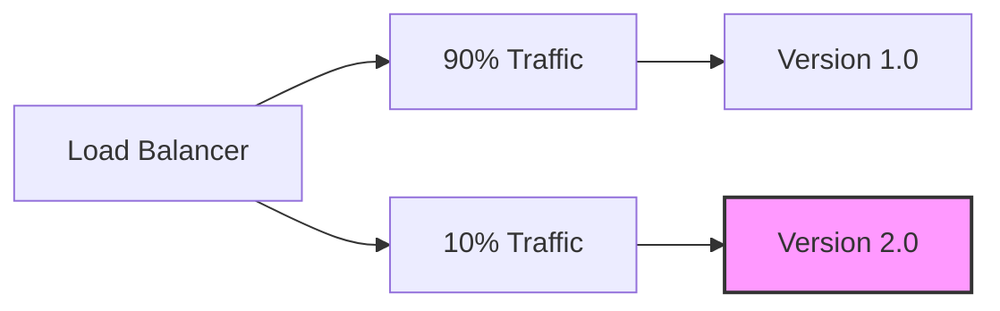
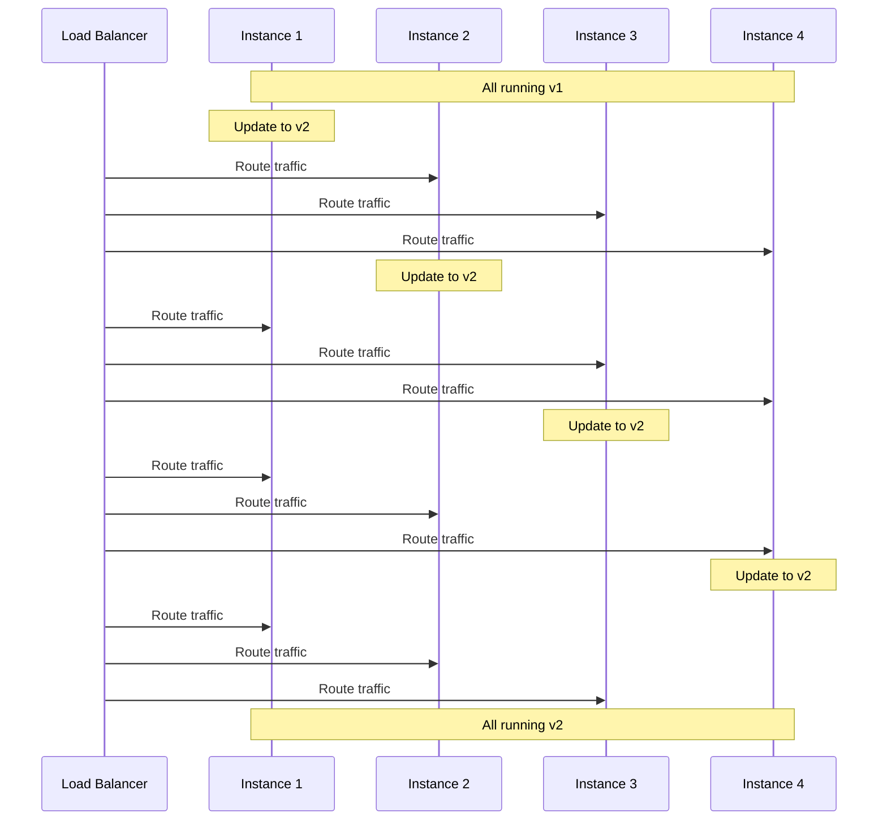

# CI/CD and Cloud Platforms

## Introduction

Continuous Integration (CI) and Continuous Deployment (CD) pipelines, coupled with modern cloud platforms, form the backbone of modern software delivery. This comprehensive guide covers pipeline design, automation strategies, infrastructure as code, and cloud platform comparisons essential for senior backend engineers working with Node.js applications.

## Table of Contents

1. [CI/CD Fundamentals](#cicd-fundamentals)
2. [Pipeline Design Patterns](#pipeline-design-patterns)
3. [Infrastructure as Code](#infrastructure-as-code)
4. [Cloud Platform Comparison](#cloud-platform-comparison)
5. [AWS for Node.js Applications](#aws-for-nodejs-applications)
6. [Azure for Node.js Applications](#azure-for-nodejs-applications)
7. [GCP for Node.js Applications](#gcp-for-nodejs-applications)
8. [Deployment Strategies](#deployment-strategies)
9. [Monitoring and Observability](#monitoring-and-observability)
10. [Security Best Practices](#security-best-practices)

## CI/CD Fundamentals

### What is CI/CD?

Continuous Integration (CI) is the practice of frequently merging code changes into a shared repository, followed by automated builds and tests. Continuous Deployment (CD) extends this by automatically deploying all code changes to production after passing the CI stage.


###
 CI/CD Benefits

1. **Faster Time to Market**: Automate repetitive tasks to deliver features quickly
2. **Higher Quality Code**: Catch bugs early through automated testing
3. **Reduced Deployment Risk**: Smaller, incremental changes are easier to troubleshoot
4. **Improved Developer Productivity**: Focus on writing code, not manual deployment tasks
5. **Consistent Environments**: Infrastructure as code ensures consistency across environments

### CI/CD Pipeline Components

#### 1. Source Control Management
```javascript
// Example Git workflow for feature development
const gitWorkflow = {
  mainBranch: 'main',
  developBranch: 'develop',
  featureBranchPrefix: 'feature/',
  releaseBranchPrefix: 'release/',
  hotfixBranchPrefix: 'hotfix/',
  
  createFeature: (featureName) => {
    return `git checkout -b ${this.featureBranchPrefix}${featureName} ${this.developBranch}`;
  },
  
  completeFeature: (featureName) => {
    return [
      `git checkout ${this.developBranch}`,
      `git merge --no-ff ${this.featureBranchPrefix}${featureName}`,
      `git push origin ${this.developBranch}`
    ];
  }
};
```

#### 2. Build Automation
```javascript
// Example package.json scripts for Node.js build process
{
  "scripts": {
    "clean": "rimraf dist",
    "lint": "eslint src/**/*.js",
    "test": "jest --coverage",
    "build": "npm run clean && npm run lint && babel src -d dist",
    "ci": "npm run build && npm run test"
  }
}
```

#### 3. Automated Testing
```javascript
// Example Jest test configuration
module.exports = {
  preset: 'ts-jest',
  testEnvironment: 'node',
  collectCoverage: true,
  coverageThreshold: {
    global: {
      branches: 80,
      functions: 80,
      lines: 80,
      statements: 80
    }
  },
  testMatch: ['**/__tests__/**/*.test.[jt]s?(x)'],
  setupFilesAfterEnv: ['./jest.setup.js']
};
```

#### 4. Artifact Management
```javascript
// Example npm package publishing workflow
const publishWorkflow = {
  prepareRelease: () => {
    return [
      'npm version patch', // or minor/major
      'npm run build',
      'npm test'
    ];
  },
  
  publishPackage: () => {
    return [
      'npm publish --access public',
      'git push --follow-tags'
    ];
  }
};
```

#### 5. Deployment Automation
```yaml
# Example deployment script using Docker
version: '3'
services:
  app:
    image: ${REGISTRY}/myapp:${VERSION}
    deploy:
      replicas: 3
      update_config:
        parallelism: 1
        delay: 10s
        order: start-first
      restart_policy:
        condition: on-failure
    environment:
      - NODE_ENV=production
    ports:
      - "3000:3000"
```
## Pip
eline Design Patterns

### Trunk-Based Development vs. GitFlow

#### Trunk-Based Development


**Benefits:**
- Simpler workflow with fewer branches
- Continuous integration of features
- Faster feedback cycles
- Reduced merge conflicts

#### GitFlow


**Benefits:**
- Clear separation of development and production code
- Structured release process
- Support for multiple production versions

### Pipeline as Code

```yaml
# Example GitHub Actions workflow for Node.js
name: Node.js CI/CD

on:
  push:
    branches: [ main, develop ]
  pull_request:
    branches: [ main, develop ]

jobs:
  build:
    runs-on: ubuntu-latest
    
    strategy:
      matrix:
        node-version: [16.x, 18.x]
        
    steps:
    - uses: actions/checkout@v3
    
    - name: Use Node.js ${{ matrix.node-version }}
      uses: actions/setup-node@v3
      with:
        node-version: ${{ matrix.node-version }}
        cache: 'npm'
        
    - name: Install dependencies
      run: npm ci
      
    - name: Lint
      run: npm run lint
      
    - name: Build
      run: npm run build
      
    - name: Test
      run: npm test
      
    - name: Upload build artifacts
      uses: actions/upload-artifact@v3
      with:
        name: build-output
        path: dist/
        
  deploy-staging:
    needs: build
    if: github.ref == 'refs/heads/develop'
    runs-on: ubuntu-latest
    
    steps:
    - uses: actions/checkout@v3
    
    - name: Download build artifacts
      uses: actions/download-artifact@v3
      with:
        name: build-output
        path: dist/
        
    - name: Deploy to staging
      run: |
        echo "Deploying to staging environment"
        # Deployment script here
        
  deploy-production:
    needs: build
    if: github.ref == 'refs/heads/main'
    runs-on: ubuntu-latest
    environment: production
    
    steps:
    - uses: actions/checkout@v3
    
    - name: Download build artifacts
      uses: actions/download-artifact@v3
      with:
        name: build-output
        path: dist/
        
    - name: Deploy to production
      run: |
        echo "Deploying to production environment"
        # Deployment script here
```

### Multi-Environment Pipeline



### Parallel Testing Strategies

```javascript
// Example Jest configuration for parallel testing
module.exports = {
  preset: 'ts-jest',
  testEnvironment: 'node',
  maxWorkers: '50%', // Use 50% of available CPU cores
  testMatch: ['**/__tests__/**/*.test.[jt]s?(x)'],
  
  // Group tests for parallel execution
  projects: [
    {
      displayName: 'unit',
      testMatch: ['**/__tests__/unit/**/*.test.[jt]s?(x)'],
      maxWorkers: 4
    },
    {
      displayName: 'integration',
      testMatch: ['**/__tests__/integration/**/*.test.[jt]s?(x)'],
      maxWorkers: 2
    },
    {
      displayName: 'e2e',
      testMatch: ['**/__tests__/e2e/**/*.test.[jt]s?(x)'],
      maxWorkers: 1
    }
  ]
};
```## Infra
structure as Code

### Terraform for Cloud Infrastructure

```hcl
# Example Terraform configuration for AWS Node.js application
provider "aws" {
  region = "us-west-2"
}

# VPC and networking
module "vpc" {
  source = "terraform-aws-modules/vpc/aws"
  
  name = "nodejs-app-vpc"
  cidr = "10.0.0.0/16"
  
  azs             = ["us-west-2a", "us-west-2b"]
  private_subnets = ["10.0.1.0/24", "10.0.2.0/24"]
  public_subnets  = ["10.0.101.0/24", "10.0.102.0/24"]
  
  enable_nat_gateway = true
}

# ECS cluster for containerized Node.js app
resource "aws_ecs_cluster" "nodejs_cluster" {
  name = "nodejs-app-cluster"
  
  setting {
    name  = "containerInsights"
    value = "enabled"
  }
}

# Task definition for Node.js application
resource "aws_ecs_task_definition" "nodejs_task" {
  family                   = "nodejs-app"
  network_mode             = "awsvpc"
  requires_compatibilities = ["FARGATE"]
  cpu                      = 256
  memory                   = 512
  execution_role_arn       = aws_iam_role.ecs_execution_role.arn
  
  container_definitions = jsonencode([
    {
      name      = "nodejs-app"
      image     = "${var.ecr_repository_url}:${var.app_version}"
      essential = true
      
      portMappings = [
        {
          containerPort = 3000
          hostPort      = 3000
          protocol      = "tcp"
        }
      ]
      
      environment = [
        {
          name  = "NODE_ENV"
          value = "production"
        }
      ]
      
      logConfiguration = {
        logDriver = "awslogs"
        options = {
          "awslogs-group"         = "/ecs/nodejs-app"
          "awslogs-region"        = "us-west-2"
          "awslogs-stream-prefix" = "ecs"
        }
      }
    }
  ])
}

# ECS service
resource "aws_ecs_service" "nodejs_service" {
  name            = "nodejs-app-service"
  cluster         = aws_ecs_cluster.nodejs_cluster.id
  task_definition = aws_ecs_task_definition.nodejs_task.arn
  desired_count   = 2
  launch_type     = "FARGATE"
  
  network_configuration {
    subnets         = module.vpc.private_subnets
    security_groups = [aws_security_group.nodejs_sg.id]
  }
  
  load_balancer {
    target_group_arn = aws_lb_target_group.nodejs_tg.arn
    container_name   = "nodejs-app"
    container_port   = 3000
  }
}
```

### AWS CloudFormation

```yaml
# Example CloudFormation template for Node.js application
AWSTemplateFormatVersion: '2010-09-09'
Description: 'Node.js Application Stack'

Parameters:
  AppName:
    Type: String
    Default: nodejs-app
    Description: Name of the Node.js application
    
  ContainerImage:
    Type: String
    Description: URI of the container image
    
  ContainerPort:
    Type: Number
    Default: 3000
    Description: Port exposed by the container
    
Resources:
  # VPC and networking resources
  AppVPC:
    Type: AWS::EC2::VPC
    Properties:
      CidrBlock: 10.0.0.0/16
      EnableDnsSupport: true
      EnableDnsHostnames: true
      Tags:
        - Key: Name
          Value: !Sub ${AppName}-vpc
          
  # ECS Cluster
  ECSCluster:
    Type: AWS::ECS::Cluster
    Properties:
      ClusterName: !Sub ${AppName}-cluster
      
  # Task Definition
  TaskDefinition:
    Type: AWS::ECS::TaskDefinition
    Properties:
      Family: !Sub ${AppName}-task
      NetworkMode: awsvpc
      RequiresCompatibilities:
        - FARGATE
      Cpu: 256
      Memory: 512
      ExecutionRoleArn: !GetAtt ECSExecutionRole.Arn
      ContainerDefinitions:
        - Name: !Ref AppName
          Image: !Ref ContainerImage
          Essential: true
          PortMappings:
            - ContainerPort: !Ref ContainerPort
              Protocol: tcp
          Environment:
            - Name: NODE_ENV
              Value: production
          LogConfiguration:
            LogDriver: awslogs
            Options:
              awslogs-group: !Ref LogGroup
              awslogs-region: !Ref AWS::Region
              awslogs-stream-prefix: ecs
              
  # ECS Service
  ECSService:
    Type: AWS::ECS::Service
    DependsOn: LoadBalancerListener
    Properties:
      ServiceName: !Sub ${AppName}-service
      Cluster: !Ref ECSCluster
      TaskDefinition: !Ref TaskDefinition
      DesiredCount: 2
      LaunchType: FARGATE
      NetworkConfiguration:
        AwsvpcConfiguration:
          Subnets: !Ref PrivateSubnets
          SecurityGroups:
            - !Ref ContainerSecurityGroup
      LoadBalancers:
        - TargetGroupArn: !Ref TargetGroup
          ContainerName: !Ref AppName
          ContainerPort: !Ref ContainerPort
```

### Ansible for Configuration Management

```yaml
# Example Ansible playbook for Node.js application deployment
---
- name: Deploy Node.js Application
  hosts: app_servers
  become: yes
  vars:
    app_name: nodejs-app
    app_version: "1.0.0"
    node_version: "18.x"
    app_dir: "/opt/{{ app_name }}"
    
  tasks:
    - name: Install Node.js repository
      shell: |
        curl -fsSL https://deb.nodesource.com/setup_{{ node_version }} | bash -
      args:
        warn: false
        
    - name: Install Node.js and npm
      apt:
        name: nodejs
        state: present
        update_cache: yes
        
    - name: Create application directory
      file:
        path: "{{ app_dir }}"
        state: directory
        owner: "{{ ansible_user }}"
        group: "{{ ansible_user }}"
        mode: '0755'
        
    - name: Clone application repository
      git:
        repo: "https://github.com/example/{{ app_name }}.git"
        dest: "{{ app_dir }}"
        version: "v{{ app_version }}"
        
    - name: Install dependencies
      npm:
        path: "{{ app_dir }}"
        ci: yes
        production: yes
        
    - name: Build application
      command: npm run build
      args:
        chdir: "{{ app_dir }}"
        
    - name: Set up systemd service
      template:
        src: templates/nodejs-app.service.j2
        dest: /etc/systemd/system/{{ app_name }}.service
        
    - name: Start and enable service
      systemd:
        name: "{{ app_name }}"
        state: started
        enabled: yes
        daemon_reload: yes
```## Cloud 
Platform Comparison

### AWS vs Azure vs GCP for Node.js Applications

| Feature | AWS | Azure | GCP |
|---------|-----|-------|-----|
| **Compute Services** | AWS Lambda, Elastic Beanstalk, ECS, EKS | Azure Functions, App Service, AKS | Cloud Functions, App Engine, GKE |
| **Serverless** | Lambda + API Gateway | Azure Functions + API Management | Cloud Functions + API Gateway |
| **Container Orchestration** | ECS, EKS | AKS | GKE |
| **Database Options** | DynamoDB, RDS, DocumentDB | Cosmos DB, Azure SQL, Table Storage | Firestore, Cloud SQL, Bigtable |
| **CI/CD Integration** | CodePipeline, CodeBuild, CodeDeploy | Azure DevOps, GitHub Actions | Cloud Build, Cloud Deploy |
| **Monitoring** | CloudWatch | Azure Monitor | Cloud Monitoring |
| **Cost Model** | Pay-as-you-go, reserved instances | Pay-as-you-go, reserved instances | Pay-as-you-go, sustained use discounts |
| **Global Reach** | 25+ regions | 60+ regions | 25+ regions |
| **Node.js Support** | Excellent | Excellent | Excellent |

### Choosing the Right Platform

When selecting a cloud platform for Node.js applications, consider:

1. **Existing Ecosystem**: Integration with current tools and services
2. **Specific Service Requirements**: Specialized services needed for your application
3. **Team Expertise**: Familiarity with specific cloud platforms
4. **Cost Structure**: Pricing models that align with your usage patterns
5. **Global Presence**: Regions where your users are located
6. **Compliance Requirements**: Certifications and compliance standards

## AWS for Node.js Applications

### Serverless with AWS Lambda

```javascript
// Example AWS Lambda function for Node.js
exports.handler = async (event) => {
  try {
    // Parse request
    const body = JSON.parse(event.body);
    
    // Process data
    const result = await processData(body);
    
    // Return success response
    return {
      statusCode: 200,
      headers: {
        'Content-Type': 'application/json'
      },
      body: JSON.stringify({
        message: 'Operation successful',
        data: result
      })
    };
  } catch (error) {
    // Return error response
    return {
      statusCode: 500,
      headers: {
        'Content-Type': 'application/json'
      },
      body: JSON.stringify({
        message: 'Error processing request',
        error: error.message
      })
    };
  }
};

async function processData(data) {
  // Implementation details
  return { processed: true, timestamp: new Date().toISOString() };
}
```

### AWS Elastic Beanstalk for Node.js

```yaml
# Example .ebextensions/nodecommand.config
option_settings:
  aws:elasticbeanstalk:container:nodejs:
    NodeCommand: "npm start"
    NodeVersion: 18.x
    ProxyServer: nginx
    GzipCompression: true
  aws:elasticbeanstalk:application:environment:
    NODE_ENV: production
    DB_HOST: ${RDS_HOSTNAME}
    DB_USER: ${RDS_USERNAME}
    DB_PASSWORD: ${RDS_PASSWORD}
    DB_NAME: ${RDS_DB_NAME}
  aws:elasticbeanstalk:environment:proxy:staticfiles:
    /static: /static
```

### AWS CDK for Infrastructure

```typescript
// Example AWS CDK code for Node.js application
import * as cdk from 'aws-cdk-lib';
import { Construct } from 'constructs';
import * as ec2 from 'aws-cdk-lib/aws-ec2';
import * as ecs from 'aws-cdk-lib/aws-ecs';
import * as ecr from 'aws-cdk-lib/aws-ecr';
import * as elbv2 from 'aws-cdk-lib/aws-elasticloadbalancingv2';

export class NodejsAppStack extends cdk.Stack {
  constructor(scope: Construct, id: string, props?: cdk.StackProps) {
    super(scope, id, props);

    // VPC
    const vpc = new ec2.Vpc(this, 'NodejsAppVpc', {
      maxAzs: 2
    });

    // ECS Cluster
    const cluster = new ecs.Cluster(this, 'NodejsAppCluster', {
      vpc: vpc
    });

    // ECR Repository
    const repository = new ecr.Repository(this, 'NodejsAppRepository', {
      repositoryName: 'nodejs-app'
    });

    // Fargate Task Definition
    const taskDefinition = new ecs.FargateTaskDefinition(this, 'NodejsAppTask', {
      memoryLimitMiB: 512,
      cpu: 256
    });

    // Add container to task
    const container = taskDefinition.addContainer('NodejsAppContainer', {
      image: ecs.ContainerImage.fromEcrRepository(repository),
      environment: {
        NODE_ENV: 'production'
      },
      logging: ecs.LogDrivers.awsLogs({ streamPrefix: 'nodejs-app' })
    });

    container.addPortMappings({
      containerPort: 3000
    });

    // Fargate Service
    const service = new ecs.FargateService(this, 'NodejsAppService', {
      cluster,
      taskDefinition,
      desiredCount: 2,
      assignPublicIp: false
    });

    // Load Balancer
    const lb = new elbv2.ApplicationLoadBalancer(this, 'NodejsAppLB', {
      vpc,
      internetFacing: true
    });

    const listener = lb.addListener('NodejsAppListener', {
      port: 80
    });

    listener.addTargets('NodejsAppTarget', {
      port: 80,
      targets: [service],
      healthCheck: {
        path: '/health',
        interval: cdk.Duration.seconds(60)
      }
    });

    // Output the load balancer DNS
    new cdk.CfnOutput(this, 'LoadBalancerDNS', {
      value: lb.loadBalancerDnsName
    });
  }
}
```## Azure
 for Node.js Applications

### Azure App Service

```json
// Example Azure App Service configuration (azure.json)
{
  "name": "nodejs-app",
  "type": "Microsoft.Web/sites",
  "location": "West US",
  "properties": {
    "serverFarmId": "[resourceId('Microsoft.Web/serverfarms', 'nodejs-app-plan')]",
    "siteConfig": {
      "appSettings": [
        {
          "name": "WEBSITE_NODE_DEFAULT_VERSION",
          "value": "~18"
        },
        {
          "name": "NODE_ENV",
          "value": "production"
        },
        {
          "name": "COSMOS_DB_CONNECTION_STRING",
          "value": "[parameters('cosmosDbConnectionString')]"
        }
      ],
      "alwaysOn": true,
      "http20Enabled": true,
      "minTlsVersion": "1.2",
      "ftpsState": "Disabled",
      "healthCheckPath": "/health"
    }
  }
}
```

### Azure Functions for Serverless

```javascript
// Example Azure Function for Node.js
module.exports = async function (context, req) {
  context.log('JavaScript HTTP trigger function processed a request.');

  try {
    // Parse request
    const body = req.body || {};
    
    // Process data
    const result = await processData(body);
    
    // Return success response
    context.res = {
      status: 200,
      headers: {
        'Content-Type': 'application/json'
      },
      body: {
        message: 'Operation successful',
        data: result
      }
    };
  } catch (error) {
    // Return error response
    context.res = {
      status: 500,
      headers: {
        'Content-Type': 'application/json'
      },
      body: {
        message: 'Error processing request',
        error: error.message
      }
    };
  }
};

async function processData(data) {
  // Implementation details
  return { processed: true, timestamp: new Date().toISOString() };
}
```

### Azure DevOps Pipeline

```yaml
# Example Azure DevOps pipeline for Node.js
trigger:
- main
- develop

pool:
  vmImage: 'ubuntu-latest'

variables:
  nodeVersion: '18.x'
  appServiceName: 'nodejs-app'
  resourceGroup: 'nodejs-app-rg'

stages:
- stage: Build
  jobs:
  - job: BuildJob
    steps:
    - task: NodeTool@0
      inputs:
        versionSpec: $(nodeVersion)
      displayName: 'Install Node.js'
      
    - script: |
        npm ci
      displayName: 'Install dependencies'
      
    - script: |
        npm run lint
      displayName: 'Run linting'
      
    - script: |
        npm run build
      displayName: 'Build application'
      
    - script: |
        npm test
      displayName: 'Run tests'
      
    - task: ArchiveFiles@2
      inputs:
        rootFolderOrFile: '$(System.DefaultWorkingDirectory)'
        includeRootFolder: false
        archiveType: 'zip'
        archiveFile: '$(Build.ArtifactStagingDirectory)/$(Build.BuildId).zip'
        replaceExistingArchive: true
        
    - task: PublishBuildArtifacts@1
      inputs:
        PathtoPublish: '$(Build.ArtifactStagingDirectory)'
        ArtifactName: 'drop'
        publishLocation: 'Container'

- stage: DeployToStaging
  dependsOn: Build
  condition: succeeded()
  jobs:
  - deployment: DeployStaging
    environment: 'staging'
    strategy:
      runOnce:
        deploy:
          steps:
          - task: AzureWebApp@1
            inputs:
              azureSubscription: 'Azure Subscription'
              appType: 'webAppLinux'
              appName: '$(appServiceName)-staging'
              resourceGroupName: '$(resourceGroup)'
              package: '$(Pipeline.Workspace)/drop/$(Build.BuildId).zip'
              startUpCommand: 'npm run start'

- stage: DeployToProduction
  dependsOn: DeployToStaging
  condition: succeeded()
  jobs:
  - deployment: DeployProduction
    environment: 'production'
    strategy:
      runOnce:
        deploy:
          steps:
          - task: AzureWebApp@1
            inputs:
              azureSubscription: 'Azure Subscription'
              appType: 'webAppLinux'
              appName: '$(appServiceName)'
              resourceGroupName: '$(resourceGroup)'
              package: '$(Pipeline.Workspace)/drop/$(Build.BuildId).zip'
              startUpCommand: 'npm run start'
```

## GCP for Node.js Applications

### Google Cloud Functions

```javascript
// Example Google Cloud Function for Node.js
const functions = require('@google-cloud/functions-framework');

functions.http('processRequest', async (req, res) => {
  try {
    // Parse request
    const body = req.body || {};
    
    // Process data
    const result = await processData(body);
    
    // Return success response
    res.status(200).json({
      message: 'Operation successful',
      data: result
    });
  } catch (error) {
    // Return error response
    res.status(500).json({
      message: 'Error processing request',
      error: error.message
    });
  }
});

async function processData(data) {
  // Implementation details
  return { processed: true, timestamp: new Date().toISOString() };
}
```

### Google App Engine

```yaml
# Example app.yaml for Node.js on App Engine
runtime: nodejs18

env_variables:
  NODE_ENV: 'production'
  DB_HOST: '10.0.0.1'
  DB_NAME: 'myapp'

handlers:
- url: /.*
  script: auto
  secure: always

automatic_scaling:
  min_instances: 1
  max_instances: 10
  target_cpu_utilization: 0.65
  target_throughput_utilization: 0.6
  max_concurrent_requests: 50

network:
  session_affinity: true

readiness_check:
  path: "/health"
  check_interval_sec: 30
  timeout_sec: 4
  failure_threshold: 2
  success_threshold: 2
  app_start_timeout_sec: 300
```

### Google Cloud Build

```yaml
# Example cloudbuild.yaml for Node.js
steps:
# Install dependencies
- name: 'node:18'
  entrypoint: npm
  args: ['ci']

# Run linting
- name: 'node:18'
  entrypoint: npm
  args: ['run', 'lint']

# Run tests
- name: 'node:18'
  entrypoint: npm
  args: ['test']

# Build the application
- name: 'node:18'
  entrypoint: npm
  args: ['run', 'build']

# Build the container image
- name: 'gcr.io/cloud-builders/docker'
  args: ['build', '-t', 'gcr.io/$PROJECT_ID/nodejs-app:$COMMIT_SHA', '.']

# Push the container image to Container Registry
- name: 'gcr.io/cloud-builders/docker'
  args: ['push', 'gcr.io/$PROJECT_ID/nodejs-app:$COMMIT_SHA']

# Deploy container image to Cloud Run
- name: 'gcr.io/google.com/cloudsdktool/cloud-sdk'
  entrypoint: gcloud
  args:
  - 'run'
  - 'deploy'
  - 'nodejs-app'
  - '--image'
  - 'gcr.io/$PROJECT_ID/nodejs-app:$COMMIT_SHA'
  - '--region'
  - 'us-central1'
  - '--platform'
  - 'managed'
  - '--allow-unauthenticated'

images:
- 'gcr.io/$PROJECT_ID/nodejs-app:$COMMIT_SHA'
```#
# Deployment Strategies

### Blue-Green Deployment

Blue-green deployment is a technique that reduces downtime and risk by running two identical production environments called Blue and Green.



**Implementation with AWS:**

```javascript
const AWS = require('aws-sdk');
const elbv2 = new AWS.ELBv2();

async function switchTraffic(listenerArn, blueTargetGroupArn, greenTargetGroupArn) {
  // Get current target group
  const { Rules } = await elbv2.describeRules({ ListenerArn: listenerArn }).promise();
  const defaultRule = Rules.find(rule => rule.IsDefault);
  const currentTargetGroupArn = defaultRule.Actions[0].TargetGroupArn;
  
  // Determine new target group
  const newTargetGroupArn = currentTargetGroupArn === blueTargetGroupArn 
    ? greenTargetGroupArn 
    : blueTargetGroupArn;
  
  // Update listener default action
  await elbv2.modifyListener({
    ListenerArn: listenerArn,
    DefaultActions: [{
      Type: 'forward',
      TargetGroupArn: newTargetGroupArn
    }]
  }).promise();
  
  console.log(`Traffic switched to ${newTargetGroupArn}`);
  return newTargetGroupArn;
}
```

### Canary Deployment

Canary deployment gradually shifts traffic from the old version to the new version, allowing for monitoring and rollback if issues arise.



**Implementation with Kubernetes:**

```yaml
apiVersion: networking.istio.io/v1alpha3
kind: VirtualService
metadata:
  name: nodejs-app
spec:
  hosts:
  - nodejs-app.example.com
  http:
  - route:
    - destination:
        host: nodejs-app-v1
        port:
          number: 80
      weight: 90
    - destination:
        host: nodejs-app-v2
        port:
          number: 80
      weight: 10
```

### Rolling Deployment

Rolling deployment updates instances incrementally, replacing old instances with new ones gradually.



**Implementation with Kubernetes:**

```yaml
apiVersion: apps/v1
kind: Deployment
metadata:
  name: nodejs-app
spec:
  replicas: 4
  strategy:
    type: RollingUpdate
    rollingUpdate:
      maxSurge: 1
      maxUnavailable: 1
  selector:
    matchLabels:
      app: nodejs-app
  template:
    metadata:
      labels:
        app: nodejs-app
    spec:
      containers:
      - name: nodejs-app
        image: nodejs-app:2.0
        ports:
        - containerPort: 3000
```

## Monitoring and Observability

### Logging Best Practices

```javascript
// Structured logging with Winston
const winston = require('winston');

const logger = winston.createLogger({
  level: process.env.LOG_LEVEL || 'info',
  format: winston.format.combine(
    winston.format.timestamp(),
    winston.format.metadata({ fillExcept: ['message', 'level', 'timestamp'] }),
    winston.format.json()
  ),
  defaultMeta: { 
    service: 'nodejs-app',
    environment: process.env.NODE_ENV
  },
  transports: [
    new winston.transports.Console()
  ]
});

// Request logging middleware
function requestLogger(req, res, next) {
  const start = Date.now();
  
  // Generate request ID if not present
  req.id = req.headers['x-request-id'] || require('uuid').v4();
  
  // Add request ID to response headers
  res.setHeader('x-request-id', req.id);
  
  // Log request
  logger.info('Request received', {
    requestId: req.id,
    method: req.method,
    path: req.path,
    query: req.query,
    ip: req.ip,
    userAgent: req.get('user-agent')
  });
  
  // Log response
  res.on('finish', () => {
    const duration = Date.now() - start;
    
    logger.info('Response sent', {
      requestId: req.id,
      statusCode: res.statusCode,
      duration,
      contentLength: res.get('content-length')
    });
  });
  
  next();
}
```

### Metrics Collection

```javascript
// Prometheus metrics with prom-client
const express = require('express');
const promClient = require('prom-client');
const app = express();

// Create a Registry to register metrics
const register = new promClient.Registry();
promClient.collectDefaultMetrics({ register });

// Custom metrics
const httpRequestDurationMicroseconds = new promClient.Histogram({
  name: 'http_request_duration_seconds',
  help: 'Duration of HTTP requests in seconds',
  labelNames: ['method', 'route', 'status_code'],
  buckets: [0.01, 0.05, 0.1, 0.5, 1, 2, 5]
});

const httpRequestCounter = new promClient.Counter({
  name: 'http_requests_total',
  help: 'Total number of HTTP requests',
  labelNames: ['method', 'route', 'status_code']
});

register.registerMetric(httpRequestDurationMicroseconds);
register.registerMetric(httpRequestCounter);

// Middleware to collect metrics
app.use((req, res, next) => {
  const start = Date.now();
  
  res.on('finish', () => {
    const duration = (Date.now() - start) / 1000;
    const route = req.route ? req.route.path : req.path;
    
    httpRequestDurationMicroseconds
      .labels(req.method, route, res.statusCode)
      .observe(duration);
    
    httpRequestCounter
      .labels(req.method, route, res.statusCode)
      .inc();
  });
  
  next();
});

// Metrics endpoint
app.get('/metrics', async (req, res) => {
  res.set('Content-Type', register.contentType);
  res.end(await register.metrics());
});
```

### Distributed Tracing

```javascript
// OpenTelemetry tracing for Node.js
const { NodeTracerProvider } = require('@opentelemetry/node');
const { SimpleSpanProcessor } = require('@opentelemetry/tracing');
const { JaegerExporter } = require('@opentelemetry/exporter-jaeger');
const { ExpressInstrumentation } = require('@opentelemetry/instrumentation-express');
const { HttpInstrumentation } = require('@opentelemetry/instrumentation-http');
const { registerInstrumentations } = require('@opentelemetry/instrumentation');

// Configure Jaeger exporter
const jaegerExporter = new JaegerExporter({
  serviceName: 'nodejs-app',
  endpoint: process.env.JAEGER_ENDPOINT || 'http://jaeger:14268/api/traces'
});

// Create and register TracerProvider
const provider = new NodeTracerProvider();
provider.addSpanProcessor(new SimpleSpanProcessor(jaegerExporter));
provider.register();

// Register instrumentations
registerInstrumentations({
  instrumentations: [
    new HttpInstrumentation(),
    new ExpressInstrumentation()
  ]
});

// Get tracer
const { trace } = require('@opentelemetry/api');
const tracer = trace.getTracer('nodejs-app');

// Custom span example
app.get('/api/users/:id', async (req, res) => {
  const span = tracer.startSpan('get-user-details');
  
  try {
    span.setAttribute('user.id', req.params.id);
    
    // Database call with child span
    const dbSpan = tracer.startSpan('database-query', { parent: span });
    const user = await db.findUser(req.params.id);
    dbSpan.end();
    
    if (!user) {
      span.setStatus({ code: SpanStatusCode.ERROR });
      span.setAttribute('error', true);
      span.setAttribute('error.message', 'User not found');
      res.status(404).json({ error: 'User not found' });
      return;
    }
    
    res.json(user);
  } catch (error) {
    span.setStatus({ code: SpanStatusCode.ERROR });
    span.setAttribute('error', true);
    span.setAttribute('error.message', error.message);
    res.status(500).json({ error: 'Internal server error' });
  } finally {
    span.end();
  }
});
```_s3_bucket" "app_data" {
  bucket = "app-data-bucket"
  
  server_side_encryption_configuration {
    rule {
      apply_server_side_encryption_by_default {
        sse_algorithm = "AES256"
      }
    }
  }
  
  # Block public access
  block_public_acls       = true
  block_public_policy     = true
  ignore_public_acls      = true
  restrict_public_buckets = true
}
```

### Container Security

```dockerfile
# Secure Dockerfile for Node.js
FROM node:18-alpine AS builder

# Install dependencies
WORKDIR /app
COPY package*.json ./
RUN npm ci

# Copy source and build
COPY . .
RUN npm run build
RUN npm prune --production

# Security scanning
FROM aquasec/trivy:latest AS security-scan
COPY --from=builder /app /app
WORKDIR /app
RUN trivy filesystem --exit-code 1 --severity HIGH,CRITICAL .

# Production image
FROM node:18-alpine AS production

# Create non-root user
RUN addgroup -g 1001 nodejs && \
    adduser -S -u 1001 -G nodejs nodejs

# Set working directory and ownership
WORKDIR /app
COPY --from=builder --chown=nodejs:nodejs /app/package*.json ./
COPY --from=builder --chown=nodejs:nodejs /app/node_modules ./node_modules
COPY --from=builder --chown=nodejs:nodejs /app/dist ./dist

# Use non-root user
USER nodejs

# Set secure environment
ENV NODE_ENV=production
ENV NPM_CONFIG_LOGLEVEL=error

# Health check
HEALTHCHECK --interval=30s --timeout=5s --start-period=5s --retries=3 \
  CMD wget -q --spider http://localhost:3000/health || exit 1

# Expose port and start application
EXPOSE 3000
CMD ["node", "dist/index.js"]
```

## Interview Questions and Answers

### Question 1: What is the difference between Continuous Integration, Continuous Delivery, and Continuous Deployment?

**Answer:**

**Continuous Integration (CI)** is the practice of frequently merging code changes into a shared repository, followed by automated building and testing. The primary goal is to detect integration issues early.

**Continuous Delivery (CD)** extends CI by automatically preparing code changes for release to production. The deployment to production still requires manual approval.

**Continuous Deployment** goes one step further by automatically deploying all code changes to production after passing automated tests, without manual intervention.

Key differences:
- CI focuses on build and test automation
- Continuous Delivery ensures code is always in a deployable state but requires manual approval for production deployment
- Continuous Deployment automates the entire pipeline including production deployment

A mature CI/CD pipeline typically evolves from CI → Continuous Delivery → Continuous Deployment as teams gain confidence in their automation and testing.

### Question 2: How would you implement a secure CI/CD pipeline for a Node.js application?

**Answer:**

A secure CI/CD pipeline for a Node.js application should include:

1. **Source Code Security**
   - Code scanning with tools like ESLint, SonarQube
   - Pre-commit hooks for code quality and security checks
   - Branch protection rules requiring code reviews

2. **Dependency Security**
   - npm audit or Snyk for dependency vulnerability scanning
   - Automated dependency updates with Dependabot
   - Lockfile validation to prevent supply chain attacks

3. **Build Security**
   - Isolated build environments
   - Reproducible builds with deterministic outputs
   - Artifact signing and verification

4. **Container Security**
   - Base image scanning
   - Multi-stage builds to reduce attack surface
   - Non-root user execution
   - Image scanning with Trivy, Clair, or Snyk

5. **Infrastructure Security**
   - Infrastructure as Code (IaC) scanning
   - Least privilege principle for deployment credentials
   - Ephemeral credentials for deployments

6. **Secrets Management**
   - Secure storage in services like AWS Secrets Manager or HashiCorp Vault
   - Just-in-time access to secrets during deployment
   - No hardcoded secrets in code or configuration

7. **Deployment Security**
   - Blue-green or canary deployments for safe rollouts
   - Automated rollback capabilities
   - Post-deployment security scanning

Example implementation with GitHub Actions:
```yaml
name: Secure CI/CD Pipeline

on:
  push:
    branches: [ main ]
  pull_request:
    branches: [ main ]

jobs:
  security-scan:
    runs-on: ubuntu-latest
    steps:
      - uses: actions/checkout@v3
      - name: Run npm audit
        run: npm audit --audit-level=high
      - name: Run SAST scan
        uses: github/codeql-action/analyze@v2
      - name: Run dependency scan
        uses: snyk/actions/node@master

  build-and-test:
    needs: security-scan
    runs-on: ubuntu-latest
    steps:
      - uses: actions/checkout@v3
      - name: Build and test
        run: |
          npm ci
          npm test
          npm run build

  container-build:
    needs: build-and-test
    runs-on: ubuntu-latest
    steps:
      - uses: actions/checkout@v3
      - name: Build container
        run: docker build -t app:${{ github.sha }} .
      - name: Scan container
        uses: aquasecurity/trivy-action@master
        with:
          image-ref: app:${{ github.sha }}
          severity: 'CRITICAL,HIGH'
          exit-code: '1'

  deploy:
    needs: container-build
    runs-on: ubuntu-latest
    steps:
      - name: Configure AWS credentials
        uses: aws-actions/configure-aws-credentials@v1
        with:
          role-to-assume: ${{ secrets.AWS_ROLE_ARN }}
          aws-region: us-west-2
      - name: Deploy to ECS
        run: |
          aws ecs update-service --cluster app-cluster --service app-service --force-new-deployment
```

### Question 3: Compare and contrast the serverless offerings from AWS, Azure, and GCP for Node.js applications.

**Answer:**

**AWS Lambda:**
- **Cold Start**: Typically 100-400ms for Node.js
- **Execution Limit**: Up to 15 minutes
- **Memory**: 128MB to 10GB
- **Pricing**: Pay per request and compute time (100ms increments)
- **Integration**: Native integration with AWS services
- **Deployment**: ZIP uploads, container images, or AWS SAM
- **Unique Features**: Lambda@Edge, Provisioned Concurrency

**Azure Functions:**
- **Cold Start**: Typically 200-500ms for Node.js
- **Execution Limit**: Up to 10 minutes (Consumption plan)
- **Memory**: Up to 1.5GB
- **Pricing**: Pay per execution and resource consumption
- **Integration**: Native integration with Azure services
- **Deployment**: ZIP, container images, or Azure Functions Core Tools
- **Unique Features**: Durable Functions for stateful workflows

**Google Cloud Functions:**
- **Cold Start**: Typically 200-400ms for Node.js
- **Execution Limit**: Up to 9 minutes
- **Memory**: 128MB to 8GB
- **Pricing**: Pay per invocation, compute time, and resources
- **Integration**: Native integration with GCP services
- **Deployment**: ZIP uploads or Cloud Build
- **Unique Features**: Cloud Functions for Firebase

**Key Considerations for Node.js Applications:**

1. **Performance**:
   - AWS Lambda typically has the fastest cold starts for Node.js
   - All three platforms support HTTP triggers for API development
   - Azure Durable Functions provide better support for long-running processes

2. **Development Experience**:
   - AWS: SAM CLI for local testing
   - Azure: Functions Core Tools with VS Code integration
   - GCP: Functions Framework for local development

3. **Monitoring**:
   - AWS: CloudWatch with X-Ray for tracing
   - Azure: Application Insights with distributed tracing
   - GCP: Cloud Monitoring and Cloud Trace

4. **Cost Optimization**:
   - AWS: Provisioned Concurrency for predictable workloads
   - Azure: Premium plan for dedicated resources
   - GCP: Min/max instance settings for scaling control

**Best Practices for Node.js Serverless Applications:**
- Keep dependencies minimal to reduce cold start times
- Use connection pooling for database connections
- Implement proper error handling and retries
- Leverage environment variables for configuration
- Use bundling tools like esbuild or webpack to optimize package size

### Question 4: How would you implement Infrastructure as Code (IaC) for a microservices architecture on AWS?

**Answer:**

Implementing Infrastructure as Code (IaC) for a microservices architecture on AWS involves several key components:

1. **Repository Structure**:
```
infrastructure/
├── modules/
│   ├── networking/
│   ├── ecs/
│   ├── rds/
│   └── monitoring/
├── environments/
│   ├── dev/
│   ├── staging/
│   └── production/
└── ci/
```

2. **Core Infrastructure Components**:

```hcl
# VPC and Networking
module "vpc" {
  source = "terraform-aws-modules/vpc/aws"
  
  name = "${var.environment}-vpc"
  cidr = "10.0.0.0/16"
  
  azs             = ["us-west-2a", "us-west-2b", "us-west-2c"]
  private_subnets = ["10.0.1.0/24", "10.0.2.0/24", "10.0.3.0/24"]
  public_subnets  = ["10.0.101.0/24", "10.0.102.0/24", "10.0.103.0/24"]
  
  enable_nat_gateway = true
  single_nat_gateway = var.environment != "production"
}

# ECS Cluster
module "ecs_cluster" {
  source = "./modules/ecs"
  
  name        = "${var.environment}-cluster"
  vpc_id      = module.vpc.vpc_id
  subnet_ids  = module.vpc.private_subnets
  environment = var.environment
}

# Service Discovery
resource "aws_service_discovery_private_dns_namespace" "this" {
  name        = "${var.environment}.local"
  description = "Service discovery namespace for ${var.environment}"
  vpc         = module.vpc.vpc_id
}
```

3. **Microservice Definition**:

```hcl
module "user_service" {
  source = "./modules/microservice"
  
  name           = "user-service"
  cluster_id     = module.ecs_cluster.id
  vpc_id         = module.vpc.vpc_id
  subnet_ids     = module.vpc.private_subnets
  container_port = 3000
  
  environment_variables = {
    NODE_ENV = var.environment
    DB_HOST  = module.user_db.endpoint
  }
  
  secrets = {
    DB_PASSWORD = module.user_db.password_arn
  }
  
  health_check_path = "/health"
  
  scaling_config = {
    min_capacity = 2
    max_capacity = 10
    cpu_threshold = 70
    memory_threshold = 80
  }
  
  service_discovery_namespace_id = aws_service_discovery_private_dns_namespace.this.id
}
```

4. **Database Resources**:

```hcl
module "user_db" {
  source = "./modules/rds"
  
  identifier        = "${var.environment}-user-db"
  engine            = "postgres"
  engine_version    = "13.4"
  instance_class    = "db.t3.medium"
  allocated_storage = 20
  
  name     = "users"
  username = "app_user"
  
  vpc_id              = module.vpc.vpc_id
  subnet_ids          = module.vpc.database_subnets
  security_group_ids  = [module.user_service.security_group_id]
  
  backup_retention_period = var.environment == "production" ? 7 : 1
  deletion_protection     = var.environment == "production"
}
```

5. **API Gateway**:

```hcl
module "api_gateway" {
  source = "./modules/api_gateway"
  
  name        = "${var.environment}-api"
  description = "API Gateway for ${var.environment} environment"
  
  integrations = {
    "users" = {
      service_name = module.user_service.service_name
      path         = "/users"
      methods      = ["GET", "POST", "PUT", "DELETE"]
    },
    "products" = {
      service_name = module.product_service.service_name
      path         = "/products"
      methods      = ["GET", "POST"]
    }
  }
  
  domain_name     = var.environment == "production" ? "api.example.com" : "${var.environment}-api.example.com"
  certificate_arn = var.certificate_arn
}
```

6. **Monitoring and Observability**:

```hcl
module "monitoring" {
  source = "./modules/monitoring"
  
  environment = var.environment
  
  services = [
    {
      name       = module.user_service.name
      cluster    = module.ecs_cluster.name
      log_group  = module.user_service.log_group_name
      alarm_config = {
        cpu_threshold    = 80
        memory_threshold = 80
        error_rate       = 5
      }
    },
    {
      name       = module.product_service.name
      cluster    = module.ecs_cluster.name
      log_group  = module.product_service.log_group_name
      alarm_config = {
        cpu_threshold    = 80
        memory_threshold = 80
        error_rate       = 5
      }
    }
  ]
  
  notification_topic_arn = aws_sns_topic.alerts.arn
}
```

7. **CI/CD Integration**:

```yaml
# .github/workflows/terraform.yml
name: Terraform

on:
  push:
    branches: [ main ]
    paths:
      - 'infrastructure/**'
  pull_request:
    branches: [ main ]
    paths:
      - 'infrastructure/**'

jobs:
  validate:
    runs-on: ubuntu-latest
    steps:
      - uses: actions/checkout@v3
      
      - name: Setup Terraform
        uses: hashicorp/setup-terraform@v2
        
      - name: Terraform Format
        run: terraform fmt -check -recursive
        
      - name: Terraform Init
        run: |
          cd infrastructure/environments/dev
          terraform init
          
      - name: Terraform Validate
        run: |
          cd infrastructure/environments/dev
          terraform validate
          
      - name: Terraform Plan
        if: github.event_name == 'pull_request'
        run: |
          cd infrastructure/environments/dev
          terraform plan
        env:
          AWS_ACCESS_KEY_ID: ${{ secrets.AWS_ACCESS_KEY_ID }}
          AWS_SECRET_ACCESS_KEY: ${{ secrets.AWS_SECRET_ACCESS_KEY }}
          
  apply:
    needs: validate
    if: github.ref == 'refs/heads/main'
    runs-on: ubuntu-latest
    steps:
      - uses: actions/checkout@v3
      
      - name: Setup Terraform
        uses: hashicorp/setup-terraform@v2
        
      - name: Terraform Init
        run: |
          cd infrastructure/environments/dev
          terraform init
          
      - name: Terraform Apply
        run: |
          cd infrastructure/environments/dev
          terraform apply -auto-approve
        env:
          AWS_ACCESS_KEY_ID: ${{ secrets.AWS_ACCESS_KEY_ID }}
          AWS_SECRET_ACCESS_KEY: ${{ secrets.AWS_SECRET_ACCESS_KEY }}
```

**Best Practices:**
- Use modules for reusable components
- Separate state files for different environments
- Implement state locking with DynamoDB
- Use remote state storage in S3
- Implement drift detection
- Version infrastructure changes alongside application code
- Use Terraform workspaces or separate directories for environments
- Implement automated testing for infrastructure code

### Question 5: Explain the concept of GitOps and how it can be implemented for Kubernetes deployments.

**Answer:**

**GitOps** is an operational framework that takes DevOps best practices used for application development such as version control, collaboration, compliance, and CI/CD, and applies them to infrastructure automation.

**Core Principles of GitOps:**
1. **Declarative Infrastructure**: Infrastructure defined as code in a declarative way
2. **Version Controlled**: All changes tracked in Git
3. **Automated Synchronization**: Automatic reconciliation between Git state and cluster state
4. **Continuous Verification**: Constant monitoring for drift between desired and actual state

**Implementation for Kubernetes Deployments:**

1. **Repository Structure**:
```
kubernetes/
├── base/
│   ├── namespace.yaml
│   ├── deployment.yaml
│   ├── service.yaml
│   └── configmap.yaml
├── overlays/
│   ├── dev/
│   │   ├── kustomization.yaml
│   │   └── patch.yaml
│   ├── staging/
│   │   ├── kustomization.yaml
│   │   └── patch.yaml
│   └── production/
│       ├── kustomization.yaml
│       └── patch.yaml
└── .flux.yaml
```

2. **Using Flux CD**:

```yaml
# .flux.yaml
version: 1
commandUpdated:
  generators:
    - command: kustomize build .
  updaters:
    - containerImage:
        command: >-
          cd ${FLUX_DIR} &&
          kustomize edit set image ${FLUX_IMAGE}:${FLUX_TAG}
```

```yaml
# flux-system/gotk-sync.yaml
apiVersion: source.toolkit.fluxcd.io/v1beta1
kind: GitRepository
metadata:
  name: nodejs-app
  namespace: flux-system
spec:
  interval: 1m0s
  ref:
    branch: main
  secretRef:
    name: flux-system
  url: ssh://git@github.com/example/nodejs-app
---
apiVersion: kustomize.toolkit.fluxcd.io/v1beta1
kind: Kustomization
metadata:
  name: nodejs-app
  namespace: flux-system
spec:
  interval: 10m0s
  path: ./kubernetes/overlays/production
  prune: true
  sourceRef:
    kind: GitRepository
    name: nodejs-app
  validation: client
```

3. **Using ArgoCD**:

```yaml
# argocd-application.yaml
apiVersion: argoproj.io/v1alpha1
kind: Application
metadata:
  name: nodejs-app
  namespace: argocd
spec:
  project: default
  source:
    repoURL: https://github.com/example/nodejs-app.git
    targetRevision: HEAD
    path: kubernetes/overlays/production
  destination:
    server: https://kubernetes.default.svc
    namespace: production
  syncPolicy:
    automated:
      prune: true
      selfHeal: true
    syncOptions:
      - CreateNamespace=true
```

4. **CI/CD Integration**:

```yaml
# .github/workflows/gitops.yml
name: GitOps

on:
  push:
    branches: [ main ]
    paths:
      - 'src/**'
      - 'Dockerfile'

jobs:
  build-and-push:
    runs-on: ubuntu-latest
    steps:
      - uses: actions/checkout@v3
      
      - name: Build and push Docker image
        uses: docker/build-push-action@v2
        with:
          push: true
          tags: ghcr.io/example/nodejs-app:${{ github.sha }}
          
      - name: Update Kubernetes manifests
        run: |
          git config --global user.name 'GitHub Actions'
          git config --global user.email 'actions@github.com'
          git clone https://github.com/example/nodejs-app.git
          cd nodejs-app
          cd kubernetes/overlays/production
          kustomize edit set image ghcr.io/example/nodejs-app:${{ github.sha }}
          git add .
          git commit -m "Update image to ${{ github.sha }}"
          git push
```

**Benefits of GitOps for Kubernetes:**
- **Audit Trail**: Complete history of all changes
- **Rollbacks**: Easy rollback to previous states
- **Consistency**: Same process for all environments
- **Collaboration**: PR-based workflow for infrastructure changes
- **Security**: Reduced need for cluster credentials
- **Observability**: Clear visibility into what's deployed where

**Best Practices:**
- Use separate repositories for application code and infrastructure
- Implement proper access controls for the Git repository
- Use signed commits for enhanced security
- Implement proper secrets management (e.g., Sealed Secrets, Vault)
- Set up alerts for drift detection
- Use progressive delivery techniques (e.g., Flagger for canary deployments)
- Implement proper testing for infrastructure changes

This comprehensive guide covers CI/CD fundamentals, pipeline design patterns, infrastructure as code, cloud platform comparisons, deployment strategies, monitoring, and security best practices essential for senior backend engineers working with Node.js applications.