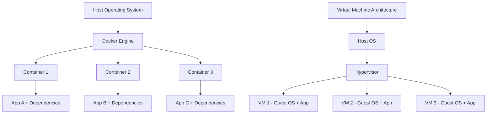
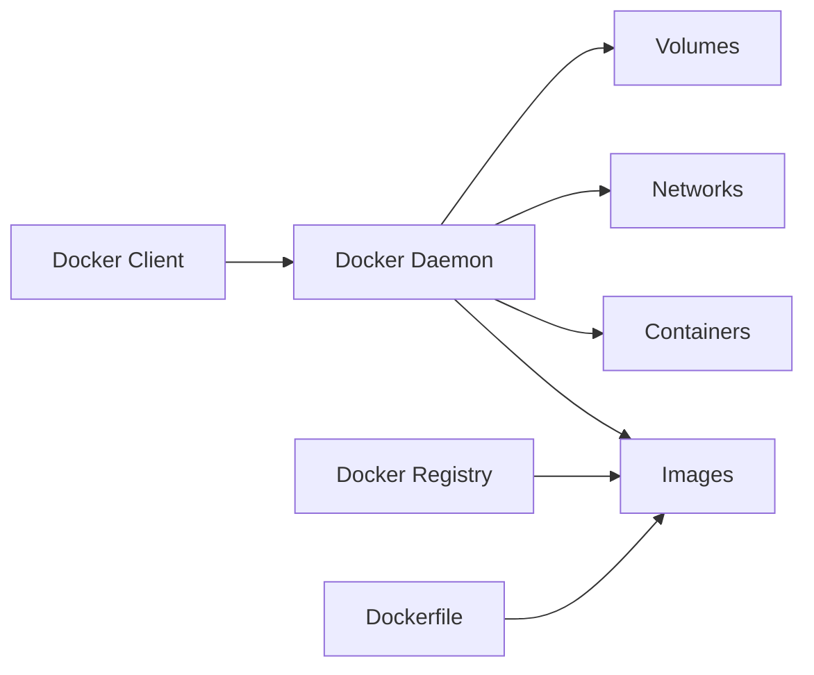
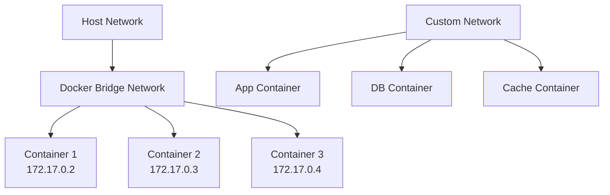

# Docker and Containerization

## Introduction

Docker revolutionized application deployment by providing lightweight, portable containers that package applications with their dependencies. This comprehensive guide covers Docker from fundamentals to advanced orchestration, container optimization, security practices, and deployment strategies essential for senior backend engineers.

## Table of Contents

1. [Docker Fundamentals](#docker-fundamentals)
2. [Container Architecture](#container-architecture)
3. [Dockerfile Best Practices](#dockerfile-best-practices)
4. [Multi-Stage Builds](#multi-stage-builds)
5. [Container Optimization](#container-optimization)
6. [Security Practices](#security-practices)
7. [Docker Compose](#docker-compose)
8. [Container Orchestration](#container-orchestration)
9. [Production Deployment](#production-deployment)
10. [Monitoring and Logging](#monitoring-and-logging)

## Docker Fundamentals

### What is Docker?

Docker is a containerization platform that uses OS-level virtualization to deliver software in packages called containers. Unlike virtual machines, containers share the host OS kernel, making them lightweight and efficient.



### Key Docker Concepts

#### Images and Containers
- **Image**: Read-only template containing application code, runtime, libraries, and dependencies
- **Container**: Running instance of an image with its own filesystem, networking, and process space

#### Docker Architecture


### Basic Docker Commands

```bash
# Image management
docker build -t myapp:latest .
docker pull nginx:alpine
docker images
docker rmi image_id

# Container lifecycle
docker run -d --name mycontainer -p 8080:80 nginx
docker ps
docker stop mycontainer
docker start mycontainer
docker rm mycontainer

# Container interaction
docker exec -it mycontainer /bin/bash
docker logs mycontainer
docker inspect mycontainer
```

## Container Architecture

### Linux Namespaces

Docker uses Linux namespaces to provide isolation:

- **PID Namespace**: Process isolation
- **Network Namespace**: Network interface isolation
- **Mount Namespace**: Filesystem isolation
- **UTS Namespace**: Hostname isolation
- **IPC Namespace**: Inter-process communication isolation
- **User Namespace**: User and group ID isolation

### Control Groups (cgroups)

Cgroups limit and monitor resource usage:

```bash
# CPU limits
docker run --cpus="1.5" myapp

# Memory limits
docker run --memory="512m" myapp

# Combined resource limits
docker run --cpus="2" --memory="1g" --memory-swap="2g" myapp
```

### Container Networking



#### Network Types
- **Bridge**: Default network for containers on single host
- **Host**: Container uses host's network directly
- **None**: No network access
- **Custom**: User-defined networks for better isolation

```bash
# Create custom network
docker network create --driver bridge mynetwork

# Run containers on custom network
docker run --network mynetwork --name app myapp
docker run --network mynetwork --name db postgres
```

## Dockerfile Best Practices

### Basic Dockerfile Structure

```dockerfile
# Use specific version tags
FROM node:18-alpine

# Set working directory
WORKDIR /app

# Copy package files first (better caching)
COPY package*.json ./

# Install dependencies
RUN npm ci --only=production

# Copy application code
COPY . .

# Create non-root user
RUN addgroup -g 1001 -S nodejs && \
    adduser -S nextjs -u 1001

# Change ownership
RUN chown -R nextjs:nodejs /app
USER nextjs

# Expose port
EXPOSE 3000

# Health check
HEALTHCHECK --interval=30s --timeout=3s --start-period=5s --retries=3 \
    CMD curl -f http://localhost:3000/health || exit 1

# Start application
CMD ["npm", "start"]
```

### Layer Optimization

```dockerfile
# ❌ Poor layer caching
FROM node:18-alpine
COPY . .
RUN npm install
RUN npm run build

# ✅ Optimized layer caching
FROM node:18-alpine
WORKDIR /app

# Dependencies layer (cached unless package.json changes)
COPY package*.json ./
RUN npm ci --only=production

# Source code layer
COPY . .
RUN npm run build
```

### Node.js Production Dockerfile

```dockerfile
FROM node:18-alpine AS base

# Install dependencies only when needed
FROM base AS deps
WORKDIR /app
COPY package*.json ./
RUN npm ci --only=production && npm cache clean --force

# Build the app
FROM base AS builder
WORKDIR /app
COPY package*.json ./
RUN npm ci
COPY . .
RUN npm run build

# Production image
FROM base AS runner
WORKDIR /app

ENV NODE_ENV=production

RUN addgroup --system --gid 1001 nodejs
RUN adduser --system --uid 1001 nextjs

# Copy built application
COPY --from=builder --chown=nextjs:nodejs /app/dist ./dist
COPY --from=deps --chown=nextjs:nodejs /app/node_modules ./node_modules
COPY --from=builder --chown=nextjs:nodejs /app/package.json ./package.json

USER nextjs

EXPOSE 3000

CMD ["node", "dist/index.js"]
```

## Multi-Stage Builds

### Benefits of Multi-Stage Builds

1. **Smaller final images**: Exclude build tools and dependencies
2. **Better security**: Fewer attack vectors in production image
3. **Cleaner separation**: Build and runtime environments isolated
4. **Faster deployments**: Smaller images transfer faster

### Advanced Multi-Stage Example

```dockerfile
# Build stage
FROM node:18-alpine AS builder
WORKDIR /app

# Install build dependencies
RUN apk add --no-cache python3 make g++

# Copy and install all dependencies
COPY package*.json ./
RUN npm ci

# Copy source and build
COPY . .
RUN npm run build
RUN npm run test

# Production dependencies stage
FROM node:18-alpine AS deps
WORKDIR /app
COPY package*.json ./
RUN npm ci --only=production && npm cache clean --force

# Runtime stage
FROM node:18-alpine AS runtime
WORKDIR /app

# Install runtime dependencies
RUN apk add --no-cache dumb-init curl

# Create user
RUN addgroup -g 1001 -S nodejs && \
    adduser -S nextjs -u 1001

# Copy application files
COPY --from=builder --chown=nextjs:nodejs /app/dist ./dist
COPY --from=deps --chown=nextjs:nodejs /app/node_modules ./node_modules
COPY --chown=nextjs:nodejs package.json ./

USER nextjs

EXPOSE 3000

HEALTHCHECK --interval=30s --timeout=3s --start-period=5s --retries=3 \
    CMD curl -f http://localhost:3000/health || exit 1

ENTRYPOINT ["dumb-init", "--"]
CMD ["node", "dist/index.js"]
```

### Database Multi-Stage Build

```dockerfile
# Build stage for database migrations
FROM node:18-alpine AS migrator
WORKDIR /app
COPY package*.json ./
RUN npm ci
COPY migrations/ ./migrations/
COPY knexfile.js ./

# Production database image
FROM postgres:15-alpine AS database
COPY --from=migrator /app/migrations /docker-entrypoint-initdb.d/
ENV POSTGRES_DB=myapp
ENV POSTGRES_USER=appuser
ENV POSTGRES_PASSWORD_FILE=/run/secrets/db_password
```

## Container Optimization

### Image Size Optimization

#### Use Alpine Linux
```dockerfile
# Standard image: ~900MB
FROM node:18

# Alpine image: ~170MB
FROM node:18-alpine

# Distroless image: ~150MB
FROM gcr.io/distroless/nodejs18-debian11
```

#### Remove Unnecessary Files
```dockerfile
FROM node:18-alpine
WORKDIR /app

# Copy only necessary files
COPY package*.json ./
RUN npm ci --only=production

# Remove npm cache and temporary files
RUN npm cache clean --force && \
    rm -rf /tmp/* /var/tmp/* /root/.npm

COPY src/ ./src/
```

#### Use .dockerignore
```dockerignore
node_modules
npm-debug.log
.git
.gitignore
README.md
.env
.nyc_output
coverage
.coverage
.cache
.DS_Store
*.log
```

### Performance Optimization

#### Parallel Processing
```dockerfile
FROM node:18-alpine
WORKDIR /app

# Parallel dependency installation
COPY package*.json ./
RUN npm ci --only=production --parallel

# Parallel build processes
COPY . .
RUN npm run build:client & npm run build:server & wait
```

#### Build Cache Optimization
```dockerfile
# Use BuildKit for better caching
# syntax=docker/dockerfile:1

FROM node:18-alpine
WORKDIR /app

# Mount cache for npm
RUN --mount=type=cache,target=/root/.npm \
    npm ci --only=production

# Mount cache for build artifacts
RUN --mount=type=cache,target=/app/.next/cache \
    npm run build
```

### Memory and CPU Optimization

```bash
# Build with resource limits
docker build --memory=1g --cpus=2 -t myapp .

# Run with optimized resources
docker run -d \
  --name myapp \
  --memory=512m \
  --cpus=1 \
  --restart=unless-stopped \
  myapp
```

## Security Practices

### Image Security

#### Use Official Base Images
```dockerfile
# ✅ Official image
FROM node:18-alpine

# ❌ Unofficial image
FROM someuser/node:latest
```

#### Scan for Vulnerabilities
```bash
# Docker Scout (built-in)
docker scout cves myapp:latest

# Trivy scanner
trivy image myapp:latest

# Snyk scanner
snyk container test myapp:latest
```

### Runtime Security

#### Non-Root User
```dockerfile
FROM node:18-alpine

# Create non-root user
RUN addgroup -g 1001 -S appgroup && \
    adduser -S appuser -u 1001 -G appgroup

# Set ownership
WORKDIR /app
COPY --chown=appuser:appgroup . .

# Switch to non-root user
USER appuser
```

#### Read-Only Filesystem
```bash
docker run -d \
  --name myapp \
  --read-only \
  --tmpfs /tmp \
  --tmpfs /var/run \
  myapp
```

#### Security Options
```bash
docker run -d \
  --name myapp \
  --security-opt=no-new-privileges:true \
  --cap-drop=ALL \
  --cap-add=NET_BIND_SERVICE \
  myapp
```

### Secrets Management

#### Using Docker Secrets
```bash
# Create secret
echo "mysecretpassword" | docker secret create db_password -

# Use in service
docker service create \
  --name myapp \
  --secret db_password \
  myapp:latest
```

#### Environment Variables vs Secrets
```dockerfile
# ❌ Hardcoded secrets
ENV DB_PASSWORD=mysecret

# ✅ Use secrets or external config
ENV DB_PASSWORD_FILE=/run/secrets/db_password
```

## Docker Compose

### Basic Compose Configuration

```yaml
version: '3.8'

services:
  app:
    build:
      context: .
      dockerfile: Dockerfile
      target: production
    ports:
      - "3000:3000"
    environment:
      - NODE_ENV=production
      - DB_HOST=database
    depends_on:
      database:
        condition: service_healthy
    networks:
      - app-network
    restart: unless-stopped

  database:
    image: postgres:15-alpine
    environment:
      POSTGRES_DB: myapp
      POSTGRES_USER: appuser
      POSTGRES_PASSWORD_FILE: /run/secrets/db_password
    volumes:
      - postgres_data:/var/lib/postgresql/data
      - ./init.sql:/docker-entrypoint-initdb.d/init.sql:ro
    networks:
      - app-network
    secrets:
      - db_password
    healthcheck:
      test: ["CMD-SHELL", "pg_isready -U appuser -d myapp"]
      interval: 30s
      timeout: 10s
      retries: 3
      start_period: 30s

  redis:
    image: redis:7-alpine
    command: redis-server --appendonly yes
    volumes:
      - redis_data:/data
    networks:
      - app-network
    restart: unless-stopped

volumes:
  postgres_data:
  redis_data:

networks:
  app-network:
    driver: bridge

secrets:
  db_password:
    file: ./secrets/db_password.txt
```

### Production Compose Configuration

```yaml
version: '3.8'

services:
  app:
    image: myapp:${APP_VERSION:-latest}
    deploy:
      replicas: 3
      update_config:
        parallelism: 1
        delay: 10s
        failure_action: rollback
      restart_policy:
        condition: on-failure
        delay: 5s
        max_attempts: 3
    ports:
      - "3000:3000"
    environment:
      - NODE_ENV=production
    configs:
      - source: app_config
        target: /app/config.json
    secrets:
      - db_password
      - jwt_secret
    networks:
      - frontend
      - backend
    logging:
      driver: "json-file"
      options:
        max-size: "10m"
        max-file: "3"

  nginx:
    image: nginx:alpine
    ports:
      - "80:80"
      - "443:443"
    volumes:
      - ./nginx.conf:/etc/nginx/nginx.conf:ro
      - ./ssl:/etc/nginx/ssl:ro
    depends_on:
      - app
    networks:
      - frontend

configs:
  app_config:
    file: ./config/production.json

secrets:
  db_password:
    external: true
  jwt_secret:
    external: true

networks:
  frontend:
    driver: overlay
  backend:
    driver: overlay
    internal: true
```

## Container Orchestration

### Docker Swarm

#### Initialize Swarm
```bash
# Initialize swarm mode
docker swarm init --advertise-addr 192.168.1.100

# Join worker nodes
docker swarm join --token SWMTKN-1-... 192.168.1.100:2377

# Deploy stack
docker stack deploy -c docker-compose.yml myapp
```

#### Service Management
```bash
# Create service
docker service create \
  --name web \
  --replicas 3 \
  --publish 8080:80 \
  nginx:alpine

# Scale service
docker service scale web=5

# Update service
docker service update --image nginx:latest web

# Rolling update
docker service update \
  --update-parallelism 1 \
  --update-delay 10s \
  --image myapp:v2 \
  myapp_web
```

### Container Health Monitoring

```dockerfile
# Application health check
HEALTHCHECK --interval=30s --timeout=3s --start-period=5s --retries=3 \
    CMD curl -f http://localhost:3000/health || exit 1
```

```javascript
// Health check endpoint
app.get('/health', (req, res) => {
  const healthCheck = {
    uptime: process.uptime(),
    message: 'OK',
    timestamp: Date.now(),
    checks: {
      database: checkDatabase(),
      redis: checkRedis(),
      memory: process.memoryUsage(),
      cpu: process.cpuUsage()
    }
  };
  
  try {
    res.status(200).json(healthCheck);
  } catch (error) {
    healthCheck.message = error.message;
    res.status(503).json(healthCheck);
  }
});
```

## Production Deployment

### CI/CD Pipeline Integration

```yaml
# GitHub Actions example
name: Build and Deploy

on:
  push:
    branches: [main]

jobs:
  build:
    runs-on: ubuntu-latest
    steps:
      - uses: actions/checkout@v3
      
      - name: Set up Docker Buildx
        uses: docker/setup-buildx-action@v2
        
      - name: Login to Container Registry
        uses: docker/login-action@v2
        with:
          registry: ghcr.io
          username: ${{ github.actor }}
          password: ${{ secrets.GITHUB_TOKEN }}
          
      - name: Build and push
        uses: docker/build-push-action@v4
        with:
          context: .
          push: true
          tags: |
            ghcr.io/${{ github.repository }}:latest
            ghcr.io/${{ github.repository }}:${{ github.sha }}
          cache-from: type=gha
          cache-to: type=gha,mode=max
```

### Blue-Green Deployment

```bash
#!/bin/bash
# Blue-green deployment script

NEW_VERSION=$1
CURRENT_COLOR=$(docker service inspect myapp_web --format '{{.Spec.Labels.color}}')

if [ "$CURRENT_COLOR" = "blue" ]; then
    NEW_COLOR="green"
else
    NEW_COLOR="blue"
fi

# Deploy new version
docker service create \
  --name myapp_web_${NEW_COLOR} \
  --label color=${NEW_COLOR} \
  --replicas 3 \
  myapp:${NEW_VERSION}

# Health check
sleep 30
if curl -f http://myapp_web_${NEW_COLOR}:3000/health; then
    # Switch traffic
    docker service update --publish-rm 80:3000 myapp_web_${CURRENT_COLOR}
    docker service update --publish-add 80:3000 myapp_web_${NEW_COLOR}
    
    # Remove old version
    docker service rm myapp_web_${CURRENT_COLOR}
    echo "Deployment successful: ${NEW_COLOR} is now live"
else
    # Rollback
    docker service rm myapp_web_${NEW_COLOR}
    echo "Deployment failed: rolled back to ${CURRENT_COLOR}"
    exit 1
fi
```

### Container Registry Management

```bash
# Tag and push images
docker tag myapp:latest registry.company.com/myapp:v1.2.3
docker push registry.company.com/myapp:v1.2.3

# Multi-architecture builds
docker buildx build \
  --platform linux/amd64,linux/arm64 \
  --tag myapp:latest \
  --push .

# Image signing and verification
docker trust sign myapp:latest
docker trust inspect myapp:latest
```

## Monitoring and Logging

### Container Metrics

```yaml
# Prometheus monitoring
version: '3.8'

services:
  app:
    image: myapp:latest
    ports:
      - "3000:3000"
      - "9090:9090"  # Metrics endpoint
    
  prometheus:
    image: prom/prometheus
    ports:
      - "9090:9090"
    volumes:
      - ./prometheus.yml:/etc/prometheus/prometheus.yml
      
  grafana:
    image: grafana/grafana
    ports:
      - "3000:3000"
    environment:
      - GF_SECURITY_ADMIN_PASSWORD=admin
```

### Centralized Logging

```yaml
# ELK Stack logging
version: '3.8'

services:
  app:
    image: myapp:latest
    logging:
      driver: "fluentd"
      options:
        fluentd-address: localhost:24224
        tag: myapp
        
  fluentd:
    image: fluent/fluentd:v1.14-debian-1
    ports:
      - "24224:24224"
    volumes:
      - ./fluentd.conf:/fluentd/etc/fluent.conf
      
  elasticsearch:
    image: docker.elastic.co/elasticsearch/elasticsearch:8.5.0
    environment:
      - discovery.type=single-node
      - xpack.security.enabled=false
    ports:
      - "9200:9200"
      
  kibana:
    image: docker.elastic.co/kibana/kibana:8.5.0
    ports:
      - "5601:5601"
    depends_on:
      - elasticsearch
```

### Application Logging Best Practices

```javascript
// Structured logging
const winston = require('winston');

const logger = winston.createLogger({
  level: 'info',
  format: winston.format.combine(
    winston.format.timestamp(),
    winston.format.errors({ stack: true }),
    winston.format.json()
  ),
  defaultMeta: {
    service: 'myapp',
    version: process.env.APP_VERSION,
    container_id: process.env.HOSTNAME
  },
  transports: [
    new winston.transports.Console(),
    new winston.transports.File({ filename: '/var/log/app/error.log', level: 'error' }),
    new winston.transports.File({ filename: '/var/log/app/combined.log' })
  ]
});

// Request logging middleware
app.use((req, res, next) => {
  const start = Date.now();
  
  res.on('finish', () => {
    logger.info('HTTP Request', {
      method: req.method,
      url: req.url,
      status: res.statusCode,
      duration: Date.now() - start,
      user_agent: req.get('User-Agent'),
      ip: req.ip
    });
  });
  
  next();
});
```

## Key Takeaways

### Docker Best Practices Summary

1. **Use multi-stage builds** for smaller, more secure images
2. **Implement proper layer caching** to speed up builds
3. **Run containers as non-root users** for security
4. **Use health checks** for better orchestration
5. **Implement proper logging and monitoring**
6. **Use secrets management** for sensitive data
7. **Optimize for production** with resource limits
8. **Implement CI/CD integration** for automated deployments

### Common Pitfalls to Avoid

1. **Large image sizes** due to unnecessary dependencies
2. **Running as root user** in production
3. **Hardcoded secrets** in images or environment variables
4. **Missing health checks** causing deployment issues
5. **Poor layer optimization** leading to slow builds
6. **Inadequate monitoring** and logging
7. **Security vulnerabilities** in base images
8. **Resource limits not set** causing performance issues

This comprehensive guide provides the foundation for mastering Docker and containerization technologies essential for senior backend engineering roles.
##
 Interview Questions and Answers

### Fundamental Questions

#### Q1: What is Docker and how does it differ from virtual machines?

**Answer:**
Docker is a containerization platform that uses OS-level virtualization to package applications with their dependencies. Key differences from VMs:

- **Resource Usage**: Containers share the host OS kernel, while VMs include full guest OS
- **Startup Time**: Containers start in seconds, VMs take minutes
- **Size**: Container images are typically MBs, VM images are GBs
- **Isolation**: VMs provide stronger isolation, containers provide process-level isolation
- **Performance**: Containers have near-native performance, VMs have overhead

#### Q2: Explain the Docker architecture and its main components.

**Answer:**
Docker uses a client-server architecture:

- **Docker Client**: Command-line interface that communicates with Docker daemon
- **Docker Daemon**: Background service that manages containers, images, networks, and volumes
- **Docker Images**: Read-only templates used to create containers
- **Docker Containers**: Running instances of images
- **Docker Registry**: Storage for Docker images (Docker Hub, private registries)
- **Dockerfile**: Text file with instructions to build images

#### Q3: What are the benefits of using multi-stage builds?

**Answer:**
Multi-stage builds provide several advantages:

- **Smaller Images**: Exclude build tools and dependencies from final image
- **Security**: Fewer attack vectors in production image
- **Separation of Concerns**: Build and runtime environments are isolated
- **Faster Deployments**: Smaller images transfer and start faster
- **Cost Efficiency**: Reduced storage and bandwidth costs

### Intermediate Questions

#### Q4: How would you optimize a Docker image for production?

**Answer:**
Key optimization strategies:

```dockerfile
# Use specific, minimal base images
FROM node:18-alpine

# Optimize layer caching
COPY package*.json ./
RUN npm ci --only=production

# Multi-stage builds
FROM node:18-alpine AS builder
# ... build steps
FROM node:18-alpine AS runtime
COPY --from=builder /app/dist ./dist

# Remove unnecessary files
RUN rm -rf /tmp/* /var/tmp/* /root/.npm

# Use non-root user
USER node

# Add health checks
HEALTHCHECK CMD curl -f http://localhost:3000/health
```

#### Q5: Explain Docker networking modes and when to use each.

**Answer:**
Docker networking modes:

- **Bridge (default)**: Isolated network for containers on single host
- **Host**: Container uses host's network directly (better performance, less isolation)
- **None**: No network access (maximum security)
- **Overlay**: Multi-host networking for Docker Swarm
- **Custom Networks**: User-defined networks for better control

Use cases:
- Bridge: Most applications requiring isolation
- Host: High-performance networking applications
- None: Security-critical applications with no network needs
- Overlay: Multi-host container orchestration

#### Q6: How do you handle secrets in Docker containers?

**Answer:**
Best practices for secrets management:

```bash
# Docker Secrets (Swarm mode)
echo "password" | docker secret create db_password -
docker service create --secret db_password myapp

# Environment files
docker run --env-file .env myapp

# External secret management
docker run -v /run/secrets:/run/secrets myapp
```

Avoid:
- Hardcoding secrets in Dockerfile
- Passing secrets as environment variables
- Including secrets in image layers

### Advanced Questions

#### Q7: How would you implement a zero-downtime deployment strategy with Docker?

**Answer:**
Blue-Green deployment strategy:

```bash
# Deploy new version (green)
docker service create --name myapp_green myapp:v2

# Health check
curl -f http://myapp_green:3000/health

# Switch traffic
docker service update --publish-rm 80:3000 myapp_blue
docker service update --publish-add 80:3000 myapp_green

# Remove old version
docker service rm myapp_blue
```

Rolling updates with Docker Swarm:
```bash
docker service update \
  --update-parallelism 1 \
  --update-delay 10s \
  --update-failure-action rollback \
  --image myapp:v2 \
  myapp
```

#### Q8: How do you monitor and troubleshoot Docker containers in production?

**Answer:**
Comprehensive monitoring approach:

```yaml
# Monitoring stack
services:
  app:
    image: myapp:latest
    logging:
      driver: "json-file"
      options:
        max-size: "10m"
        max-file: "3"
  
  prometheus:
    image: prom/prometheus
    volumes:
      - ./prometheus.yml:/etc/prometheus/prometheus.yml
      
  grafana:
    image: grafana/grafana
    ports:
      - "3000:3000"
```

Troubleshooting commands:
```bash
# Container inspection
docker logs --tail 100 -f container_name
docker exec -it container_name /bin/sh
docker stats container_name

# System-wide monitoring
docker system df
docker system events
docker system prune
```

#### Q9: Explain container security best practices.

**Answer:**
Security best practices:

```dockerfile
# Use official, minimal base images
FROM node:18-alpine

# Create non-root user
RUN addgroup -g 1001 -S nodejs && \
    adduser -S nextjs -u 1001

# Set proper ownership
COPY --chown=nextjs:nodejs . .
USER nextjs

# Health checks
HEALTHCHECK CMD curl -f http://localhost:3000/health
```

Runtime security:
```bash
# Run with security options
docker run \
  --read-only \
  --security-opt=no-new-privileges:true \
  --cap-drop=ALL \
  --cap-add=NET_BIND_SERVICE \
  myapp
```

Additional measures:
- Regular vulnerability scanning
- Image signing and verification
- Network segmentation
- Resource limits
- Secrets management

#### Q10: How would you design a microservices architecture using Docker?

**Answer:**
Microservices Docker architecture:

```yaml
version: '3.8'

services:
  api-gateway:
    image: nginx:alpine
    ports:
      - "80:80"
    depends_on:
      - user-service
      - order-service
    networks:
      - frontend
      - backend

  user-service:
    image: user-service:latest
    environment:
      - DB_HOST=user-db
    networks:
      - backend
      - user-network
    depends_on:
      - user-db

  order-service:
    image: order-service:latest
    environment:
      - DB_HOST=order-db
    networks:
      - backend
      - order-network
    depends_on:
      - order-db

  user-db:
    image: postgres:15-alpine
    environment:
      - POSTGRES_DB=users
    networks:
      - user-network
    volumes:
      - user_data:/var/lib/postgresql/data

  order-db:
    image: postgres:15-alpine
    environment:
      - POSTGRES_DB=orders
    networks:
      - order-network
    volumes:
      - order_data:/var/lib/postgresql/data

networks:
  frontend:
  backend:
  user-network:
    internal: true
  order-network:
    internal: true

volumes:
  user_data:
  order_data:
```

Key principles:
- Service isolation with dedicated networks
- Database per service
- API gateway for external access
- Health checks and monitoring
- Centralized logging
- Service discovery

### Scenario-Based Questions

#### Q11: Your Docker container is consuming too much memory. How do you diagnose and fix this?

**Answer:**
Diagnosis steps:

```bash
# Monitor memory usage
docker stats container_name

# Check container limits
docker inspect container_name | grep -i memory

# Analyze memory usage inside container
docker exec -it container_name cat /proc/meminfo
docker exec -it container_name ps aux --sort=-%mem
```

Solutions:
```bash
# Set memory limits
docker run --memory=512m myapp

# Optimize application
# - Fix memory leaks
# - Implement proper garbage collection
# - Use memory profiling tools

# Use multi-stage builds to reduce image size
FROM node:18-alpine AS builder
# ... build steps
FROM node:18-alpine AS runtime
COPY --from=builder /app/dist ./dist
```

#### Q12: How would you handle database migrations in a containerized environment?

**Answer:**
Migration strategies:

```dockerfile
# Migration container
FROM node:18-alpine AS migrator
WORKDIR /app
COPY package*.json ./
RUN npm ci
COPY migrations/ ./migrations/
COPY migrate.js ./
CMD ["node", "migrate.js"]
```

```yaml
# Docker Compose with init container
version: '3.8'

services:
  migrate:
    build:
      context: .
      target: migrator
    depends_on:
      database:
        condition: service_healthy
    environment:
      - DB_HOST=database
    networks:
      - backend

  app:
    image: myapp:latest
    depends_on:
      migrate:
        condition: service_completed_successfully
    networks:
      - backend

  database:
    image: postgres:15-alpine
    healthcheck:
      test: ["CMD-SHELL", "pg_isready"]
      interval: 30s
      timeout: 10s
      retries: 3
```

Best practices:
- Run migrations before application startup
- Use init containers for one-time setup
- Implement rollback strategies
- Version control migration scripts
- Test migrations in staging environment

### Performance Questions

#### Q13: How do you optimize Docker build times?

**Answer:**
Build optimization techniques:

```dockerfile
# Use BuildKit
# syntax=docker/dockerfile:1

FROM node:18-alpine
WORKDIR /app

# Optimize layer caching
COPY package*.json ./
RUN --mount=type=cache,target=/root/.npm \
    npm ci --only=production

# Parallel builds
COPY . .
RUN npm run build:client & npm run build:server & wait

# Multi-stage builds
FROM node:18-alpine AS deps
COPY package*.json ./
RUN npm ci --only=production

FROM node:18-alpine AS builder
COPY package*.json ./
RUN npm ci
COPY . .
RUN npm run build

FROM node:18-alpine AS runtime
COPY --from=deps /app/node_modules ./node_modules
COPY --from=builder /app/dist ./dist
```

Additional optimizations:
- Use .dockerignore effectively
- Leverage build cache
- Use smaller base images
- Minimize layers
- Use multi-stage builds

#### Q14: Explain how you would implement container auto-scaling.

**Answer:**
Auto-scaling with Docker Swarm:

```bash
# Create service with resource limits
docker service create \
  --name myapp \
  --replicas 3 \
  --limit-memory 512m \
  --limit-cpu 1 \
  --reserve-memory 256m \
  --reserve-cpu 0.5 \
  myapp:latest

# Manual scaling
docker service scale myapp=5

# Auto-scaling with external tools
# Use Prometheus + custom scaling logic
```

Kubernetes-style auto-scaling:
```yaml
apiVersion: autoscaling/v2
kind: HorizontalPodAutoscaler
metadata:
  name: myapp-hpa
spec:
  scaleTargetRef:
    apiVersion: apps/v1
    kind: Deployment
    name: myapp
  minReplicas: 3
  maxReplicas: 10
  metrics:
  - type: Resource
    resource:
      name: cpu
      target:
        type: Utilization
        averageUtilization: 70
  - type: Resource
    resource:
      name: memory
      target:
        type: Utilization
        averageUtilization: 80
```

### Troubleshooting Questions

#### Q15: A container keeps restarting. How do you debug this issue?

**Answer:**
Debugging steps:

```bash
# Check container status
docker ps -a

# Examine logs
docker logs --tail 100 container_name
docker logs --since 1h container_name

# Inspect container configuration
docker inspect container_name

# Check resource usage
docker stats container_name

# Run container interactively
docker run -it --entrypoint /bin/sh image_name

# Check health status
docker inspect --format='{{.State.Health.Status}}' container_name
```

Common causes and solutions:
- **Exit code 0**: Normal termination, check if process should run continuously
- **Exit code 1**: General error, check application logs
- **Exit code 125**: Docker daemon error, check Docker configuration
- **Exit code 126**: Container command not executable, check permissions
- **Exit code 127**: Container command not found, check PATH and binary location

Prevention:
```dockerfile
# Proper health checks
HEALTHCHECK --interval=30s --timeout=3s --retries=3 \
    CMD curl -f http://localhost:3000/health || exit 1

# Proper signal handling
ENTRYPOINT ["dumb-init", "--"]
CMD ["node", "server.js"]
```

This comprehensive Docker and containerization guide covers all essential topics for senior backend engineering interviews, from fundamentals to advanced production scenarios.