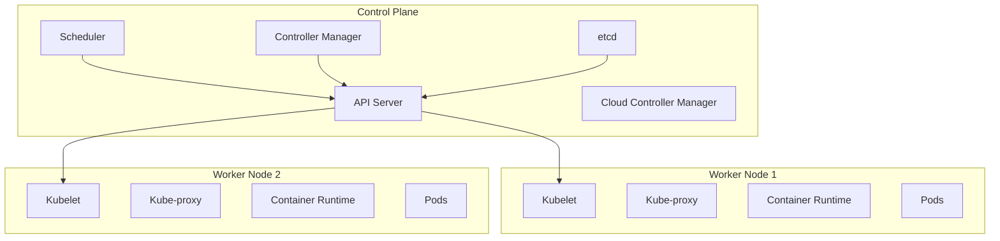
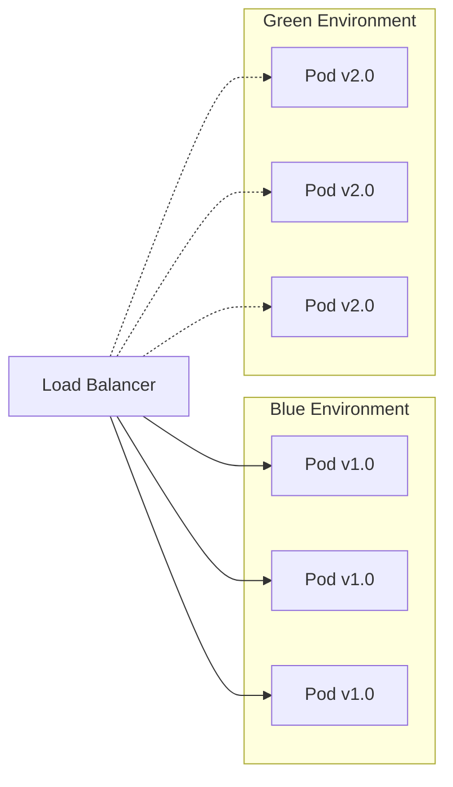
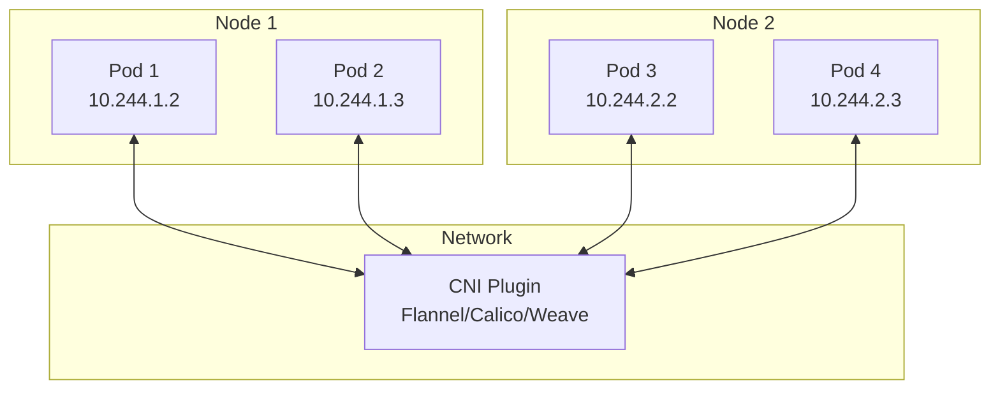
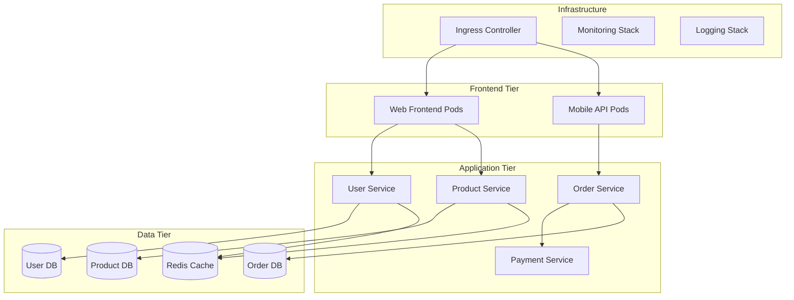

# Kubernetes & Container Orchestration

## Overview

Kubernetes (K8s) is an open-source container orchestration platform that automates the deployment, scaling, and management of containerized applications. Originally developed by Google and now maintained by the Cloud Native Computing Foundation (CNCF), Kubernetes has become the de facto standard for container orchestration in production environments.

## Core Concepts

### Cluster Architecture

Kubernetes follows a master-worker architecture where the control plane manages the cluster state and worker nodes run the actual workloads.



### Fundamental Objects

#### Pods
The smallest deployable unit in Kubernetes, representing one or more containers that share storage and network.

```yaml
apiVersion: v1
kind: Pod
metadata:
  name: web-app-pod
  labels:
    app: web-app
spec:
  containers:
  - name: web-container
    image: nginx:1.21
    ports:
    - containerPort: 80
    resources:
      requests:
        memory: "64Mi"
        cpu: "250m"
      limits:
        memory: "128Mi"
        cpu: "500m"
```

#### ReplicaSets and Deployments
ReplicaSets ensure a specified number of pod replicas are running. Deployments provide declarative updates for pods and ReplicaSets.

```yaml
apiVersion: apps/v1
kind: Deployment
metadata:
  name: web-app-deployment
spec:
  replicas: 3
  selector:
    matchLabels:
      app: web-app
  template:
    metadata:
      labels:
        app: web-app
    spec:
      containers:
      - name: web-container
        image: nginx:1.21
        ports:
        - containerPort: 80
  strategy:
    type: RollingUpdate
    rollingUpdate:
      maxUnavailable: 1
      maxSurge: 1
```

#### Services
Services provide stable network endpoints for accessing pods, abstracting away the ephemeral nature of individual pod IPs.

```yaml
apiVersion: v1
kind: Service
metadata:
  name: web-app-service
spec:
  selector:
    app: web-app
  ports:
  - protocol: TCP
    port: 80
    targetPort: 80
  type: LoadBalancer
```

## Advanced Kubernetes Concepts

### ConfigMaps and Secrets

ConfigMaps store non-confidential configuration data, while Secrets store sensitive information like passwords and API keys.

```yaml
# ConfigMap
apiVersion: v1
kind: ConfigMap
metadata:
  name: app-config
data:
  database_url: "postgresql://db:5432/myapp"
  log_level: "info"
  
---
# Secret
apiVersion: v1
kind: Secret
metadata:
  name: app-secrets
type: Opaque
data:
  db_password: cGFzc3dvcmQxMjM=  # base64 encoded
  api_key: YWJjZGVmZ2hpams=
```

### Persistent Volumes and Claims

Kubernetes provides persistent storage through PersistentVolumes (PV) and PersistentVolumeClaims (PVC).

```yaml
apiVersion: v1
kind: PersistentVolumeClaim
metadata:
  name: postgres-pvc
spec:
  accessModes:
    - ReadWriteOnce
  resources:
    requests:
      storage: 10Gi
  storageClassName: fast-ssd
```

### Ingress Controllers

Ingress manages external access to services, typically HTTP/HTTPS, providing load balancing, SSL termination, and name-based virtual hosting.

```yaml
apiVersion: networking.k8s.io/v1
kind: Ingress
metadata:
  name: web-app-ingress
  annotations:
    nginx.ingress.kubernetes.io/rewrite-target: /
    cert-manager.io/cluster-issuer: "letsencrypt-prod"
spec:
  tls:
  - hosts:
    - myapp.example.com
    secretName: myapp-tls
  rules:
  - host: myapp.example.com
    http:
      paths:
      - path: /
        pathType: Prefix
        backend:
          service:
            name: web-app-service
            port:
              number: 80
```

## Scaling and Resource Management

### Horizontal Pod Autoscaler (HPA)

HPA automatically scales the number of pods based on CPU utilization, memory usage, or custom metrics.

```yaml
apiVersion: autoscaling/v2
kind: HorizontalPodAutoscaler
metadata:
  name: web-app-hpa
spec:
  scaleTargetRef:
    apiVersion: apps/v1
    kind: Deployment
    name: web-app-deployment
  minReplicas: 2
  maxReplicas: 10
  metrics:
  - type: Resource
    resource:
      name: cpu
      target:
        type: Utilization
        averageUtilization: 70
  - type: Resource
    resource:
      name: memory
      target:
        type: Utilization
        averageUtilization: 80
```

### Vertical Pod Autoscaler (VPA)

VPA automatically adjusts CPU and memory requests/limits for containers.

```yaml
apiVersion: autoscaling.k8s.io/v1
kind: VerticalPodAutoscaler
metadata:
  name: web-app-vpa
spec:
  targetRef:
    apiVersion: apps/v1
    kind: Deployment
    name: web-app-deployment
  updatePolicy:
    updateMode: "Auto"
  resourcePolicy:
    containerPolicies:
    - containerName: web-container
      maxAllowed:
        cpu: 1
        memory: 500Mi
      minAllowed:
        cpu: 100m
        memory: 50Mi
```

## Service Mesh Integration

### Istio Service Mesh

Service mesh provides advanced traffic management, security, and observability for microservices.

```yaml
apiVersion: networking.istio.io/v1alpha3
kind: VirtualService
metadata:
  name: web-app-vs
spec:
  http:
  - match:
    - headers:
        canary:
          exact: "true"
    route:
    - destination:
        host: web-app-service
        subset: v2
      weight: 100
  - route:
    - destination:
        host: web-app-service
        subset: v1
      weight: 90
    - destination:
        host: web-app-service
        subset: v2
      weight: 10
```

## Monitoring and Observability

### Prometheus and Grafana Setup

```yaml
apiVersion: v1
kind: ServiceMonitor
metadata:
  name: web-app-monitor
spec:
  selector:
    matchLabels:
      app: web-app
  endpoints:
  - port: metrics
    interval: 30s
    path: /metrics
```

### Logging with Fluentd

```yaml
apiVersion: apps/v1
kind: DaemonSet
metadata:
  name: fluentd
spec:
  selector:
    matchLabels:
      name: fluentd
  template:
    metadata:
      labels:
        name: fluentd
    spec:
      containers:
      - name: fluentd
        image: fluent/fluentd-kubernetes-daemonset:v1-debian-elasticsearch
        env:
        - name: FLUENT_ELASTICSEARCH_HOST
          value: "elasticsearch.logging.svc.cluster.local"
        - name: FLUENT_ELASTICSEARCH_PORT
          value: "9200"
        volumeMounts:
        - name: varlog
          mountPath: /var/log
        - name: varlibdockercontainers
          mountPath: /var/lib/docker/containers
          readOnly: true
      volumes:
      - name: varlog
        hostPath:
          path: /var/log
      - name: varlibdockercontainers
        hostPath:
          path: /var/lib/docker/containers
```

## Security Best Practices

### Role-Based Access Control (RBAC)

```yaml
apiVersion: rbac.authorization.k8s.io/v1
kind: Role
metadata:
  name: pod-reader
rules:
- apiGroups: [""]
  resources: ["pods"]
  verbs: ["get", "watch", "list"]

---
apiVersion: rbac.authorization.k8s.io/v1
kind: RoleBinding
metadata:
  name: read-pods
subjects:
- kind: User
  name: jane
  apiGroup: rbac.authorization.k8s.io
roleRef:
  kind: Role
  name: pod-reader
  apiGroup: rbac.authorization.k8s.io
```

### Pod Security Standards

```yaml
apiVersion: v1
kind: Pod
metadata:
  name: secure-pod
spec:
  securityContext:
    runAsNonRoot: true
    runAsUser: 1000
    fsGroup: 2000
  containers:
  - name: app
    image: myapp:latest
    securityContext:
      allowPrivilegeEscalation: false
      readOnlyRootFilesystem: true
      capabilities:
        drop:
        - ALL
    volumeMounts:
    - name: tmp
      mountPath: /tmp
  volumes:
  - name: tmp
    emptyDir: {}
```

## Production Deployment Patterns

### Blue-Green Deployment



### Canary Deployment with Flagger

```yaml
apiVersion: flagger.app/v1beta1
kind: Canary
metadata:
  name: web-app-canary
spec:
  targetRef:
    apiVersion: apps/v1
    kind: Deployment
    name: web-app
  service:
    port: 80
  analysis:
    interval: 1m
    threshold: 5
    maxWeight: 50
    stepWeight: 10
    metrics:
    - name: request-success-rate
      threshold: 99
      interval: 1m
    - name: request-duration
      threshold: 500
      interval: 1m
```

## Multi-Cluster Management

### Cluster Federation

```yaml
apiVersion: types.kubefed.io/v1beta1
kind: FederatedDeployment
metadata:
  name: web-app-fed
spec:
  template:
    metadata:
      labels:
        app: web-app
    spec:
      replicas: 3
      selector:
        matchLabels:
          app: web-app
      template:
        metadata:
          labels:
            app: web-app
        spec:
          containers:
          - name: web-app
            image: nginx:1.21
  placement:
    clusters:
    - name: cluster-us-east
    - name: cluster-eu-west
  overrides:
  - clusterName: cluster-us-east
    clusterOverrides:
    - path: "/spec/replicas"
      value: 5
```

## Interview Questions & Answers

### Question 1: Explain the difference between a Pod and a Container in Kubernetes.

**Answer:**
A container is a lightweight, standalone package that includes everything needed to run an application. A Pod is the smallest deployable unit in Kubernetes that can contain one or more containers.

Key differences:
- **Containers** are the actual runtime instances of applications
- **Pods** are Kubernetes abstractions that wrap containers
- Containers in the same Pod share the same network namespace (IP address) and storage volumes
- Pods are ephemeral - they can be created, destroyed, and recreated
- Each Pod gets its own IP address, but containers within a Pod communicate via localhost

**Real-world example:**
```yaml
# Pod with multiple containers (sidecar pattern)
apiVersion: v1
kind: Pod
metadata:
  name: web-app-with-sidecar
spec:
  containers:
  - name: web-app
    image: nginx:1.21
    ports:
    - containerPort: 80
  - name: log-collector
    image: fluentd:latest
    volumeMounts:
    - name: shared-logs
      mountPath: /var/log
  volumes:
  - name: shared-logs
    emptyDir: {}
```

**Follow-up questions:**
- When would you use multiple containers in a single Pod?
- How do containers in a Pod communicate with each other?

### Question 2: How does Kubernetes handle service discovery and load balancing?

**Answer:**
Kubernetes provides built-in service discovery through Services and DNS, along with automatic load balancing.

**Service Discovery:**
1. **Services** create stable endpoints for accessing Pods
2. **DNS** - Kubernetes runs a DNS server that creates DNS records for Services
3. **Environment Variables** - Kubernetes injects service information as env vars

**Load Balancing:**
1. **kube-proxy** runs on each node and implements load balancing
2. **iptables mode** (default) - uses iptables rules for load balancing
3. **IPVS mode** - uses Linux IPVS for better performance at scale

```yaml
# Service with session affinity
apiVersion: v1
kind: Service
metadata:
  name: web-service
spec:
  selector:
    app: web-app
  ports:
  - port: 80
    targetPort: 8080
  sessionAffinity: ClientIP
  sessionAffinityConfig:
    clientIP:
      timeoutSeconds: 10800
```

**Load balancing algorithms:**
- Round-robin (default)
- Session affinity (sticky sessions)
- Least connections (with IPVS)

### Question 3: Explain Kubernetes networking model and how Pod-to-Pod communication works.

**Answer:**
Kubernetes follows a flat networking model where every Pod gets its own IP address and can communicate with any other Pod without NAT.

**Core principles:**
1. **Every Pod gets a unique IP** within the cluster
2. **No NAT between Pods** - Pods can communicate directly
3. **Containers within a Pod** share the same network namespace
4. **Services provide stable endpoints** for Pod groups



**CNI (Container Network Interface) plugins:**
- **Flannel** - Simple overlay network using VXLAN
- **Calico** - L3 networking with BGP, includes network policies
- **Weave** - Mesh networking with automatic discovery

### Question 4: How do you implement rolling updates and rollbacks in Kubernetes?

**Answer:**
Kubernetes Deployments provide declarative rolling updates with automatic rollback capabilities.

**Rolling Update Strategy:**
```yaml
apiVersion: apps/v1
kind: Deployment
metadata:
  name: web-app
spec:
  replicas: 6
  strategy:
    type: RollingUpdate
    rollingUpdate:
      maxUnavailable: 2    # Max pods that can be unavailable
      maxSurge: 2          # Max pods above desired replica count
  template:
    spec:
      containers:
      - name: web-app
        image: myapp:v2.0
```

**Update process:**
1. Create new ReplicaSet with updated image
2. Scale up new ReplicaSet gradually
3. Scale down old ReplicaSet simultaneously
4. Maintain minimum availability throughout

**Rollback commands:**
```bash
# Check rollout status
kubectl rollout status deployment/web-app

# View rollout history
kubectl rollout history deployment/web-app

# Rollback to previous version
kubectl rollout undo deployment/web-app

# Rollback to specific revision
kubectl rollout undo deployment/web-app --to-revision=2
```

### Question 5: Explain Kubernetes resource management and Quality of Service (QoS) classes.

**Answer:**
Kubernetes uses resource requests and limits to manage CPU and memory allocation, automatically assigning QoS classes based on these specifications.

**QoS Classes:**

1. **Guaranteed** - Highest priority
   - Requests = Limits for all containers
   - Never evicted unless exceeding limits

2. **Burstable** - Medium priority
   - Has requests < limits
   - Can use extra resources when available
   - Evicted when node is under pressure

3. **BestEffort** - Lowest priority
   - No requests or limits specified
   - First to be evicted under resource pressure

```yaml
# Guaranteed QoS
apiVersion: v1
kind: Pod
metadata:
  name: guaranteed-pod
spec:
  containers:
  - name: app
    image: nginx
    resources:
      requests:
        memory: "200Mi"
        cpu: "200m"
      limits:
        memory: "200Mi"
        cpu: "200m"

---
# Burstable QoS
apiVersion: v1
kind: Pod
metadata:
  name: burstable-pod
spec:
  containers:
  - name: app
    image: nginx
    resources:
      requests:
        memory: "100Mi"
        cpu: "100m"
      limits:
        memory: "200Mi"
        cpu: "200m"
```

### Question 6: How do you implement health checks and readiness probes in Kubernetes?

**Answer:**
Kubernetes provides three types of probes to monitor container health and readiness.

**Probe Types:**

1. **Liveness Probe** - Determines if container is running
2. **Readiness Probe** - Determines if container is ready to serve traffic
3. **Startup Probe** - Gives containers time to start before other probes begin

```yaml
apiVersion: v1
kind: Pod
metadata:
  name: health-check-pod
spec:
  containers:
  - name: web-app
    image: nginx:1.21
    ports:
    - containerPort: 80
    
    # Startup probe - gives app time to start
    startupProbe:
      httpGet:
        path: /health
        port: 80
      initialDelaySeconds: 10
      periodSeconds: 5
      failureThreshold: 30
    
    # Liveness probe - restart if unhealthy
    livenessProbe:
      httpGet:
        path: /health
        port: 80
      initialDelaySeconds: 30
      periodSeconds: 10
      timeoutSeconds: 5
      failureThreshold: 3
    
    # Readiness probe - remove from service if not ready
    readinessProbe:
      httpGet:
        path: /ready
        port: 80
      initialDelaySeconds: 5
      periodSeconds: 5
      timeoutSeconds: 3
      successThreshold: 1
      failureThreshold: 3
```

**Probe mechanisms:**
- **HTTP GET** - Most common for web applications
- **TCP Socket** - For non-HTTP services
- **Exec** - Run command inside container

### Question 7: Explain Kubernetes storage concepts: Volumes, PersistentVolumes, and StorageClasses.

**Answer:**
Kubernetes provides multiple storage abstractions to handle data persistence and sharing.

**Volume Types:**

1. **Volumes** - Tied to Pod lifecycle
2. **PersistentVolumes (PV)** - Cluster-wide storage resources
3. **PersistentVolumeClaims (PVC)** - User requests for storage

```yaml
# StorageClass for dynamic provisioning
apiVersion: storage.k8s.io/v1
kind: StorageClass
metadata:
  name: fast-ssd
provisioner: kubernetes.io/aws-ebs
parameters:
  type: gp3
  iops: "3000"
  throughput: "125"
reclaimPolicy: Delete
allowVolumeExpansion: true

---
# PersistentVolumeClaim
apiVersion: v1
kind: PersistentVolumeClaim
metadata:
  name: database-pvc
spec:
  accessModes:
    - ReadWriteOnce
  storageClassName: fast-ssd
  resources:
    requests:
      storage: 100Gi

---
# Pod using PVC
apiVersion: v1
kind: Pod
metadata:
  name: database-pod
spec:
  containers:
  - name: postgres
    image: postgres:13
    env:
    - name: POSTGRES_PASSWORD
      value: "password"
    volumeMounts:
    - name: postgres-storage
      mountPath: /var/lib/postgresql/data
  volumes:
  - name: postgres-storage
    persistentVolumeClaim:
      claimName: database-pvc
```

**Access Modes:**
- **ReadWriteOnce (RWO)** - Single node read-write
- **ReadOnlyMany (ROX)** - Multiple nodes read-only
- **ReadWriteMany (RWX)** - Multiple nodes read-write

### Question 8: How do you secure a Kubernetes cluster?

**Answer:**
Kubernetes security involves multiple layers: authentication, authorization, admission control, and runtime security.

**Security Layers:**

1. **Authentication** - Who can access the cluster
2. **Authorization** - What they can do (RBAC)
3. **Admission Control** - Validate/modify requests
4. **Runtime Security** - Pod security standards

```yaml
# RBAC Example
apiVersion: rbac.authorization.k8s.io/v1
kind: ClusterRole
metadata:
  name: deployment-manager
rules:
- apiGroups: ["apps"]
  resources: ["deployments"]
  verbs: ["get", "list", "watch", "create", "update", "patch", "delete"]
- apiGroups: [""]
  resources: ["pods"]
  verbs: ["get", "list", "watch"]

---
apiVersion: rbac.authorization.k8s.io/v1
kind: ClusterRoleBinding
metadata:
  name: deployment-manager-binding
subjects:
- kind: User
  name: alice
  apiGroup: rbac.authorization.k8s.io
roleRef:
  kind: ClusterRole
  name: deployment-manager
  apiGroup: rbac.authorization.k8s.io
```

**Security Best Practices:**
- Use Pod Security Standards
- Implement network policies
- Scan images for vulnerabilities
- Use secrets management
- Enable audit logging
- Regular security updates

### Question 9: Explain Kubernetes Operators and Custom Resource Definitions (CRDs).

**Answer:**
Operators extend Kubernetes functionality by combining Custom Resource Definitions (CRDs) with custom controllers to manage complex applications.

**Custom Resource Definition:**
```yaml
apiVersion: apiextensions.k8s.io/v1
kind: CustomResourceDefinition
metadata:
  name: databases.example.com
spec:
  group: example.com
  versions:
  - name: v1
    served: true
    storage: true
    schema:
      openAPIV3Schema:
        type: object
        properties:
          spec:
            type: object
            properties:
              size:
                type: integer
                minimum: 1
              version:
                type: string
          status:
            type: object
            properties:
              phase:
                type: string
  scope: Namespaced
  names:
    plural: databases
    singular: database
    kind: Database
```

**Custom Resource:**
```yaml
apiVersion: example.com/v1
kind: Database
metadata:
  name: my-database
spec:
  size: 3
  version: "13.4"
```

**Operator Pattern Benefits:**
- Automates complex operational tasks
- Encodes domain-specific knowledge
- Provides self-healing capabilities
- Enables declarative management of stateful applications

### Question 10: How do you troubleshoot common Kubernetes issues?

**Answer:**
Systematic troubleshooting involves checking multiple layers: pods, services, networking, and cluster components.

**Common Troubleshooting Commands:**
```bash
# Check pod status and events
kubectl get pods -o wide
kubectl describe pod <pod-name>
kubectl logs <pod-name> -c <container-name>

# Check service endpoints
kubectl get endpoints <service-name>
kubectl describe service <service-name>

# Check node status
kubectl get nodes
kubectl describe node <node-name>

# Check cluster events
kubectl get events --sort-by=.metadata.creationTimestamp

# Debug networking
kubectl exec -it <pod-name> -- nslookup <service-name>
kubectl exec -it <pod-name> -- wget -qO- <service-name>:80
```

**Common Issues and Solutions:**

1. **ImagePullBackOff**
   - Check image name and tag
   - Verify registry credentials
   - Check network connectivity

2. **CrashLoopBackOff**
   - Check application logs
   - Verify resource limits
   - Check liveness probe configuration

3. **Service not accessible**
   - Verify service selector matches pod labels
   - Check endpoints
   - Verify network policies

## Real-World Production Examples

### E-commerce Platform Architecture



### Healthcare Data Processing Pipeline

```yaml
apiVersion: batch/v1
kind: CronJob
metadata:
  name: hl7-processor
spec:
  schedule: "0 */6 * * *"  # Every 6 hours
  jobTemplate:
    spec:
      template:
        spec:
          containers:
          - name: hl7-processor
            image: healthcare/hl7-processor:v2.1
            env:
            - name: FHIR_SERVER_URL
              valueFrom:
                configMapKeyRef:
                  name: healthcare-config
                  key: fhir_server_url
            - name: DB_PASSWORD
              valueFrom:
                secretKeyRef:
                  name: db-credentials
                  key: password
            resources:
              requests:
                memory: "2Gi"
                cpu: "1000m"
              limits:
                memory: "4Gi"
                cpu: "2000m"
          restartPolicy: OnFailure
```

## Performance Optimization

### Resource Optimization Strategies

1. **Right-sizing containers**
   - Use VPA for automatic sizing
   - Monitor actual usage vs requests
   - Set appropriate limits to prevent noisy neighbors

2. **Node optimization**
   - Use node affinity for workload placement
   - Implement pod disruption budgets
   - Configure cluster autoscaler

3. **Network optimization**
   - Use network policies to reduce traffic
   - Implement service mesh for advanced routing
   - Optimize ingress controller configuration

### Monitoring and Alerting

```yaml
apiVersion: monitoring.coreos.com/v1
kind: PrometheusRule
metadata:
  name: kubernetes-alerts
spec:
  groups:
  - name: kubernetes.rules
    rules:
    - alert: PodCrashLooping
      expr: rate(kube_pod_container_status_restarts_total[15m]) > 0
      for: 5m
      labels:
        severity: warning
      annotations:
        summary: "Pod {{ $labels.pod }} is crash looping"
        description: "Pod {{ $labels.pod }} in namespace {{ $labels.namespace }} is restarting frequently"
    
    - alert: NodeNotReady
      expr: kube_node_status_condition{condition="Ready",status="true"} == 0
      for: 5m
      labels:
        severity: critical
      annotations:
        summary: "Node {{ $labels.node }} is not ready"
```

This comprehensive guide covers Kubernetes from fundamental concepts to advanced production patterns, providing the depth needed for senior-level interviews while including practical examples and real-world scenarios.