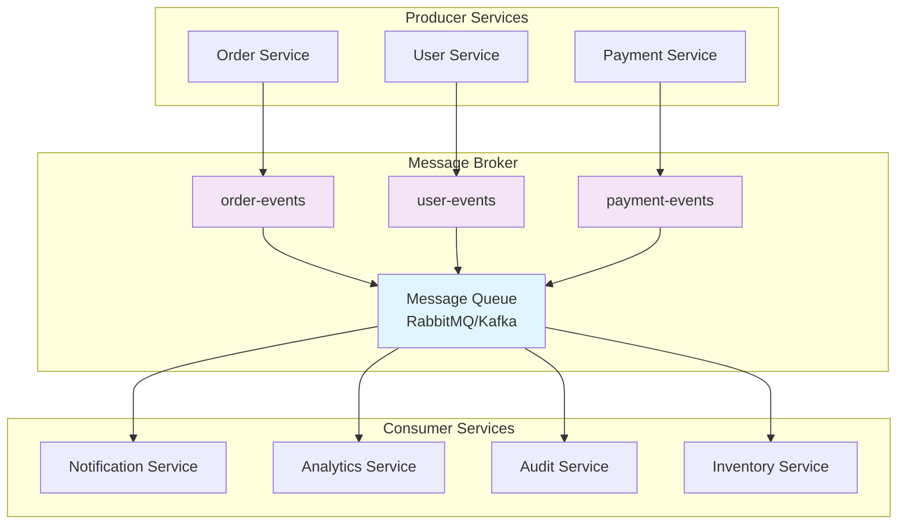
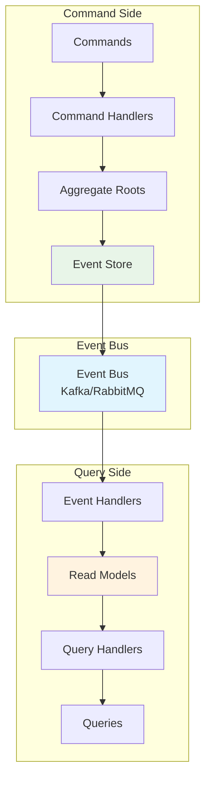
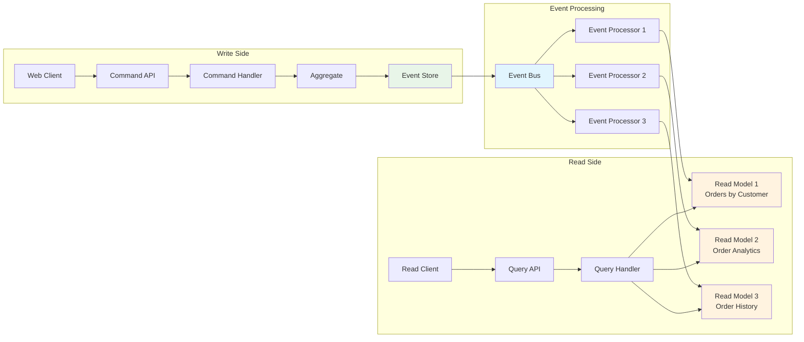
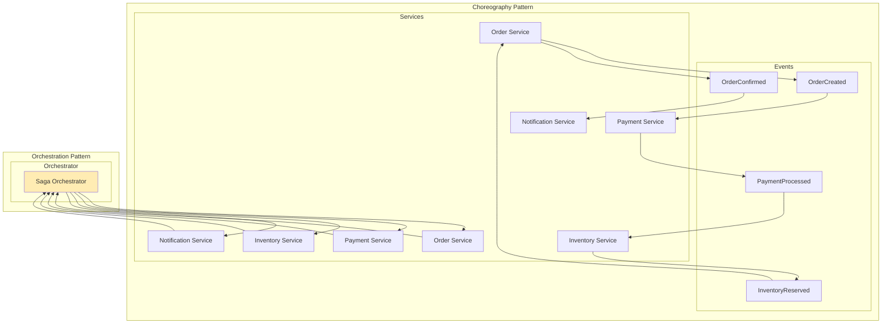
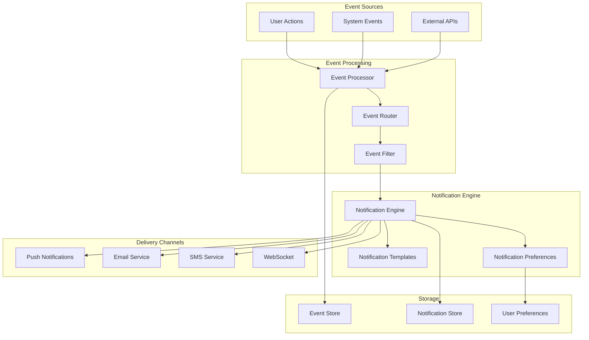

# Message Queues and Event Streaming

## Overview

Message queues and event streaming are fundamental patterns in distributed systems that enable asynchronous communication, decoupling of services, and scalable architectures. This comprehensive guide covers message queues, event sourcing, CQRS (Command Query Responsibility Segregation), and event-driven architecture patterns essential for senior backend engineers.

## Table of Contents

1. [Message Queue Fundamentals](#message-queue-fundamentals)
2. [Apache Kafka](#apache-kafka)
3. [RabbitMQ](#rabbitmq)
4. [Event Sourcing](#event-sourcing)
5. [CQRS Pattern](#cqrs-pattern)
6. [Event-Driven Architecture](#event-driven-architecture)
7. [System Diagrams](#system-diagrams)
8. [Interview Questions](#interview-questions)

## Message Queue Fundamentals

### Core Concepts

Message queues provide asynchronous communication between distributed components by storing messages in a queue until they can be processed. This pattern enables:

- **Decoupling**: Producers and consumers operate independently
- **Scalability**: Multiple consumers can process messages in parallel
- **Reliability**: Messages persist until successfully processed
- **Load Leveling**: Queues absorb traffic spikes

### Message Queue Patterns

#### Point-to-Point Pattern
```javascript
// Producer
const amqp = require('amqplib');

class OrderProducer {
  constructor() {
    this.connection = null;
    this.channel = null;
  }

  async connect() {
    this.connection = await amqp.connect('amqp://localhost');
    this.channel = await this.connection.createChannel();
    await this.channel.assertQueue('order_processing', { durable: true });
  }

  async sendOrder(orderData) {
    const message = JSON.stringify({
      orderId: orderData.id,
      customerId: orderData.customerId,
      items: orderData.items,
      timestamp: new Date().toISOString()
    });

    await this.channel.sendToQueue(
      'order_processing',
      Buffer.from(message),
      { persistent: true }
    );
    
    console.log(`Order ${orderData.id} sent to queue`);
  }
}

// Consumer
class OrderProcessor {
  constructor() {
    this.connection = null;
    this.channel = null;
  }

  async connect() {
    this.connection = await amqp.connect('amqp://localhost');
    this.channel = await this.connection.createChannel();
    await this.channel.assertQueue('order_processing', { durable: true });
    this.channel.prefetch(1); // Process one message at a time
  }

  async startProcessing() {
    await this.channel.consume('order_processing', async (msg) => {
      if (msg) {
        try {
          const orderData = JSON.parse(msg.content.toString());
          await this.processOrder(orderData);
          this.channel.ack(msg);
        } catch (error) {
          console.error('Order processing failed:', error);
          this.channel.nack(msg, false, true); // Requeue message
        }
      }
    });
  }

  async processOrder(orderData) {
    // Simulate order processing
    console.log(`Processing order ${orderData.orderId}`);
    await new Promise(resolve => setTimeout(resolve, 1000));
    console.log(`Order ${orderData.orderId} processed successfully`);
  }
}
```

#### Publish-Subscribe Pattern
```javascript
// Publisher
class EventPublisher {
  constructor() {
    this.connection = null;
    this.channel = null;
  }

  async connect() {
    this.connection = await amqp.connect('amqp://localhost');
    this.channel = await this.connection.createChannel();
    await this.channel.assertExchange('user_events', 'fanout', { durable: true });
  }

  async publishUserEvent(eventType, userData) {
    const event = {
      eventType,
      userId: userData.id,
      data: userData,
      timestamp: new Date().toISOString(),
      eventId: require('uuid').v4()
    };

    await this.channel.publish(
      'user_events',
      '',
      Buffer.from(JSON.stringify(event))
    );
    
    console.log(`Published ${eventType} event for user ${userData.id}`);
  }
}

// Subscriber
class NotificationService {
  constructor() {
    this.connection = null;
    this.channel = null;
  }

  async connect() {
    this.connection = await amqp.connect('amqp://localhost');
    this.channel = await this.connection.createChannel();
    
    await this.channel.assertExchange('user_events', 'fanout', { durable: true });
    const queue = await this.channel.assertQueue('', { exclusive: true });
    await this.channel.bindQueue(queue.queue, 'user_events', '');
    
    return queue.queue;
  }

  async subscribe() {
    const queueName = await this.connect();
    
    await this.channel.consume(queueName, (msg) => {
      if (msg) {
        const event = JSON.parse(msg.content.toString());
        this.handleUserEvent(event);
        this.channel.ack(msg);
      }
    });
  }

  handleUserEvent(event) {
    switch (event.eventType) {
      case 'USER_REGISTERED':
        this.sendWelcomeEmail(event.data);
        break;
      case 'USER_UPDATED':
        this.updateNotificationPreferences(event.data);
        break;
      default:
        console.log(`Unhandled event type: ${event.eventType}`);
    }
  }

  sendWelcomeEmail(userData) {
    console.log(`Sending welcome email to ${userData.email}`);
  }

  updateNotificationPreferences(userData) {
    console.log(`Updating notification preferences for ${userData.id}`);
  }
}
```

## Apache Kafka

### Kafka Architecture and Core Concepts

Apache Kafka is a distributed streaming platform designed for high-throughput, fault-tolerant event streaming.

#### Key Components
- **Brokers**: Kafka servers that store and serve data
- **Topics**: Categories of messages
- **Partitions**: Ordered, immutable sequence of records
- **Producers**: Applications that publish messages
- **Consumers**: Applications that subscribe to topics
- **Consumer Groups**: Groups of consumers that share partition consumption

### Kafka Producer Implementation
```javascript
const kafka = require('kafkajs');

class KafkaProducer {
  constructor() {
    this.kafka = kafka({
      clientId: 'order-service',
      brokers: ['localhost:9092', 'localhost:9093', 'localhost:9094']
    });
    
    this.producer = this.kafka.producer({
      maxInFlightRequests: 1,
      idempotent: true,
      transactionTimeout: 30000
    });
  }

  async connect() {
    await this.producer.connect();
  }

  async publishOrderEvent(orderId, eventType, orderData) {
    const message = {
      key: orderId.toString(),
      value: JSON.stringify({
        eventType,
        orderId,
        data: orderData,
        timestamp: Date.now(),
        version: 1
      }),
      headers: {
        'event-type': eventType,
        'source': 'order-service'
      }
    };

    try {
      const result = await this.producer.send({
        topic: 'order-events',
        messages: [message]
      });
      
      console.log('Message sent successfully:', result);
      return result;
    } catch (error) {
      console.error('Failed to send message:', error);
      throw error;
    }
  }

  async publishBatch(events) {
    const messages = events.map(event => ({
      key: event.orderId.toString(),
      value: JSON.stringify(event),
      timestamp: Date.now()
    }));

    return await this.producer.send({
      topic: 'order-events',
      messages
    });
  }

  async disconnect() {
    await this.producer.disconnect();
  }
}
```

### Kafka Consumer Implementation
```javascript
class KafkaConsumer {
  constructor(groupId) {
    this.kafka = kafka({
      clientId: 'order-processor',
      brokers: ['localhost:9092', 'localhost:9093', 'localhost:9094']
    });
    
    this.consumer = this.kafka.consumer({
      groupId,
      sessionTimeout: 30000,
      heartbeatInterval: 3000
    });
  }

  async connect() {
    await this.consumer.connect();
  }

  async subscribe(topics) {
    await this.consumer.subscribe({
      topics,
      fromBeginning: false
    });
  }

  async startConsuming() {
    await this.consumer.run({
      eachMessage: async ({ topic, partition, message }) => {
        try {
          const event = JSON.parse(message.value.toString());
          await this.processEvent(event, {
            topic,
            partition,
            offset: message.offset,
            key: message.key?.toString()
          });
        } catch (error) {
          console.error('Error processing message:', error);
          // Implement dead letter queue logic here
          await this.handleProcessingError(message, error);
        }
      },
    });
  }

  async processEvent(event, metadata) {
    console.log(`Processing event: ${event.eventType} for order ${event.orderId}`);
    
    switch (event.eventType) {
      case 'ORDER_CREATED':
        await this.handleOrderCreated(event.data);
        break;
      case 'ORDER_UPDATED':
        await this.handleOrderUpdated(event.data);
        break;
      case 'ORDER_CANCELLED':
        await this.handleOrderCancelled(event.data);
        break;
      default:
        console.warn(`Unknown event type: ${event.eventType}`);
    }
  }

  async handleOrderCreated(orderData) {
    // Process order creation
    console.log(`New order created: ${orderData.id}`);
    // Update inventory, send notifications, etc.
  }

  async handleOrderUpdated(orderData) {
    // Process order update
    console.log(`Order updated: ${orderData.id}`);
  }

  async handleOrderCancelled(orderData) {
    // Process order cancellation
    console.log(`Order cancelled: ${orderData.id}`);
    // Restore inventory, send refund, etc.
  }

  async handleProcessingError(message, error) {
    // Send to dead letter queue
    console.error('Sending message to DLQ:', error);
  }

  async disconnect() {
    await this.consumer.disconnect();
  }
}
```

## RabbitMQ

### RabbitMQ Architecture and Exchange Types

RabbitMQ is a message broker that implements the Advanced Message Queuing Protocol (AMQP).

#### Exchange Types
- **Direct**: Routes messages with exact routing key match
- **Topic**: Routes messages based on routing key patterns
- **Fanout**: Broadcasts messages to all bound queues
- **Headers**: Routes based on message headers

### Advanced RabbitMQ Patterns
```javascript
const amqp = require('amqplib');

class RabbitMQManager {
  constructor() {
    this.connection = null;
    this.channel = null;
  }

  async connect() {
    this.connection = await amqp.connect('amqp://localhost');
    this.channel = await this.connection.createChannel();
  }

  // Topic Exchange Pattern
  async setupTopicExchange() {
    await this.channel.assertExchange('logs', 'topic', { durable: true });
    
    // Create queues for different log levels
    await this.channel.assertQueue('error_logs', { durable: true });
    await this.channel.assertQueue('warning_logs', { durable: true });
    await this.channel.assertQueue('all_logs', { durable: true });
    
    // Bind queues with routing patterns
    await this.channel.bindQueue('error_logs', 'logs', '*.error.*');
    await this.channel.bindQueue('warning_logs', 'logs', '*.warning.*');
    await this.channel.bindQueue('all_logs', 'logs', '*.*.*');
  }

  async publishLog(service, level, message) {
    const routingKey = `${service}.${level}.log`;
    const logMessage = {
      service,
      level,
      message,
      timestamp: new Date().toISOString()
    };

    await this.channel.publish(
      'logs',
      routingKey,
      Buffer.from(JSON.stringify(logMessage))
    );
  }

  // Work Queue with Acknowledgments
  async setupWorkQueue() {
    const queueName = 'task_queue';
    await this.channel.assertQueue(queueName, { durable: true });
    this.channel.prefetch(1); // Fair dispatch
    
    return queueName;
  }

  async addTask(taskData) {
    const queueName = await this.setupWorkQueue();
    const message = JSON.stringify({
      id: require('uuid').v4(),
      data: taskData,
      createdAt: new Date().toISOString()
    });

    await this.channel.sendToQueue(
      queueName,
      Buffer.from(message),
      { persistent: true }
    );
  }

  async processTask(callback) {
    const queueName = await this.setupWorkQueue();
    
    await this.channel.consume(queueName, async (msg) => {
      if (msg) {
        try {
          const task = JSON.parse(msg.content.toString());
          await callback(task);
          this.channel.ack(msg);
        } catch (error) {
          console.error('Task processing failed:', error);
          this.channel.nack(msg, false, false); // Don't requeue
        }
      }
    });
  }

  // RPC Pattern
  async setupRPCServer(queueName, handler) {
    await this.channel.assertQueue(queueName, { durable: false });
    this.channel.prefetch(1);

    await this.channel.consume(queueName, async (msg) => {
      if (msg) {
        try {
          const request = JSON.parse(msg.content.toString());
          const response = await handler(request);
          
          await this.channel.sendToQueue(
            msg.properties.replyTo,
            Buffer.from(JSON.stringify(response)),
            { correlationId: msg.properties.correlationId }
          );
          
          this.channel.ack(msg);
        } catch (error) {
          console.error('RPC handler error:', error);
          this.channel.ack(msg);
        }
      }
    });
  }

  async rpcCall(queueName, request, timeout = 30000) {
    const correlationId = require('uuid').v4();
    const replyQueue = await this.channel.assertQueue('', { exclusive: true });
    
    return new Promise((resolve, reject) => {
      const timer = setTimeout(() => {
        reject(new Error('RPC call timeout'));
      }, timeout);

      this.channel.consume(replyQueue.queue, (msg) => {
        if (msg && msg.properties.correlationId === correlationId) {
          clearTimeout(timer);
          const response = JSON.parse(msg.content.toString());
          resolve(response);
          this.channel.ack(msg);
        }
      });

      this.channel.sendToQueue(queueName, Buffer.from(JSON.stringify(request)), {
        correlationId,
        replyTo: replyQueue.queue
      });
    });
  }
}
```

## Event Sourcing

### Event Sourcing Fundamentals

Event Sourcing stores the state of a business entity as a sequence of state-changing events. Instead of storing current state, we store events that led to the current state.

### Event Store Implementation
```javascript
class EventStore {
  constructor() {
    this.events = new Map(); // In production, use a database
    this.snapshots = new Map();
  }

  async saveEvent(streamId, event, expectedVersion) {
    const stream = this.events.get(streamId) || [];
    
    // Optimistic concurrency control
    if (expectedVersion !== -1 && stream.length !== expectedVersion) {
      throw new Error('Concurrency conflict');
    }

    const eventWithMetadata = {
      ...event,
      eventId: require('uuid').v4(),
      streamId,
      version: stream.length + 1,
      timestamp: new Date().toISOString()
    };

    stream.push(eventWithMetadata);
    this.events.set(streamId, stream);
    
    // Publish event for projections
    await this.publishEvent(eventWithMetadata);
    
    return eventWithMetadata;
  }

  async getEvents(streamId, fromVersion = 0) {
    const stream = this.events.get(streamId) || [];
    return stream.filter(event => event.version > fromVersion);
  }

  async saveSnapshot(streamId, snapshot, version) {
    this.snapshots.set(streamId, {
      ...snapshot,
      version,
      timestamp: new Date().toISOString()
    });
  }

  async getSnapshot(streamId) {
    return this.snapshots.get(streamId);
  }

  async publishEvent(event) {
    // Publish to message queue for projections and other services
    console.log(`Publishing event: ${event.eventType} for stream ${event.streamId}`);
  }
}

// Aggregate Root
class OrderAggregate {
  constructor(id) {
    this.id = id;
    this.version = 0;
    this.status = 'PENDING';
    this.items = [];
    this.totalAmount = 0;
    this.uncommittedEvents = [];
  }

  static async fromHistory(eventStore, orderId) {
    const snapshot = await eventStore.getSnapshot(orderId);
    const order = new OrderAggregate(orderId);
    
    let fromVersion = 0;
    if (snapshot) {
      order.applySnapshot(snapshot);
      fromVersion = snapshot.version;
    }

    const events = await eventStore.getEvents(orderId, fromVersion);
    events.forEach(event => order.apply(event));
    
    return order;
  }

  createOrder(customerId, items) {
    if (this.status !== 'PENDING') {
      throw new Error('Order already exists');
    }

    const totalAmount = items.reduce((sum, item) => sum + (item.price * item.quantity), 0);
    
    this.addEvent({
      eventType: 'ORDER_CREATED',
      customerId,
      items,
      totalAmount
    });
  }

  addItem(item) {
    if (this.status !== 'PENDING') {
      throw new Error('Cannot modify confirmed order');
    }

    this.addEvent({
      eventType: 'ITEM_ADDED',
      item
    });
  }

  confirmOrder() {
    if (this.status !== 'PENDING') {
      throw new Error('Order cannot be confirmed');
    }

    this.addEvent({
      eventType: 'ORDER_CONFIRMED'
    });
  }

  cancelOrder(reason) {
    if (this.status === 'CANCELLED' || this.status === 'SHIPPED') {
      throw new Error('Order cannot be cancelled');
    }

    this.addEvent({
      eventType: 'ORDER_CANCELLED',
      reason
    });
  }

  addEvent(eventData) {
    const event = {
      ...eventData,
      aggregateId: this.id,
      version: this.version + 1
    };
    
    this.apply(event);
    this.uncommittedEvents.push(event);
  }

  apply(event) {
    switch (event.eventType) {
      case 'ORDER_CREATED':
        this.status = 'PENDING';
        this.items = event.items;
        this.totalAmount = event.totalAmount;
        break;
      case 'ITEM_ADDED':
        this.items.push(event.item);
        this.totalAmount += event.item.price * event.item.quantity;
        break;
      case 'ORDER_CONFIRMED':
        this.status = 'CONFIRMED';
        break;
      case 'ORDER_CANCELLED':
        this.status = 'CANCELLED';
        break;
    }
    
    this.version = event.version || this.version + 1;
  }

  applySnapshot(snapshot) {
    this.status = snapshot.status;
    this.items = snapshot.items;
    this.totalAmount = snapshot.totalAmount;
    this.version = snapshot.version;
  }

  getUncommittedEvents() {
    return this.uncommittedEvents;
  }

  markEventsAsCommitted() {
    this.uncommittedEvents = [];
  }
}

// Repository
class OrderRepository {
  constructor(eventStore) {
    this.eventStore = eventStore;
  }

  async save(order) {
    const events = order.getUncommittedEvents();
    
    for (const event of events) {
      await this.eventStore.saveEvent(order.id, event, order.version - 1);
    }
    
    order.markEventsAsCommitted();
    
    // Create snapshot every 10 events
    if (order.version % 10 === 0) {
      await this.eventStore.saveSnapshot(order.id, {
        status: order.status,
        items: order.items,
        totalAmount: order.totalAmount
      }, order.version);
    }
  }

  async getById(orderId) {
    return await OrderAggregate.fromHistory(this.eventStore, orderId);
  }
}
```

## CQRS Pattern

### CQRS Implementation

Command Query Responsibility Segregation separates read and write operations into different models.

```javascript
// Command Side
class OrderCommandHandler {
  constructor(repository, eventBus) {
    this.repository = repository;
    this.eventBus = eventBus;
  }

  async handle(command) {
    switch (command.type) {
      case 'CREATE_ORDER':
        return await this.handleCreateOrder(command);
      case 'ADD_ITEM':
        return await this.handleAddItem(command);
      case 'CONFIRM_ORDER':
        return await this.handleConfirmOrder(command);
      case 'CANCEL_ORDER':
        return await this.handleCancelOrder(command);
      default:
        throw new Error(`Unknown command type: ${command.type}`);
    }
  }

  async handleCreateOrder(command) {
    const order = new OrderAggregate(command.orderId);
    order.createOrder(command.customerId, command.items);
    
    await this.repository.save(order);
    
    // Publish domain events
    const events = order.getUncommittedEvents();
    for (const event of events) {
      await this.eventBus.publish(event);
    }
    
    return { success: true, orderId: command.orderId };
  }

  async handleAddItem(command) {
    const order = await this.repository.getById(command.orderId);
    order.addItem(command.item);
    
    await this.repository.save(order);
    return { success: true };
  }

  async handleConfirmOrder(command) {
    const order = await this.repository.getById(command.orderId);
    order.confirmOrder();
    
    await this.repository.save(order);
    return { success: true };
  }

  async handleCancelOrder(command) {
    const order = await this.repository.getById(command.orderId);
    order.cancelOrder(command.reason);
    
    await this.repository.save(order);
    return { success: true };
  }
}

// Query Side - Read Models
class OrderReadModel {
  constructor() {
    this.orders = new Map();
    this.ordersByCustomer = new Map();
    this.ordersByStatus = new Map();
  }

  // Event handlers for projections
  async handleOrderCreated(event) {
    const orderView = {
      id: event.aggregateId,
      customerId: event.customerId,
      items: event.items,
      totalAmount: event.totalAmount,
      status: 'PENDING',
      createdAt: event.timestamp,
      updatedAt: event.timestamp
    };

    this.orders.set(event.aggregateId, orderView);
    this.addToIndex('customer', event.customerId, event.aggregateId);
    this.addToIndex('status', 'PENDING', event.aggregateId);
  }

  async handleOrderConfirmed(event) {
    const order = this.orders.get(event.aggregateId);
    if (order) {
      this.removeFromIndex('status', order.status, event.aggregateId);
      order.status = 'CONFIRMED';
      order.updatedAt = event.timestamp;
      this.addToIndex('status', 'CONFIRMED', event.aggregateId);
    }
  }

  async handleOrderCancelled(event) {
    const order = this.orders.get(event.aggregateId);
    if (order) {
      this.removeFromIndex('status', order.status, event.aggregateId);
      order.status = 'CANCELLED';
      order.updatedAt = event.timestamp;
      order.cancellationReason = event.reason;
      this.addToIndex('status', 'CANCELLED', event.aggregateId);
    }
  }

  addToIndex(indexType, key, orderId) {
    const index = indexType === 'customer' ? this.ordersByCustomer : this.ordersByStatus;
    if (!index.has(key)) {
      index.set(key, new Set());
    }
    index.get(key).add(orderId);
  }

  removeFromIndex(indexType, key, orderId) {
    const index = indexType === 'customer' ? this.ordersByCustomer : this.ordersByStatus;
    if (index.has(key)) {
      index.get(key).delete(orderId);
    }
  }

  // Query methods
  getOrderById(orderId) {
    return this.orders.get(orderId);
  }

  getOrdersByCustomer(customerId) {
    const orderIds = this.ordersByCustomer.get(customerId) || new Set();
    return Array.from(orderIds).map(id => this.orders.get(id));
  }

  getOrdersByStatus(status) {
    const orderIds = this.ordersByStatus.get(status) || new Set();
    return Array.from(orderIds).map(id => this.orders.get(id));
  }

  getOrderSummary() {
    const summary = {
      total: this.orders.size,
      byStatus: {}
    };

    for (const [status, orderIds] of this.ordersByStatus) {
      summary.byStatus[status] = orderIds.size;
    }

    return summary;
  }
}

// Query Handler
class OrderQueryHandler {
  constructor(readModel) {
    this.readModel = readModel;
  }

  async handle(query) {
    switch (query.type) {
      case 'GET_ORDER':
        return this.readModel.getOrderById(query.orderId);
      case 'GET_ORDERS_BY_CUSTOMER':
        return this.readModel.getOrdersByCustomer(query.customerId);
      case 'GET_ORDERS_BY_STATUS':
        return this.readModel.getOrdersByStatus(query.status);
      case 'GET_ORDER_SUMMARY':
        return this.readModel.getOrderSummary();
      default:
        throw new Error(`Unknown query type: ${query.type}`);
    }
  }
}
```

## Event-Driven Architecture

### Saga Pattern Implementation

Sagas manage distributed transactions across multiple services using choreography or orchestration patterns.

```javascript
// Choreography-based Saga
class OrderSagaChoreography {
  constructor(eventBus) {
    this.eventBus = eventBus;
    this.setupEventHandlers();
  }

  setupEventHandlers() {
    this.eventBus.subscribe('ORDER_CREATED', this.handleOrderCreated.bind(this));
    this.eventBus.subscribe('PAYMENT_PROCESSED', this.handlePaymentProcessed.bind(this));
    this.eventBus.subscribe('PAYMENT_FAILED', this.handlePaymentFailed.bind(this));
    this.eventBus.subscribe('INVENTORY_RESERVED', this.handleInventoryReserved.bind(this));
    this.eventBus.subscribe('INVENTORY_RESERVATION_FAILED', this.handleInventoryReservationFailed.bind(this));
  }

  async handleOrderCreated(event) {
    try {
      // Start the saga by processing payment
      await this.eventBus.publish({
        eventType: 'PROCESS_PAYMENT',
        orderId: event.orderId,
        customerId: event.customerId,
        amount: event.totalAmount,
        sagaId: require('uuid').v4()
      });
    } catch (error) {
      await this.handleSagaFailure(event.orderId, 'PAYMENT_PROCESSING_FAILED', error);
    }
  }

  async handlePaymentProcessed(event) {
    try {
      // Payment successful, reserve inventory
      await this.eventBus.publish({
        eventType: 'RESERVE_INVENTORY',
        orderId: event.orderId,
        items: event.items,
        sagaId: event.sagaId
      });
    } catch (error) {
      await this.handleSagaFailure(event.orderId, 'INVENTORY_RESERVATION_FAILED', error);
    }
  }

  async handleInventoryReserved(event) {
    try {
      // Inventory reserved, confirm order
      await this.eventBus.publish({
        eventType: 'CONFIRM_ORDER',
        orderId: event.orderId,
        sagaId: event.sagaId
      });
    } catch (error) {
      await this.handleSagaFailure(event.orderId, 'ORDER_CONFIRMATION_FAILED', error);
    }
  }

  async handlePaymentFailed(event) {
    await this.handleSagaFailure(event.orderId, 'PAYMENT_FAILED', event.error);
  }

  async handleInventoryReservationFailed(event) {
    // Compensate: refund payment
    await this.eventBus.publish({
      eventType: 'REFUND_PAYMENT',
      orderId: event.orderId,
      amount: event.amount,
      reason: 'Inventory not available'
    });
    
    await this.handleSagaFailure(event.orderId, 'INVENTORY_NOT_AVAILABLE', event.error);
  }

  async handleSagaFailure(orderId, reason, error) {
    await this.eventBus.publish({
      eventType: 'ORDER_PROCESSING_FAILED',
      orderId,
      reason,
      error: error.message,
      timestamp: new Date().toISOString()
    });
  }
}

// Orchestration-based Saga
class OrderSagaOrchestrator {
  constructor(eventBus) {
    this.eventBus = eventBus;
    this.sagaInstances = new Map();
  }

  async startSaga(orderCreatedEvent) {
    const sagaId = require('uuid').v4();
    const sagaInstance = {
      id: sagaId,
      orderId: orderCreatedEvent.orderId,
      state: 'STARTED',
      steps: [
        { name: 'PROCESS_PAYMENT', status: 'PENDING' },
        { name: 'RESERVE_INVENTORY', status: 'PENDING' },
        { name: 'CONFIRM_ORDER', status: 'PENDING' }
      ],
      compensations: [],
      createdAt: new Date().toISOString()
    };

    this.sagaInstances.set(sagaId, sagaInstance);
    
    // Start first step
    await this.executeStep(sagaInstance, 'PROCESS_PAYMENT');
  }

  async executeStep(sagaInstance, stepName) {
    const step = sagaInstance.steps.find(s => s.name === stepName);
    if (!step) return;

    step.status = 'IN_PROGRESS';
    step.startedAt = new Date().toISOString();

    try {
      switch (stepName) {
        case 'PROCESS_PAYMENT':
          await this.processPayment(sagaInstance);
          break;
        case 'RESERVE_INVENTORY':
          await this.reserveInventory(sagaInstance);
          break;
        case 'CONFIRM_ORDER':
          await this.confirmOrder(sagaInstance);
          break;
      }
    } catch (error) {
      step.status = 'FAILED';
      step.error = error.message;
      await this.handleStepFailure(sagaInstance, stepName, error);
    }
  }

  async processPayment(sagaInstance) {
    await this.eventBus.publish({
      eventType: 'PROCESS_PAYMENT_COMMAND',
      orderId: sagaInstance.orderId,
      sagaId: sagaInstance.id
    });
  }

  async reserveInventory(sagaInstance) {
    await this.eventBus.publish({
      eventType: 'RESERVE_INVENTORY_COMMAND',
      orderId: sagaInstance.orderId,
      sagaId: sagaInstance.id
    });
  }

  async confirmOrder(sagaInstance) {
    await this.eventBus.publish({
      eventType: 'CONFIRM_ORDER_COMMAND',
      orderId: sagaInstance.orderId,
      sagaId: sagaInstance.id
    });
  }

  async handleStepSuccess(sagaId, stepName) {
    const sagaInstance = this.sagaInstances.get(sagaId);
    if (!sagaInstance) return;

    const step = sagaInstance.steps.find(s => s.name === stepName);
    step.status = 'COMPLETED';
    step.completedAt = new Date().toISOString();

    // Execute next step
    const nextStep = this.getNextStep(sagaInstance);
    if (nextStep) {
      await this.executeStep(sagaInstance, nextStep.name);
    } else {
      // Saga completed successfully
      sagaInstance.state = 'COMPLETED';
      await this.eventBus.publish({
        eventType: 'ORDER_SAGA_COMPLETED',
        orderId: sagaInstance.orderId,
        sagaId: sagaInstance.id
      });
    }
  }

  async handleStepFailure(sagaInstance, stepName, error) {
    sagaInstance.state = 'COMPENSATING';
    
    // Execute compensations in reverse order
    const completedSteps = sagaInstance.steps
      .filter(s => s.status === 'COMPLETED')
      .reverse();

    for (const step of completedSteps) {
      await this.executeCompensation(sagaInstance, step.name);
    }

    sagaInstance.state = 'FAILED';
    await this.eventBus.publish({
      eventType: 'ORDER_SAGA_FAILED',
      orderId: sagaInstance.orderId,
      sagaId: sagaInstance.id,
      reason: error.message
    });
  }

  async executeCompensation(sagaInstance, stepName) {
    switch (stepName) {
      case 'PROCESS_PAYMENT':
        await this.eventBus.publish({
          eventType: 'REFUND_PAYMENT_COMMAND',
          orderId: sagaInstance.orderId,
          sagaId: sagaInstance.id
        });
        break;
      case 'RESERVE_INVENTORY':
        await this.eventBus.publish({
          eventType: 'RELEASE_INVENTORY_COMMAND',
          orderId: sagaInstance.orderId,
          sagaId: sagaInstance.id
        });
        break;
    }
  }

  getNextStep(sagaInstance) {
    return sagaInstance.steps.find(s => s.status === 'PENDING');
  }
}
```
## Syst
em Diagrams

### Message Queue Architecture



### Event Sourcing Architecture



### CQRS with Event Sourcing



### Saga Pattern - Choreography vs Orchestration



## Interview Questions

### Fundamental Concepts

#### Q1: What are the key differences between message queues and event streaming platforms?

**Expected Answer:**

**Message Queues (RabbitMQ, Amazon SQS):**
- Point-to-point or publish-subscribe messaging
- Messages are typically consumed once and removed
- Focus on reliable message delivery
- Lower throughput, higher latency
- Better for task distribution and RPC patterns
- Messages have TTL and can expire

**Event Streaming (Kafka, Amazon Kinesis):**
- Distributed commit log model
- Events are persisted and can be replayed
- Focus on high throughput and real-time processing
- Higher throughput, lower latency
- Better for event sourcing and real-time analytics
- Events are retained based on time or size limits

**Follow-up Questions:**
- When would you choose Kafka over RabbitMQ?
- How do you handle message ordering in both systems?
- What are the trade-offs in terms of consistency and availability?

#### Q2: Explain the concept of Event Sourcing and its benefits and drawbacks.

**Expected Answer:**

**Event Sourcing** stores the state of business entities as a sequence of state-changing events rather than storing the current state directly.

**Benefits:**
- **Complete Audit Trail**: Every change is recorded
- **Temporal Queries**: Can reconstruct state at any point in time
- **Debugging**: Easy to trace how the system reached its current state
- **Flexibility**: Can create new projections from existing events
- **Natural Event-Driven Architecture**: Events can trigger other processes

**Drawbacks:**
- **Complexity**: More complex than CRUD operations
- **Event Schema Evolution**: Handling changes to event structure over time
- **Performance**: Rebuilding state from events can be slow
- **Storage**: Events accumulate over time
- **Eventual Consistency**: Read models may be temporarily inconsistent

**Implementation Considerations:**
- Snapshotting for performance
- Event versioning strategies
- Handling concurrent updates (optimistic locking)

**Follow-up Questions:**
- How do you handle event schema evolution?
- When would you not use Event Sourcing?
- How do you implement snapshotting?

#### Q3: What is CQRS and how does it complement Event Sourcing?

**Expected Answer:**

**CQRS (Command Query Responsibility Segregation)** separates read and write operations into different models:

**Command Side (Write):**
- Handles business logic and state changes
- Optimized for writes and consistency
- Uses domain models and aggregates
- Validates business rules

**Query Side (Read):**
- Handles data retrieval and reporting
- Optimized for reads and performance
- Uses denormalized read models
- Can have multiple specialized views

**How CQRS Complements Event Sourcing:**
- Events from the write side populate read models
- Read models can be rebuilt from event history
- Different read models for different use cases
- Eventual consistency between command and query sides

**Benefits:**
- Independent scaling of reads and writes
- Optimized data models for different purposes
- Better performance for complex queries
- Flexibility in technology choices

**Follow-up Questions:**
- How do you handle eventual consistency in CQRS?
- What are the challenges of maintaining multiple read models?
- When is CQRS overkill?

### Advanced Scenarios

#### Q4: Design a distributed transaction system using the Saga pattern.

**Scenario:** Design an e-commerce order processing system that involves payment processing, inventory reservation, and shipping coordination across multiple microservices.

**Expected Answer:**

**Saga Pattern Implementation:**

**Choreography Approach:**
```
1. Order Service publishes OrderCreated event
2. Payment Service processes payment, publishes PaymentProcessed
3. Inventory Service reserves items, publishes InventoryReserved
4. Shipping Service schedules delivery, publishes ShippingScheduled
5. Order Service confirms order, publishes OrderConfirmed
```

**Orchestration Approach:**
```
1. Order Saga Orchestrator receives OrderCreated
2. Orchestrator sends ProcessPayment command
3. On success, sends ReserveInventory command
4. On success, sends ScheduleShipping command
5. On success, sends ConfirmOrder command
```

**Compensation Logic:**
- Payment failure: Cancel order
- Inventory failure: Refund payment
- Shipping failure: Release inventory, refund payment

**Key Considerations:**
- Idempotency of operations
- Timeout handling
- Monitoring and observability
- Dead letter queues for failed messages

**Follow-up Questions:**
- How do you handle partial failures?
- What's the difference between choreography and orchestration?
- How do you ensure data consistency across services?

#### Q5: How would you implement exactly-once message processing?

**Expected Answer:**

**Challenges:**
- Network failures can cause duplicate messages
- Consumer crashes can lead to message reprocessing
- At-least-once delivery guarantees can create duplicates

**Solutions:**

**1. Idempotent Operations:**
```javascript
// Make operations naturally idempotent
async function processPayment(paymentId, amount) {
  const existing = await getPayment(paymentId);
  if (existing) {
    return existing; // Already processed
  }
  
  return await createPayment(paymentId, amount);
}
```

**2. Deduplication with Database:**
```javascript
async function processMessage(messageId, messageData) {
  const transaction = await db.beginTransaction();
  
  try {
    // Check if already processed
    const processed = await db.query(
      'SELECT id FROM processed_messages WHERE message_id = ?',
      [messageId]
    );
    
    if (processed.length > 0) {
      await transaction.rollback();
      return; // Already processed
    }
    
    // Process the message
    await processBusinessLogic(messageData);
    
    // Mark as processed
    await db.query(
      'INSERT INTO processed_messages (message_id, processed_at) VALUES (?, ?)',
      [messageId, new Date()]
    );
    
    await transaction.commit();
  } catch (error) {
    await transaction.rollback();
    throw error;
  }
}
```

**3. Kafka Exactly-Once Semantics:**
- Enable idempotent producers
- Use transactional producers and consumers
- Configure `isolation.level=read_committed`

**Follow-up Questions:**
- What are the performance implications of exactly-once processing?
- How do you handle message ordering with exactly-once semantics?
- What's the difference between at-least-once and exactly-once delivery?

#### Q6: How do you handle message ordering in a distributed system?

**Expected Answer:**

**Challenges:**
- Multiple producers can create race conditions
- Parallel processing can change message order
- Network delays can affect delivery order

**Solutions:**

**1. Partition-Based Ordering (Kafka):**
```javascript
// Use consistent partitioning
const partition = hash(orderId) % numberOfPartitions;
await producer.send({
  topic: 'order-events',
  messages: [{
    key: orderId.toString(), // Ensures same partition
    value: JSON.stringify(event),
    partition: partition
  }]
});
```

**2. Sequential Processing:**
```javascript
// Process messages sequentially per entity
class OrderedMessageProcessor {
  constructor() {
    this.processingQueues = new Map();
  }
  
  async processMessage(entityId, message) {
    if (!this.processingQueues.has(entityId)) {
      this.processingQueues.set(entityId, []);
    }
    
    const queue = this.processingQueues.get(entityId);
    queue.push(message);
    
    if (queue.length === 1) {
      await this.processQueue(entityId);
    }
  }
  
  async processQueue(entityId) {
    const queue = this.processingQueues.get(entityId);
    
    while (queue.length > 0) {
      const message = queue.shift();
      await this.handleMessage(message);
    }
    
    this.processingQueues.delete(entityId);
  }
}
```

**3. Version-Based Ordering:**
```javascript
// Use version numbers to handle out-of-order messages
async function processVersionedEvent(event) {
  const currentVersion = await getCurrentVersion(event.entityId);
  
  if (event.version <= currentVersion) {
    // Old event, ignore
    return;
  }
  
  if (event.version > currentVersion + 1) {
    // Future event, store for later
    await storeForLater(event);
    return;
  }
  
  // Process current event
  await processEvent(event);
  
  // Check for stored future events
  await processStoredEvents(event.entityId, event.version + 1);
}
```

**Follow-up Questions:**
- How do you handle ordering across multiple partitions?
- What are the trade-offs between ordering and performance?
- How do you detect and handle out-of-order messages?

### Performance and Scalability

#### Q7: How do you optimize message queue performance for high-throughput scenarios?

**Expected Answer:**

**Producer Optimizations:**

**1. Batching:**
```javascript
class BatchedProducer {
  constructor(batchSize = 100, flushInterval = 1000) {
    this.batch = [];
    this.batchSize = batchSize;
    this.flushInterval = flushInterval;
    this.timer = setInterval(() => this.flush(), flushInterval);
  }
  
  async send(message) {
    this.batch.push(message);
    
    if (this.batch.length >= this.batchSize) {
      await this.flush();
    }
  }
  
  async flush() {
    if (this.batch.length === 0) return;
    
    const messages = this.batch.splice(0);
    await this.producer.send({
      topic: 'events',
      messages
    });
  }
}
```

**2. Async Processing:**
```javascript
// Use async/await with Promise.all for parallel processing
async function processMessages(messages) {
  const chunks = chunkArray(messages, 10);
  
  for (const chunk of chunks) {
    await Promise.all(
      chunk.map(message => processMessage(message))
    );
  }
}
```

**Consumer Optimizations:**

**1. Parallel Processing:**
```javascript
class ParallelConsumer {
  constructor(concurrency = 10) {
    this.concurrency = concurrency;
    this.semaphore = new Semaphore(concurrency);
  }
  
  async processMessage(message) {
    await this.semaphore.acquire();
    
    try {
      await this.handleMessage(message);
    } finally {
      this.semaphore.release();
    }
  }
}
```

**2. Connection Pooling:**
```javascript
class ConnectionPool {
  constructor(size = 10) {
    this.pool = [];
    this.size = size;
  }
  
  async getConnection() {
    if (this.pool.length > 0) {
      return this.pool.pop();
    }
    
    if (this.activeConnections < this.size) {
      return await this.createConnection();
    }
    
    // Wait for available connection
    return await this.waitForConnection();
  }
}
```

**Infrastructure Optimizations:**
- Increase partition count for parallel processing
- Tune batch sizes and flush intervals
- Use compression (gzip, snappy)
- Optimize serialization (Avro, Protocol Buffers)
- Monitor and tune JVM settings for Kafka

**Follow-up Questions:**
- How do you monitor message queue performance?
- What metrics are most important for message queues?
- How do you handle backpressure in high-throughput scenarios?

#### Q8: Design a dead letter queue system with retry mechanisms.

**Expected Answer:**

**Dead Letter Queue Architecture:**

```javascript
class RetryableMessageProcessor {
  constructor(options = {}) {
    this.maxRetries = options.maxRetries || 3;
    this.retryDelays = options.retryDelays || [1000, 5000, 15000]; // ms
    this.deadLetterQueue = options.deadLetterQueue || 'dlq';
  }
  
  async processMessage(message) {
    const retryCount = message.retryCount || 0;
    
    try {
      await this.handleMessage(message);
      await this.acknowledgeMessage(message);
    } catch (error) {
      if (retryCount < this.maxRetries) {
        await this.scheduleRetry(message, retryCount + 1, error);
      } else {
        await this.sendToDeadLetterQueue(message, error);
      }
    }
  }
  
  async scheduleRetry(message, retryCount, error) {
    const delay = this.retryDelays[retryCount - 1] || 
                  this.retryDelays[this.retryDelays.length - 1];
    
    const retryMessage = {
      ...message,
      retryCount,
      originalError: error.message,
      scheduledFor: Date.now() + delay,
      retryHistory: [
        ...(message.retryHistory || []),
        {
          attempt: retryCount,
          error: error.message,
          timestamp: new Date().toISOString()
        }
      ]
    };
    
    await this.scheduleMessage(retryMessage, delay);
  }
  
  async sendToDeadLetterQueue(message, error) {
    const dlqMessage = {
      ...message,
      failureReason: error.message,
      failedAt: new Date().toISOString(),
      originalQueue: message.queue,
      retryHistory: message.retryHistory || []
    };
    
    await this.publishToQueue(this.deadLetterQueue, dlqMessage);
    
    // Log for monitoring
    console.error(`Message sent to DLQ: ${message.id}`, {
      error: error.message,
      retryCount: message.retryCount || 0
    });
  }
  
  async reprocessFromDLQ(messageId) {
    const message = await this.getFromDeadLetterQueue(messageId);
    
    if (!message) {
      throw new Error(`Message ${messageId} not found in DLQ`);
    }
    
    // Reset retry count and remove DLQ metadata
    const cleanMessage = {
      ...message,
      retryCount: 0,
      retryHistory: [],
      failureReason: undefined,
      failedAt: undefined
    };
    
    await this.publishToQueue(message.originalQueue, cleanMessage);
    await this.removeFromDeadLetterQueue(messageId);
  }
}

// Exponential backoff with jitter
class ExponentialBackoffRetry {
  constructor(baseDelay = 1000, maxDelay = 60000, jitter = true) {
    this.baseDelay = baseDelay;
    this.maxDelay = maxDelay;
    this.jitter = jitter;
  }
  
  calculateDelay(retryCount) {
    let delay = this.baseDelay * Math.pow(2, retryCount);
    delay = Math.min(delay, this.maxDelay);
    
    if (this.jitter) {
      // Add random jitter to prevent thundering herd
      delay = delay * (0.5 + Math.random() * 0.5);
    }
    
    return Math.floor(delay);
  }
}

// Circuit breaker for external dependencies
class CircuitBreaker {
  constructor(options = {}) {
    this.failureThreshold = options.failureThreshold || 5;
    this.resetTimeout = options.resetTimeout || 60000;
    this.state = 'CLOSED'; // CLOSED, OPEN, HALF_OPEN
    this.failureCount = 0;
    this.lastFailureTime = null;
  }
  
  async execute(operation) {
    if (this.state === 'OPEN') {
      if (Date.now() - this.lastFailureTime > this.resetTimeout) {
        this.state = 'HALF_OPEN';
      } else {
        throw new Error('Circuit breaker is OPEN');
      }
    }
    
    try {
      const result = await operation();
      this.onSuccess();
      return result;
    } catch (error) {
      this.onFailure();
      throw error;
    }
  }
  
  onSuccess() {
    this.failureCount = 0;
    this.state = 'CLOSED';
  }
  
  onFailure() {
    this.failureCount++;
    this.lastFailureTime = Date.now();
    
    if (this.failureCount >= this.failureThreshold) {
      this.state = 'OPEN';
    }
  }
}
```

**DLQ Monitoring and Management:**

```javascript
class DLQManager {
  async getDLQStats() {
    return {
      totalMessages: await this.countDLQMessages(),
      messagesByError: await this.groupMessagesByError(),
      oldestMessage: await this.getOldestDLQMessage(),
      recentFailures: await this.getRecentFailures()
    };
  }
  
  async reprocessDLQMessages(filter = {}) {
    const messages = await this.getDLQMessages(filter);
    const results = [];
    
    for (const message of messages) {
      try {
        await this.reprocessMessage(message);
        results.push({ messageId: message.id, status: 'success' });
      } catch (error) {
        results.push({ 
          messageId: message.id, 
          status: 'failed', 
          error: error.message 
        });
      }
    }
    
    return results;
  }
}
```

**Follow-up Questions:**
- How do you prevent infinite retry loops?
- What strategies do you use for retry delay calculation?
- How do you monitor and alert on DLQ growth?
- When would you choose to discard messages vs. retry indefinitely?

### System Design Questions

#### Q9: Design a real-time notification system that can handle millions of users.

**Expected Answer:**

**Architecture Overview:**



**Implementation Details:**

```javascript
// Event-driven notification system
class NotificationSystem {
  constructor() {
    this.eventBus = new EventBus();
    this.notificationEngine = new NotificationEngine();
    this.deliveryManager = new DeliveryManager();
    this.setupEventHandlers();
  }
  
  setupEventHandlers() {
    this.eventBus.subscribe('USER_FOLLOWED', this.handleUserFollowed.bind(this));
    this.eventBus.subscribe('POST_LIKED', this.handlePostLiked.bind(this));
    this.eventBus.subscribe('COMMENT_ADDED', this.handleCommentAdded.bind(this));
  }
  
  async handleUserFollowed(event) {
    const notification = await this.notificationEngine.createNotification({
      type: 'USER_FOLLOWED',
      recipientId: event.followedUserId,
      actorId: event.followerUserId,
      data: {
        followerName: event.followerName,
        followerAvatar: event.followerAvatar
      }
    });
    
    await this.deliveryManager.deliver(notification);
  }
}

// Scalable notification delivery
class DeliveryManager {
  constructor() {
    this.channels = {
      push: new PushNotificationChannel(),
      email: new EmailChannel(),
      sms: new SMSChannel(),
      websocket: new WebSocketChannel()
    };
    this.rateLimiter = new RateLimiter();
  }
  
  async deliver(notification) {
    const userPreferences = await this.getUserPreferences(notification.recipientId);
    const deliveryChannels = this.selectChannels(notification, userPreferences);
    
    // Check rate limits
    const allowed = await this.rateLimiter.checkLimit(
      notification.recipientId,
      notification.type
    );
    
    if (!allowed) {
      await this.scheduleForLater(notification);
      return;
    }
    
    // Deliver in parallel
    const deliveryPromises = deliveryChannels.map(channel =>
      this.deliverViaChannel(channel, notification)
    );
    
    const results = await Promise.allSettled(deliveryPromises);
    await this.recordDeliveryResults(notification, results);
  }
  
  async deliverViaChannel(channel, notification) {
    try {
      await this.channels[channel].send(notification);
      return { channel, status: 'success' };
    } catch (error) {
      console.error(`Delivery failed for channel ${channel}:`, error);
      return { channel, status: 'failed', error: error.message };
    }
  }
}

// Real-time WebSocket delivery
class WebSocketChannel {
  constructor() {
    this.connections = new Map(); // userId -> WebSocket connections
    this.redis = new Redis(); // For horizontal scaling
  }
  
  async send(notification) {
    const connections = this.connections.get(notification.recipientId);
    
    if (connections && connections.length > 0) {
      // User is online, send immediately
      const message = JSON.stringify({
        type: 'notification',
        data: notification
      });
      
      connections.forEach(ws => {
        if (ws.readyState === WebSocket.OPEN) {
          ws.send(message);
        }
      });
    } else {
      // User is offline, store for when they come online
      await this.redis.lpush(
        `offline_notifications:${notification.recipientId}`,
        JSON.stringify(notification)
      );
    }
  }
  
  async handleUserOnline(userId, websocket) {
    // Add connection
    if (!this.connections.has(userId)) {
      this.connections.set(userId, []);
    }
    this.connections.get(userId).push(websocket);
    
    // Send offline notifications
    const offlineNotifications = await this.redis.lrange(
      `offline_notifications:${userId}`,
      0, -1
    );
    
    for (const notificationData of offlineNotifications) {
      const notification = JSON.parse(notificationData);
      websocket.send(JSON.stringify({
        type: 'notification',
        data: notification
      }));
    }
    
    // Clear offline notifications
    await this.redis.del(`offline_notifications:${userId}`);
  }
}

// Rate limiting for notifications
class RateLimiter {
  constructor() {
    this.redis = new Redis();
    this.limits = {
      'USER_FOLLOWED': { count: 10, window: 3600 }, // 10 per hour
      'POST_LIKED': { count: 50, window: 3600 },    // 50 per hour
      'COMMENT_ADDED': { count: 20, window: 3600 }  // 20 per hour
    };
  }
  
  async checkLimit(userId, notificationType) {
    const limit = this.limits[notificationType];
    if (!limit) return true;
    
    const key = `rate_limit:${userId}:${notificationType}`;
    const current = await this.redis.incr(key);
    
    if (current === 1) {
      await this.redis.expire(key, limit.window);
    }
    
    return current <= limit.count;
  }
}
```

**Scaling Considerations:**
- Horizontal scaling with message queues
- Database sharding by user ID
- Caching user preferences
- CDN for notification templates
- Load balancing WebSocket connections

**Follow-up Questions:**
- How do you handle notification preferences and unsubscribes?
- What's your strategy for handling failed deliveries?
- How do you prevent notification spam?
- How do you measure notification engagement?

#### Q10: How would you implement a distributed event bus that guarantees message ordering and exactly-once delivery?

**Expected Answer:**

**Architecture Design:**

```javascript
// Distributed Event Bus with ordering and exactly-once guarantees
class DistributedEventBus {
  constructor(options = {}) {
    this.nodeId = options.nodeId || require('uuid').v4();
    this.kafka = new KafkaClient(options.kafka);
    this.redis = new Redis(options.redis);
    this.eventStore = new EventStore(options.eventStore);
    this.partitioner = new ConsistentHashPartitioner();
  }
  
  async publish(event) {
    // Generate unique event ID
    const eventId = this.generateEventId();
    const enrichedEvent = {
      ...event,
      eventId,
      publisherId: this.nodeId,
      timestamp: Date.now(),
      version: 1
    };
    
    // Determine partition for ordering
    const partition = this.partitioner.getPartition(event.aggregateId);
    
    // Idempotent publish with deduplication
    const isDuplicate = await this.checkDuplicate(eventId);
    if (isDuplicate) {
      return { eventId, status: 'duplicate' };
    }
    
    // Transactional publish
    const transaction = await this.kafka.transaction();
    
    try {
      // Store in event store
      await this.eventStore.save(enrichedEvent, transaction);
      
      // Publish to Kafka
      await transaction.send({
        topic: event.eventType,
        partition,
        key: event.aggregateId,
        value: JSON.stringify(enrichedEvent),
        headers: {
          'event-id': eventId,
          'publisher-id': this.nodeId
        }
      });
      
      // Mark as published
      await this.markAsPublished(eventId, transaction);
      
      await transaction.commit();
      
      return { eventId, status: 'published' };
    } catch (error) {
      await transaction.abort();
      throw error;
    }
  }
  
  async subscribe(eventType, handler, options = {}) {
    const consumer = this.kafka.consumer({
      groupId: options.groupId || `${eventType}-consumer`,
      sessionTimeout: 30000,
      heartbeatInterval: 3000
    });
    
    await consumer.subscribe({ topics: [eventType] });
    
    await consumer.run({
      eachMessage: async ({ topic, partition, message }) => {
        const event = JSON.parse(message.value.toString());
        const eventId = message.headers['event-id'].toString();
        
        // Exactly-once processing with idempotency
        const processed = await this.isProcessed(eventId, options.groupId);
        if (processed) {
          return; // Already processed
        }
        
        try {
          // Process with distributed lock for ordering
          await this.processWithLock(event, async () => {
            await handler(event);
            await this.markAsProcessed(eventId, options.groupId);
          });
        } catch (error) {
          console.error(`Error processing event ${eventId}:`, error);
          throw error; // Will trigger retry
        }
      }
    });
  }
  
  async processWithLock(event, processor) {
    const lockKey = `lock:${event.aggregateId}`;
    const lockValue = require('uuid').v4();
    const lockTTL = 30000; // 30 seconds
    
    // Acquire distributed lock
    const acquired = await this.redis.set(
      lockKey,
      lockValue,
      'PX',
      lockTTL,
      'NX'
    );
    
    if (!acquired) {
      // Wait and retry
      await new Promise(resolve => setTimeout(resolve, 100));
      return await this.processWithLock(event, processor);
    }
    
    try {
      await processor();
    } finally {
      // Release lock
      const script = `
        if redis.call("get", KEYS[1]) == ARGV[1] then
          return redis.call("del", KEYS[1])
        else
          return 0
        end
      `;
      await this.redis.eval(script, 1, lockKey, lockValue);
    }
  }
  
  generateEventId() {
    return `${this.nodeId}-${Date.now()}-${Math.random().toString(36).substr(2, 9)}`;
  }
  
  async checkDuplicate(eventId) {
    const exists = await this.redis.exists(`published:${eventId}`);
    return exists === 1;
  }
  
  async markAsPublished(eventId, transaction) {
    await this.redis.setex(`published:${eventId}`, 86400, '1'); // 24 hours TTL
  }
  
  async isProcessed(eventId, groupId) {
    const exists = await this.redis.exists(`processed:${groupId}:${eventId}`);
    return exists === 1;
  }
  
  async markAsProcessed(eventId, groupId) {
    await this.redis.setex(`processed:${groupId}:${eventId}`, 86400, '1');
  }
}

// Consistent hash partitioner for ordering
class ConsistentHashPartitioner {
  constructor(partitions = 32) {
    this.partitions = partitions;
  }
  
  getPartition(key) {
    const hash = this.hash(key);
    return hash % this.partitions;
  }
  
  hash(str) {
    let hash = 0;
    for (let i = 0; i < str.length; i++) {
      const char = str.charCodeAt(i);
      hash = ((hash << 5) - hash) + char;
      hash = hash & hash; // Convert to 32-bit integer
    }
    return Math.abs(hash);
  }
}

// Event ordering validator
class EventOrderValidator {
  constructor() {
    this.expectedVersions = new Map();
  }
  
  async validateOrder(event) {
    const aggregateId = event.aggregateId;
    const eventVersion = event.version;
    
    const expectedVersion = this.expectedVersions.get(aggregateId) || 0;
    
    if (eventVersion !== expectedVersion + 1) {
      throw new Error(
        `Event out of order. Expected version ${expectedVersion + 1}, got ${eventVersion}`
      );
    }
    
    this.expectedVersions.set(aggregateId, eventVersion);
  }
}
```

**Key Features:**
- **Ordering**: Consistent partitioning ensures events for the same aggregate are processed in order
- **Exactly-Once**: Idempotency keys and deduplication prevent duplicate processing
- **Distributed Locks**: Ensure only one consumer processes events for an aggregate at a time
- **Transactional Publishing**: Atomic operations across event store and message broker
- **Monitoring**: Track event processing metrics and failures

**Follow-up Questions:**
- How do you handle consumer rebalancing while maintaining ordering?
- What happens when a consumer fails while holding a distributed lock?
- How do you monitor and debug ordering violations?
- What are the performance implications of distributed locking?

## Best Practices and Patterns

### Message Design
- Use immutable events with clear schemas
- Include correlation IDs for tracing
- Version your message formats
- Keep messages small and focused

### Error Handling
- Implement circuit breakers for external dependencies
- Use exponential backoff with jitter for retries
- Design for idempotency
- Monitor dead letter queues

### Performance Optimization
- Batch messages when possible
- Use appropriate serialization formats
- Implement connection pooling
- Monitor and tune consumer lag

### Monitoring and Observability
- Track message throughput and latency
- Monitor consumer lag and processing times
- Set up alerts for dead letter queue growth
- Implement distributed tracing

This comprehensive guide covers the essential concepts, patterns, and implementation details for message queues and event streaming systems that senior backend engineers need to master for technical interviews and real-world applications.