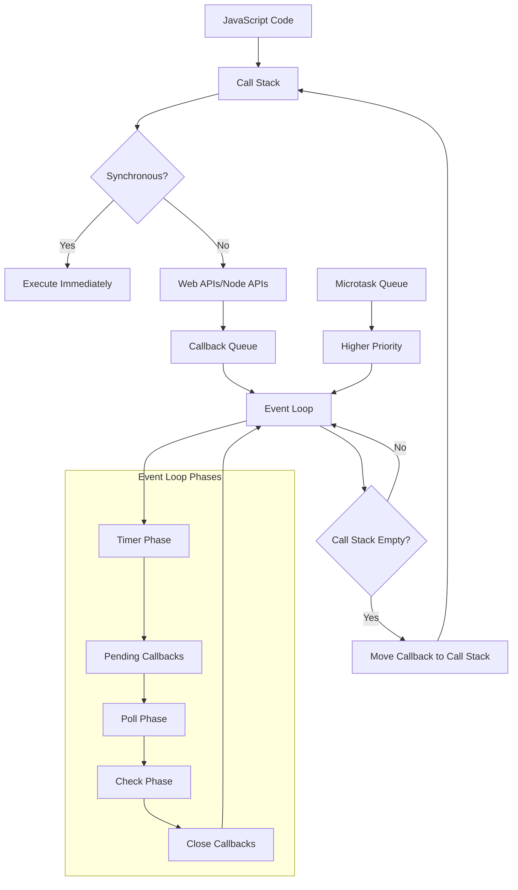

# Event Loop and Asynchronous Programming

## Introduction

The Event Loop is the heart of Node.js's asynchronous, non-blocking I/O model. Understanding how it works is crucial for writing efficient Node.js applications and is a common topic in senior backend engineering interviews.

## Core Concepts

### What is the Event Loop?

The Event Loop is a programming construct that waits for and dispatches events or messages in a program. In Node.js, it's what allows the runtime to perform non-blocking I/O operations despite JavaScript being single-threaded.

### Event Loop Phases

The Event Loop has six main phases:

1.  **Timer Phase** - Executes callbacks scheduled by `setTimeout()` and `setInterval()`
2.  **Pending Callbacks Phase** - Executes I/O callbacks deferred to the next loop iteration
3.  **Idle, Prepare Phase** - Only used internally
4.  **Poll Phase** - Fetches new I/O events and executes I/O related callbacks
5.  **Check Phase** - Executes `setImmediate()` callbacks
6.  **Close Callbacks Phase** - Executes close callbacks (e.g., `socket.on('close', ...)`)

### Microtasks and Macrotasks

Understanding the difference between microtasks and macrotasks is crucial for predicting execution order in Node.js.

*   **Macrotasks**: These are tasks handled by the Event Loop phases. Examples include `setTimeout`, `setInterval`, `setImmediate`, I/O operations, and UI rendering.
*   **Microtasks**: These are smaller, more urgent tasks that are executed after the current operation completes and before the next macrotask begins. Examples include `process.nextTick`, Promises (`.then()`, `.catch()`, `.finally()`), and `queueMicrotask`.

The microtask queue is processed entirely after each phase of the event loop (or after a synchronous block of code), before moving to the next macrotask. `process.nextTick` microtasks have higher priority than Promise microtasks.

## Code Examples

### Basic Event Loop Example

```javascript
console.log('Start');

setTimeout(() => {
  console.log('Timer 1');
}, 0);

setImmediate(() => {
  console.log('Immediate 1');
});

process.nextTick(() => {
  console.log('Next Tick 1');
});

console.log('End');

// Output:
// Start
// End
// Next Tick 1
// Timer 1
// Immediate 1
```

### Promise vs Callback Execution Order

```javascript
console.log('=== Promise vs Callback ===');

setTimeout(() => console.log('Timer'), 0);

Promise.resolve().then(() => console.log('Promise'));

process.nextTick(() => console.log('NextTick'));

setImmediate(() => console.log('Immediate'));

// Output:
// === Promise vs Callback ===
// NextTick
// Promise
// Timer
// Immediate
```

## Real-World Applications

### Database Connection Pooling

```javascript
const mysql = require('mysql2/promise');

class DatabaseManager {
  constructor() {
    this.pool = mysql.createPool({
      host: 'localhost',
      user: 'user',
      password: 'password',
      database: 'mydb',
      waitForConnections: true,
      connectionLimit: 10,
      queueLimit: 0
    });
  }

  async executeQuery(sql, params) {
    try {
      const [rows] = await this.pool.execute(sql, params);
      return rows;
    } catch (error) {
      console.error('Database query failed:', error);
      throw error;
    }
  }

  async getUser(userId) {
    return this.executeQuery(
      'SELECT * FROM users WHERE id = ?',
      [userId]
    );
  }
}
```

## Performance Considerations

### Blocking vs Non-Blocking Operations

```javascript
// ❌ Blocking - Avoid this
const fs = require('fs');
const data = fs.readFileSync('large-file.txt', 'utf8');
console.log('File read complete');

// ✅ Non-Blocking - Preferred approach
fs.readFile('large-file.txt', 'utf8', (err, data) => {
  if (err) throw err;
  console.log('File read complete');
});

// ✅ Promise-based approach
const fsPromises = require('fs').promises;
fsPromises.readFile('large-file.txt', 'utf8')
  .then(data => console.log('File read complete'))
  .catch(err => console.error(err));
```

## Common Pitfalls

### 1. Blocking the Event Loop

```javascript
// ❌ This blocks the event loop
function fibonacci(n) {
  if (n < 2) return n;
  return fibonacci(n - 1) + fibonacci(n - 2);
}

// ✅ Better approach using Worker Threads
const { Worker, isMainThread, parentPort, workerData } = require('worker_threads');

if (isMainThread) {
  const worker = new Worker(__filename, { workerData: { n: 40 } });
  worker.on('message', (result) => {
    console.log('Fibonacci result:', result);
  });
} else {
  const result = fibonacci(workerData.n);
  parentPort.postMessage(result);
}
```

### 2. Memory Leaks with Event Listeners

```javascript
// ❌ Memory leak - listeners not removed
const EventEmitter = require('events');
const emitter = new EventEmitter();

function createHandler() {
  const handler = (data) => {
    console.log('Processing:', data);
  };
  emitter.on('data', handler);
  // Handler is never removed!
}

// ✅ Proper cleanup
function createHandlerWithCleanup() {
  const handler = (data) => {
    console.log('Processing:', data);
  };
  
  emitter.on('data', handler);
  
  // Return cleanup function
  return () => {
    emitter.removeListener('data', handler);
  };
}
```

## System Architecture Diagram



## Interview Questions & Answers

### Question 1: Explain the Event Loop and its phases
**Difficulty**: Senior  
**Category**: Core Concepts

**Answer**: The Event Loop is Node.js's mechanism for handling asynchronous operations in a single-threaded environment. It operates in six phases:

1. **Timer Phase**: Executes callbacks from `setTimeout()` and `setInterval()`
2. **Pending Callbacks**: Handles I/O callbacks deferred from previous iterations
3. **Idle/Prepare**: Internal use only
4. **Poll Phase**: Fetches new I/O events and executes callbacks
5. **Check Phase**: Executes `setImmediate()` callbacks
6. **Close Callbacks**: Handles connection closures

**Code Example**:
```javascript
console.log('1: Start');

setTimeout(() => console.log('2: Timer'), 0);
setImmediate(() => console.log('3: Immediate'));
process.nextTick(() => console.log('4: NextTick'));

Promise.resolve().then(() => console.log('5: Promise'));

console.log('6: End');

// Output: 1, 6, 4, 5, 2, 3
```

**Follow-up Questions**:
- What happens if the Poll phase queue is empty?
- How does `process.nextTick()` differ from `setImmediate()`?
- What are microtasks vs macrotasks?

### Question 2: How would you prevent blocking the Event Loop?
**Difficulty**: Senior  
**Category**: Performance

**Answer**: Several strategies prevent Event Loop blocking:

1. **Use Worker Threads for CPU-intensive tasks**
2. **Break large operations into smaller chunks**
3. **Use asynchronous I/O operations**
4. **Implement proper error handling**

**Code Example**:
```javascript
// ❌ Blocking approach
function processLargeArray(arr) {
  return arr.map(item => heavyComputation(item));
}

// ✅ Non-blocking approach
async function processLargeArrayAsync(arr, chunkSize = 1000) {
  const results = [];
  
  for (let i = 0; i < arr.length; i += chunkSize) {
    const chunk = arr.slice(i, i + chunkSize);
    const chunkResults = chunk.map(item => heavyComputation(item));
    results.push(...chunkResults);
    
    // Yield control back to Event Loop
    await new Promise(resolve => setImmediate(resolve));
  }
  
  return results;
}

// ✅ Worker Thread approach
const { Worker, isMainThread, parentPort, workerData } = require('worker_threads');

if (isMainThread) {
  const worker = new Worker(__filename, { 
    workerData: { array: largeArray } 
  });
  worker.on('message', (result) => {
    console.log('Processing complete:', result.length);
  });
} else {
  const result = workerData.array.map(item => heavyComputation(item));
  parentPort.postMessage(result);
}
```

### Question 3: Explain the difference between process.nextTick() and setImmediate()
**Difficulty**: Mid-Senior  
**Category**: Execution Order

**Answer**: 
- `process.nextTick()`: Executes before the Event Loop continues to the next phase
- `setImmediate()`: Executes in the Check phase of the Event Loop

**Code Example**:
```javascript
console.log('Start');

setImmediate(() => {
  console.log('setImmediate 1');
  process.nextTick(() => console.log('nextTick inside setImmediate'));
});

process.nextTick(() => {
  console.log('nextTick 1');
  setImmediate(() => console.log('setImmediate inside nextTick'));
});

console.log('End');

// Output:
// Start
// End
// nextTick 1
// setImmediate 1
// nextTick inside setImmediate
// setImmediate inside nextTick
```

### Question 4: How do you handle memory leaks in Event Loop applications?
**Difficulty**: Senior  
**Category**: Memory Management

**Answer**: Common memory leak sources and solutions:

1. **Uncleaned Event Listeners**
2. **Circular References**
3. **Closures holding references**
4. **Timers not cleared**

**Code Example**:
```javascript
class EventManager {
  constructor() {
    this.listeners = new Map();
    this.timers = new Set();
  }

  addListener(emitter, event, handler) {
    emitter.on(event, handler);
    
    // Track for cleanup
    if (!this.listeners.has(emitter)) {
      this.listeners.set(emitter, new Map());
    }
    
    const emitterListeners = this.listeners.get(emitter);
    if (!emitterListeners.has(event)) {
      emitterListeners.set(event, new Set());
    }
    
    emitterListeners.get(event).add(handler);
  }

  addTimer(callback, delay) {
    const timer = setTimeout(() => {
      callback();
      this.timers.delete(timer);
    }, delay);
    
    this.timers.add(timer);
    return timer;
  }

  cleanup() {
    // Remove all listeners
    for (const [emitter, events] of this.listeners) {
      for (const [event, handlers] of events) {
        for (const handler of handlers) {
          emitter.removeListener(event, handler);
        }
      }
    }
    this.listeners.clear();

    // Clear all timers
    for (const timer of this.timers) {
      clearTimeout(timer);
    }
    this.timers.clear();
  }
}
```

### Question 5: Describe how you would implement a rate limiter using the Event Loop
**Difficulty**: Expert  
**Category**: Advanced Implementation

**Answer**: A rate limiter can be implemented using token bucket or sliding window algorithms:

**Code Example**:
```javascript
class TokenBucketRateLimiter {
  constructor(capacity, refillRate, refillPeriod = 1000) {
    this.capacity = capacity;
    this.tokens = capacity;
    this.refillRate = refillRate;
    this.refillPeriod = refillPeriod;
    this.lastRefill = Date.now();
    
    // Start refill process
    this.startRefillProcess();
  }

  startRefillProcess() {
    setInterval(() => {
      const now = Date.now();
      const timePassed = now - this.lastRefill;
      const tokensToAdd = Math.floor((timePassed / this.refillPeriod) * this.refillRate);
      
      this.tokens = Math.min(this.capacity, this.tokens + tokensToAdd);
      this.lastRefill = now;
    }, this.refillPeriod / 10); // Check 10 times per refill period
  }

  async consume(tokens = 1) {
    return new Promise((resolve, reject) => {
      const attempt = () => {
        if (this.tokens >= tokens) {
          this.tokens -= tokens;
          resolve(true);
        } else {
          // Wait and retry
          setTimeout(attempt, 10);
        }
      };
      
      attempt();
    });
  }

  canConsume(tokens = 1) {
    return this.tokens >= tokens;
  }
}

// Usage example
const rateLimiter = new TokenBucketRateLimiter(10, 5, 1000); // 10 capacity, 5 tokens/sec

async function handleRequest(req, res) {
  try {
    await rateLimiter.consume(1);
    // Process request
    res.json({ success: true });
  } catch (error) {
    res.status(429).json({ error: 'Rate limit exceeded' });
  }
}
```

## Behavioral Questions

### Question 1: Describe a time when you had to optimize a Node.js application's performance
**Category**: Technical Leadership

**Sample Answer Framework**:
- **Situation**: Application experiencing high latency and memory usage
- **Task**: Identify bottlenecks and implement optimizations
- **Action**: 
  - Profiled application using Node.js built-in profiler
  - Identified Event Loop blocking operations
  - Implemented Worker Threads for CPU-intensive tasks
  - Added connection pooling for database operations
- **Result**: Reduced response time by 60% and memory usage by 40%

### Question 2: How do you handle disagreements about asynchronous programming approaches in your team?
**Category**: Team Collaboration

**Key Points to Address**:
- Present data-driven arguments (performance benchmarks)
- Consider maintainability and team expertise
- Propose proof-of-concept implementations
- Focus on business impact and user experience

## Key Takeaways

1.  **Single-Threaded**: JavaScript execution is single-threaded, but I/O operations are handled by the system.
2.  **Non-Blocking**: The Event Loop enables non-blocking I/O operations.
3.  **Phase-Based**: The Event Loop operates in phases, each with specific responsibilities.
4.  **Microtasks vs. Macrotasks**: Microtasks (like `process.nextTick` and Promises) have higher priority and execute before the next macrotask.
5.  **Performance**: Understanding the Event Loop is crucial for writing performant Node.js applications.
6.  **Memory Management**: Proper cleanup of listeners and timers prevents memory leaks.
7.  **Monitoring**: Use profiling tools to identify Event Loop blocking operations.

## Next Steps

-   Learn about [Async/Await](./promises-async-await.md)
-   Explore [Stream Processing](./streams.md)
-   Study [Worker Threads](./worker-threads.md) for CPU-intensive tasks
-   Delve deeper into [JavaScript Promises](../javascript/promises.md)
