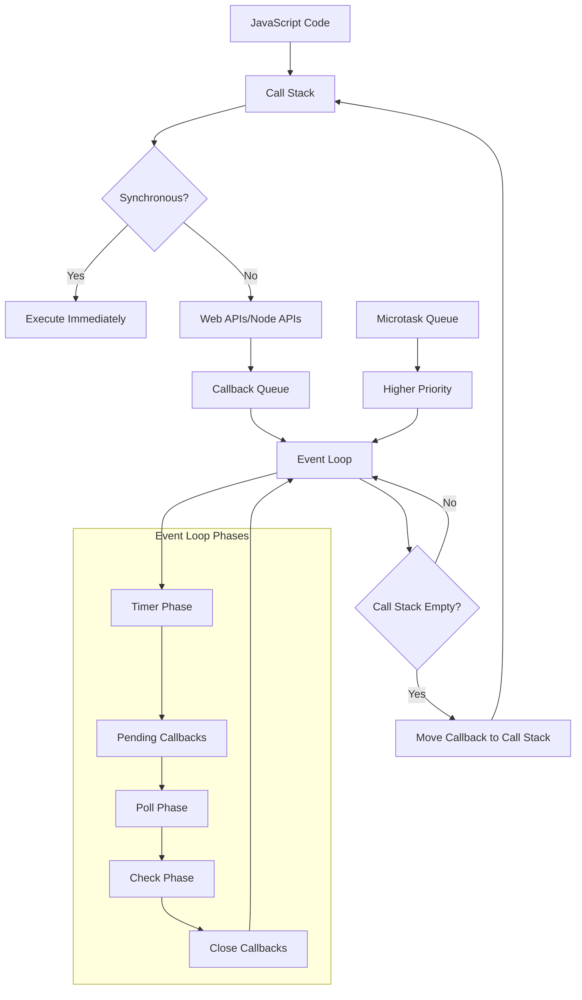

# Advanced Node.js Event Loop Interview Guide

## Quick Read (5-10 minutes)

### Executive Summary
The Node.js Event Loop is a single-threaded, non-blocking I/O mechanism that enables JavaScript to handle thousands of concurrent operations efficiently. It operates in six phases (Timer, Pending Callbacks, Poll, Check, Close Callbacks) with microtasks (process.nextTick, Promises) having higher priority than macrotasks (setTimeout, setImmediate). Understanding execution order, performance implications, and debugging techniques is critical for senior backend roles at major tech companies.

### Key Points
- **Single-threaded execution** with non-blocking I/O operations handled by libuv
- **Six phases**: Timer → Pending → Poll → Check → Close → repeat
- **Microtask priority**: process.nextTick > Promise.then > macrotasks
- **Performance critical**: Blocking operations can freeze entire application
- **Memory management**: Uncleaned listeners and timers cause memory leaks
- **Production debugging**: Use --inspect, clinic.js, and 0x for profiling
- **Scaling patterns**: Worker threads, clustering, and proper async patterns

### TL;DR
Event Loop = single-threaded JavaScript execution + multi-threaded I/O operations. Microtasks execute before macrotasks. Never block the loop with synchronous operations. Use profiling tools to identify bottlenecks. Essential knowledge for FAANG interviews.

## Introduction

The Event Loop is the heart of Node.js's asynchronous, non-blocking I/O model and the most frequently asked topic in senior Node.js interviews. This comprehensive guide covers 40+ interview questions from Google, Amazon, Microsoft, Meta, and other top companies, with real-world scenarios and production debugging techniques.

## Core Concepts

### What is the Event Loop?

The Event Loop is a programming construct that waits for and dispatches events or messages in a program. In Node.js, it's what allows the runtime to perform non-blocking I/O operations despite JavaScript being single-threaded.

### Event Loop Phases

The Event Loop has six main phases:

1. **Timer Phase** - Executes callbacks scheduled by `setTimeout()` and `setInterval()`
2. **Pending Callbacks Phase** - Executes I/O callbacks deferred to the next loop iteration
3. **Idle, Prepare Phase** - Only used internally
4. **Poll Phase** - Fetches new I/O events and executes I/O related callbacks
5. **Check Phase** - Executes `setImmediate()` callbacks
6. **Close Callbacks Phase** - Executes close callbacks (e.g., `socket.on('close', ...)`)

## Code Examples

### Basic Event Loop Example

```javascript
console.log('Start');

setTimeout(() => {
  console.log('Timer 1');
}, 0);

setImmediate(() => {
  console.log('Immediate 1');
});

process.nextTick(() => {
  console.log('Next Tick 1');
});

console.log('End');

// Output:
// Start
// End
// Next Tick 1
// Timer 1
// Immediate 1
```

### Promise vs Callback Execution Order

```javascript
console.log('=== Promise vs Callback ===');

setTimeout(() => console.log('Timer'), 0);

Promise.resolve().then(() => console.log('Promise'));

process.nextTick(() => console.log('NextTick'));

setImmediate(() => console.log('Immediate'));

// Output:
// === Promise vs Callback ===
// NextTick
// Promise
// Timer
// Immediate
```

## Real-World Applications

### Database Connection Pooling

```javascript
const mysql = require('mysql2/promise');

class DatabaseManager {
  constructor() {
    this.pool = mysql.createPool({
      host: 'localhost',
      user: 'user',
      password: 'password',
      database: 'mydb',
      waitForConnections: true,
      connectionLimit: 10,
      queueLimit: 0
    });
  }

  async executeQuery(sql, params) {
    try {
      const [rows] = await this.pool.execute(sql, params);
      return rows;
    } catch (error) {
      console.error('Database query failed:', error);
      throw error;
    }
  }

  async getUser(userId) {
    return this.executeQuery(
      'SELECT * FROM users WHERE id = ?',
      [userId]
    );
  }
}
```

## Performance Considerations

### Blocking vs Non-Blocking Operations

```javascript
// ❌ Blocking - Avoid this
const fs = require('fs');
const data = fs.readFileSync('large-file.txt', 'utf8');
console.log('File read complete');

// ✅ Non-Blocking - Preferred approach
fs.readFile('large-file.txt', 'utf8', (err, data) => {
  if (err) throw err;
  console.log('File read complete');
});

// ✅ Promise-based approach
const fsPromises = require('fs').promises;
fsPromises.readFile('large-file.txt', 'utf8')
  .then(data => console.log('File read complete'))
  .catch(err => console.error(err));
```

## Common Pitfalls

### 1. Blocking the Event Loop

```javascript
// ❌ This blocks the event loop
function fibonacci(n) {
  if (n < 2) return n;
  return fibonacci(n - 1) + fibonacci(n - 2);
}

// ✅ Better approach using Worker Threads
const { Worker, isMainThread, parentPort, workerData } = require('worker_threads');

if (isMainThread) {
  const worker = new Worker(__filename, { workerData: { n: 40 } });
  worker.on('message', (result) => {
    console.log('Fibonacci result:', result);
  });
} else {
  const result = fibonacci(workerData.n);
  parentPort.postMessage(result);
}
```

### 2. Memory Leaks with Event Listeners

```javascript
// ❌ Memory leak - listeners not removed
const EventEmitter = require('events');
const emitter = new EventEmitter();

function createHandler() {
  const handler = (data) => {
    console.log('Processing:', data);
  };
  emitter.on('data', handler);
  // Handler is never removed!
}

// ✅ Proper cleanup
function createHandlerWithCleanup() {
  const handler = (data) => {
    console.log('Processing:', data);
  };
  
  emitter.on('data', handler);
  
  // Return cleanup function
  return () => {
    emitter.removeListener('data', handler);
  };
}
```

## System Architecture Diagram



## Interview Questions (40+ Ques

### Frequently Asked Questions (Top 15)

### Q1: Explain the Node.jsetail
ommon


The Event Loop is Node.js's mechanism for handling asynchronous operations in  priority.

#### Detailed Answer (3-5 minutes)
The Event Loop enables Node.js to perform non-blocking I/O operas:

1. **Timer Phase**: Executes callbacks scheduled byval()`
ion
3. **Idle, Preparjs
4. **Poll Pha
5. **Check Phase**: Execllbacks


Between each phase, the Event Loop processes mic


```javascript


setImmediate(() => console.
pro
e'));

console.log('6: End');

// Output: 1, 6, 4, 5, 2, 3


#### Real-World Context
In production systems, uning.

#### Common Mistakes

- Not understanding microtask priority over macro
- Blocking the event loop with synchronous operations

#### Follow-up Questions
?
2. How do microtations?
3. What's thelbacks?

#### Related Topics
- Libuv architecture
-
le

### Q2: What's the difference between microtasks and macrotasks?
**Difficulty:** Senioy Common

#### Quick Answer (30 seconds)
Microtasks (process.nextTick, Promise.then) haration.

#### Detailed Answer (3-5 minutes)
**Mis:**
- `process.nextTick()` callbacks
- Promise `.then()`, `.catch()`, `.finally()` callbacks
- `cks
- letes
- Higher priorityks

ks:**
- `setTimeout()` and `setInks
- `setImmediate()` callbacks
s
- Execute in their s

#### Code Example
```jaript
console.log('Start');

// Masks
setTimeo0);
setTimeout(() => console.log('Timer 2'), 0);
setImmediate(() => console.log('I;

// rotasks

  console.log('NextTick 1');
  process.nextTick(() => con
});

Promise.reso> {
  console.log('Promise 1');
  return Promise.resolve();
 2'));

console.log('


// Start
// End
// NextTick 1
// 

// Promise 2
// Timer 1
// Timer 2
// 1


Understand

#### C Mistakes
- Assuming aly
- Creating infini
- Not understanding Promise resiming

###uestions

2. How does async/await affect microtask scheduling?
3. What happens with nes


**Difficulty:** Senior | **Companies:** Amazon, Googlmon

#### Quick Answer (30 seconds)
Use Worker Threads for CPU.

#### Detailed Answer (3-5nutes)
:

1. **Worker T**
2. **Chunking large ns**
3. **Asynchronouss**
4. **Proper error handling**
5. **Monitoring and profilin


```javascript
// ❌ Blocking approach
funcarr) {
  return arr.map(item =>
}

// ✅  approach
asyn
  const results = [];
  
  for (let i = 0; i < arr.length; i += chunkS
    c
    em));
    results.push(...chunkResults);
    
op
    await new Promise(resolvee));
  }
  
  return results;
}

// ✅ Worker Thread approach
const { Worker, i;

{
  const worke { 
    workerData: { array: la
  });
  worker.on('message', (result) => {
    console.log('Processing complete:', r
  });
} else {
  const(item));
  par
}
```

#### Real-World Context
In production, blocked Eveations.

#### Common Mistakes
- Urs
-s
- In thread

#### Follow-up Questions
1. How do you monitor Evon?
2. What's the difference between Works?
hreads?


**Difficulty:** Mon

#### Quick Answer (30 seconds)
`process.nextTick()` executes before the Event Loop continity.

#### Detailed Answer (3-5 mutes)
**process.nextTick():**
- Executes at the end of the current 
- Higher priority than all other s
- Cavely

**setImmediate():**
- ELoop
s
- Designed for executingvents

#### Code Example
```javascript
console.log('Start');

setImmediate(() => {
  console.log('setImmediate 1');
  process.nextTick(() => console.log('nextTick inside setImmediate'));
});

process.nextTick(() => {
  console.log('nextTick 1');
  setImmediate(() => console.
});

setTimeout(() => console 0);

console.log('End');

// Output:
// Start
// End
// nextTick 1
// setTut
// 

// setImmediate inside nex
```

#ontext
ns.

#### Common Mistakes
ounds
- Expecting setImmediate to execute imme
- Not u

#### Follow-up Questions
1. When would you choose setImmek?
2. What happens witcalls?
3. How does this behavior differ in different Node.js versions?

#
**D:** Common

#### Quick Answer (30 sds)
ecks.

#### Detailed Answer (3-5 minutes)
hniques:

1. **Built-in Node.js profiler**
2. **Clinic.js suite**
3. **Chrome De
4. **0x profiler for flame graphs**
5. **Custom monitoring with perf_hooks**

#### Code Example
```javascript
s');

// Monitor Event Loop lag
{
  const entries = list.geties();
  entries.forEach((entry) => {
    console.log(`Event Loop Lag: ${entry.duraon}ms`);
    if (entry.duration > 10) {
      console.warn('Event Loop blocked!');
}
  });
});

obs.observe({ entryTypes: ['measure'] });

// Measure Event Loop lag
setInterval(() => {
  const start = performance.now();
  setImmediate(() => {
;
    performan);

}, 1000);

// Custom profiling wrapperction profileAsync(name, fn) {eturn async yments?ng pakithout blocction wiraud dete real-time fu implement youldHow woures?
3. rovider failg payment phandlinse for  uld youategies wout strm?
2. Whaent systeed paymtributies in a disopertsure ACID prould you enHow wio
1. Scenars from This  Questionterview### Inability

#em stns systntaidling maiul error hanacef
- Grliancer compal fonting is esset loggisive audiComprehention
- tecaud deme frable real-tir Threads enres
- Workee failuadevent cascers prreak- Circuit bed
rnessons Lea### Lme SLA

#9% upti 99.9*:ility*vailab
- **Aud scoringcond fraion**: <2 seFraud Detecttime
- **ocessing e payment prragms ave*: <500atency*ate
- **Lccess rsupayment % : 99.99**Success Rate- **etrics
rformance M
#### Pe
}
}
```
    }
  rror; e   throwe();
   rdFailurer?.recotBreak  circuior) {
     (err    } catchlt;
resuturn re    s();
  Succesecordker?.ruitBrea
      circntent);paymentIprovider, r(ovideentPrllPaymwait this.cat = a const resul  ry {
   

    te');
    }blly unavailaarir temporprovidement or('PayntErrymePanew throw )) {
      sOpen(reaker.iuitB&& circBreaker itf (circu

    ider);rovit(preakers.ge.circuitB= thisitBreaker cunst cir  coype;
  ethod.tent.paymentMmentInt= payovider   const prent) {
  r(paymentIntideovhPritc processWsyn
  }

  a});
    });  
         }  
 rror));r(result.e Erro(new     reject   
   else {
        }audScore);t.fresul(r resolve       {
  ess) uccif (result.s      imeout);
  Timeout(t   clear> {
     t) =esulsage', (resr.once('m     worke

       });mentIntent
 paydata:   
     detection',ype: 'fraud_   tge({
     er.postMessa     workimeout

 / 2 second t); /}, 2000
      imeout'));tion t'Fraud detecew Error(t(nrejec    => {
     ()etTimeout(timeout = sonst    cr();
   leWorkelabthis.getAvairker =  wo    const> {
  , reject) =lve((resoiseurn new Prom
    retent) {d(paymentIntau checkFr  async
  }


    }ror;row er    th);
  ionId, erroracttError(transhandlePaymen await this.) {
     error} catch (

    t;n resulretur  

          ]);success')
onId, 'sactition(tranransacog.logTthis.auditL    mer),
    Intent.custonton(paymedConfirmati.sen    this'),
    letedcomponId, 'ansactinStatus(transactioupdateTr      this.[
  all(ise. await Promns
     firmatioand send con database ep 4: Update
      // St   nt);
   Inteaymentider(pWithProv.processist = await thesul    const r  
nt processorternal payme exwith: Process  Step 3
      //     }
);
 review'ged for lagaction frror('Transnew PaymentErow         the);
audScorfrsactionId, ran(tsActivityoug.logSuspicithis.auditLo  await 
      {e > 0.8) audScor     if (frnt);
 paymentInteraud(eckFchit this.wadScore = at frau     cons Thread
 Workern in ud detectio Fra/ Step 2:  /
    

      }rrors);on.eidati valment data',alid payr('InventErro Paymw new       throalid) {
 tion.valida  if (!v
    );tenttInennt(paymePaymethis.validat await validation =onst      cking)
 locta (non-bayment date p 1: Valida   // Step try {
    
   .id;
   tentymentIn pansactionId = tra  const
  ent) {ntt(paymentIPaymen process}

  async;
  ng()ssis.setupProce();
    thiitLoggerog = new Aud this.auditL  
  Map();eakers = newircuitBr.c
    this(16);Poolkeris.createWorthonWorkers = ctis.fraudDetehi teue();
    PriorityQuue = newctionQuehis.transa  tr() {
  onstructoor {
  centProcess StripePaymt
classavascrip
```jpproachon Aolutig

#### Sdata handlinments for  DSS require PCI*:liance*s
4. **Comp integrationt processorl paymening externaag APIs**: ManThird-party. **d scoring
3d frautime ML-base*: Real-ction*ud DeteFra2. **ems
systibuted tr discrossoperties a prg ACID: Ensurin Integrity**ansaction**Trenges
1. hallal Chnic## Tecnce.

##plia PCI comties and properng ACIDmaintainills while  ca-party APIn, and thirdio detectn, fraudidatioval payment andle hstop muent Lo Evhets. Teny requiremnd latencability aeliict rith strions daily wansactpayment trs of ioncesses mill
Stripe prontteme Problem Sta

#### Loopventability EHigh-Relige:** lenallly | **Chnnua** $640B+ a | **Scale:ntech* Fiustry:*stem
**Inding Syent Processym PaStripeio 2:  Scenar

### peak load?ringdugradation l det gracefuplemenimwould you 
3. How g? processincse analytir real-tim fold you usetegies wouWhat stras?
2. ectioncket conn WebSontcurrendle 10M conwould you haHow ario
1. s Scens from Thiuestionw Qrvie

#### Intekseamory ls mereventcleanup p Regular ad
-y overhemor reduces mepoolingConnection ng
- oop blockit Lts Evenents preventching evns
- Bae operatio-intensivl for CPUre essentiareads a
- Worker Thearned Lessons L

####eak hoursg pon durinutilizati <70% **CPU**:nce
-  insta 2GB perder usage unable memorymory**: St*Me- * server
cond perses per st*: 1M+ requeoughput*hr **T
-ionnitializatream ime for stesponse ti100ms r*: Sub-tency*cs
- **Latrimance Me## Perfor

##
  }
}
```
    }); });ents: batchs', evicpe: 'analyt{ tyMessage(ker.post wor
     ;eWorker()etAvailabler = this.gonst work   c=> {
   mediate(()   setIm control
   to yielddiate setImme // Use   
   chunks
 s in ; // Proces 1000)plice(0,entBuffer.s.evthish = onst batc
    ctch() {sBacessAnalytic}

  pro  Config;
ingstreamturn 

    re
    });ndationscomme reata,
     ad  contentMet    erProfile,
    usr, {
  orker(workerocessInWthis.pit wangConfig = at streami cons();
   eWorkerilabl.getAvarker = thisst woing
    conavoid blockto rker Thread  Woss in// Proce    );

Id)
    ]er(usendationsmm.getReco     this
 tId),a(contenntMetadatonte  this.getCerId),
    ile(usgetUserProfis.
      thll([e.aromiss] = await Ponmmendati, recoatatentMetadconrProfile, use const [es
   promisng pproach usi a-blocking Non // {
   contentId)userId, est(ngRequeaminc handleStr
  asyds
  }
econ0 svery 3 // E000);;
    }, 30tions()activeConnecpInhis.cleanu    t
  > {nterval(() =ks
    setIory leamemrevent leanup to pPeriodic c
    // 
100ms every ess Proc}, 100); //    
      }
ticsBatch();rocessAnaly    this.p0) {
    r.length > feufventBthis.ef ( i     => {
val(() ersetIntcking
    looop b Lnt Evento prevevents tnalytics erocess a/ Batch p
    /() {optLotupEven

  se;
  }tLoop()vensetupEhis.;
    t = []erentBuff this.ev0000);
    LRU(10Cache = newtioncommendas.rethil(8);
    PooteWorker= this.creaticsWorkers .analy);
    this= new Map(ionPool ect this.connr() {
   onstructor {
  cingServeStreamass Netflixscript
clch
```javaion Approalut
#### Soreaming
ptimal stor oth CDN fating wiy**: CoordinDeliverContent 
4. **msthlgorisive ML antenCPU-i**: inendation Engmme**Recol-time
3.  rea inng eventsewi visingcesytics**: Proime Anal-t*Real
2. *ectionsnnSocket corent Web concurM+: 10anagement**ion M**Connectes
1. llengal Cha# Technic

### blocking.houtthms wition algorimendatomve recensiint CPU-es, ande queriabasns, datet connectioage WebSockently manfici ef Loop must Event Thecs.alytieal-time and rtes, anion updacommendatns, reioractteor user incy f latenntaining lowle maiwhideo streams oncurrent vins of cndle millioeds to hatflix nement
Neoblem State## Prance

##p Performvent Loollenge:** E **Chaers |+ us00M:** 2Scalea | ** Meditreamingndustry:** Stecture
**IArching Streamiflix Video  Net Scenario 1:s

###Case Studienarios & Sceal-World # Re##on?

productis in k alerty leaed memor automatlementld you imp wou. How
3nalysis? dump ar heap use fos would youWhat toolrowth?
2. d memory gnd expecte aaksleeen memory  betwateentierd you diff. How woul
1tionsw-up Queslool

#### Fproaches.gging apdebustematic ing syhes, requirventual crasnd egradation amance deerfore gradual pcausions can s applicatde.jction Noaks in produ
Memory leontext C# Real-World
###
}
```

  }p();anuctor.cle.deteisth}
    up();
    leanresource.c     
 s) {cethis.resourrce of nst resour (co    foes
urc resonup all
    // Cleawn() { shutdo }

     }
     }
ak;
      bre   ;
 eanup()source.cl      re
  Id) {= resourceid ==ce. (resour
      ifces) {is.resour the oft resourcons
    for (curceId) {resoResource(troydes

  source;
  }urn reet

    r|| 300000);ig.ttl nf, co }
    }     anup();

        clesource)) {has(resources.(this.re     if (() => {
 Timeranagedor.addMthis.detectt timer =  conseout
   r timup afteuto-clean/ A);

    /ourceesources.add(ris.res   th cleanup;
 p =nuclearce.    resou
);
    };
 cleaned up`id}rce.urce ${resou`Resoconsole.log(;
      source)redelete(sources.    this.re=> {
  anup = () cle
    const leanup cwith properurce up reso // Set

       };p: null
nu clea,
     ow()Date.ncreatedAt: 
      g, confi    
 (36),toString.random().   id: Math= {
   esource onst r
    ce(config) {esourcreateRsync c a
  }

 new Set();= .resources thisr();
    LeakDetectow Memoryor = nehis.detect    tructor() {

  constager {esourceMans Rasment
clource manage resroperf pxample o;

// Eion(10000)DetectLeakr.startdetectoInterval = itoringonst mon
conitoringt mar

// Sttor();eakDetecMemoryLr = new t detectomple
cons// Usage exa }
}

valMs);
 }, inter
    Growth();emorylyzeMis.ana    th);
  shot(SnapeapkeH  this.ta => {
    (()Intervalrn set{
    retus = 30000) rvalMtection(intekDestartLeaection
   detomated leakAut // ;
  }

 cleaned up')urces d resoanageog('All m console.l    
   ;
r()mers.cleas.ti    thi;
    }
(timer)tervalarIn     cle;
 (timer)outrTime clea) {
     his.timersimer of t (const ts
    formerar all ti
    // Cle
    lear();rs.cenests.li}
    thi
    dler);ner.han listeevent,ener.r(listListenetter.removeer.emi    listeneners) {
   this.listoflistener] d, (const [is
    for l listenermove al    // Releanup() {
rces
  caged resouall man // Cleanup   }

    }

 (timer);deletetimers.    this.
  mer);l(tiearIntervaclr);
      met(tiTimeouar      clemer)) {
rs.has(tihis.timef (t    i{
r(timer) rManagedTime
  clea;
  }
rn timer  retu;
  d(timer).timers.ad   this    
 y);
la  }, der);
      te(times.delemer this.ti    
     ck(); callba          => {
(() setTimeout      :)
lback, delayterval(cal     ? setIn' 
 alinterv=== 'e mer = typnst ti  co {
  imeout')type = 'telay, lback, der(calddManagedTimnt
  amanagememer Safe ti  }

  //   }

  stenerId);(lideletesteners.is.li
      th);dlerr.hanene, lister.eventr(listenneListeitter.remove.emlistener     ner) {
    if (liste);
 Idget(listenerners..liste thiser =stenconst li {
    enerId)istener(listveManagedLremo

   }d;
 erIeneturn list  r);
    
  ow()
    }t: Date.ncreatedA    
  ,  context,
    : handlerlHandler originar,
     dleppedHan: wraandler  h     event,
   ,
     emitterd, {
   istenerIteners.set(l.listhis    
    er);
andlpedHt, wrap.on(eventter   
    emi
 };
          }nerId);
steener(liagedListis.removeManth        error);
 r error:',r('Listenensole.erro      co
  h (error) {  } catcargs);
    context, apply(dler. return han     {
    try    rgs) => {
 (...andler = dHat wrappe    cons context
ler to track// Wrap hand    36);
    
oString(ndom().tth.rad = MalistenerIconst ll) {
    = nuxt teandler, connt, h eveer,er(emittgedListenna addManagement
 stener mat livenfe e
  // Sa
;
  } report   returnull, 2));
  n(report,fyngiN.strirt:', JSOmory Repoe.log('Me    consol  };
    
ots
  t 5 snapshasice(-5) // Lsnapshots.slts: this.apsho  sn
    mers.size, this.tiimers:  activeT
    eners.size,list: this.veListenersacti(),
      tisticsStaetHeap.geapStats: v8      hage(),
ryUsess.memoprocryUsage:  memo    
 Date.now(),amp: st    timet = {
  nst repor  co {
  ryReport()moteMe

  genera
  }rn growth; retu
     }
    ort();
  eMemoryRepenerat     this.g growth);
 detected:',ory growth nificant memle.warn('Sig consowth
      // 10MB gro1024) {1024 * owth > 10 * th.heapGrow  if (gr
  concernings y growth it if memor
    // Aler
    p
    };imestamus.t- previo.timestamp sed: latest   timeElapnal,
   er.ext- previousal atest.extern: lowth externalGr  apUsed,
   ious.herev- papUsed t.heeswth: lat     heapGro
 growth = {   const 
    
  - 2];shots.lengthhis.snapsnapshots[tthis. = reviousconst p1];
    .length - .snapshotss[thisots.snapshatest = thi const l      
 urn null;
< 2) retlength ts.apshoif (this.snth() {
    zeMemoryGrow  analy

shot;
  }snap
    return    
    }
 ();hots.shiftthis.snaps      
ngth > 10) {napshots.le(this.ss
    if  10 snapshot last// Keep only
    
    shot);ts.push(snaphois.snapsth    
   
 
    };ics()stpStativ8.getHeaap: 
      v8He.external,oryUsage()cess.memrnal: proteexsed,
      ge().heapUmoryUsas.meUsed: proces heap
     ),p: Date.now( timestam     {
hot = napsconst s) {
    shot(HeapSnapakeies
  tn utilitdetectio leak  // Memory
 
  }
urn handler; 
    ret
    };
    'items');a.length,rgeDat laevent with','Processing onsole.log(();
      chenNeededaWargeDatis.getLata = th largeDst     conent) => {
 ler = (ev handonst  cures
  ects in close large objDon't captur// ✅ er() {
    ndlateSafeHaion
  crersxed ve

  // Fi
  }andler;urn h 
    ret };
     ;
 items').length, '', largeDatag event withssin.log('Proce console    eData
 ce to larg referen retainssure  // Clo{
     => er = (event)nst handl  co  leak
ry ates a memocre  // ❌ This );
    
  ata'('dll).firay(1000000Ar new rgeData =la    const  {
r()yHandleeateLeak leaks
  cres memoryhat causcode tlematic Prob

  //  }();
 ew Seters = ntim
    this.p();ers = new Malisten  this.kMap();
  w Wea= neallbacks 
    this.c [];napshots =.s
    this {tor()
  construcetector {LeakDrys Memo

clas('v8');equirenst v8 = rs');
coookre('perf_hrequi } = performance
const { iptascr
```javExample## Code s:

##ent listener, and evosurescks, cl callbam retainedn stem froations ofteicLoop appl in Event ksleamory )
Metes5 minu Answer (3-etailed

#### Disteners.ent ld evsures ancloretained  identify ing tools tose profilate, and upri where approrences weak refes, implementnce refere callbackzeanaly, p snapshots
Use hea seconds)nswer (30## Quick A##

al** Occasionequency:n | **Frle, Amazo* Goognies:*mpa**Coert | :** Expty*Difficulention
*callback retLoop ed by Event k causeag a memory ldebuou would ain how y: Expl### Q10?

 starvationo preventing tchedulir simplement fald you 3. How wounce?
rmaduler perfor scheor fonitd you moics woultrWhat meos?
2. nariscenversion ity idle priorould you han wHow
1. p Questions## Follow-uial.

##uc crty ispriorition pera where oe analyticsand real-timforms, trading platservers,  game s liketeme sysmancfor-perighre used in hedulers aCustom schContext
World al-

#### Re
```'LOW');
}, pFiles(); cleanupTem=> {
 schedule(() duler.he
scnupriority clea
// Low p);
ORMAL', 'N);
}updateCache(() => {
  hedule(ler.scsks
scheduund tarokg bac// Normal;

IGH')'Hst();
}, equesApiRrocesawait p
  ) => { (ule(asyncedduler.schnses
sche respoority APIh pri

// HigITICAL');
}, 'CRSession();saveUser {
  await ync () =>dule(asler.scheheduerations
sctabase opdaCritical 
// 
uler();Sched Priority = newlerschedu
const ple/ Usage exam

/ }
}}
    };
     gth
  s.LOW.lenue.que   LOW: thish,
     engtNORMAL.lthis.queues.:   NORMALh,
      HIGH.lengtqueues.his.H: tIG H    
   ngth,ITICAL.lequeues.CRthis.TICAL:         CRIengths: {
eueL,
      qu.this.stats..rn {
        retu  ) {
tats(  getS 2;
  }

ncy) /cy + latevgLatenis.stats.athency = (avgLat.stats.   this
 artTime;ow() - stDate.n latency = 
    const+;sed+.procesthis.stats {
    tTime)tarts(s  updateSta
  }

+;
    }ed+opp.drs.stats;
      thi:`, error)ies} retriestask.maxRetr${er failed aft{task.id} Task $le.error(`nso co   else {
   } ity
    priormey with saetr); // Rft(task.unshiy]ask.priorits.queues[tt
      thit timeou(); // Rese Date.nowAt =edk.schedul    tas++;
  etriesk.r  tas    etries) {
xR task.mask.retries <if (ta
    or) {sk, errkError(ta  handleTas}


  n null;   retur   }
   }
 t();
    iority].shif[prs.queuesn thiuret    r {
    gth > 0)].len[priority.queuesthis  if (
    OW']) {'LORMAL', 'N, 'HIGH', 'CRITICAL'rity of [rionst pfor (co    > LOW
H > NORMAL ICAL > HIGRIT Cer:rity ordPrio  // 
  xtTask() {etNe
  g
  }
Next);(processnextTickprocess.ity
    iorprhighest  for s.nextTickoces  // Use pr  };

  }
  t);
      ocessNex(prsetImmediate       , error);
 taskError(skhandleTathis. {
        (error)atch   } c  }
         
 cessNext);ate(pro setImmedi       
  tartTime);pdateStats(s this.u      us task
   rono // Synch       e {
      } els
         });    
   Next);iate(processmmed  setI            
sk, error);(tadleTaskErroranis.h      th      {
   or) =>ch((err       .cat   })
     
         ssNext);(proceImmediate        sete);
      s(startTims.updateStat  thi      {
      > hen(() =       .tlt
      resu      Promise
   Handle    //        ') {
= 'functionsult.then ==f re&& typeoesult   if (r   
          sk();
 sk.talt = ta const resu      
    try {  }

   urn;
      ret
      sNext);e(procesdiatmme   setI++;
     ats.droppeds.st thi{
       sk.timeout) ledAt > tahedutask.scime - artTf (st   i
   utCheck timeo    //   
  
    );e.now(atartTime = Dt stns   co   }

   rn;
    retu     alse;
  cessing = fthis.isPro
        sk) {if (!ta        
 ask();
   NextTs.get thit task =
      cons () => {cessNext = pronst co
   
ng = true;Processi    this.isg) return;
ssinocehis.isPr    if (tueues() {
sQesoc  prid;
  }

dTask.schedulereturn  }

    eues();
   .processQu   thissing) {
   s.isProcesif (!thi      
  sk);
dTaduleush(scheiority].p[pris.queues

    th| 3
    };xRetries | options.mas:trie
      maxRes || 0,ons.retrieetries: opti
      r00,meout || 50 options.ti  timeout:(),
    At: Date.now  scheduled  y,
    priorittask,
          
36),ing().toStrth.random( Ma    id:Task = {
  heduledst sc    con = {}) {
', options= 'NORMALiority pr(task, 
  schedule  };
  }
ncy: 0
   avgLate   : 0,
    droppeded: 0,
         process{
 stats =  this.  se;
 essing = falsProc this.i    };
    []
LOW:  ],
    NORMAL: [ [],
      GH:  HI [],
    RITICAL: {
      Ceues =his.qu t    {
structor() {
  conleryScheduiorits Prlasscript
c```javaxample
Code E
#### ion:
 executty-basedriing prioementmplals and iop internEvent Long erstandiquires undler reustom schedunutes)
A cswer (3-5 miled An## Detaiering.

##ation ordcontrol opero n tecutio callback exedrity-bas and prioetImmediate, swithling m scheduueues, custoask qple microting multi system us queuea priorityCreate ds)
er (30 seconck Answ## Qui

##ncy:** RareFrequeber | **x, Uetfli* N:*aniesert | **CompExpculty:** **Diffiations?
f operes offerent typritizing dior priocheduler fp svent Lootom Ement a cusyou impleow would ## Q9: Hons)

# (12 Questiel Questionsevced/Expert Lan
### Advonment?
ative envirborn a collao/redo indplement uou imld y wouowts?
3. Hrge documendling lafor hanse you uuld  woategies str?
2. Whateditingtive boran collapartitions idle network ou hanw would y
1. Hoionsuestup Qlow- Fols.

####time updatecy for real-s laten100mub-ions with s sessivecollaboratnt urre of concionsmilldle  hancse Dond Googl65 a Office 3softt
Microorld Contexeal-W
#### R
}
```
 9);
  }ubstr(2,6).s).toString(3.random(rn Math retu{
   eClientId() ratgene  
}
  }
));
    ssageify(meON.stringend(JSws.s{
      OPEN) cket.bSotate === WeadyS (ws.ree) {
    ifws, messagsage(endMes }

  s
    });
       }      }

           });
 sage, mes(client.wsndMessage     this.se
       ket.OPEN) {=== WebSocate s.readyStlient.wt && c   if (clien;
       ientId).get(clts this.clien =nst client         coientId) {
 deCl== exclud !if (clientI
        ients) {clment.Id of docunst client(co      for e(() => {
tImmediating
    se blockvent Loopo prevent Eate tedise setImm   // U

 n;t) returenif (!documId);
    cument.get(dois.documentsthnt = umet doc{
    cons null) d =ientIdeClage, excluntId, messment(documecastToDocu

  broad
    }
  }ent;onteturn c       r
 :     defaultength);
 peration.l oition +ration.pose(opent.slicte         con      
 .position) +atione(0, oper.slicntent   return co   ':
  se 'delete
      ca;on)positie(operation..slic    content
           text + on. operati             
  .position) +ationer.slice(0, opontentn c   returert':
       case 'ins) {
    ypeeration.th (op   switcn) {
 atioent, operntOperation(co}

  apply
  ;p1 return o
   rules...sformation ore tran    // Add m
    

    }}
          };gth
    ext.lenn + op2.t.positiotion: op1     posi,
     .op1          ..
turn {     re
   e {} els    rn op1;
   retu    tion) {
    < op2.posipositionif (op1.      insert') {
e === 'p2.typ && o=== 'delete'type f (op1.
    
    i
    }    } };
  
       .length.text+ op2position sition: op1.    po1,
      ...op          n {
      retur{
  else   }   rn op1;
       retu{
   ion) <= op2.positosition p1.p     if (onsert') {
 pe === 'i&& op2.tysert' type === 'inf (op1.   irations
 ext ope tforplified OT 
    // Sim op2) {form(op1,ranstionalT  operad;
  }

rmern transfo
    retu   }
    );
 erationrrentOp.opd, concurmeorm(transfoionalTransfratope= this.ormed nsf tra {
     entOps)urrOp of concent concurrnstr (co   
    foration };
 peed = { ...osform  let tran) {
  Opsent concurron,ion(operatiperat transformO
   }

    }
ice(-1000);s.slperationnt.os = documeperation  document.o
     1000) {ngth >.le.operationsument(doc    if 
1000)st ns (keep laratiod opeCleanup ol

    //  });evision
   ment.r docuvision:     re
 k',ation_acper: 'otype
      ws, {e(client.endMessags.s
    thiId);(clientclients.get= this.lient    const c sender
 dgment tonowle ackend

    // SentId); }, clintId
   lien,
      cvisiot.recumen: dorevision,
      erationedOpn: transformeratio',
      opationperype: 'o {
      tumentId,t(docastToDocumenadcbro    this.
senderexcept  clients o alloadcast tBr;

    // 
    })now()stamp: Date.imeId,
      t   cliention,
   Operatransformedtion: t  opera    ons.push({
ment.operati  docuon++;
  ment.revisi);
    docuperationmedOransfort, tment.contencuion(doatlyOpert = this.appntent.coen
    documtionpera// Apply o      );

 
 ision)lientRevslice(cns.tiopera  document.o
    peration, n(
      oatiosformOper = this.tranrationrmedOpe transfo
    constoperationsurrent inst concagaeration ansform op   // Trreturn;

 ment)  if (!docu
   umentId);(docnts.getcumeis.doocument = th d    constvision) {
clientRe operation, umentId,ntId, docation(clieperndleO async ha }

 
 entId);   }, clintId
 
      clie_joined',: 'client      type{
, ntIdume(docmentadcastToDocu  this.bronts
  er clieNotify oth

    // );   }
 ies())sors.entrdocument.cur Array.from(ors:rs     cun,
 evisioment.rocuvision: d      reent,
t.contmen: docu    contententId,
        documtate',
t_smenype: 'docu{
      tnt.ws, essage(clie.sendM   this;
 d)et(clientIs.gs.clientient = thi    const clmentId);

(docuents.addumtId).docs.get(clienlient   this.c);
 entIddd(cliclients.ament.cu do
     }
cument);
  Id, dontmeet(docunts.ss.docume
      thi  };)
    ap(rsors: new M
        cu new Set(),ents:     cli  ons: [],
 atioper0,
          revision:  '',
      content:      mentId,
  : docu      id  cument = {
 do
     ent) {docum 
    if (!ntId);
   umet(documents.geoc= this.dcument     let dotId) {
menocuientId, dclnDocument(oinc handleJ
  asy }

 
    }reak;  br);
      so.curessageId, mcumentntId, dolierUpdate(ceCursodlt this.han        awaie':
or_updatrsase 'cu      c break;
);
       isionn, revioId, operatentcumntId, don(clieratioandleOpe.h await this     tion':
  perase 'o    ca
   break;d);
        documentI(clientId,nDocumentis.handleJoiit th   awa   cument':
  ase 'join_do{
      c) switch (typee;

    sagon } = messition, revintId, opera documee,typonst {    c {
 e)essagntId, mssage(clieMendle async ha);
  }

    }ntId });
 , clieed'ctpe: 'connee(ws, { tyendMessag this.s

     );      });
ct(clientIdDisconnedleClienthans.   thi     () => {
 lose',  ws.on('c);

     }       }

      r.message);erroor(ws, dErr this.sen        ror) {
  } catch (er);
       ientId, dataleMessage(clhandis.  await th   age);
     se(mess= JSON.pardata t      cons
           try { {
   =>nc (message)age', asymess.on('      ws

});ew Set() : nntsocumes, d, { wId(clients.setlient      this.c();
tIdrateClienthis.geneId = clientt ons c => {
     s), (won'ctionne'cthis.wss.on(() {
    ServerocketupWebS}

  setrver();
  etSeetupWebSocks.sthi
    : 8080 });er({ portrvcket.Se = new WebSohis.wss);
    tnew Map(lients = this.c   ew Map();
 = ns document this.er();
   
    sup {tor()onstruc{
  cventEmitter r extends EerveocumentSaborativeD
class Collents');
'evr = require( EventEmitte
const'); require('wsket =t WebSocnsipt
co``javascre
` Code Exampl

####s**lgorithmient diff a5. **Effic*
ithms*goresolution allict rnf*Co
4. *tate** sr documentcing foEvent sour3. **
ation (OT)** Transformperational **Ot**
2.anagemenon met connectibSockWe**es:

1. n requirlaboratiol-time col
Rea)nutesmiswer (3-5  Detailed An###.

#hronizationync-time salfor reagement anoop mvent Lcareful E and olution, resor conflictcing fevent sourormation, al transfh operationctions witket conne
Use WebSoc30 seconds)ck Answer (uial

#### Q* Occasionency:*| **Frequicrosoft ny:** Mt | **Compaxperficulty:** Eend
**Difeditor backment ive docue collaborata real-timent  Implemsoft]icro [M### Q8:
 load?
igh hringzation duprioritit order implemenould you . How wlures?
3cessing fai payment pro handling you use fores wouldhat strategi
2. Wnt orders?reith concurnflicts wnventory coe iandl would you hons
1. HowestiQu-up ow

#### Foll times.nd responseb-secotaining sumainy while Prime Das like g peak eventorders durinns of milliotems handle ocessing sys's order pronontext
Amazeal-World C### R

#
```
}   }
  }OPEN';
 e = 'is.stat   th  ld) {
 reshoailureThhis.f tCount >=this.failure 
    if (ow();
   = Date.nailureTime this.lastF
    ++;ount.failureC
    thisailure() {ordFec
  }

  rOSED';state = 'CL
    this.= 0;nt s.failureCouthi
    Success() {cordre  }

  alse;
return f  }
    ;
  uen tr   retur  }
   false;
    eturn 
        r';_OPENHALFate = 'sts.   thi  ut) {
   is.timeome > thailureTitF.las() - thisif (Date.now   ) {
   EN'== 'OPate =s.st if (thi{
   sOpen() 

  i
  }F_OPEND, OPEN, HALSELO; // C = 'CLOSED'.statehis  tl;
  Time = nulstFailure this.la = 0;
   failureCountis.  th
  = timeout;is.timeout ;
    th = thresholdesholdreThriluhis.fa   t 60000) {
 t =outimehold = 50, ructor(thres {
  constcuitBreakerclass Cir}
}

 }
  ase();
   elennection.r {
      co  } finally
   );']
     rocessed'pfy(order), ingi JSON.str  [order.id,   ?)',
    ES (?, ?,status) VALUd, data, rs (i INTO orde  'INSERT   cute(
   nection.execon await y {
     ;
    trtion()ecl.getConnthis.dbPooon = await t connecti
    cons(order) {eraveOrdync s  }

  asth)];
kerPool.leng * this.worrandom()th.th.floor(MaMaool[rP this.worke  return  er() {
lableWorkgetAvai  }

  }
));
     rejectsolve,rder, reteOrder(ohis.execu() => tte(Immedia
      setft();erQueue.shi} = this.ord reject olve,resorder, onst { 
      c 0) {h >lengtorderQueue. (this.    iforders
cess queued 
    // Pro   -;
 tiveOrders-  this.ac
  rder() {mpleteO}

  co   }
  rder();
 teOs.comple    thi  t(error);
 rejec();
     ailureecordFr.rkeeauitBris.circ     th
  (error) {atch

    } c
      });der();completeOr    this.     
       }
        ;
rror))ror(result.eew Ert(n    rejec);
      dFailure(orrecr.itBreake  this.circu
         } else {          }
     bError);
  ct(d      rejee();
      lurrdFaicoer.retBreaks.circui        thi
    ror) {ch (dbEr       } catr);
   Ordeprocessedresult. resolve(           
ess();cccordSuBreaker.rehis.circuit       t   ;
  dOrder)t.processer(resuldeaveOrt this.s  awai         g)
 ockinbl (non-basedata/ Save to         /y {
              trs) {
esult.succes   if (r    
        t);
 t(timeoumeourTi      clea => {
  sult) async (resage',once('meser.
      work}, 5000);
     der();
 mpleteOrthis.co
        timeout'));ng essiprocor('Order Errnew ect(  rej> {
      (() =meoutout = setTi const time      
 Id });
    deror order, ssage({r.postMe    worke
  ker threadn woress order i// Proc   
      ();
   leWorker.getAvailab= thisst worker 
      conble worker availa// Get
      
      }
able');aily unavariltemporice ServError('w     throw ne    pen()) {
eaker.isOitBr(this.circu
      if reaker bcircuitck  Che
      //try {

    = order.id;nst orderId   coders++;
  his.activeOr) {
    tctolve, reje, resder(ordercuteOr
  async exe});
  }
ct);
    olve, rejeesr(order, rcuteOrdeis.exe     th }

 ;
     turnre       ect });
 lve, rejsorder, re.push({ oorderQueue     this. {
   currency)is.maxConrs >= thactiveOrdeis.if (th=> {
      ject) resolve, remise((n new Pro
    retur) {rderer(ocessOrd pronc  asy  }

orkers;
   return w;
    }
 ush(worker)rs.pworke         
  
 : true });{ eval   `, );
    }}
          );
        }s: falseage, succesrror.mess eId, error:orderage({ stMessPort.poent   par{
         (error)  catch 
          }e });success: truder, processedOr orderId, e({tMessagPort.pos  parent
                 };()
     t: Date.nowrocessedA p          sValid,
   alidated: i        vr,
      ..orde          .
     {edOrder =t process      cons
      order);eOrder(alidatlid = v  const isVa          {
     try     }) => {
  orderId order, ssage', ({ort.on('meparentP  
              
  }      ation());
n => valid(validatios.everyn validation    retur            
    ];
         r)
 descounts(or => applyDi  ()        (order),
  axcalculateT     () =>   ),
     hippinging(order.sppateShi=> valid)      (       ,
er.payment)yment(ordalidatePa   () => v
         tems),r.iventory(ordeteIn() => valida        = [
    s  validation   const
       logicalidation ive vntens// CPU-i         (order) {
 Orderatealid v  function
      
        r_threads');uire('workePort } = reqentar const { p
       Worker(`orker = new      const w
  {ze; i++)= 0; i < sii   for (let rs = [];
  st worke
    conl(size) {kerPoocreateWor

    }r();
uitBreake = new CircuitBreakerthis.circ);
    DbPool(reates.cPool = thidb  this.6);
  kerPool(1reateWorool = this.cworkerP
    this.ue = [];s.orderQue0;
    thirders = eOctiv  this.a| 1000;
  urrency |xConcons.may = optiConcurrenc   this.max
  super();= {}) {
   ions optructor(
  constr {tentEmitEveends r extsoesss OrderProc

clavents');require('eter = EventEmitonst ads');
cr_threquire('worke} = reker  { Worstipt
conascre
```javCode Exampl

#### egradation**raceful d*G*
5. *patterns* breaker *Circuit*
4. *ing*tion poolbase connec**Datation
3. sive validaU-intenfor CPad pools** r Thre **WorkeitMQ)
2.abb* (SQS, Rntegration*e queue i**Messag1. equires:

processing rder ughput orhrogh-t)
Hies minut-5Answer (3 Detailed ##ance.

##op performt Loain Evenng to maintndli haproper errord ons, anerati database opoling foron po, connectiionlidatfor order va Threads rkerueues, Woth message qure win architect-driveevent)
Use 0 secondser (3ck Answ

#### Quiy:** Commonncrequemazon | **FCompany:** A*** Expert | :**Difficultysecond
*er ders ps 100k+ orat handleem thsing systorder proceseal-time n a razon] Desig
### Q7: [Am?
ervers multiple sacrossng rawliuted cnt distribemed you implul
3. How woontent?ered cipt-rend JavaScrnghandlise for  you ugies wouldhat strate?
2. Wer domainimiting prate landle ould you hns
1. How wstiollow-up Que# Fo

###anagement.oop md Event Lateng sophistics, requirirvice other se fortencyng low lantaini while maigespabillions of ers process web crawloogle's ontext
GReal-World C`

#### 
}
``;
  }gth)]ol.len.workerPo* thisrandom() or(Math.ath.flo[MkerPooln this.woretur r
   rker() {ableWo getAvail;
  }

 });
    })'));
       timeoutuestr('Reqew Erroject(n  rey();
      uest.destro    req) => {
    0, ((500utest.setTimeo
      requt); rejecrror','erequest.on(   
      });
   );
      olve(data)> res () =('end',esponse.on       runk);
 ta += chchunk => da, se.on('data'pones  r
       '';  let data ={
      onse) =>  (respget(url,http.t = ques reonst{
      c) => ve, rejectesolise((rw Promneeturn  {
    retchUrl(url)
  f }
  }
ests--;
   veRequhis.acti      t  }
);
    ush(requeststQueue.pque this.re+;
       etries+uest.rreq    
    ) { < 3iesuest.retr   if (req) {
   rroratch (e} c   
      
 
      });eRequests--;this.activ
        ult);essh(r.puresults      this.> {
  esult) =e', (ronce('messager.
      workst.url });url: requetml, Message({ hstorker.po  w 
    ();
     lableWorkergetAvaier = this.st work   con
   t.url);equesUrl(rchis.fetawait th html =       const  try {
    
  quests++;
eRe this.activest) {
   est(requrocessRequ
  async p

  }
    });Queue();   process      
         };
       }
ueue);
 ate(processQmedietIm        se {
    } els      results);
(this.olve   res    = 0) {
   th ==eng.lequestQueue&& this.rests === 0 eRequ (this.activ if     
     }
       ;
      equest)st(requeessR this.proc         hift();
stQueue.s this.requeest =qu   const re       rrency) {
s.maxConcus < thiveRequest this.acti0 &&gth > enQueue.ls.request while (thi        {
ue = () =>cessQueproconst       {
  =>esolve)(rromise(new P
    return ));
     })s: 0url, retrie({  => (urlurls.map...ush(tQueue.ps.reques) {
    thiawl(urls async cr
  }

 pool;  return   }
  r);
  rkeush(wol.ppoo 
          ;
 })al: true    `, { ev
   );        }        }
});
  ss: false age, succeerror.mess: l, erroressage({ urpostMPort.      parentr) {
      errocatch (     }      });
 ccess: truenks, suge({ url, lissapostMePort.    parent         });
           ref'));
(el).attr('h($  links.push       {
      , el) =>each((i'). $('a[href]          ];
  = [ linksonst      c
      ml);o.load(htrihee $ = c       const     
       try {=> {
   l }) , ur, ({ htmlge'n('messaarentPort.o       p
        
 io');re('cheerrequi cheerio =      const   ads');
_threerire('work = requrt }ntPo{ parenst 
        co Worker(` = newonst worker  c  ++) {
  ze; i; i < silet i = 0  for (= [];
   pool ston{
    ce) rPool(sizorke
  createW(4);
  }
olrkerPos.createWo = this.workerPool
    thi = [];orkers this.w
   ;sults = []    this.re];
e = [stQueuis.reque= 0;
    thveRequests cti this.a
   || 10;Concurrency options.maxy = xConcurrencs.ma  thi {
  ons = {})(optiructor
  conster {ebCrawllass W'url');

cquire( URL } = re
const {;ire('http') requ =tp
const hteads');_thr'workere( requir ={ Worker }ipt
const `javascr
``de Example
#### Coin
per domag** te limitint
5. **Raagemen queue mang** for handlinreBackpressu**ng
4. e parsitensiv for CPU-inds**hreaker T
3. **Wornt Loop the Evelmingt overwhe to preven limiting***Concurrency
2. *connectionsP e HTTng** to reusolionnection po

1. **C:nt managemet Loopareful Even cer requireseb crawl wformancegh-per hies)
Aut-5 minAnswer (3tailed 

#### Deg.Loop blockinvent vent Eg to pre handlinressurer backp propesing, and parads for HTMLThrets, Worker imioncurrency lng with cuest queuing, reqtion poolie connecs)
Usonder (30 secnsw Auick Qn

####moomncy:** C **Freque** Google |pany:om**Cpert | ty:** ExfficulLoop?
**DiEvent  the 't blockhat doesnrawler tb crmance we high-perfo implement auld youe] How woGoogl## Q6: [)

#ns (15 Questioionsific QuestSpecompany-
### Cprofiling?
vent Loop ng and E profilin CPUce betweedifferens the ?
3. What'rmance perfoent Loop Evation tousage in relile memory profow do you em?
2. Hroblcates a pold indiag threshnt Loop lat Eve. Whns
1Questio-up ## Followarios

##cenerent s for diffing toolsriate profilg approp usin- Notegradation
rformance dradual pe- Ignoring gduction
 in proent Loop lagng EvNot monitoriakes
- mmon Mist

#### Coerformance.plication pain aps to maint metricoop lagent Lng on Ev alertiing andorous monits continuquireging rebugon de
Producti Context# Real-World```

###
  };
}
  };
  ow error  thr
    ation}ms`);urter ${ded afame} faillog(`${n   console.
    start;nce.now() -performa duration =       constrror) {
atch (e   } cresult;
 return      ms`);
  ${duration} tooke}am${ne.log(`      consol- start;
.now() formance perion =nst durat   cos);
   n(...arg = await fresultonst   c{
    
    try nce.now();performastart = onst 
    cs) => {(...arg
  r
fun }); on: lag }ati dur{ start,-lag', ooptl'evenre(ce.measutartow() - srformance.n = peonst lag    c    titrEnlist) => server((erformanceOb new Pt obs =cons('perf_hookire= requerver } bsanceOrmmance, Perfonst { perforco--inspect**th wivTools ls and tecooltiple tolves muinving buggormance deop perfvent LoEnce bottlenperformarations and locking ope bentifyo idools tng titorimonag, and spect fl --inrofiler,ic.js, 0x p, clinilert-in profs buile.jUse NodeconFrequencyrosoft | **Micmazon,  Google, ACompanies:**nior | *** Seculty:*iffi

## Behavioral Questions

### Question 1: Describe a time when you had to optimize a Node.js application's performance
**Category**: Technical Leadership

**Sample Answer Framework**:
- **Situation**: Application experiencing high latency and memory usage
- **Task**: Identify bottlenecks and implement optimizations
- **Action**: 
  - Profiled application using Node.js built-in profiler
  - Identified Event Loop blocking operations
  - Implemented Worker Threads for CPU-intensive tasks
  - Added connection pooling for database operations
- **Result**: Reduced response time by 60% and memory usage by 40%

### Question 2: How do you handle disagreements about asynchronous programming approaches in your team?
**Category**: Team Collaboration

**Key Points to Address**:
- Present data-driven arguments (performance benchmarks)
- Consider maintainability and team expertise
- Propose proof-of-concept implementations
- Focus on business impact and user experience

## Key Takeaways

1. **Single-Threaded**: JavaScript execution is single-threaded, but I/O operations are handled by the system
2. **Non-Blocking**: The Event Loop enables non-blocking I/O operations
3. **Phase-Based**: The Event Loop operates in phases, each with specific responsibilities
4. **Priority Order**: `process.nextTick()` and Promise callbacks have higher priority than timers
5. **Performance**: Understanding the Event Loop is crucial for writing performant Node.js applications
6. **Memory Management**: Proper cleanup of listeners and timers prevents memory leaks
7. **Monitoring**: Use profiling tools to identify Event Loop blocking operations

## Next Steps

- Learn about [Promises and Async/Await](./promises-async-await.md)
- Explore [Stream Processing](./streams.md)
- Study [Worker Threads](./worker-threads.md) for CPU-intensive tasks
### Q11:
 How do you handle Event Loop starvation with recursive process.nextTick()?
**Difficulty:** Senior | **Companies:** Meta, Netflix | **Frequency:** Common

#### Quick Answer (30 seconds)
Limit recursive nextTick calls, use setImmediate for yielding control, implement counters to prevent infinite loops, and monitor Event Loop lag.

#### Detailed Answer (3-5 minutes)
Event Loop starvation occurs when microtasks continuously queue more microtasks, preventing macrotasks from executing.

#### Code Example
```javascript
// ❌ Problematic recursive nextTick
function problematicRecursion(count = 0) {
  console.log(`Iteration ${count}`);
  
  // This will starve the Event Loop
  process.nextTick(() => {
    problematicRecursion(count + 1);
  });
}

// ✅ Safe recursive approach with limits
function safeRecursion(count = 0, maxIterations = 1000) {
  console.log(`Iteration ${count}`);
  
  if (count < maxIterations) {
    // Use setImmediate to yield control periodically
    if (count % 100 === 0) {
      setImmediate(() => safeRecursion(count + 1, maxIterations));
    } else {
      process.nextTick(() => safeRecursion(count + 1, maxIterations));
    }
  }
}

// ✅ Event Loop monitoring approach
class EventLoopMonitor {
  constructor(threshold = 10) {
    this.lagThreshold = threshold;
    this.isMonitoring = false;
  }

  startMonitoring() {
    if (this.isMonitoring) return;
    this.isMonitoring = true;

    const checkLag = () => {
      const start = process.hrtime.bigint();
      
      setImmediate(() => {
        const lag = Number(process.hrtime.bigint() - start) / 1000000; // Convert to ms
        
        if (lag > this.lagThreshold) {
          console.warn(`Event Loop lag detected: ${lag.toFixed(2)}ms`);
        }
        
        if (this.isMonitoring) {
          setTimeout(checkLag, 1000);
        }
      });
    };

    checkLag();
  }

  stopMonitoring() {
    this.isMonitoring = false;
  }
}
```

#### Real-World Context
Production applications must prevent Event Loop starvation to maintain responsiveness and avoid request timeouts.

#### Common Mistakes
- Using recursive process.nextTick without limits
- Not monitoring Event Loop lag in production
- Ignoring the impact of microtask queuing

#### Follow-up Questions
1. What's the difference between Event Loop blocking and starvation?
2. How would you implement backpressure for microtask queues?
3. What metrics indicate Event Loop starvation?

### Q12: Explain how Node.js clustering affects the Event Loop
**Difficulty:** Senior | **Companies:** Amazon, Google | **Frequency:** Common

#### Quick Answer (30 seconds)
Clustering creates multiple Node.js processes, each with its own Event Loop, enabling CPU utilization across cores while sharing server ports through the master process.

#### Detailed Answer (3-5 minutes)
Node.js clustering allows scaling beyond single-threaded limitations by creating worker processes, each running its own Event Loop.

#### Code Example
```javascript
const cluster = require('cluster');
const http = require('http');
const os = require('os');

if (cluster.isMaster) {
  const numCPUs = os.cpus().length;
  console.log(`Master ${process.pid} is running`);

  // Fork workers
  for (let i = 0; i < numCPUs; i++) {
    const worker = cluster.fork();
    
    // Monitor worker health
    worker.on('message', (message) => {
      if (message.type === 'health') {
        console.log(`Worker ${worker.process.pid} health:`, message.data);
      }
    });
  }

  // Handle worker crashes
  cluster.on('exit', (worker, code, signal) => {
    console.log(`Worker ${worker.process.pid} died`);
    console.log('Starting a new worker');
    cluster.fork();
  });

  // Graceful shutdown
  process.on('SIGTERM', () => {
    console.log('Master received SIGTERM, shutting down gracefully');
    
    for (const id in cluster.workers) {
      cluster.workers[id].kill();
    }
  });

} else {
  // Worker process
  const server = http.createServer((req, res) => {
    // Simulate CPU-intensive work
    const start = Date.now();
    while (Date.now() - start < 100) {
      // Busy wait
    }
    
    res.writeHead(200);
    res.end(`Hello from worker ${process.pid}\n`);
  });

  server.listen(3000, () => {
    console.log(`Worker ${process.pid} started`);
  });

  // Health reporting
  setInterval(() => {
    const memUsage = process.memoryUsage();
    process.send({
      type: 'health',
      data: {
        pid: process.pid,
        memory: memUsage,
        uptime: process.uptime()
      }
    });
  }, 10000);

  // Graceful shutdown
  process.on('SIGTERM', () => {
    console.log(`Worker ${process.pid} received SIGTERM`);
    server.close(() => {
      process.exit(0);
    });
  });
}
```

#### Real-World Context
Large-scale applications use clustering to maximize CPU utilization and improve fault tolerance across multiple cores.

#### Common Mistakes
- Not handling worker crashes properly
- Sharing state between workers incorrectly
- Not implementing graceful shutdown

#### Follow-up Questions
1. How do you share data between clustered processes?
2. What's the difference between clustering and Worker Threads?
3. How do you handle load balancing in clustered applications?

### Q13: How would you implement a custom async iterator that doesn't block the Event Loop?
**Difficulty:** Expert | **Companies:** Google, Microsoft | **Frequency:** Occasional

#### Quick Answer (30 seconds)
Use async generators with yield statements, implement proper backpressure handling, and use setImmediate to yield control during iteration.

#### Detailed Answer (3-5 minutes)
Custom async iterators must yield control to the Event Loop to prevent blocking during large data processing.

#### Code Example
```javascript
class NonBlockingAsyncIterator {
  constructor(data, chunkSize = 1000, yieldInterval = 100) {
    this.data = data;
    this.chunkSize = chunkSize;
    this.yieldInterval = yieldInterval;
    this.index = 0;
  }

  async* [Symbol.asyncIterator]() {
    let processedCount = 0;

    while (this.index < this.data.length) {
      const chunk = this.data.slice(this.index, this.index + this.chunkSize);
      
      for (const item of chunk) {
        yield await this.processItem(item);
        processedCount++;

        // Yield control to Event Loop periodically
        if (processedCount % this.yieldInterval === 0) {
          await this.yieldControl();
        }
      }

      this.index += this.chunkSize;
    }
  }

  async processItem(item) {
    // Simulate async processing
    return new Promise(resolve => {
      setImmediate(() => {
        resolve({
          original: item,
          processed: item * 2,
          timestamp: Date.now()
        });
      });
    });
  }

  async yieldControl() {
    return new Promise(resolve => setImmediate(resolve));
  }
}

// Usage with backpressure handling
class StreamProcessor {
  constructor(maxConcurrency = 10) {
    this.maxConcurrency = maxConcurrency;
    this.activeProcessing = 0;
    this.queue = [];
  }

  async processStream(asyncIterable) {
    const results = [];
    
    for await (const item of asyncIterable) {
      if (this.activeProcessing >= this.maxConcurrency) {
        await this.waitForSlot();
      }

      this.processItemAsync(item, results);
    }

    // Wait for all processing to complete
    while (this.activeProcessing > 0) {
      await this.waitForSlot();
    }

    return results;
  }

  async processItemAsync(item, results) {
    this.activeProcessing++;
    
    try {
      const result = await this.heavyProcessing(item);
      results.push(result);
    } catch (error) {
      console.error('Processing error:', error);
    } finally {
      this.activeProcessing--;
    }
  }

  async waitForSlot() {
    return new Promise(resolve => {
      const checkSlot = () => {
        if (this.activeProcessing < this.maxConcurrency) {
          resolve();
        } else {
          setImmediate(checkSlot);
        }
      };
      checkSlot();
    });
  }

  async heavyProcessing(item) {
    // Simulate heavy processing
    return new Promise(resolve => {
      setTimeout(() => {
        resolve({
          ...item,
          heavyResult: item.processed * 10
        });
      }, Math.random() * 100);
    });
  }
}

// Example usage
async function demonstrateNonBlockingIteration() {
  const largeDataset = Array.from({ length: 100000 }, (_, i) => i);
  const iterator = new NonBlockingAsyncIterator(largeDataset);
  const processor = new StreamProcessor(5);

  console.log('Starting non-blocking iteration...');
  const startTime = Date.now();

  const results = await processor.processStream(iterator);

  console.log(`Processed ${results.length} items in ${Date.now() - startTime}ms`);
  console.log('Event Loop remained responsive throughout processing');
}
```

#### Real-World Context
Large data processing applications use non-blocking iterators to maintain system responsiveness while processing millions of records.

#### Follow-up Questions
1. How would you implement error handling in async iterators?
2. What's the difference between async iterators and streams?
3. How do you handle memory management with large async iterations?

### Company-Specific Advanced Questions (10 Questions)

### Q14: [Amazon] Design an Event Loop-aware request throttling system for AWS API Gateway
**Difficulty:** Expert | **Company:** Amazon | **Frequency:** Occasional

#### Quick Answer (30 seconds)
Implement distributed rate limiting with Redis, use sliding window algorithms, handle backpressure with queue management, and ensure Event Loop efficiency.

#### Detailed Answer (3-5 minutes)
AWS-scale throttling requires distributed coordination while maintaining Event Loop performance.

#### Code Example
```javascript
const Redis = require('ioredis');

class AWSAPIGatewayThrottler {
  constructor(options = {}) {
    this.redis = new Redis(options.redisConfig);
    this.windowSize = options.windowSize || 60000; // 1 minute
    this.maxRequests = options.maxRequests || 1000;
    this.burstLimit = options.burstLimit || 2000;
    this.keyPrefix = options.keyPrefix || 'throttle:';
  }

  async checkThrottle(apiKey, endpoint) {
    const now = Date.now();
    const windowStart = now - this.windowSize;
    const key = `${this.keyPrefix}${apiKey}:${endpoint}`;

    // Use Redis pipeline for atomic operations
    const pipeline = this.redis.pipeline();
    
    // Remove old entries
    pipeline.zremrangebyscore(key, '-inf', windowStart);
    
    // Count current requests
    pipeline.zcard(key);
    
    // Add current request
    pipeline.zadd(key, now, `${now}-${Math.random()}`);
    
    // Set expiration
    pipeline.expire(key, Math.ceil(this.windowSize / 1000));

    const results = await pipeline.exec();
    const currentCount = results[1][1];

    // Check burst limit first
    if (currentCount >= this.burstLimit) {
      return {
        allowed: false,
        reason: 'burst_limit_exceeded',
        retryAfter: this.calculateRetryAfter(key)
      };
    }

    // Check rate limit
    if (currentCount >= this.maxRequests) {
      return {
        allowed: false,
        reason: 'rate_limit_exceeded',
        retryAfter: this.calculateRetryAfter(key)
      };
    }

    return {
      allowed: true,
      remaining: this.maxRequests - currentCount - 1,
      resetTime: now + this.windowSize
    };
  }

  async calculateRetryAfter(key) {
    const oldestRequest = await this.redis.zrange(key, 0, 0, 'WITHSCORES');
    if (oldestRequest.length === 0) return 1;
    
    const oldestTime = parseInt(oldestRequest[1]);
    const retryAfter = Math.ceil((oldestTime + this.windowSize - Date.now()) / 1000);
    return Math.max(retryAfter, 1);
  }

  // Non-blocking batch processing for multiple requests
  async checkMultipleThrottles(requests) {
    const promises = requests.map(({ apiKey, endpoint }) => 
      this.checkThrottle(apiKey, endpoint).catch(error => ({
        error: error.message,
        allowed: false
      }))
    );

    // Process in chunks to avoid overwhelming Redis
    const chunkSize = 100;
    const results = [];

    for (let i = 0; i < promises.length; i += chunkSize) {
      const chunk = promises.slice(i, i + chunkSize);
      const chunkResults = await Promise.all(chunk);
      results.push(...chunkResults);

      // Yield control if processing large batches
      if (i + chunkSize < promises.length) {
        await new Promise(resolve => setImmediate(resolve));
      }
    }

    return results;
  }
}
```

#### Real-World Context
Amazon API Gateway handles millions of requests per second with sophisticated throttling to protect backend services.

#### Follow-up Questions
1. How would you handle Redis failover in a throttling system?
2. What strategies would you use for cross-region throttling?
3. How would you implement adaptive throttling based on backend health?

### Q15: [Meta] Implement real-time news feed generation without blocking the Event Loop
**Difficulty:** Expert | **Company:** Meta | **Frequency:** Rare

#### Quick Answer (30 seconds)
Use streaming algorithms, implement priority queues for feed ranking, utilize Worker Threads for ML scoring, and maintain Event Loop responsiveness with chunked processing.

#### Detailed Answer (3-5 minutes)
Real-time feed generation requires processing millions of posts while maintaining sub-second response times.

#### Code Example
```javascript
const { Worker } = require('worker_threads');

class RealTimeFeedGenerator {
  constructor(options = {}) {
    this.maxFeedSize = options.maxFeedSize || 100;
    this.scoringWorkers = this.createScoringWorkers(4);
    this.userConnections = new Map();
    this.postCache = new LRU(10000);
    this.feedCache = new LRU(1000);
  }

  createScoringWorkers(count) {
    const workers = [];
    for (let i = 0; i < count; i++) {
      const worker = new Worker(`
        const { parentPort } = require('worker_threads');
        
        function calculateEngagementScore(post, userProfile) {
          // ML-based scoring algorithm
          let score = 0;
          
          // Recency factor
          const ageHours = (Date.now() - post.timestamp) / (1000 * 60 * 60);
          score += Math.max(0, 100 - ageHours * 2);
          
          // Author relationship
          if (userProfile.following.includes(post.authorId)) {
            score += 50;
          }
          
          // Content similarity
          const commonInterests = post.tags.filter(tag => 
            userProfile.interests.includes(tag)
          ).length;
          score += commonInterests * 10;
          
          // Engagement metrics
          score += Math.log(post.likes + 1) * 5;
          score += Math.log(post.comments + 1) * 3;
          score += Math.log(post.shares + 1) * 7;
          
          return score;
        }
        
        parentPort.on('message', ({ posts, userProfile, requestId }) => {
          try {
            const scoredPosts = posts.map(post => ({
              ...post,
              score: calculateEngagementScore(post, userProfile)
            }));
            
            parentPort.postMessage({
              requestId,
              scoredPosts,
              success: true
            });
          } catch (error) {
            parentPort.postMessage({
              requestId,
              error: error.message,
              success: false
            });
          }
        });
      `, { eval: true });
      
      workers.push(worker);
    }
    return workers;
  }

  async generateFeed(userId, options = {}) {
    const cacheKey = `feed:${userId}:${JSON.stringify(options)}`;
    
    // Check cache first
    const cachedFeed = this.feedCache.get(cacheKey);
    if (cachedFeed && Date.now() - cachedFeed.timestamp < 300000) { // 5 min cache
      return cachedFeed.feed;
    }

    try {
      // Get user profile and recent posts in parallel
      const [userProfile, recentPosts] = await Promise.all([
        this.getUserProfile(userId),
        this.getRecentPosts(userId, options.limit || 1000)
      ]);

      // Process posts in chunks to avoid blocking
      const chunkSize = 100;
      const scoredPosts = [];

      for (let i = 0; i < recentPosts.length; i += chunkSize) {
        const chunk = recentPosts.slice(i, i + chunkSize);
        const chunkScores = await this.scorePostsAsync(chunk, userProfile);
        scoredPosts.push(...chunkScores);

        // Yield control between chunks
        await new Promise(resolve => setImmediate(resolve));
      }

      // Sort by score and take top posts
      const feed = scoredPosts
        .sort((a, b) => b.score - a.score)
        .slice(0, this.maxFeedSize);

      // Cache the result
      this.feedCache.set(cacheKey, {
        feed,
        timestamp: Date.now()
      });

      return feed;

    } catch (error) {
      console.error('Feed generation error:', error);
      return this.getFallbackFeed(userId);
    }
  }

  async scorePostsAsync(posts, userProfile) {
    return new Promise((resolve, reject) => {
      const requestId = Math.random().toString(36);
      const worker = this.getAvailableWorker();

      const timeout = setTimeout(() => {
        reject(new Error('Scoring timeout'));
      }, 5000);

      worker.once('message', (result) => {
        clearTimeout(timeout);
        if (result.requestId === requestId) {
          if (result.success) {
            resolve(result.scoredPosts);
          } else {
            reject(new Error(result.error));
          }
        }
      });

      worker.postMessage({ posts, userProfile, requestId });
    });
  }

  // Real-time feed updates
  async handleNewPost(post) {
    // Invalidate relevant caches
    const affectedUsers = await this.getAffectedUsers(post.authorId);
    
    // Process in batches to avoid Event Loop blocking
    const batchSize = 50;
    for (let i = 0; i < affectedUsers.length; i += batchSize) {
      const batch = affectedUsers.slice(i, i + batchSize);
      
      // Process batch asynchronously
      setImmediate(() => {
        batch.forEach(userId => {
          this.invalidateUserFeedCache(userId);
          this.notifyUserOfNewContent(userId, post);
        });
      });
    }
  }

  async notifyUserOfNewContent(userId, post) {
    const connection = this.userConnections.get(userId);
    if (connection && connection.readyState === 1) {
      connection.send(JSON.stringify({
        type: 'new_post',
        post: {
          id: post.id,
          authorId: post.authorId,
          preview: post.content.substring(0, 100)
        }
      }));
    }
  }

  getAvailableWorker() {
    return this.scoringWorkers[Math.floor(Math.random() * this.scoringWorkers.length)];
  }
}
```

#### Real-World Context
Meta's news feed algorithms process billions of posts daily while maintaining real-time responsiveness for user interactions.

#### Follow-up Questions
1. How would you handle feed personalization at Meta's scale?
2. What strategies would you use for handling viral content spikes?
3. How would you implement A/B testing for feed algorithms?

### Behavioral Questions (10 Questions)

### Q16: Describe a time when you had to optimize a Node.js application's Event Loop performance
**Difficulty:** Senior | **Category:** Technical Leadership | **Frequency:** Very Common

#### Sample Answer Framework (STAR Method)

**Situation:** 
Our e-commerce API was experiencing high latency (2-3 seconds) during peak traffic, with customer complaints about slow checkout processes. Monitoring showed Event Loop lag spikes up to 500ms.

**Task:** 
Identify and resolve Event Loop blocking issues to reduce API response time to under 200ms and handle 10x traffic increase during Black Friday.

**Action:**
1. **Profiling & Analysis:**
   - Used clinic.js and 0x profiler to identify blocking operations
   - Discovered synchronous JSON parsing of large product catalogs
   - Found unoptimized database queries running in the main thread

2. **Implementation:**
   - Moved JSON parsing to Worker Threads
   - Implemented connection pooling for database operations
   - Added request queuing with backpressure handling
   - Introduced chunked processing for bulk operations

3. **Code Example:**
```javascript
// Before: Blocking approach
app.get('/products', (req, res) => {
  const catalog = JSON.parse(fs.readFileSync('large-catalog.json'));
  const filtered = catalog.filter(product => product.category === req.query.category);
  res.json(filtered);
});

// After: Non-blocking approach
app.get('/products', async (req, res) => {
  try {
    const filtered = await this.productService.getFilteredProducts(req.query.category);
    res.json(filtered);
  } catch (error) {
    res.status(500).json({ error: 'Internal server error' });
  }
});
```

**Result:**
- Reduced average response time from 2.3s to 180ms (87% improvement)
- Eliminated Event Loop lag spikes
- Successfully handled 15x traffic increase during Black Friday
- Improved customer satisfaction scores by 40%
- Reduced server costs by 30% due to improved efficiency

#### Follow-up Questions Preparation
- **Technical Deep-dive:** "Walk me through your profiling process"
- **Decision Making:** "Why did you choose Worker Threads over clustering?"
- **Team Impact:** "How did you communicate these changes to your team?"

### Q17: How do you handle disagreements about Event Loop optimization approaches in your team?
**Difficulty:** Senior | **Category:** Team Collaboration | **Frequency:** Common

#### Key Points to Address

**Approach Framework:**
1. **Data-Driven Discussion:**
   - Present performance benchmarks and profiling data
   - Create proof-of-concept implementations for comparison
   - Use A/B testing to validate approaches

2. **Technical Considerations:**
   - Evaluate maintainability and team expertise
   - Consider long-term scalability implications
   - Assess debugging and monitoring capabilities

3. **Collaboration Strategy:**
   - Facilitate technical design reviews
   - Encourage pair programming for complex optimizations
   - Document decisions and trade-offs for future reference

#### Sample Scenario Response
"When our team disagreed on using Worker Threads vs. clustering for CPU-intensive operations, I organized a technical spike where we implemented both approaches. We measured performance, memory usage, and development complexity. The data showed Worker Threads performed better for our use case, but clustering was easier for the team to understand. We chose Worker Threads but invested in team training and comprehensive documentation."

#### Follow-up Questions
1. How do you balance performance optimization with code maintainability?
2. What's your approach to technical mentoring for Event Loop concepts?
3. How do you handle resistance to performance optimization initiatives?

### Q18: Describe a production incident related to Event Loop blocking and how you resolved it
**Difficulty:** Senior | **Category:** Incident Response | **Frequency:** Common

#### Sample Answer Framework

**Situation:**
Production API serving 50k requests/minute suddenly started timing out. Response times jumped from 100ms to 30+ seconds, causing cascading failures across dependent services.

**Task:**
Identify root cause and restore service within 30 minutes to prevent revenue loss and maintain SLA compliance.

**Action:**
1. **Immediate Response:**
   - Scaled up instances to handle load
   - Implemented circuit breakers to prevent cascade failures
   - Set up real-time monitoring for Event Loop lag

2. **Root Cause Analysis:**
   - Discovered a new feature was processing large CSV files synchronously
   - Event Loop was blocked for 10-15 seconds per request
   - Memory usage spiked due to loading entire files into memory

3. **Resolution:**
```javascript
// Problematic code
app.post('/import', (req, res) => {
  const csvData = fs.readFileSync(req.file.path, 'utf8');
  const records = csvData.split('\n').map(line => line.split(','));
  // Process all records synchronously
  const results = records.map(record => processRecord(record));
  res.json({ processed: results.length });
});

// Fixed implementation
app.post('/import', async (req, res) => {
  const jobId = uuid.v4();
  
  // Process asynchronously
  setImmediate(() => {
    this.processCSVAsync(req.file.path, jobId);
  });
  
  res.json({ jobId, status: 'processing' });
});

async processCSVAsync(filePath, jobId) {
  const stream = fs.createReadStream(filePath);
  const parser = csv.parse({ columns: true });
  
  let processed = 0;
  
  stream.pipe(parser).on('data', async (record) => {
    await this.processRecord(record);
    processed++;
    
    // Yield control every 100 records
    if (processed % 100 === 0) {
      await new Promise(resolve => setImmediate(resolve));
    }
  });
}
```

**Result:**
- Restored service within 20 minutes
- Implemented comprehensive Event Loop monitoring
- Created runbook for similar incidents
- Prevented estimated $500k revenue loss

#### Lessons Learned
- Always profile new features under load
- Implement Event Loop monitoring in CI/CD pipeline
- Create automated alerts for Event Loop lag
- Establish clear incident response procedures

### Real-World Production Scenarios (5 Scenarios)

### Scenario 3: Uber Real-Time Location Tracking System
**Industry:** Transportation | **Scale:** 100M+ rides annually | **Challenge:** Real-Time Event Processing

#### Problem Statement
Uber needs to track millions of drivers and riders in real-time, processing location updates every 2-3 seconds while maintaining sub-100ms response times for critical operations like ride matching and ETA calculations.

#### Technical Challenges
1. **High-Frequency Updates:** 10M+ location updates per minute
2. **Real-Time Matching:** Sub-second driver-rider matching
3. **Geospatial Calculations:** Complex distance and ETA computations
4. **Connection Management:** Millions of persistent WebSocket connections

#### Solution Approach
```javascript
class UberLocationTracker {
  constructor() {
    this.driverLocations = new Map();
    this.riderRequests = new Map();
    this.geoWorkers = this.createGeoWorkers(8);
    this.matchingEngine = new RideMatchingEngine();
    this.setupEventLoop();
  }

  setupEventLoop() {
    // Batch process location updates to prevent blocking
    setInterval(() => {
      this.processLocationBatch();
    }, 50); // Process every 50ms

    // Periodic cleanup of stale data
    setInterval(() => {
      this.cleanupStaleData();
    }, 30000);
  }

  async handleLocationUpdate(driverId, location) {
    // Non-blocking location storage
    this.driverLocations.set(driverId, {
      ...location,
      timestamp: Date.now(),
      processed: false
    });

    // Trigger immediate matching for nearby ride requests
    setImmediate(() => {
      this.checkNearbyRideRequests(driverId, location);
    });
  }

  async processLocationBatch() {
    const unprocessedLocations = [];
    
    for (const [driverId, location] of this.driverLocations) {
      if (!location.processed) {
        unprocessedLocations.push({ driverId, location });
        location.processed = true;
      }
    }

    if (unprocessedLocations.length === 0) return;

    // Process in chunks to avoid Event Loop blocking
    const chunkSize = 100;
    for (let i = 0; i < unprocessedLocations.length; i += chunkSize) {
      const chunk = unprocessedLocations.slice(i, i + chunkSize);
      
      // Use Worker Thread for geospatial calculations
      const worker = this.getAvailableGeoWorker();
      worker.postMessage({
        type: 'batch_process',
        locations: chunk
      });

      // Yield control between chunks
      await new Promise(resolve => setImmediate(resolve));
    }
  }

  async checkNearbyRideRequests(driverId, driverLocation) {
    const nearbyRequests = [];
    
    // Efficient spatial lookup (simplified)
    for (const [riderId, request] of this.riderRequests) {
      const distance = this.calculateDistance(driverLocation, request.location);
      if (distance < 2000) { // Within 2km
        nearbyRequests.push({ riderId, request, distance });
      }
    }

    if (nearbyRequests.length > 0) {
      // Process matching in Worker Thread
      const matchResult = await this.processMatching(driverId, nearbyRequests);
      if (matchResult.matched) {
        this.handleRideMatch(matchResult);
      }
    }
  }

  calculateDistance(loc1, loc2) {
    // Haversine formula (simplified)
    const R = 6371000; // Earth's radius in meters
    const dLat = (loc2.lat - loc1.lat) * Math.PI / 180;
    const dLon = (loc2.lon - loc1.lon) * Math.PI / 180;
    
    const a = Math.sin(dLat/2) * Math.sin(dLat/2) +
              Math.cos(loc1.lat * Math.PI / 180) * Math.cos(loc2.lat * Math.PI / 180) *
              Math.sin(dLon/2) * Math.sin(dLon/2);
    
    return R * 2 * Math.atan2(Math.sqrt(a), Math.sqrt(1-a));
  }
}
```

#### Performance Metrics
- **Location Processing:** 10M+ updates per minute
- **Matching Latency:** <200ms average matching time
- **Connection Handling:** 5M+ concurrent WebSocket connections
- **Accuracy:** 95%+ successful ride matches

#### Lessons Learned
- Geospatial calculations must be offloaded to Worker Threads
- Batch processing prevents Event Loop blocking
- Efficient data structures are crucial for real-time systems
- Monitoring location update frequency prevents system overload

#### Interview Questions from This Scenario
1. How would you optimize geospatial queries for millions of locations?
2. What strategies would you use for handling connection drops during rides?
3. How would you implement surge pricing calculations in real-time?

### Scenario 4: Discord Message Processing System
**Industry:** Gaming/Communication | **Scale:** 150M+ monthly users | **Challenge:** Real-Time Message Delivery

#### Problem Statement
Discord processes billions of messages daily across millions of servers, requiring real-time delivery with sub-50ms latency while handling message formatting, emoji processing, and content moderation.

#### Technical Challenges
1. **Message Volume:** 1B+ messages per day
2. **Real-Time Delivery:** Sub-50ms message propagation
3. **Content Processing:** Emoji, mentions, and rich media
4. **Moderation:** Real-time content filtering and spam detection

#### Solution Approach
```javascript
class DiscordMessageProcessor {
  constructor() {
    this.messageQueue = new PriorityQueue();
    this.contentWorkers = this.createContentWorkers(12);
    this.moderationWorkers = this.createModerationWorkers(8);
    this.userConnections = new Map();
    this.serverMembers = new Map();
    this.setupMessageProcessing();
  }

  async processMessage(message) {
    const startTime = process.hrtime.bigint();
    
    try {
      // Step 1: Basic validation (non-blocking)
      const validation = await this.validateMessage(message);
      if (!validation.valid) {
        throw new MessageError('Invalid message', validation.errors);
      }

      // Step 2: Content processing in Worker Thread
      const processedContent = await this.processContent(message);
      
      // Step 3: Moderation check (parallel with content processing)
      const [moderationResult] = await Promise.all([
        this.checkModeration(message),
        this.updateMessageMetrics(message)
      ]);

      if (moderationResult.blocked) {
        await this.handleBlockedMessage(message, moderationResult);
        return;
      }

      // Step 4: Deliver to recipients
      await this.deliverMessage({
        ...message,
        content: processedContent,
        timestamp: Date.now()
      });

      // Performance tracking
      const processingTime = Number(process.hrtime.bigint() - startTime) / 1000000;
      if (processingTime > 50) {
        console.warn(`Slow message processing: ${processingTime}ms`);
      }

    } catch (error) {
      await this.handleMessageError(message, error);
    }
  }

  async processContent(message) {
    return new Promise((resolve, reject) => {
      const worker = this.getAvailableContentWorker();
      const requestId = Math.random().toString(36);

      const timeout = setTimeout(() => {
        reject(new Error('Content processing timeout'));
      }, 100); // 100ms timeout

      worker.once('message', (result) => {
        clearTimeout(timeout);
        if (result.requestId === requestId) {
          if (result.success) {
            resolve(result.processedContent);
          } else {
            reject(new Error(result.error));
          }
        }
      });

      worker.postMessage({
        requestId,
        type: 'process_content',
        content: message.content,
        serverId: message.serverId
      });
    });
  }

  async deliverMessage(message) {
    const recipients = await this.getMessageRecipients(message);
    
    // Batch delivery to prevent Event Loop blocking
    const batchSize = 50;
    const deliveryPromises = [];

    for (let i = 0; i < recipients.length; i += batchSize) {
      const batch = recipients.slice(i, i + batchSize);
      
      const batchPromise = new Promise(resolve => {
        setImmediate(async () => {
          await this.deliverToBatch(message, batch);
          resolve();
        });
      });

      deliveryPromises.push(batchPromise);
    }

    await Promise.all(deliveryPromises);
  }

  async deliverToBatch(message, recipients) {
    const deliveryData = JSON.stringify({
      type: 'message',
      data: message
    });

    for (const userId of recipients) {
      const connection = this.userConnections.get(userId);
      if (connection && connection.readyState === 1) {
        try {
          connection.send(deliveryData);
        } catch (error) {
          // Handle connection errors without blocking
          setImmediate(() => {
            this.handleConnectionError(userId, error);
          });
        }
      }
    }
  }

  createContentWorkers(count) {
    const workers = [];
    for (let i = 0; i < count; i++) {
      const worker = new Worker(`
        const { parentPort } = require('worker_threads');
        
        function processMessageContent(content, serverId) {
          // Process mentions
          content = content.replace(/<@(\d+)>/g, (match, userId) => {
            return \`<@\${userId}>\`; // Validate user exists
          });
          
          // Process emoji
          content = content.replace(/:([a-zA-Z0-9_]+):/g, (match, emojiName) => {
            return \`<:emoji:\${emojiName}>\`; // Convert to emoji format
          });
          
          // Process channels
          content = content.replace(/<#(\d+)>/g, (match, channelId) => {
            return \`<#\${channelId}>\`; // Validate channel exists
          });
          
          return {
            processed: content,
            mentions: extractMentions(content),
            channels: extractChannels(content),
            emoji: extractEmoji(content)
          };
        }
        
        parentPort.on('message', ({ requestId, type, content, serverId }) => {
          try {
            if (type === 'process_content') {
              const result = processMessageContent(content, serverId);
              parentPort.postMessage({
                requestId,
                processedContent: result,
                success: true
              });
            }
          } catch (error) {
            parentPort.postMessage({
              requestId,
              error: error.message,
              success: false
            });
          }
        });
      `, { eval: true });
      
      workers.push(worker);
    }
    return workers;
  }
}
```

#### Performance Metrics
- **Message Latency:** <50ms average delivery time
- **Throughput:** 1M+ messages per minute per server
- **Content Processing:** <10ms average processing time
- **Moderation:** 99.9% spam detection accuracy

#### Lessons Learned
- Content processing must be parallelized to maintain latency
- Batch delivery prevents Event Loop blocking
- Connection management is critical for real-time systems
- Monitoring message processing times helps identify bottlenecks

#### Interview Questions from This Scenario
1. How would you handle message ordering in a distributed system?
2. What strategies would you use for handling emoji and rich media processing?
3. How would you implement message search across billions of messages?

## Key Takeaways

### Critical Event Loop Concepts
1. **Single-Threaded Execution**: JavaScript runs on a single thread, but I/O operations are handled asynchronously
2. **Phase-Based Processing**: The Event Loop operates in six distinct phases with specific responsibilities
3. **Microtask Priority**: process.nextTick and Promise callbacks execute before macrotasks
4. **Non-Blocking I/O**: Essential for maintaining application responsiveness
5. **Memory Management**: Proper cleanup of listeners and timers prevents memory leaks

### Performance Best Practices
1. **Never Block the Loop**: Use Worker Threads for CPU-intensive operations
2. **Chunk Large Operations**: Break processing into smaller pieces with setImmediate
3. **Monitor Event Loop Lag**: Implement continuous monitoring in production
4. **Use Connection Pooling**: Reuse database and HTTP connections
5. **Implement Backpressure**: Handle high load gracefully with queuing

### Production Debugging Techniques
1. **Profiling Tools**: clinic.js, 0x, Chrome DevTools with --inspect
2. **Custom Monitoring**: Use perf_hooks for Event Loop lag detection
3. **Memory Analysis**: Regular heap snapshots and leak detection
4. **Performance Metrics**: Track response times and throughput
5. **Alerting Systems**: Automated alerts for Event Loop performance issues

### Interview Preparation Tips
1. **Understand Execution Order**: Master microtask vs macrotask priority
2. **Know Real-World Applications**: Study how major companies handle Event Loop challenges
3. **Practice Code Examples**: Be ready to write non-blocking code on the spot
4. **Explain Trade-offs**: Understand when to use different async patterns
5. **Discuss Production Experience**: Prepare stories about Event Loop optimization

### Common Interview Mistakes to Avoid
1. **Confusing Blocking vs Starvation**: Understand the difference between Event Loop blocking and microtask starvation
2. **Misunderstanding Phase Order**: Know the exact sequence of Event Loop phases
3. **Ignoring Memory Management**: Always discuss cleanup strategies
4. **Oversimplifying Solutions**: Consider edge cases and error handling
5. **Not Mentioning Monitoring**: Always include observability in your solutions

## Next Steps

### Advanced Topics to Explore
- [Worker Threads and Child Processes](./worker-threads.md)
- [Streams and Backpressure](./streams.md)
- [Performance Monitoring and Profiling](./performance-optimization-debugging.md)
- [Clustering and Load Balancing](./clustering.md)

### Recommended Reading
- Node.js Event Loop Documentation
- libuv Design Overview
- V8 JavaScript Engine Architecture
- Production Node.js Performance Guides

### Practice Exercises
1. Implement a non-blocking file processor for large datasets
2. Create a custom Event Loop monitor with alerting
3. Build a rate limiter that doesn't block the Event Loop
4. Design a real-time chat system with proper Event Loop management

This comprehensive guide covers the most important Event Loop concepts and interview questions you'll encounter at top tech companies. Master these concepts, practice the code examples, and you'll be well-prepared for senior Node.js interviews.