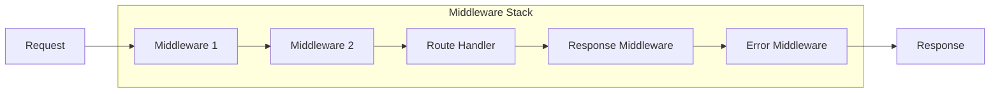

# Express.js Fundamentals and Advanced Patterns

## Introduction

Express.js is the most popular Node.js web framework, providing a robust set of features for web and mobile applications. Understanding Express.js architecture, middleware patterns, and best practices is crucial for senior backend engineers.

## Core Concepts

### Express Application Structure

```javascript
const express = require('express');
const app = express();

// Application-level middleware
app.use(express.json());
app.use(express.urlencoded({ extended: true }));

// Routes
app.get('/', (req, res) => {
  res.json({ message: 'Hello World' });
});

// Error handling middleware
app.use((err, req, res, next) => {
  console.error(err.stack);
  res.status(500).json({ error: 'Something went wrong!' });
});

const PORT = process.env.PORT || 3000;
app.listen(PORT, () => {
  console.log(`Server running on port ${PORT}`);
});
```

### Middleware Architecture

Express.js is built around middleware functions that execute during the request-response cycle:



## Advanced Middleware Patterns

### Custom Authentication Middleware

```javascript
const jwt = require('jsonwebtoken');
const User = require('../models/User');

// JWT Authentication Middleware
const authenticateToken = async (req, res, next) => {
  try {
    const authHeader = req.headers['authorization'];
    const token = authHeader && authHeader.split(' ')[1];

    if (!token) {
      return res.status(401).json({ error: 'Access token required' });
    }

    const decoded = jwt.verify(token, process.env.JWT_SECRET);
    const user = await User.findById(decoded.userId);

    if (!user) {
      return res.status(401).json({ error: 'Invalid token' });
    }

    req.user = user;
    next();
  } catch (error) {
    console.error('Authentication error:', error);
    res.status(403).json({ error: 'Invalid or expired token' });
  }
};

// Role-based Authorization Middleware
const requireRole = (roles) => {
  return (req, res, next) => {
    if (!req.user) {
      return res.status(401).json({ error: 'Authentication required' });
    }

    if (!roles.includes(req.user.role)) {
      return res.status(403).json({ error: 'Insufficient permissions' });
    }

    next();
  };
};

// Usage
app.get('/admin/users', 
  authenticateToken, 
  requireRole(['admin', 'moderator']), 
  getUsersController
);
```

### Request Validation Middleware

```javascript
const Joi = require('joi');

// Generic validation middleware factory
const validateRequest = (schema, property = 'body') => {
  return (req, res, next) => {
    const { error, value } = schema.validate(req[property], {
      abortEarly: false,
      stripUnknown: true
    });

    if (error) {
      const errors = error.details.map(detail => ({
        field: detail.path.join('.'),
        message: detail.message
      }));

      return res.status(400).json({
        error: 'Validation failed',
        details: errors
      });
    }

    req[property] = value;
    next();
  };
};

// Validation schemas
const userCreateSchema = Joi.object({
  name: Joi.string().min(2).max(50).required(),
  email: Joi.string().email().required(),
  password: Joi.string().min(8).pattern(/^(?=.*[a-z])(?=.*[A-Z])(?=.*\d)/).required(),
  role: Joi.string().valid('user', 'admin').default('user')
});

const userUpdateSchema = Joi.object({
  name: Joi.string().min(2).max(50),
  email: Joi.string().email(),
  role: Joi.string().valid('user', 'admin')
}).min(1);

// Usage
app.post('/users', validateRequest(userCreateSchema), createUserController);
app.put('/users/:id', validateRequest(userUpdateSchema), updateUserController);
```

### Rate Limiting Middleware

```javascript
const rateLimit = require('express-rate-limit');
const RedisStore = require('rate-limit-redis');
const Redis = require('ioredis');

const redis = new Redis(process.env.REDIS_URL);

// Different rate limits for different endpoints
const createRateLimiter = (windowMs, max, message) => {
  return rateLimit({
    store: new RedisStore({
      client: redis,
      prefix: 'rl:'
    }),
    windowMs,
    max,
    message: { error: message },
    standardHeaders: true,
    legacyHeaders: false,
    keyGenerator: (req) => {
      // Use user ID if authenticated, otherwise IP
      return req.user ? `user:${req.user.id}` : `ip:${req.ip}`;
    }
  });
};

// Apply different limits
app.use('/api/auth/login', createRateLimiter(15 * 60 * 1000, 5, 'Too many login attempts'));
app.use('/api/users', createRateLimiter(60 * 1000, 100, 'Too many requests'));
app.use('/api/upload', createRateLimiter(60 * 1000, 10, 'Too many upload requests'));
```

## Advanced Routing Patterns

### Modular Route Organization

```javascript
// routes/users.js
const express = require('express');
const router = express.Router();
const UserController = require('../controllers/UserController');
const { authenticateToken, requireRole } = require('../middleware/auth');
const { validateRequest } = require('../middleware/validation');
const { userCreateSchema, userUpdateSchema } = require('../schemas/user');

// Middleware that applies to all routes in this router
router.use(authenticateToken);

// CRUD operations
router.get('/', UserController.getUsers);
router.get('/:id', UserController.getUserById);
router.post('/', 
  requireRole(['admin']),
  validateRequest(userCreateSchema),
  UserController.createUser
);
router.put('/:id',
  requireRole(['admin']),
  validateRequest(userUpdateSchema),
  UserController.updateUser
);
router.delete('/:id',
  requireRole(['admin']),
  UserController.deleteUser
);

// Nested routes
router.get('/:id/posts', UserController.getUserPosts);
router.get('/:id/profile', UserController.getUserProfile);

module.exports = router;

// app.js
const userRoutes = require('./routes/users');
app.use('/api/users', userRoutes);
```

### Dynamic Route Parameters and Validation

```javascript
// Parameter validation middleware
const validateObjectId = (paramName) => {
  return (req, res, next) => {
    const id = req.params[paramName];
    if (!mongoose.Types.ObjectId.isValid(id)) {
      return res.status(400).json({ 
        error: `Invalid ${paramName} format` 
      });
    }
    next();
  };
};

// Resource existence middleware
const checkUserExists = async (req, res, next) => {
  try {
    const user = await User.findById(req.params.id);
    if (!user) {
      return res.status(404).json({ error: 'User not found' });
    }
    req.user = user;
    next();
  } catch (error) {
    next(error);
  }
};

// Complex nested routing
router.param('userId', validateObjectId('userId'));
router.param('postId', validateObjectId('postId'));

router.get('/users/:userId/posts/:postId/comments',
  checkUserExists,
  async (req, res, next) => {
    try {
      const comments = await Comment.find({
        post: req.params.postId,
        author: req.params.userId
      }).populate('author', 'name email');
      
      res.json(comments);
    } catch (error) {
      next(error);
    }
  }
);
```

## Error Handling Strategies

### Centralized Error Handling

```javascript
// Custom error classes
class AppError extends Error {
  constructor(message, statusCode, isOperational = true) {
    super(message);
    this.statusCode = statusCode;
    this.isOperational = isOperational;
    this.status = `${statusCode}`.startsWith('4') ? 'fail' : 'error';

    Error.captureStackTrace(this, this.constructor);
  }
}

class ValidationError extends AppError {
  constructor(message, details = []) {
    super(message, 400);
    this.details = details;
  }
}

// Async error wrapper
const asyncHandler = (fn) => {
  return (req, res, next) => {
    Promise.resolve(fn(req, res, next)).catch(next);
  };
};

// Global error handler
const globalErrorHandler = (err, req, res, next) => {
  let error = { ...err };
  error.message = err.message;

  // Log error
  console.error(err);

  // Mongoose bad ObjectId
  if (err.name === 'CastError') {
    const message = 'Resource not found';
    error = new AppError(message, 404);
  }

  // Mongoose duplicate key
  if (err.code === 11000) {
    const message = 'Duplicate field value entered';
    error = new AppError(message, 400);
  }

  // Mongoose validation error
  if (err.name === 'ValidationError') {
    const message = Object.values(err.errors).map(val => val.message);
    error = new ValidationError('Validation failed', message);
  }

  // JWT errors
  if (err.name === 'JsonWebTokenError') {
    const message = 'Invalid token';
    error = new AppError(message, 401);
  }

  if (err.name === 'TokenExpiredError') {
    const message = 'Token expired';
    error = new AppError(message, 401);
  }

  res.status(error.statusCode || 500).json({
    success: false,
    error: error.message || 'Server Error',
    ...(error.details && { details: error.details }),
    ...(process.env.NODE_ENV === 'development' && { stack: err.stack })
  });
};

// Usage
app.use(globalErrorHandler);
```

## Real-World Application Example

### E-commerce API Structure

```javascript
// models/Product.js
const mongoose = require('mongoose');

const productSchema = new mongoose.Schema({
  name: { type: String, required: true, trim: true },
  description: { type: String, required: true },
  price: { type: Number, required: true, min: 0 },
  category: { type: mongoose.Schema.Types.ObjectId, ref: 'Category', required: true },
  inventory: {
    quantity: { type: Number, required: true, min: 0 },
    reserved: { type: Number, default: 0 },
    available: { type: Number }
  },
  images: [{ type: String }],
  specifications: { type: Map, of: String },
  ratings: {
    average: { type: Number, default: 0 },
    count: { type: Number, default: 0 }
  },
  isActive: { type: Boolean, default: true }
}, {
  timestamps: true,
  toJSON: { virtuals: true },
  toObject: { virtuals: true }
});

// Virtual for available inventory
productSchema.virtual('inventory.available').get(function() {
  return this.inventory.quantity - this.inventory.reserved;
});

// Indexes for performance
productSchema.index({ category: 1, isActive: 1 });
productSchema.index({ 'ratings.average': -1 });
productSchema.index({ price: 1 });
productSchema.index({ name: 'text', description: 'text' });

module.exports = mongoose.model('Product', productSchema);

// controllers/ProductController.js
class ProductController {
  static async getProducts(req, res, next) {
    try {
      const {
        page = 1,
        limit = 20,
        category,
        minPrice,
        maxPrice,
        sortBy = 'createdAt',
        sortOrder = 'desc',
        search
      } = req.query;

      // Build query
      const query = { isActive: true };
      
      if (category) query.category = category;
      if (minPrice || maxPrice) {
        query.price = {};
        if (minPrice) query.price.$gte = parseFloat(minPrice);
        if (maxPrice) query.price.$lte = parseFloat(maxPrice);
      }
      if (search) {
        query.$text = { $search: search };
      }

      // Build sort
      const sort = {};
      sort[sortBy] = sortOrder === 'desc' ? -1 : 1;

      // Execute query with pagination
      const skip = (page - 1) * limit;
      const [products, total] = await Promise.all([
        Product.find(query)
          .populate('category', 'name')
          .sort(sort)
          .skip(skip)
          .limit(parseInt(limit)),
        Product.countDocuments(query)
      ]);

      res.json({
        success: true,
        data: products,
        pagination: {
          page: parseInt(page),
          limit: parseInt(limit),
          total,
          pages: Math.ceil(total / limit)
        }
      });
    } catch (error) {
      next(error);
    }
  }

  static async createProduct(req, res, next) {
    try {
      const product = new Product(req.body);
      await product.save();
      await product.populate('category', 'name');

      res.status(201).json({
        success: true,
        data: product
      });
    } catch (error) {
      next(error);
    }
  }

  static async updateInventory(req, res, next) {
    try {
      const { id } = req.params;
      const { quantity, operation } = req.body; // 'add', 'subtract', 'set'

      const product = await Product.findById(id);
      if (!product) {
        throw new AppError('Product not found', 404);
      }

      switch (operation) {
        case 'add':
          product.inventory.quantity += quantity;
          break;
        case 'subtract':
          if (product.inventory.quantity < quantity) {
            throw new AppError('Insufficient inventory', 400);
          }
          product.inventory.quantity -= quantity;
          break;
        case 'set':
          product.inventory.quantity = quantity;
          break;
        default:
          throw new AppError('Invalid operation', 400);
      }

      await product.save();

      res.json({
        success: true,
        data: product
      });
    } catch (error) {
      next(error);
    }
  }
}

module.exports = ProductController;
```

## Performance Optimization

### Caching Strategies

```javascript
const Redis = require('ioredis');
const redis = new Redis(process.env.REDIS_URL);

// Cache middleware factory
const cacheMiddleware = (keyGenerator, ttl = 300) => {
  return async (req, res, next) => {
    try {
      const key = typeof keyGenerator === 'function' 
        ? keyGenerator(req) 
        : keyGenerator;

      const cached = await redis.get(key);
      if (cached) {
        return res.json(JSON.parse(cached));
      }

      // Store original json method
      const originalJson = res.json;
      
      // Override json method to cache response
      res.json = function(data) {
        // Cache successful responses only
        if (res.statusCode >= 200 && res.statusCode < 300) {
          redis.setex(key, ttl, JSON.stringify(data));
        }
        return originalJson.call(this, data);
      };

      next();
    } catch (error) {
      next();
    }
  };
};

// Usage
app.get('/api/products',
  cacheMiddleware(req => `products:${JSON.stringify(req.query)}`, 600),
  ProductController.getProducts
);

// Cache invalidation
const invalidateCache = (pattern) => {
  return async (req, res, next) => {
    try {
      const keys = await redis.keys(pattern);
      if (keys.length > 0) {
        await redis.del(...keys);
      }
      next();
    } catch (error) {
      next();
    }
  };
};

app.post('/api/products',
  ProductController.createProduct,
  invalidateCache('products:*')
);
```

## Interview Questions & Answers

### Question 1: Explain Express.js middleware and the request-response cycle
**Difficulty**: Mid-Senior  
**Category**: Core Concepts

**Answer**: Express.js middleware are functions that execute during the request-response cycle. They have access to the request object (req), response object (res), and the next middleware function (next).

**Code Example**:
```javascript
// Middleware function signature
const middleware = (req, res, next) => {
  // Perform operations
  console.log('Request received:', req.method, req.path);
  
  // Modify request/response objects
  req.timestamp = Date.now();
  
  // Call next middleware or end the cycle
  next(); // Continue to next middleware
  // OR
  // res.json({ message: 'Response sent' }); // End the cycle
};

// Types of middleware
app.use(middleware); // Application-level
router.use(middleware); // Router-level
app.use('/api', middleware); // Path-specific
app.use((err, req, res, next) => {}); // Error-handling
```

**Follow-up Questions**:
- What happens if you don't call `next()`?
- How do you handle errors in middleware?
- What's the difference between `app.use()` and `app.get()`?

### Question 2: How would you implement authentication and authorization in Express?
**Difficulty**: Senior  
**Category**: Security

**Answer**: Implement JWT-based authentication with role-based authorization:

**Code Example**:
```javascript
// Authentication middleware
const authenticateToken = async (req, res, next) => {
  try {
    const token = req.headers.authorization?.split(' ')[1];
    if (!token) throw new Error('No token provided');

    const decoded = jwt.verify(token, process.env.JWT_SECRET);
    const user = await User.findById(decoded.userId);
    if (!user) throw new Error('User not found');

    req.user = user;
    next();
  } catch (error) {
    res.status(401).json({ error: 'Authentication failed' });
  }
};

// Authorization middleware
const authorize = (permissions) => {
  return (req, res, next) => {
    if (!req.user.permissions.some(p => permissions.includes(p))) {
      return res.status(403).json({ error: 'Insufficient permissions' });
    }
    next();
  };
};

// Usage
app.get('/admin/users', 
  authenticateToken, 
  authorize(['user:read', 'admin']), 
  getUsersController
);
```

### Question 3: How do you handle file uploads in Express?
**Difficulty**: Mid-Senior  
**Category**: File Handling

**Answer**: Use multer for multipart/form-data handling with proper validation and storage:

**Code Example**:
```javascript
const multer = require('multer');
const path = require('path');

// Configure storage
const storage = multer.diskStorage({
  destination: (req, file, cb) => {
    cb(null, 'uploads/');
  },
  filename: (req, file, cb) => {
    const uniqueSuffix = Date.now() + '-' + Math.round(Math.random() * 1E9);
    cb(null, file.fieldname + '-' + uniqueSuffix + path.extname(file.originalname));
  }
});

// File filter
const fileFilter = (req, file, cb) => {
  const allowedTypes = ['image/jpeg', 'image/png', 'image/gif'];
  if (allowedTypes.includes(file.mimetype)) {
    cb(null, true);
  } else {
    cb(new Error('Invalid file type'), false);
  }
};

const upload = multer({
  storage,
  fileFilter,
  limits: {
    fileSize: 5 * 1024 * 1024, // 5MB
    files: 5
  }
});

// Route handler
app.post('/upload', upload.array('images', 5), (req, res, next) => {
  try {
    const files = req.files.map(file => ({
      filename: file.filename,
      originalName: file.originalname,
      size: file.size,
      path: file.path
    }));

    res.json({ success: true, files });
  } catch (error) {
    next(error);
  }
});
```

### Question 4: How do you implement proper error handling in Express?
**Difficulty**: Senior  
**Category**: Error Handling

**Answer**: Implement centralized error handling with custom error classes:

**Code Example**:
```javascript
// Custom error class
class AppError extends Error {
  constructor(message, statusCode) {
    super(message);
    this.statusCode = statusCode;
    this.isOperational = true;
    Error.captureStackTrace(this, this.constructor);
  }
}

// Async wrapper
const asyncHandler = (fn) => (req, res, next) => {
  Promise.resolve(fn(req, res, next)).catch(next);
};

// Global error handler
const errorHandler = (err, req, res, next) => {
  let error = { ...err };
  error.message = err.message;

  // Log error
  console.error(err);

  // Mongoose validation error
  if (err.name === 'ValidationError') {
    const message = Object.values(err.errors).map(val => val.message);
    error = new AppError(message, 400);
  }

  // Mongoose duplicate key
  if (err.code === 11000) {
    const message = 'Duplicate field value entered';
    error = new AppError(message, 400);
  }

  res.status(error.statusCode || 500).json({
    success: false,
    error: error.message || 'Server Error'
  });
};

// Usage
app.get('/users/:id', asyncHandler(async (req, res, next) => {
  const user = await User.findById(req.params.id);
  if (!user) {
    throw new AppError('User not found', 404);
  }
  res.json(user);
}));

app.use(errorHandler);
```

### Question 5: How would you implement API versioning in Express?
**Difficulty**: Senior  
**Category**: API Design

**Answer**: Multiple approaches for API versioning:

**Code Example**:
```javascript
// 1. URL Path versioning
app.use('/api/v1', v1Routes);
app.use('/api/v2', v2Routes);

// 2. Header versioning
const versionMiddleware = (req, res, next) => {
  const version = req.headers['api-version'] || 'v1';
  req.apiVersion = version;
  next();
};

const routeByVersion = (versions) => {
  return (req, res, next) => {
    const handler = versions[req.apiVersion] || versions.default;
    if (!handler) {
      return res.status(400).json({ error: 'Unsupported API version' });
    }
    handler(req, res, next);
  };
};

app.get('/api/users', versionMiddleware, routeByVersion({
  v1: getUsersV1,
  v2: getUsersV2,
  default: getUsersV1
}));

// 3. Accept header versioning
app.get('/api/users', (req, res, next) => {
  const acceptHeader = req.headers.accept;
  if (acceptHeader.includes('application/vnd.api.v2+json')) {
    return getUsersV2(req, res, next);
  }
  return getUsersV1(req, res, next);
});
```

## Key Takeaways

1. **Middleware Architecture**: Express.js is built around middleware functions that process requests sequentially
2. **Error Handling**: Implement centralized error handling with custom error classes and async wrappers
3. **Security**: Always implement proper authentication, authorization, and input validation
4. **Performance**: Use caching, compression, and proper database queries for optimization
5. **Structure**: Organize routes modularly and separate concerns (controllers, middleware, models)
6. **Validation**: Validate all inputs using schemas and middleware
7. **Monitoring**: Implement proper logging and error tracking for production applications

## Next Steps

- Learn about [Database Integration](./database-integration.md)
- Explore [Testing Express Applications](./testing-express.md)
- Study [Microservices with Express](./microservices-patterns.md)