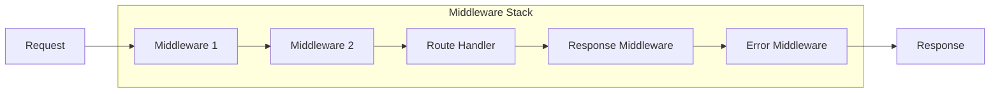

# Express.js Fundamentals and Advanced Patterns

## Introduction

Express.js is the most popular Node.js web framework, providing a robust set of features for web and mobile applications. Understanding Express.js architecture, middleware patterns, and best practices is crucial for senior backend engineers.

## Core Concepts

### Express Application Structure

```javascript
const express = require('express');
const app = express();

// Application-level middleware
app.use(express.json());
app.use(express.urlencoded({ extended: true }));

// Routes
app.get('/', (req, res) => {
  res.json({ message: 'Hello World' });
});

// Error handling middleware
app.use((err, req, res, next) => {
  console.error(err.stack);
  res.status(500).json({ error: 'Something went wrong!' });
});

const PORT = process.env.PORT || 3000;
app.listen(PORT, () => {
  console.log(`Server running on port ${PORT}`);
});
```

### Middleware Architecture

Express.js is built around middleware functions that execute during the request-response cycle:



## Advanced Middleware Patterns

### Custom Authentication Middleware

```javascript
const jwt = require('jsonwebtoken');
const User = require('../models/User');

// JWT Authentication Middleware
const authenticateToken = async (req, res, next) => {
  try {
    const authHeader = req.headers['authorization'];
    const token = authHeader && authHeader.split(' ')[1];

    if (!token) {
      return res.status(401).json({ error: 'Access token required' });
    }

    const decoded = jwt.verify(token, process.env.JWT_SECRET);
    const user = await User.findById(decoded.userId);

    if (!user) {
      return res.status(401).json({ error: 'Invalid token' });
    }

    req.user = user;
    next();
  } catch (error) {
    console.error('Authentication error:', error);
    res.status(403).json({ error: 'Invalid or expired token' });
  }
};

// Role-based Authorization Middleware
const requireRole = (roles) => {
  return (req, res, next) => {
    if (!req.user) {
      return res.status(401).json({ error: 'Authentication required' });
    }

    if (!roles.includes(req.user.role)) {
      return res.status(403).json({ error: 'Insufficient permissions' });
    }

    next();
  };
};

// Usage
app.get('/admin/users', 
  authenticateToken, 
  requireRole(['admin', 'moderator']), 
  getUsersController
);
```

### Request Validation Middleware

```javascript
const Joi = require('joi');

// Generic validation middleware factory
const validateRequest = (schema, property = 'body') => {
  return (req, res, next) => {
    const { error, value } = schema.validate(req[property], {
      abortEarly: false,
      stripUnknown: true
    });

    if (error) {
      const errors = error.details.map(detail => ({
        field: detail.path.join('.'),
        message: detail.message
      }));

      return res.status(400).json({
        error: 'Validation failed',
        details: errors
      });
    }

    req[property] = value;
    next();
  };
};

// Validation schemas
const userCreateSchema = Joi.object({
  name: Joi.string().min(2).max(50).required(),
  email: Joi.string().email().required(),
  password: Joi.string().min(8).pattern(/^(?=.*[a-z])(?=.*[A-Z])(?=.*\d)/).required(),
  role: Joi.string().valid('user', 'admin').default('user')
});

const userUpdateSchema = Joi.object({
  name: Joi.string().min(2).max(50),
  email: Joi.string().email(),
  role: Joi.string().valid('user', 'admin')
}).min(1);

// Usage
app.post('/users', validateRequest(userCreateSchema), createUserController);
app.put('/users/:id', validateRequest(userUpdateSchema), updateUserController);
```

### Rate Limiting Middleware

```javascript
const rateLimit = require('express-rate-limit');
const RedisStore = require('rate-limit-redis');
const Redis = require('ioredis');

const redis = new Redis(process.env.REDIS_URL);

// Different rate limits for different endpoints
const createRateLimiter = (windowMs, max, message) => {
  return rateLimit({
    store: new RedisStore({
      client: redis,
      prefix: 'rl:'
    }),
    windowMs,
    max,
    message: { error: message },
    standardHeaders: true,
    legacyHeaders: false,
    keyGenerator: (req) => {
      // Use user ID if authenticated, otherwise IP
      return req.user ? `user:${req.user.id}` : `ip:${req.ip}`;
    }
  });
};

// Apply different limits
app.use('/api/auth/login', createRateLimiter(15 * 60 * 1000, 5, 'Too many login attempts'));
app.use('/api/users', createRateLimiter(60 * 1000, 100, 'Too many requests'));
app.use('/api/upload', createRateLimiter(60 * 1000, 10, 'Too many upload requests'));
```

## Advanced Routing Patterns

### Modular Route Organization

```javascript
// routes/users.js
const express = require('express');
const router = express.Router();
const UserController = require('../controllers/UserController');
const { authenticateToken, requireRole } = require('../middleware/auth');
const { validateRequest } = require('../middleware/validation');
const { userCreateSchema, userUpdateSchema } = require('../schemas/user');

// Middleware that applies to all routes in this router
router.use(authenticateToken);

// CRUD operations
router.get('/', UserController.getUsers);
router.get('/:id', UserController.getUserById);
router.post('/', 
  requireRole(['admin']),
  validateRequest(userCreateSchema),
  UserController.createUser
);
router.put('/:id',
  requireRole(['admin']),
  validateRequest(userUpdateSchema),
  UserController.updateUser
);
router.delete('/:id',
  requireRole(['admin']),
  UserController.deleteUser
);

// Nested routes
router.get('/:id/posts', UserController.getUserPosts);
router.get('/:id/profile', UserController.getUserProfile);

module.exports = router;

// app.js
const userRoutes = require('./routes/users');
app.use('/api/users', userRoutes);
```

### Dynamic Route Parameters and Validation

```javascript
// Parameter validation middleware
const validateObjectId = (paramName) => {
  return (req, res, next) => {
    const id = req.params[paramName];
    if (!mongoose.Types.ObjectId.isValid(id)) {
      return res.status(400).json({ 
        error: `Invalid ${paramName} format` 
      });
    }
    next();
  };
};

// Resource existence middleware
const checkUserExists = async (req, res, next) => {
  try {
    const user = await User.findById(req.params.id);
    if (!user) {
      return res.status(404).json({ error: 'User not found' });
    }
    req.user = user;
    next();
  } catch (error) {
    next(error);
  }
};

// Complex nested routing
router.param('userId', validateObjectId('userId'));
router.param('postId', validateObjectId('postId'));

router.get('/users/:userId/posts/:postId/comments',
  checkUserExists,
  async (req, res, next) => {
    try {
      const comments = await Comment.find({
        post: req.params.postId,
        author: req.params.userId
      }).populate('author', 'name email');
      
      res.json(comments);
    } catch (error) {
      next(error);
    }
  }
);
```

## Error Handling Strategies

### Centralized Error Handling

```javascript
// Custom error classes
class AppError extends Error {
  constructor(message, statusCode, isOperational = true) {
    super(message);
    this.statusCode = statusCode;
    this.isOperational = isOperational;
    this.status = `${statusCode}`.startsWith('4') ? 'fail' : 'error';

    Error.captureStackTrace(this, this.constructor);
  }
}

class ValidationError extends AppError {
  constructor(message, details = []) {
    super(message, 400);
    this.details = details;
  }
}

// Async error wrapper
const asyncHandler = (fn) => {
  return (req, res, next) => {
    Promise.resolve(fn(req, res, next)).catch(next);
  };
};

// Global error handler
const globalErrorHandler = (err, req, res, next) => {
  let error = { ...err };
  error.message = err.message;

  // Log error
  console.error(err);

  // Mongoose bad ObjectId
  if (err.name === 'CastError') {
    const message = 'Resource not found';
    error = new AppError(message, 404);
  }

  // Mongoose duplicate key
  if (err.code === 11000) {
    const message = 'Duplicate field value entered';
    error = new AppError(message, 400);
  }

  // Mongoose validation error
  if (err.name === 'ValidationError') {
    const message = Object.values(err.errors).map(val => val.message);
    error = new ValidationError('Validation failed', message);
  }

  // JWT errors
  if (err.name === 'JsonWebTokenError') {
    const message = 'Invalid token';
    error = new AppError(message, 401);
  }

  if (err.name === 'TokenExpiredError') {
    const message = 'Token expired';
    error = new AppError(message, 401);
  }

  res.status(error.statusCode || 500).json({
    success: false,
    error: error.message || 'Server Error',
    ...(error.details && { details: error.details }),
    ...(process.env.NODE_ENV === 'development' && { stack: err.stack })
  });
};

// Usage
app.use(globalErrorHandler);
```

## Real-World Application Example

### E-commerce API Structure

```javascript
// models/Product.js
const mongoose = require('mongoose');

const productSchema = new mongoose.Schema({
  name: { type: String, required: true, trim: true },
  description: { type: String, required: true },
  price: { type: Number, required: true, min: 0 },
  category: { type: mongoose.Schema.Types.ObjectId, ref: 'Category', required: true },
  inventory: {
    quantity: { type: Number, required: true, min: 0 },
    reserved: { type: Number, default: 0 },
    available: { type: Number }
  },
  images: [{ type: String }],
  specifications: { type: Map, of: String },
  ratings: {
    average: { type: Number, default: 0 },
    count: { type: Number, default: 0 }
  },
  isActive: { type: Boolean, default: true }
}, {
  timestamps: true,
  toJSON: { virtuals: true },
  toObject: { virtuals: true }
});

// Virtual for available inventory
productSchema.virtual('inventory.available').get(function() {
  return this.inventory.quantity - this.inventory.reserved;
});

// Indexes for performance
productSchema.index({ category: 1, isActive: 1 });
productSchema.index({ 'ratings.average': -1 });
productSchema.index({ price: 1 });
productSchema.index({ name: 'text', description: 'text' });

module.exports = mongoose.model('Product', productSchema);

// controllers/ProductController.js
class ProductController {
  static async getProducts(req, res, next) {
    try {
      const {
        page = 1,
        limit = 20,
        category,
        minPrice,
        maxPrice,
        sortBy = 'createdAt',
        sortOrder = 'desc',
        search
      } = req.query;

      // Build query
      const query = { isActive: true };
      
      if (category) query.category = category;
      if (minPrice || maxPrice) {
        query.price = {};
        if (minPrice) query.price.$gte = parseFloat(minPrice);
        if (maxPrice) query.price.$lte = parseFloat(maxPrice);
      }
      if (search) {
        query.$text = { $search: search };
      }

      // Build sort
      const sort = {};
      sort[sortBy] = sortOrder === 'desc' ? -1 : 1;

      // Execute query with pagination
      const skip = (page - 1) * limit;
      const [products, total] = await Promise.all([
        Product.find(query)
          .populate('category', 'name')
          .sort(sort)
          .skip(skip)
          .limit(parseInt(limit)),
        Product.countDocuments(query)
      ]);

      res.json({
        success: true,
        data: products,
        pagination: {
          page: parseInt(page),
          limit: parseInt(limit),
          total,
          pages: Math.ceil(total / limit)
        }
      });
    } catch (error) {
      next(error);
    }
  }

  static async createProduct(req, res, next) {
    try {
      const product = new Product(req.body);
      await product.save();
      await product.populate('category', 'name');

      res.status(201).json({
        success: true,
        data: product
      });
    } catch (error) {
      next(error);
    }
  }

  static async updateInventory(req, res, next) {
    try {
      const { id } = req.params;
      const { quantity, operation } = req.body; // 'add', 'subtract', 'set'

      const product = await Product.findById(id);
      if (!product) {
        throw new AppError('Product not found', 404);
      }

      switch (operation) {
        case 'add':
          product.inventory.quantity += quantity;
          break;
        case 'subtract':
          if (product.inventory.quantity < quantity) {
            throw new AppError('Insufficient inventory', 400);
          }
          product.inventory.quantity -= quantity;
          break;
        case 'set':
          product.inventory.quantity = quantity;
          break;
        default:
          throw new AppError('Invalid operation', 400);
      }

      await product.save();

      res.json({
        success: true,
        data: product
      });
    } catch (error) {
      next(error);
    }
  }
}

module.exports = ProductController;
```

## Performance Optimization

### Caching Strategies

```javascript
const Redis = require('ioredis');
const redis = new Redis(process.env.REDIS_URL);

// Cache middleware factory
const cacheMiddleware = (keyGenerator, ttl = 300) => {
  return async (req, res, next) => {
    try {
      const key = typeof keyGenerator === 'function' 
        ? keyGenerator(req) 
        : keyGenerator;

      const cached = await redis.get(key);
      if (cached) {
        return res.json(JSON.parse(cached));
      }

      // Store original json method
      const originalJson = res.json;
      
      // Override json method to cache response
      res.json = function(data) {
        // Cache successful responses only
        if (res.statusCode >= 200 && res.statusCode < 300) {
          redis.setex(key, ttl, JSON.stringify(data));
        }
        return originalJson.call(this, data);
      };

      next();
    } catch (error) {
      next();
    }
  };
};

// Usage
app.get('/api/products',
  cacheMiddleware(req => `products:${JSON.stringify(req.query)}`, 600),
  ProductController.getProducts
);

// Cache invalidation
const invalidateCache = (pattern) => {
  return async (req, res, next) => {
    try {
      const keys = await redis.keys(pattern);
      if (keys.length > 0) {
        await redis.del(...keys);
      }
      next();
    } catch (error) {
      next();
    }
  };
};

app.post('/api/products',
  ProductController.createProduct,
  invalidateCache('products:*')
);
```

## Interview Questions & Answers

### Question 1: Explain Express.js middleware and the request-response cycle
**Difficulty**: Mid-Senior  
**Category**: Core Concepts

**Answer**: Express.js middleware are functions that execute during the request-response cycle. They have access to the request object (req), response object (res), and the next middleware function (next).

**Code Example**:
```javascript
// Middleware function signature
const middleware = (req, res, next) => {
  // Perform operations
  console.log('Request received:', req.method, req.path);
  
  // Modify request/response objects
  req.timestamp = Date.now();
  
  // Call next middleware or end the cycle
  next(); // Continue to next middleware
  // OR
  // res.json({ message: 'Response sent' }); // End the cycle
};

// Types of middleware
app.use(middleware); // Application-level
router.use(middleware); // Router-level
app.use('/api', middleware); // Path-specific
app.use((err, req, res, next) => {}); // Error-handling
```

**Follow-up Questions**:
- What happens if you don't call `next()`?
- How do you handle errors in middleware?
- What's the difference between `app.use()` and `app.get()`?

### Question 2: How would you implement authentication and authorization in Express?
**Difficulty**: Senior  
**Category**: Security

**Answer**: Implement JWT-based authentication with role-based authorization:

**Code Example**:
```javascript
// Authentication middleware
const authenticateToken = async (req, res, next) => {
  try {
    const token = req.headers.authorization?.split(' ')[1];
    if (!token) throw new Error('No token provided');

    const decoded = jwt.verify(token, process.env.JWT_SECRET);
    const user = await User.findById(decoded.userId);
    if (!user) throw new Error('User not found');

    req.user = user;
    next();
  } catch (error) {
    res.status(401).json({ error: 'Authentication failed' });
  }
};

// Authorization middleware
const authorize = (permissions) => {
  return (req, res, next) => {
    if (!req.user.permissions.some(p => permissions.includes(p))) {
      return res.status(403).json({ error: 'Insufficient permissions' });
    }
    next();
  };
};

// Usage
app.get('/admin/users', 
  authenticateToken, 
  authorize(['user:read', 'admin']), 
  getUsersController
);
```

### Question 3: How do you handle file uploads in Express?
**Difficulty**: Mid-Senior  
**Category**: File Handling

**Answer**: Use multer for multipart/form-data handling with proper validation and storage:

**Code Example**:
```javascript
const multer = require('multer');
const path = require('path');

// Configure storage
const storage = multer.diskStorage({
  destination: (req, file, cb) => {
    cb(null, 'uploads/');
  },
  filename: (req, file, cb) => {
    const uniqueSuffix = Date.now() + '-' + Math.round(Math.random() * 1E9);
    cb(null, file.fieldname + '-' + uniqueSuffix + path.extname(file.originalname));
  }
});

// File filter
const fileFilter = (req, file, cb) => {
  const allowedTypes = ['image/jpeg', 'image/png', 'image/gif'];
  if (allowedTypes.includes(file.mimetype)) {
    cb(null, true);
  } else {
    cb(new Error('Invalid file type'), false);
  }
};

const upload = multer({
  storage,
  fileFilter,
  limits: {
    fileSize: 5 * 1024 * 1024, // 5MB
    files: 5
  }
});

// Route handler
app.post('/upload', upload.array('images', 5), (req, res, next) => {
  try {
    const files = req.files.map(file => ({
      filename: file.filename,
      originalName: file.originalname,
      size: file.size,
      path: file.path
    }));

    res.json({ success: true, files });
  } catch (error) {
    next(error);
  }
});
```

### Question 4: How do you implement proper error handling in Express?
**Difficulty**: Senior  
**Category**: Error Handling

**Answer**: Implement centralized error handling with custom error classes:

**Code Example**:
```javascript
// Custom error class
class AppError extends Error {
  constructor(message, statusCode) {
    super(message);
    this.statusCode = statusCode;
    this.isOperational = true;
    Error.captureStackTrace(this, this.constructor);
  }
}

// Async wrapper
const asyncHandler = (fn) => (req, res, next) => {
  Promise.resolve(fn(req, res, next)).catch(next);
};

// Global error handler
const errorHandler = (err, req, res, next) => {
  let error = { ...err };
  error.message = err.message;

  // Log error
  console.error(err);

  // Mongoose validation error
  if (err.name === 'ValidationError') {
    const message = Object.values(err.errors).map(val => val.message);
    error = new AppError(message, 400);
  }

  // Mongoose duplicate key
  if (err.code === 11000) {
    const message = 'Duplicate field value entered';
    error = new AppError(message, 400);
  }

  res.status(error.statusCode || 500).json({
    success: false,
    error: error.message || 'Server Error'
  });
};

// Usage
app.get('/users/:id', asyncHandler(async (req, res, next) => {
  const user = await User.findById(req.params.id);
  if (!user) {
    throw new AppError('User not found', 404);
  }
  res.json(user);
}));

app.use(errorHandler);
```

### Question 5: How would you implement API versioning in Express?
**Difficulty**: Senior  
**Category**: API Design

**Answer**: Multiple approaches for API versioning:

**Code Example**:
```javascript
// 1. URL Path versioning
app.use('/api/v1', v1Routes);
app.use('/api/v2', v2Routes);

// 2. Header versioning
const versionMiddleware = (req, res, next) => {
  const version = req.headers['api-version'] || 'v1';
  req.apiVersion = version;
  next();
};

const routeByVersion = (versions) => {
  return (req, res, next) => {
    const handler = versions[req.apiVersion] || versions.default;
    if (!handler) {
      return res.status(400).json({ error: 'Unsupported API version' });
    }
    handler(req, res, next);
  };
};

app.get('/api/users', versionMiddleware, routeByVersion({
  v1: getUsersV1,
  v2: getUsersV2,
  default: getUsersV1
}));

// 3. Accept header versioning
app.get('/api/users', (req, res, next) => {
  const acceptHeader = req.headers.accept;
  if (acceptHeader.includes('application/vnd.api.v2+json')) {
    return getUsersV2(req, res, next);
  }
  return getUsersV1(req, res, next);
});
```

### Question 6: 
r  
**Category**: Performance & Security  
**Companies**: Google, Amazon, Meta | **Frequency**: Common

**Quick Answer**: Use express-rate-limit with Redis store for distributed applications, im

**Detailed Answer**: Rate limiting prevents abuse and ensures fair age:


```javascript
;
const RedisStore = require('rate-limit-redis');
const Redis = require('ioredis');
is = new Redis(process.env.REDIS_URL);ible rate limiter factoryonterns.md)services-pat/micro](.h Expressvices witcroserudy [Mis.md)
- Ststing-expresations](./tess Applicxpreng Ere [Testi Explon.md)
-tegratiose-in](./databaonIntegratiDatabase n about [eareps

- Lt St
## Nexcations
tion applior productracking ferror  and gingproper lognt **: Implemetoring **Monileware
7.mas and middhets using sce all inpuValidatdation**: ali)
6. **Vodelseware, mdlrs, mid (controllernsconcerate and sepamodularly ze routes : Organicture**
5. **Strumization optiries forbase queer datand propssion, ampreco,  cachingce**: Useman
4. **Perfordation vali, and inputrizationon, authonticatiproper authement Always impleSecurity**:  **appers
3.nd async wrsses arror cla ewith customr handling zed erro centraliImplementg**: or Handlin2. **Errlly
quentiauests se process reqs thatnctione fuwar middlelt around bui.js isExpress*: hitecture*eware Arcddl **Mis

1.akeaway T## Keyernetes?

 Kubs inrobeess pnd readiness atween livenerence be the diff?
- What'senciesrvice depend external sekers forcuit breant cirimplemeou 
- How do ys**:estionlow-up Qu
**Fol```

});
RT}`);{PO port $ing oner runnlog(`Servle.nso  co() => {
PORT, n(app.listeer = 

serv
});ction');jendledRe'unhaulShutdown(cef grason);
 n:', reae, 'reasoat:', promisction Rejeled 'Unhandle.error(
  conso) => {miseason, proion', (rendledRejects.on('unha);

proces);
}tion'cepaughtExhutdown('uncfulS  grace', error);
t Exception:'Uncaugh.error(le
  conso {or) =>n', (erreptioxctEncaugh'un(process.otions
t excepuncaugh
// Handle INT'));
tdown('SIGulShu> gracef) =GINT', (cess.on('SIproGTERM'));
n('SIowracefulShutd, () => gSIGTERM'cess.on('proandlers
 shutdown hgister);

// Reext();
} n
 }eturn;
  );
    r    }: 30
ertryAft,
      reting down'er is shutServr: '   erron({
   03).jso(5  res.statusgDown) {
   (isShuttin
  ifxt) => { ne, res,app.use((reqn
hutdow srings duuest reject reqddleware to
};

// Mid timeout// 30 secon, 30000); xit(1);
  } process.e   out');
 timen due toutdowr('Forced shrrosole.e{
    con) => ut((tTimeoeout
  seimwn after te shutdo // Forc  
 ;

  })  }  it(1);
ss.ex procer);
     roerutdown:', eful shuring gracError dr('sole.erro      conerror) {
 } catch (t(0);
   process.exid');
      pletetdown comful shuaceg('Grlonsole.
      co();
      sourcesrReoseOtheait cl
      awcessourose other re     // Cl  
   ed');
  closion s connect.log('Redi  consoleit();
    t redis.qu  awai    ion
connects edi  // Close R      
    closed');
on nnectie coog('Databasle.lso   conose();
   .clnnection mongoose.co     awaitons
 nectise con databa// Close   y {
     tr;
    
   closed')HTTP serverg('onsole.lo  c
    
  
    }.exit(1);ocess      pr);
:', erroseerver cl during sror('Errorconsole.er      ) {
f (err{
    inc (err) => asyerver.close(
  sstsequeg new reptintop acc
  
  // S = true;huttingDown);
  isS.`utdown..l shting gracefugnal}. Starsid ${veceile.log(`Re> {
  conso (signal) =tdown =racefulShu
const gfalse;
Down = sShuttinglet ierver;
ing
let sdlutdown hanGraceful sh
// 
});
});)
  uptime(ss.me: proce  upting(),
  ).toISOStriw Date(estamp: nee',
    timivtus: 'al{
    stan(sous(200).js.stat{
  rees) => (req, r/live', pp.get('es)
aerneteck (for Kubiveness ch

// L
  }
});
    });tring().toISOSte()new Daestamp: 
      timsage,or.meserror: err    y',
  ot read 'n     status:
 son({03).j.status(5
    res{ror) tch (er
  } ca()
    });SOString Date().toInewmp: mesta',
      tiready status: '  {
   n(00).jsoes.status(2
    
    rs.ping();  await redi
  in().ping();db.admnection.one.cmongooswait nly
    aencies opend deck critical  // Che
  {
  try {) => c (req, res', asynready'/)
app.get(esetrn(for Kubek ss checineead

// R  }
});)
    });
ring(oISOSt().t Date: newimestamp   t
   ssage,.meerror: error     thy',
 altatus: 'unhe{
      sson(us(503).jes.stat   rerror) {
   } catch (onse);
respjson(usCode).atus(statst 
    res.
   00 : 503;aded' ? 2=== 'degrlStatus overal                      00 : 
althy' ? 2atus === 'heverallStatusCode = ost st con}
    
      };
    
   e()s.cpuUsagcesu: pro      cpUsage(),
  .memoryy: process  memorpid,
      ocess.     pid: pr,
   ersionprocess.vn: odeVersio
        ns.platform,m: procesatfor
        plstem = {.syesponse    r
  ecks;s = chheckse.cespon) {
      retailed
    if (d };
       nt'
opmevel 'deNODE_ENV ||ocess.env.ent: prnvironm,
      e| '1.0.0'e_version |ckagpas.env.npm_sion: proces
      verartTime,ste.now() -  Datime:sponseT,
      reme()ptiss.ue: proceim      upt(),
ng).toISOStrinew Date(imestamp:     t
  tatus, overallStatus: s     sponse = {
renst co
    
    omises);Pre.all(checkt Promis awai   
   });
      }
    althy';
 us = 'unheallStatover
        age };ror.mess error: eralthy',s: 'unhe = { statuhecks[name]
        c (error) {     } catch }
      ';
  adeddegrStatus = '   overall       {
healthy') = 's ==rallStatu && oveegraded''datus === sult.streif (e    } elsthy';
      = 'unhealatusverallSt     o) {
     'unhealthy'tatus === f (result.s        i  

      sult;name] = reks[chec                
      ]);
           )
0)
 00out')), 10timeth check  Error('Heal reject(newut(() =>   setTimeo        ) => 
 eject(_, rse( new Promi        
 (),Fn check
         ce([e.raromisawait P= t resul   const y {
      tr     {
kFn]) => ([name, checasync .map(Checks)healthries(Object.entses = heckPromit c
    consllelra in pa checksall healthn Ru  
    // thy';
  s = 'healerallStatuov
    let  = {};eckscht {
    cons
  try ;
  w()te.noartTime = Da  const strue';
led === 'ttai.dequeryeq.led = ronst detai
  cres) => {q,  (renc asyhealth',pp.get('/
aendpointck health cherehensive 
// Comp
};
  }
    }
mUsage };: mememoryUsagealthy', s: 'hetun { sta   returlse {
      } e};
 ge  memUsasage:memoryUgraded', tus: 'de{ sta    return 0) {
   8e >Percentagif (used else 
    }sage };Usage: memUthy', memorys: 'unhealstatun {       retur0) {
tage > 9usedPercen 
    if (   ) * 100;
alMemtotage.rss / mUsge = (mePercentaconst usedem();
    ).totalmos'e('m = requiralMe  const totUsage();
  ocess.memory = prage memUsconst
     => { memory: ()
  },

 
    }.message };r: errornown', errostatus: 'unkturn { re
      or) {} catch (err    
      }
age };rcentusedPehealthy',  { status: 'urnret{
            } else  };
  dPercentagesedegraded', u: 'tus sta  return {
      80) {age > edPercente if (usels
      } tage };edPercenthy', usnhealatus: 'uturn { st        re) {
 90tage >dPercen   if (use     
   00;
  1lSpace) *taace) / toace - freeSptotalSpntage = ((st usedPerce
      con;ts.frsizetaks * sstats.bloc = cet totalSpaconsize;
      .frsail * stats stats.bavfreeSpace =t       cons
fs('.');es.statvpromist fs.ats = awai st   const {
       try {
() =>: async Space

  disk}
  },
    r.message };r: errothy', errounheal { status: 'urn      ret(error) {
 } catch   
      }
    };   status 
  nse.: respodesCotu  sta  
      ed', tus: 'degradta        s
  {    return      else {
;
      } 
        } - start te.now()seTime: Da      respon 
    : 'healthy',    status       
urn {
        ret) {e.okpons   if (res
      
      });: 5000
      timeout
      {/health',ce.comternal-servi//api.exetch('https:ait fponse = awest r cons    ow();
 ate.n start = D   const  try {
   
  => {c () ynernalAPI: asext
   },
;
    }
 e }essagror.mror: erealthy', erstatus: 'unh return { ) {
     or (erratch;
    } c
      }rt staate.now() - ime: DeTespons  r 
      thy', 'heal  status:
      eturn {      rping();
 redis.     await .now();
 atest start = D      con{
 try () => {
   dis: async  re  },

 ;
    }
sage }: error.mes errorlthy','unhea status: eturn {     r(error) {
 catch    } 
 w() };e.noTime: Daty', responses: 'healthn { statu retur);
     ing(in().pn.db.admectioose.connt mongo     awai try {
 => {
   c () ynatabase: ass = {
  dChecknst healths
coctioncheck funalth al he
// Individu
cks: {}
};,
  cheme()cess.upti pro
  uptime:ate.now(),tamp: Dy',
  timeslthatus: 'hea
  sts = {tu healthStang
consttatus trackik s chec

// Health);_URL.REDISprocess.env new Redis( redis =nst();
copp = expressst a
conis');
iorede('uir reqdis =
const Reose');ire('mongogoose = requnst mon
coss');pree('exquir= renst express 
cocript*:
```javasample**Code Ex:

*bilityion reliaproductor tial fwn are essenl shutdo gracefus andcheckth er**: Healiled Answ.

**Detaentsloymntime depero-dowfor zandling wn hceful shutdo and graependencies for dth checkshealnsive nt comprehelemer**: Imp Answe*Quick

*: Commonrequency**rbnb | **F, Aiberetflix, Ues**: N 
**Companing ri& MonitoevOps y**: D 
**Categor*: Senior iculty*Diffress?
**down in Expul shutgracefcks and che health lementmp i you 13: How doestion

### Qustrategies?versioning ent erns of diffnd cothe pros ahat are ?
- Wversioningnges in API king chabreahandle you w do s**:
- Houestionollow-up Q*F);
```

*t);
  }
}q, res, nexV1(reetUsers return gt:
     faul    de
ext); res, nreq, getUsersV3(urn   ret  se 'v3':
 ;
    cat)exs, n(req, reUsersV2urn get   rete 'v2':
    casnext);
    res, UsersV1(req,rn get  retuv1':
       case 'rsion) {
 h (req.apiVe> {
  switc, next) =resreq,  (ers',/api/uspp.get('ng
aon handli with versi// Routes);
};

ser res.json(u
   ]);
  
}
    }
      : 1updatedAt        1,
createdAt:      },
          
 unt'wersCount: '$folloollowersCo     fnt',
     Count: '$posts    postsCou   s: {
         stat] },
  le', 0At: ['$profi{ $arrayElemfile:   pro     ,
 email: 1
         1,  name: {
        $project:   ,
    {
   }
    }   
 ile': 'prof as  Id',
     ereld: 'usreignFi     fo
   ,'_id'lField:     loca
    s',filerom: 'pro    f {
    lookup: {
      $egate([
   it User.aggr users = awanstcos) => {
  (req, resync V3 = anst getUsers

cos);
};ser.json(u');
  respdatedAtcreatedAt u profile  emailect('nameeler.find().s Us = awaitsersst u> {
  cons) =req, re (async = rsV2t getUse

conssers);
};s.json(u re);
  createdAt'ailname em('().select User.finditsers = awa
  const u, res) => { (req= asyncgetUsersV1 rs
const leroute handpecific Version-s

// se);tResponmause(forg);
app.Versioninapp.use(apin);
iatioNegotontentse(ceware
app.uply middl
// Apdata;
};

  return  }
  }
  
   ;1}` } + on.pagenatigi.pa${datapage=seUrl}?q.ba{reef: `$ext = { hrta._links.nda  ) {
    eson?.pag.paginati < data?.pageationin.pag  if (data }
    
  };
   ge - 1}` ination.paa.pagdat}?page=${baseUrl `${req. { href:rev =inks.pata._l {
      dpage > 1)pagination?. (data.   
    if;
    }
  } || 1}`n?.pagesa.paginatioage=${datl}?peq.baseUrref: `${rt: { h     lasage=1` },
 rl}?pbaseU{req. `$rst: { href:,
      firl }iginalU: req.orself: { href = {
      inks   data._lata)) {
 ray(data.d.isArf (Array => {
  i(data, req)nks = t addHalLiinks
consguage) lication Lan Applext(HypertAL 
};

// Ha;
  }eturn dat r   ult:
   
    defa
   
      };
        }     }
     : nulla.id}` ${daturce//reso ? `/api/v3data.id self:      {
      nks:           lie.now(),
: Datstampme       ti,
   3'rsion: 'v    ve {
      ta: _metada     ,
  ataa: d       dat
 turn {      recase 'v3':
 
         };
           }
 NODE_ENV
cess.env.erver: pro s,
         w() Date.noestamp: tim        ,
 2': 'vion    vers {
            meta: data,
  ult:
        res,uccess' status: 's    
       return {'v2':
  case 
    
      };
    )ring(oISOSt).tte(Daamp: new mest    ti,
      data: data,
      rue  success: t   rn {
   tu re   :
  v1'   case 'n) {
 itch (versio> {
  swon) = versin = (data,ersioormatByVst fg
cona formattinic datn-specifersio
};

// V  next();
  
 };}
 Data);
    tedis, formaton.call(thnalJs origi  return);
      n/json'tio', 'applicaContent-Type  res.set('
      efault:   
      d));
   edData, reqrmattdHalLinks(foall(this, adinalJson.ceturn orig r
       +json');haln/ioate', 'applict-Typntenes.set('Co  r
      :/hal+json'ication case 'appl     ;
      
eak   br        }
 
    data));Data.ormattedoCsv(f(jsonTes.send   return r
       csv');'text/ype', ontent-Tet('C       res.s
   ta)) {a.daDatformattedisArray(ay.  if (Arr
      xt/csv': 'te
      case;
      Data))formattednToXml((jso.sendres   return ml');
     ication/xappl 'ype',nt-Tontes.set('C  rel':
      tion/xmicappl case 'a) {
     erredTypeeq.pref switch (r    
   ;
ion)piVerseq.aata, rn(dsioyVeratB = formormattedDatat f  cons(data) {
  ionjson = funct  
  res.
json;Json = res.nalconst origi> {
  , next) == (req, resonse ormatRespst fonare
cdlewer midse formatton

// Resp);
};
  next(on;versision = .apiVer}
  
  req[1]}`;
  ersiontV= `v${accepn versio
    rsion) {eptVe  if (acc;
on/)jsv(\d+)\+\.pid\.aation\/vnpplicch(/a?.mats.acceptder= req.heasion ceptVernst acrs)
  coes otheidverrersioning (or vcept heade  // 3. Ac
  }
  rsion;
headerVe =   version) {
  sioneaderVer];
  if (hrsion'rs['api-veq.heade = resionderVerhea const es path)
 g (overridersioninder v 2. Hea  
  //
 };
 1]}`n[{pathVersiosion = `v$
    ver {on)Versi
  if (pathv(\d+)/);/api\/match(/^\ req.path.rsion =st pathVe cong
 sioninRL path ver 1. Ult
  
  //defau1'; // n = 'v  let versioategies
ing strversiontiple 
  // Mul next) => {eq, res,sioning = (ronst apiVerddleware
cersioning mi vPI
};

// Aext();';
  
  nication/jsone || 'applyp]?.tdTypes[0eptedType = accreq.preferre  es;
cceptedTyp = aeptedTypesaccreq.

  a.quality);uality - .q> brt((a, b) =
  }).so;0
    }1.=')[1]) : ty.split('qualiFloat(seity ? parlity: qual      qua(),
diaType.trim    type: men {
  etur
    r);'q=')rtsWith(trim().sta=> p.s.find(p ramy = paitonst qual    clit(';');
().sp type.trimrams] = ...paediaType,const [m
    e => {p(typplit(',').maader.s acceptHeeptedTypes = const accr
 accept headese ar
  // Pjson';
  pplication/ept || 'a.headers.accreq = aderptHeconst acce  => {
next) , res, ion = (reqNegotiatst content
coniddlewaren megotiatioontent n// Cript
```javascExample**:

**Code ort:
ent suppe clid flexiblbility anard compatie backwensuration nt negotinteand coing  API versiond Answer**:leetai*Dormats.

*e fsponserent reor diffiation fontent negotr cope with pr-type), content(URL, headerategies g strversionin multiple  ImplementAnswer**:
**Quick mmon
 Co*:Frequency*inkedIn | ** Twitter, LHub,es**: Git 
**Companign **: API Desioryateg*C Senior  
*culty**:*Diffining?
*I versio and APiationotcontent negement impl you ow don 12: HQuestios?

### -to-end testn, and end integratiot,etween unifference bdithe s ?
- What'cesetween servisting bntract telement coou impo yHow d**:
- up Questions

**Follow-;
```});
})});
    
  d();.toBeDefines).detail.bodyonse(respexpect  ');
    ation failede('Validr).toB.errose.bodyponpect(res      exct(400);

     .expe   idData)
.send(inval    en}`)
    authTok, `Bearer ${n'zatioriet('Autho
        .s')ersost('/api/us
        .ppp)uest(aawait reqse = on const resp};

     rt
       Too sho //3'12word: '        passid-email',
nval email: 'i     hort
  oo s // T'A',me:        na= {
 a idDatalst inv  con) => {
     async (data', invalid oron error fativalidrn etuit('should r

    
    });;ail)ata.emserDoBe(ua.email).tdy.datponse.boxpect(res    ea.name);
  DattoBe(userdata.name).ponse.body.  expect(res    rue);
.toBe(ty.success)esponse.bod  expect(r);

    .expect(201     ata)
   end(userD.s    `)
    {authToken}r $, `Beareation'horizet('Aut    .ssers')
    pi/u/a    .post('  st(app)
  wait requeponse = a const res
         };

  ord123'rd: 'passwsswo   pa     
xample.com', 'newuser@eemail:      ',
  e: 'New Useram     n
   {ta = rDause    const > {
  ) = async (ta',daid h valituser we new  creat it('should    () => {
s',api/userOST /e('P

  describ}); });
  oBe(5);
   it).timation.le.body.pagin(respons expect     oBe(1);
ge).ttion.paody.paginae.bsponsre     expect(
 00);
ct(2     .expe}`)
   okenauthT, `Bearer ${on'uthorizati  .set('A)
      &limit=5'ge=1s?pa/api/user .get('      p)
 apt(eswait requ= ast response {
      conasync () => orrectly', on cginatild handle pat('shou  i   });

  1);
 (40xpect      .ers')
  /api/use  .get('      t(app)
t reques    awai () => {
   asyncst',requehenticated 01 for unautuld return 4   it('sho});

    ();
 efined).toBeDtionagina.body.pct(response   expe(true);
   .data)).toBense.bodyy(resporay.isArra  expect(Artrue);
    cess).toBe(.sucse.bodypect(respon   ex00);

   .expect(2      oken}`)
  r ${authT', `Beareuthorization  .set('A)
      s'('/api/user    .get)
    pprequest(a= await  response nst  co> {
     () =r', asynccated usehentir autst fo users lid return('shoul
    it => {, ()/api/users'e('GET scrib});

  de;
  pTestDB()it cleanuwa> {
    a) =(async (
  afterAll
  });
id;.body.user.se= responserId   u;
  .body.tokense= responken thTo  au
  });
    23'
      word1rd: 'passswo    pas',
    le.comt@exampemail: 'tes
        st User',e: 'Te
        namsend({ .
     /register')i/auth'/appost(      .est(app)
equait response = aw
    const rth tokenand get autest user // Create    
    
 TestDB(); connect    await database
stetup te
    // S> {sync () =oreAll(a

  befserId;
  let uoken;et authT() => {
  lAPI', er ('Usibecr');

desre('../apppp = requinst ast');
cosupertere('quirequest = renst coest
Supertnd Jest aetup with ng sTesti

// or
 */r err Serveiption:       descr
 *     500:ized
 *    on: Unauthordescripti    
 *           401:teger
 *  in   type:                    es:
 *         pag          *   integer
 type:                       total:
 *                 *    er
 ype: integ t                   mit:
 *             li        r
 *   type: intege                   e:
 *        pag            *     operties:
  pr                   *t
: objec   type                :
 *agination         p
 *        hemas/User'nts/sccompone  $ref: '#/                tems:
 *            i      ay
 *       type: arr     *            data:
               n
 *  type: boolea                 s:
 *     succes         *     operties:
  pr     
 *         ype: object t       *       a:
    schem         
 * tion/json:lica app    t:
 *      ten     con    of users
 *List cription:          des  200:
 *:
 *     es   respons  page
 *per ers ber of usiption: Num     descr100
 *      maximum:  *         1
   minimum: *        
 : integer       type *     schema:
  
 *      name: limit       
 *  n: query*       - inumber
 ption: Page scri      deum: 1
 *        minim  
 *    erintegype:    t*        ma:
       schege
 *   : paname*         
 ery   - in: quers:
 *        paramet* rAuth: []
 - beare*       urity:
     sec
 * ers]s: [Usag*     t users
 all Get    summary:
 *  
 *   get::* /api/userswagger
 
 * @s**le
 */

/r's roseion: Uscript        dein]
 *    [user, adm  enum:        ng
 * ri  type: st       le:
 *           ro
 * addresser's emailption: Us  descri     mail
 *    mat: e     for
 *      : stringtype       
 *      email: *        full name
on: User's descripti         tring
 * pe: s    ty       
 *      name:*   
 ed user IDeratn: Auto-gendescriptio       ng
 *      type: stri         *   id:
   :
 *    properties      mail
 *          - eme
 *      - na    *red:
     requi
 *  ype: object
 *       ter::
 *     Uschemas*   sents:
 pon
 * comgger**
 * @swa

/gerSpec));etup(swagswaggerUi.serve, aggerUi.s-docs', swse('/apip.u
apons);waggerOptiaggerJsdoc(srSpec = swwagge
const s
s']
};/models/*.j, '.routes/*.js's: ['./
  api    }
  },  }
    }
    
    rmat: 'JWT'erFo  bear     earer',
   e: 'b      schem
    ', type: 'http    
     erAuth: {  bear     : {
 tySchemes   securi   onents: {
comp    ],
    '
      }
serverDevelopment tion: 'escrip    d0',
    alhost:300//locL || 'http:API_URnv.ess.e  url: proc      {
    ers: [
  },
    serv
    API'Express.js ehensive 'A comprcription: 
      des', '1.0.0sion:,
      verAPI''Express    title: info: {
   .0.0',
    '3napi:  ope: {
   ion{
  definitions = erOptswaggon
const onfiguratigger c);

// Swai-express'-uire('swagger requaggerUi =;
const swc')sdoer-jquire('swaggregerJsdoc = 
const swagavascript`j:
``le**ode Examp

**Cnable APIs:for maintaie essential aresting tation and tmenr docuer**: PropeAnswled aiDet.

**nd tests end-to-e andation,t, integrcluding uniinstrategies g e testinrehensivomp and centationor documenAPI fr/OpgeSwagUse r**: ck AnsweQui
**: Common
Frequency**Hub | ** Twilio, Git: Stripe,ies** 
**Compan & Testing mentationDocuory**: ategior  
**C-Senlty**: Mid?
**Difficu Expressd testing inon anentatit API documou implemenw do ytion 11: Ho### Quesng?

 polli Events, andver-SentSockets, Sertween Webfferences bere the di- What atances?
ver insltiple serns across muonnectioWebSocket cle ca do you s**:
- How Questionsw-up*Follo

*
```;
}); ${PORT}`) on portunningerver rog(`S  console.l() => {
en(PORT, ver.list
});

ser);
  }e }essagror: error.m.json({ erstatus(500)    res.(error) {

  } catch _id });n. notificatioficationId:, notiess: truejson({ succes. 
    r   });
   reatedAt
 fication.cnoti: tamp times
     type,age,
      
      mess._id,icationd: notif   i, {
   on'('notificati).emituserId}`o(`user:${   io.tn
 icatiome notifal-ti // Send re    
();
   cation.savenotifi  await     });
  ad: false

      re,     typeessage,
 d,
      mrIse u  user:{
    on(ficatiw Notin = neicatiost notife
    conatabasication to dtif/ Save no 
    /y;
   } = req.bodtype d, message, userIonst {   c {
   {
  try res) => (req,en, asyncnticateTok', autheificationsi/notapst('/
app.poSocketon with Web integratiREST API

// });
});ected`);
  e} disconn.namocket.userog(`User ${sole.l   cons) => {
 , (onnect''discocket.on( s
 isconnectionHandle d/ 
  /);
  
  });
    }ket.userIdsocserId: 
      uing', {ypped-ttopemit('user-sroomId}`).${.to(`room: socket) => {
    (roomIdg-stop',('typin.on  
  socket  });
});
.name
    socket.usere:    userNam
   ket.userId,Id: soc
      usering', {user-typ`).emit('omId}${rot.to(`room:  sockeId) => {
  ', (rooming-starttypn('.o  socket
dicatorsle typing in 
  // Hand });
 }
      });
message'nd  to seled: 'Faige messaror', {mit('er   socket.eror) {
   ch (er    } cat      });

.timestampchatMessageamp: est      timge,
   messa     
          },me
na.user.etname: sock     d,
     t.userI   id: socke      r: {
  sende  mId,
             rooid,
essage._atMageId: chmess     ge', {
   new-messa('omId}`).emit(`room:${roio.to      members
om st to ro// Broadca        

    ();e.savessag chatMe     await;
  })()
     Datetamp: new times        e,
essag       md,
 t.userIer: socke  send      roomId,
 om:       ro
 sage({tMesw Chasage = ne chatMes      consto database
sage tmesSave  //   
      data;
    ge } =Id, messa{ room    const 
     try {ata) => {
 e', async (dsagsend-mes('.onsocketges
  nding messa/ Handle se /});
  
  }
  );
   oom' }n rd to joiFaileessage: 'r', { mt('erroocket.emi   s
   (error) {catch });
    } 
      ameser.n.ucketsoserName:  u     
  cket.userId,d: so userI{
       ed', -join.emit('usermId}`){roo(`room:$ocket.to     s members
  roomher// Notify ot
      
      .name });Name: roomom, romIdom', { rooned-rojoiemit('cket.   soId}`);
   m:${roomjoin(`roosocket.
            ;
      }
return       ;
  })m' rood toss denieceAc message: 'r', {rroet.emit('eock        s
userId)) {socket..includes(ersembm || !room.m  if (!roo   Id);
 (roomoom.findByIdChatRom = await nst ro      coroom
s to has accesrify user       // Ve {
> {
    try(roomId) =c om', asynoin-roet.on('j sockat rooms
 oining ch/ Handle j`);
  
  /d}ket.userIoc${s(`user:joinocket.
  sonal roomr perso theioin user t 
  // Jected`);
 .name} connket.userr ${soce.log(`Use consol
 ocket) => {ion', (s.on('connection handling
ectio

// Connocket);ticateS.use(autheneware
ioion middlenticatth// Apply au};

d'));
  }
leion faiuthenticator('At(new Err   nexrror) {
 catch (e} ();
  
    next = user;t.userocke   s
 toString();user._id. = et.userId   sock    
   }
d'));
  aileentication f('Authew Errorrn next(nretu     {
  f (!user)    
    iserId);
d(decoded.uindByIait User.fr = awnst useET);
    co_SECRess.env.JWT procrify(token,t.ve jwt decoded =onsen;
    c.auth.tokake.handshsocketst token = {
    con> {
  try , next) =(socketasync ocket = ateSst authenticdleware
conmidhentication Socket aut// 

  }
});"POST"]
"GET", : [  methods,
  v.CLIENT_URLs.enn: proces   origicors: {
 
  (server, {socketIot io = pp);
consteServer(a.creaerver = httpst son
cexpress();app = const oken');

jsonwebt= require('onst jwt t.io');
ccke('soquiretIo = reconst sockettp');
e('hp = requir
const httess');'expr= require(ress const expcript
:
```javasmple**e Exa
**Codtes:
ive upda lns, andnotificatioke chat, atures lie fees real-tim enablontigratet inWebSockeAnswer**: etailed nt.

**Dgememanad room on anatiicer authentg propimplementincation, unicommal ectionme bidirfor real-tiss re Expcket.IO with Use Sonswer**:ck AQuion

** Comm**:uencypp | **FreqWhatsA, Discord, ck Slaes**:ani*Compion  
*catuni CommReal-timey**: tegor  
**Caeniorulty**: Sfic
**Dif Express? withionintegratcket  WebSoentmplemyou i 10: How do ### Questionctions?

nsatraB ongoD to M apply theynd how doies apropert the ACID  What arebases?
-tiple data muloss acractionsnsuted trae distribdldo you hanw - Hons**:
w-up Questio
**Follo

);
```sferMoney)(tranTransaction
  withchema),transferSest(equ
  validateRken,Tohenticate 
  aut/transfer',post('/api;

app.
  }
}or);   next(errerror) {
 h (atc});
  } clly'
    cessfupleted sucfer come: 'Trans messag,
     saction._id tranonId: transacti
     ess: true,
      succes.json({});

    rion sesstion.save({ nsac await tra  
    });
 mpleted'cos: 'tatu      ser',
nsfra    type: 't  
  amount,,
    untId toAccoAccount: to     ,
IdmAccountnt: froccou    fromAction({
  = new Transaction  transa const record
   one transacti/ Creat

    / }
    );sion  { ses} },
    e: amount : { balanc      { $incccountId,
oA
      tpdate(IdAndUindBy.fccount  await A
    );
ssion }
  
      { semount } },e: -ac: { balanc      { $ind,
romAccountI(
      fdAndUpdatent.findByIwait Accou   a
 ferrm transrfo/ Pe
    /
04);
    }t found', 4unt noaccoination ('Destorew AppErr   throw nunt) {
    (!toAcco
    ifion);sion(sesssesountId).AccdById(toccount.finawait Acount = toAcnst 
    co existscountination ac destCheck
    // 
    }
 400); funds',ufficientppError('Insw Ahrow ne     tamount) {
 alance < mAccount.bnt || fro(!fromAccou   if ;
 on(session)sies.smAccountId)indById(froit Account.fccount = awa fromAst   con
 t balanceccounsource ack he    // C {

  trysession;
ssion = req.se
  const y;bodt } = req.ouncountId, amtoAcccountId, st { fromA  con {
t) => res, nexreq,nc (= asyrMoney transfenst xample
coey eer monransf
// T};
;
  }
  }  ession();
on.endSessiawait s {
      lyalfin  } 
  rror);(e
      nextansaction();ortTression.ab await s
      (error) {  } catch  });
      next);
req, res,  fn(wait a;
       = sessionsion     req.ses{
    => nc () tion(asynsac.withTra session      await   try {
();
    
 rtSessiontangoose.sit mo awast session => {
    connext) =s, , re async (reqeturn  r {
= (fn) =>nsaction hTranst witre
cowaction middlensa// Traose');

ngo('moe = requirengoosmoonst ipt
c
```javascr**: Exampleodens:

**Coperatioiple ross multtency aconsisa ce datns ensursactiobase tran: Datad Answer**aile
**Detons.
ratial opeinancifor f especially  mechanisms,rollbackdling and rror hanproper eh witons tibase transacse data*: Uick Answer*mon

**Quncy**: Comueeq| **Frquare al, SStripe, PayPes**:  
**Companin ioegrattabase Int Day**:*Categor
*: Senior  Difficulty**ons?
**atiess applic in Exprsactionsranase tatabndle dou ha9: How do yon 
### Questiing?
oritrmance monor API perfoct fu colleld yo metrics wou
- What?rvicesmicroses croscing aributed trat distou implemenow would y- Htions**:
 Ques**Follow-up
```

or);ceMonitse(performanr);
app.uggeequestLoe(r};

app.us);
;

  next(   });
  })n
 ratio
      duode,.statusCCode: res     status
 method, req.   method:.url,
    reqath ||.p.route?: requte     ros({
 icMetr
    collect collectionstom metrics  // Cu
     }
    );
 de
      }Co res.statusode:statusC
        ion,       durat.url,
    url: reqhod,
     hod: req.met   met
     Id,steq.reque ruestId:   req     
etected', {quest drn('Slow regger.walo  s
    estslow requ// Log > 1000) { n (duratioif e
    viceroring sonitto md metrics 
    // Sen   onds
 secmilliert to 000; // Convime) / 1000 startTdTime -(en = Numbert durationnsco
    e.bigint();cess.hrtimTime = prond   const e
 => {', () 'finish 
  res.on(
 int();me.bigss.hrtioce = prtTimenst star=> {
  coext) (req, res, n= itor formanceMonst perre
con middlewa monitoringormance

// Perft();
}; };

  nex data);
 this,call(alJson.rigin  return o  
    });

q.user?.id  userId: re
    .length,fy(data)stringie: JSON.izsponseS    re,
  tion dura   ode,
  tusCes.stasCode: r    statueq.url,
   url: rthod,
     meq.hod: re
      metstId,eque
      r {completed',equest .info('R  logger  
  e;
  im) - startTate.now(tion = Dst dura   conta) {
 on(da = functies.json.json;
  rlJson = resriginae
  const oog responsjson to lide res. // Overr);

 
  }eq.user?.iderId: r.ip,
    us: req),
    ipt't('User-Agenreq.gerAgent: rl,
    usereq.ul:     ureq.method,
ethod: rId,
    m   requested', {
 t start'Requeser.info( loggstart
  request   // LogtId;
  
d = reques.requestI  reqject
t obo requesequest ID t
  // Add r;
  d = uuidv4()uestIconst reqow();
   Date.nTime = const start> {
 xt) =q, res, ner = (restLoggest requere
conddlewaogging miRequest l
});

// 
  ]e()
    }).simplatton.form: wins    formatle({
  .Consoansportswinston.tr  new log' }),
   'combined.ame:({ filenlets.Fion.transpor  new winst  or' }),
vel: 'errror.log', lee: 'ere({ filenamorts.Filtranspton. new winsorts: [
   spran
  t
  ),mat.json()forwinston.   ue }),
  trs({ stack:errorat.on.form
    winsttimestamp(),at.form  winston.ombine(
  .catrmston.format: winfo',
  foel: 'in  lev({
teLoggerreaon.cstger = wing
const loglogginructured Configure st

// id');e('uu requir } =v4 v4: uuidonst {
cton');uire('winsinston = reqnst wvascript
co**:
```jampleCode Exaon:

**cs collecti and metriggingructured los st requiremonitoringEffective : Answer**d 
**Detaileracking.
r t, and errocsmetriperformance se data, /responures requestcapteware that middlogging ehensive le compreatswer**: CrQuick Ann

**: Commoncy****Freque, Meta | n, Googlezo Amas**:panieg  
**Comitorin**: Monory
**Categenior  culty**: Sfi*Diftoring?
*onid mr logging an foleware midd custom implement you do: How# Question 8
##ods?
oute meth ralidu` and indiv.route()uter between `rorencediffe the 
- What'sdence?nd precenflicts aoute cohandle r How do you 
-*:uestions*Follow-up Q
```

**es);v1', v1Rout.use('/api/s'));
apppi/v1/postutes/aire('./roequposts', rutes.use('/));
v1Ropi/v1/users'utes/aire('./ro', requuse('/users
v1Routes.er();xpress.Roututes = et v1Rounting
cons.js route moain appr;

// Morts = route
module.exple);
ofier.getUserPrllrControofile', UseserId/prt('/:uer.geosts);
router.getUserPolltrs', UserConserId/post.get('/:uteres
rououtrce rd resouesteer);

// NUs.deleteerntroll'), UserCor:deleteze('use(authorielete  .d
er
  )ateUsupdroller.    UserContte),
hemas.updaidate(userSc),
    val:update'serze('u authori
   
  .put(ById)Userettroller.g), UserConead'er:re('ust(authoriz')
  .gee('/:userIdroutouter.

r );reateUser
 .controllerserC    Ucreate),
chemas.serSvalidate(u'),
    te:creahorize('user aut
   post(
  .rs)ler.getUseontrol UserCer:read'),horize('usaut.get(e('/')
  uter.rout
ron levelszatiooriuth different aes with CRUD rout});

//or);
  }
ext(err{
    nh (error) catc;
  }     next()r;
 useer =.targetUseq}
    r  d' });
  ser not foun 'Uerror:json({ status(404).es. return r
     r) {se
    if (!u(userId);findByIdser.er = await U    const us try {
 => {
 ext, userId) ns,ync (req, reuserId', asr.param('oute
rewareameter middl// Paricate);

nth.autheter.use(autoudleware
rmidspecific oute-

// Rs');ema/../../schrequire('..Schemas } = { usert 
consleware');dd/../mie('../.. requirate } =orize, validutht { auth, a
consoller');rs/UserContrcontrollee('../../../requirontroller = t UserC });
consParams: true({ mergess.Router= exprenst router ss');
copreequire('exs = rst expresers.js
conv1/uspi/
// routes/avascript*:
```jaxample**Code E
*:
ionsplicatble ap maintaina crucial forion iste organizatrouoper r**: Prled Answe.

**Detaitionter valida and parame compositionmiddlewareion with organizatute dular rofor moress Router e ExpUs*: nswer*k A
**Quicry Common
**: Ve **Frequencyx, Uber |tflirosoft, Ne Mic**:ies**Compan  
rchitecturegory**: A 
**Catenior ty**: Mid-Seifficul**Ds
on applicatites in largeize rou organnd how toting ajs rouss.n Expre: Explaiuestion 7
### Q limiting?
tes-based raRediy and emoreen metwfs bade-oft are the trWhaing?
- mite li rating windownt slidou implemeould y- How w**:
onsow-up QuestillFo

**r);
```', apiLimite('/api.usemiter);
apphLiauth', aut'/api/use(

app.ests'
});PI requmany Age: 'Too 
  messa
  max: 100,1 minute1000, // * 0 Ms: 6 window',
 apime: '{
  naRateLimiter(ate= cremiter piLi;

const a
})attempts'ion thenticatny auoo maessage: 'Tx: 5,
  mes
  maminut/ 15 60 * 1000, /wMs: 15 * windouth',
  ame: 'a({
  nerRateLimit = createterimi
const authLst endpointifferenits for dfferent limDi// 


  });
};    }= 'admin';
ser.role ==ser && req.uurn req.u   retusers
   or admin miting f rate li   // Skip
   (req) => {ip: },
    sk   
 {req.ip}`;urn `ip:$et`;
      rq.user.id}r:${reuseeturn `eq.user) r (r  ifts
    ndpoinferent e difgies fortetra Different s //   => {
   (req) eyGenerator:se,
    keaders: falcyH    legars: true,
dardHeade stan },
   ns.message optioerror:{ age:   messax,
  ons.m: opti   maxowMs,
 tions.windwindowMs: op}),
    }:`
    ns.name${optio: `rl:   prefix,
   lient: redis      c{
Store( Redis store: new({
   n rateLimitetur> {
  roptions) =Limiter = (eateRate crst
c
// Flex

const red
#
## Question 14: How do you implement CORS (Cross-Origin Resource Sharing) in Express?
**Difficulty**: Mid-Senior  
**Category**: Security  
**Companies**: Mozilla, Chrome, Safari | **Frequency**: Very Common

**Quick Answer**: Use the cors middleware with proper configuration for different origins, methods, and credentials.

**Detailed Answer**: CORS is essential for web applications that need to make cross-origin requests:

**Code Example**:
```javascript
const cors = require('cors');

// Basic CORS setup
app.use(cors());

// Advanced CORS configuration
const corsOptions = {
  origin: (origin, callback) => {
    // Allow requests with no origin (mobile apps, Postman, etc.)
    if (!origin) return callback(null, true);
    
    const allowedOrigins = [
      'https://myapp.com',
      'https://admin.myapp.com',
      'http://localhost:3000',
      'http://localhost:3001'
    ];
    
    if (allowedOrigins.includes(origin)) {
      callback(null, true);
    } else {
      callback(new Error('Not allowed by CORS'));
    }
  },
  methods: ['GET', 'POST', 'PUT', 'DELETE', 'OPTIONS'],
  allowedHeaders: [
    'Origin',
    'X-Requested-With',
    'Content-Type',
    'Accept',
    'Authorization',
    'X-API-Key'
  ],
  credentials: true, // Allow cookies
  maxAge: 86400 // Cache preflight for 24 hours
};

app.use(cors(corsOptions));

// Route-specific CORS
app.get('/api/public', cors(), (req, res) => {
  res.json({ message: 'Public endpoint' });
});

// Custom CORS middleware
const customCors = (req, res, next) => {
  const origin = req.headers.origin;
  const allowedOrigins = process.env.ALLOWED_ORIGINS?.split(',') || [];
  
  if (allowedOrigins.includes(origin)) {
    res.setHeader('Access-Control-Allow-Origin', origin);
  }
  
  res.setHeader('Access-Control-Allow-Methods', 'GET, POST, PUT, DELETE');
  res.setHeader('Access-Control-Allow-Headers', 'Content-Type, Authorization');
  res.setHeader('Access-Control-Allow-Credentials', 'true');
  
  if (req.method === 'OPTIONS') {
    res.status(200).end();
    return;
  }
  
  next();
};
```

**Follow-up Questions**:
- What's the difference between simple and preflight CORS requests?
- How do you handle CORS in a microservices architecture?

### Question 15: How do you implement request/response compression in Express?
**Difficulty**: Mid-Senior  
**Category**: Performance  
**Companies**: Netflix, Amazon, Google | **Frequency**: Common

**Quick Answer**: Use compression middleware with proper configuration for different content types and compression levels.

**Detailed Answer**: Compression reduces bandwidth usage and improves response times:

**Code Example**:
```javascript
const compression = require('compression');
const zlib = require('zlib');

// Basic compression
app.use(compression());

// Advanced compression configuration
app.use(compression({
  // Only compress responses larger than 1KB
  threshold: 1024,
  
  // Compression level (1-9, higher = better compression but slower)
  level: 6,
  
  // Custom filter function
  filter: (req, res) => {
    // Don't compress if client doesn't support it
    if (req.headers['x-no-compression']) {
      return false;
    }
    
    // Don't compress images, videos, or already compressed files
    const contentType = res.getHeader('Content-Type');
    if (contentType && (
      contentType.includes('image/') ||
      contentType.includes('video/') ||
      contentType.includes('application/zip') ||
      contentType.includes('application/gzip')
    )) {
      return false;
    }
    
    // Use compression for everything else
    return compression.filter(req, res);
  },
  
  // Memory level (1-9, higher = more memory usage but better compression)
  memLevel: 8,
  
  // Window bits (affects compression quality and memory usage)
  windowBits: 15,
  
  // Strategy for different content types
  strategy: zlib.constants.Z_DEFAULT_STRATEGY
}));

// Custom compression for specific routes
const customCompression = compression({
  level: 9, // Maximum compression for API responses
  filter: (req, res) => {
    return req.path.startsWith('/api/');
  }
});

app.use('/api', customCompression);

// Brotli compression (newer, better compression)
const shrinkRay = require('shrink-ray-current');

app.use(shrinkRay({
  brotli: {
    quality: 4,
    isText: (req, res) => {
      const contentType = res.getHeader('Content-Type');
      return contentType && contentType.includes('text/');
    }
  },
  gzip: {
    level: 6
  }
}));
```

**Follow-up Questions**:
- What's the difference between gzip and Brotli compression?
- How do you handle compression in a CDN setup?

### Question 16: How do you implement session management in Express?
**Difficulty**: Senior  
**Category**: Authentication  
**Companies**: Facebook, Twitter, LinkedIn | **Frequency**: Common

**Quick Answer**: Use express-session with secure configuration and Redis store for distributed applications.

**Detailed Answer**: Proper session management is crucial for stateful web applications:

**Code Example**:
```javascript
const session = require('express-session');
const RedisStore = require('connect-redis')(session);
const Redis = require('ioredis');

const redis = new Redis(process.env.REDIS_URL);

// Session configuration
app.use(session({
  store: new RedisStore({ client: redis }),
  secret: process.env.SESSION_SECRET,
  name: 'sessionId', // Don't use default 'connect.sid'
  resave: false,
  saveUninitialized: false,
  rolling: true, // Reset expiration on activity
  cookie: {
    secure: process.env.NODE_ENV === 'production', // HTTPS only in production
    httpOnly: true, // Prevent XSS
    maxAge: 24 * 60 * 60 * 1000, // 24 hours
    sameSite: 'strict' // CSRF protection
  }
}));

// Session-based authentication
app.post('/login', async (req, res) => {
  try {
    const { email, password } = req.body;
    const user = await User.findOne({ email });
    
    if (!user || !await user.comparePassword(password)) {
      return res.status(401).json({ error: 'Invalid credentials' });
    }
    
    // Store user info in session
    req.session.userId = user._id;
    req.session.user = {
      id: user._id,
      email: user.email,
      role: user.role
    };
    
    res.json({ 
      success: true, 
      user: req.session.user 
    });
  } catch (error) {
    res.status(500).json({ error: error.message });
  }
});

// Session authentication middleware
const requireAuth = (req, res, next) => {
  if (!req.session.userId) {
    return res.status(401).json({ error: 'Authentication required' });
  }
  next();
};

// Session-based routes
app.get('/profile', requireAuth, async (req, res) => {
  try {
    const user = await User.findById(req.session.userId);
    res.json(user);
  } catch (error) {
    res.status(500).json({ error: error.message });
  }
});

app.post('/logout', (req, res) => {
  req.session.destroy((err) => {
    if (err) {
      return res.status(500).json({ error: 'Could not log out' });
    }
    res.clearCookie('sessionId');
    res.json({ success: true });
  });
});

// Session cleanup middleware
const cleanupSessions = async (req, res, next) => {
  try {
    // Clean up expired sessions periodically
    if (Math.random() < 0.01) { // 1% chance
      const expiredKeys = await redis.keys('sess:*');
      const pipeline = redis.pipeline();
      
      for (const key of expiredKeys) {
        const ttl = await redis.ttl(key);
        if (ttl <= 0) {
          pipeline.del(key);
        }
      }
      
      await pipeline.exec();
    }
    next();
  } catch (error) {
    next();
  }
};

app.use(cleanupSessions);
```

**Follow-up Questions**:
- What are the security considerations for session management?
- How do you handle session sharing across multiple servers?

### Question 17: How do you implement input sanitization and XSS prevention in Express?
**Difficulty**: Senior  
**Category**: Security  
**Companies**: PayPal, Stripe, Square | **Frequency**: Very Common

**Quick Answer**: Use multiple layers of input sanitization, validation, and output encoding to prevent XSS attacks.

**Detailed Answer**: XSS prevention requires comprehensive input/output handling:

**Code Example**:
```javascript
const helmet = require('helmet');
const xss = require('xss');
const validator = require('validator');
const DOMPurify = require('isomorphic-dompurify');

// Security headers
app.use(helmet({
  contentSecurityPolicy: {
    directives: {
      defaultSrc: ["'self'"],
      styleSrc: ["'self'", "'unsafe-inline'", "https://fonts.googleapis.com"],
      fontSrc: ["'self'", "https://fonts.gstatic.com"],
      scriptSrc: ["'self'"],
      imgSrc: ["'self'", "data:", "https:"],
      connectSrc: ["'self'"],
      frameSrc: ["'none'"],
      objectSrc: ["'none'"],
      baseUri: ["'self'"]
    }
  }
}));

// Input sanitization middleware
const sanitizeInput = (req, res, next) => {
  const sanitizeValue = (value) => {
    if (typeof value === 'string') {
      // Remove HTML tags and encode special characters
      return validator.escape(validator.stripLow(value.trim()));
    }
    if (typeof value === 'object' && value !== null) {
      const sanitized = {};
      for (const [key, val] of Object.entries(value)) {
        sanitized[validator.escape(key)] = sanitizeValue(val);
      }
      return sanitized;
    }
    return value;
  };

  // Sanitize request body
  if (req.body) {
    req.body = sanitizeValue(req.body);
  }

  // Sanitize query parameters
  if (req.query) {
    req.query = sanitizeValue(req.query);
  }

  // Sanitize URL parameters
  if (req.params) {
    req.params = sanitizeValue(req.params);
  }

  next();
};

// XSS protection middleware
const xssProtection = (req, res, next) => {
  const xssOptions = {
    whiteList: {
      p: [],
      br: [],
      strong: [],
      em: [],
      u: [],
      ol: [],
      ul: [],
      li: []
    },
    stripIgnoreTag: true,
    stripIgnoreTagBody: ['script', 'style']
  };

  const cleanValue = (value) => {
    if (typeof value === 'string') {
      return xss(value, xssOptions);
    }
    if (typeof value === 'object' && value !== null) {
      const cleaned = {};
      for (const [key, val] of Object.entries(value)) {
        cleaned[key] = cleanValue(val);
      }
      return cleaned;
    }
    return value;
  };

  if (req.body) {
    req.body = cleanValue(req.body);
  }

  next();
};

// Rich text sanitization for user content
const sanitizeRichText = (html) => {
  return DOMPurify.sanitize(html, {
    ALLOWED_TAGS: [
      'p', 'br', 'strong', 'em', 'u', 'ol', 'ul', 'li',
      'h1', 'h2', 'h3', 'h4', 'h5', 'h6',
      'blockquote', 'code', 'pre'
    ],
    ALLOWED_ATTR: ['class'],
    KEEP_CONTENT: true,
    RETURN_DOM: false,
    RETURN_DOM_FRAGMENT: false
  });
};

// Apply sanitization middleware
app.use(sanitizeInput);
app.use(xssProtection);

// Validation schemas with sanitization
const createPostSchema = Joi.object({
  title: Joi.string()
    .min(1)
    .max(200)
    .required()
    .custom((value, helpers) => {
      // Additional XSS check
      if (value !== validator.escape(value)) {
        return helpers.error('any.invalid');
      }
      return value;
    }),
  content: Joi.string()
    .min(1)
    .max(10000)
    .required()
    .custom((value, helpers) => {
      // Sanitize rich text content
      const sanitized = sanitizeRichText(value);
      if (sanitized !== value) {
        return sanitized;
      }
      return value;
    }),
  tags: Joi.array()
    .items(
      Joi.string()
        .min(1)
        .max(50)
        .pattern(/^[a-zA-Z0-9-_]+$/)
    )
    .max(10)
});

// Safe response helper
const safeResponse = (res, data) => {
  // Ensure all string values are properly escaped
  const escapeStrings = (obj) => {
    if (typeof obj === 'string') {
      return validator.escape(obj);
    }
    if (typeof obj === 'object' && obj !== null) {
      const escaped = {};
      for (const [key, value] of Object.entries(obj)) {
        escaped[key] = escapeStrings(value);
      }
      return escaped;
    }
    return obj;
  };

  res.json(escapeStrings(data));
};

// Example route with comprehensive protection
app.post('/api/posts', 
  validateRequest(createPostSchema),
  async (req, res, next) => {
    try {
      const { title, content, tags } = req.body;
      
      // Additional server-side validation
      if (!validator.isLength(title, { min: 1, max: 200 })) {
        throw new AppError('Invalid title length', 400);
      }
      
      const post = new Post({
        title: validator.escape(title),
        content: sanitizeRichText(content),
        tags: tags.map(tag => validator.escape(tag)),
        author: req.user.id
      });
      
      await post.save();
      
      safeResponse(res, {
        success: true,
        data: post
      });
    } catch (error) {
      next(error);
    }
  }
);
```

**Follow-up Questions**:
- What's the difference between stored and reflected XSS?
- How do you handle file upload security?

### Question 18: How do you implement database connection pooling and optimization in Express?
**Difficulty**: Senior  
**Category**: Database Performance  
**Companies**: MongoDB, PostgreSQL, MySQL | **Frequency**: Common

**Quick Answer**: Configure connection pooling with proper pool sizes, timeouts, and monitoring for optimal database performance.

**Detailed Answer**: Database connection pooling is essential for production applications:

**Code Example**:
```javascript
const mongoose = require('mongoose');
const { Pool } = require('pg');

// MongoDB connection with pooling
const mongooseOptions = {
  // Connection pool settings
  maxPoolSize: 10, // Maximum number of connections
  minPoolSize: 5,  // Minimum number of connections
  maxIdleTimeMS: 30000, // Close connections after 30 seconds of inactivity
  serverSelectionTimeoutMS: 5000, // How long to try selecting a server
  socketTimeoutMS: 45000, // How long a send or receive on a socket can take
  
  // Buffering settings
  bufferMaxEntries: 0, // Disable mongoose buffering
  bufferCommands: false, // Disable mongoose buffering
  
  // Other settings
  useNewUrlParser: true,
  useUnifiedTopology: true
};

mongoose.connect(process.env.MONGODB_URL, mongooseOptions);

// Monitor MongoDB connection
mongoose.connection.on('connected', () => {
  console.log('MongoDB connected');
});

mongoose.connection.on('error', (err) => {
  console.error('MongoDB connection error:', err);
});

mongoose.connection.on('disconnected', () => {
  console.log('MongoDB disconnected');
});

// PostgreSQL connection pool
const pgPool = new Pool({
  host: process.env.PG_HOST,
  port: process.env.PG_PORT,
  database: process.env.PG_DATABASE,
  user: process.env.PG_USER,
  password: process.env.PG_PASSWORD,
  
  // Pool configuration
  min: 5, // Minimum number of connections
  max: 20, // Maximum number of connections
  idleTimeoutMillis: 30000, // How long a client is allowed to remain idle
  connectionTimeoutMillis: 2000, // How long to wait for a connection
  
  // Query timeout
  query_timeout: 10000,
  
  // SSL configuration for production
  ssl: process.env.NODE_ENV === 'production' ? {
    rejectUnauthorized: false
  } : false
});

// Pool event handlers
pgPool.on('connect', (client) => {
  console.log('New PostgreSQL client connected');
});

pgPool.on('error', (err, client) => {
  console.error('PostgreSQL pool error:', err);
});

// Database query helper with connection management
class DatabaseManager {
  // MongoDB operations
  static async mongoQuery(model, operation, options = {}) {
    const session = await mongoose.startSession();
    
    try {
      const result = await session.withTransaction(async () => {
        switch (operation.type) {
          case 'find':
            return await model.find(operation.query, operation.projection, {
              ...options,
              session
            });
          case 'findOne':
            return await model.findOne(operation.query, operation.projection, {
              ...options,
              session
            });
          case 'create':
            return await model.create([operation.data], { session });
          case 'update':
            return await model.updateMany(operation.query, operation.update, {
              ...options,
              session
            });
          case 'delete':
            return await model.deleteMany(operation.query, { session });
          default:
            throw new Error('Unsupported operation');
        }
      });
      
      return result;
    } finally {
      await session.endSession();
    }
  }

  // PostgreSQL operations with connection pooling
  static async pgQuery(text, params = []) {
    const client = await pgPool.connect();
    
    try {
      const start = Date.now();
      const result = await client.query(text, params);
      const duration = Date.now() - start;
      
      // Log slow queries
      if (duration > 1000) {
        console.warn('Slow query detected:', {
          text,
          duration,
          rows: result.rowCount
        });
      }
      
      return result;
    } finally {
      client.release();
    }
  }

  // Transaction helper for PostgreSQL
  static async pgTransaction(queries) {
    const client = await pgPool.connect();
    
    try {
      await client.query('BEGIN');
      
      const results = [];
      for (const query of queries) {
        const result = await client.query(query.text, query.params);
        results.push(result);
      }
      
      await client.query('COMMIT');
      return results;
    } catch (error) {
      await client.query('ROLLBACK');
      throw error;
    } finally {
      client.release();
    }
  }

  // Connection health check
  static async healthCheck() {
    const health = {
      mongodb: false,
      postgresql: false
    };

    try {
      // Check MongoDB
      await mongoose.connection.db.admin().ping();
      health.mongodb = true;
    } catch (error) {
      console.error('MongoDB health check failed:', error);
    }

    try {
      // Check PostgreSQL
      const result = await pgPool.query('SELECT 1');
      health.postgresql = result.rowCount === 1;
    } catch (error) {
      console.error('PostgreSQL health check failed:', error);
    }

    return health;
  }

  // Pool statistics
  static getPoolStats() {
    return {
      mongodb: {
        readyState: mongoose.connection.readyState,
        host: mongoose.connection.host,
        name: mongoose.connection.name
      },
      postgresql: {
        totalCount: pgPool.totalCount,
        idleCount: pgPool.idleCount,
        waitingCount: pgPool.waitingCount
      }
    };
  }
}

// Middleware for database connection monitoring
const dbMonitoring = async (req, res, next) => {
  req.dbStats = DatabaseManager.getPoolStats();
  next();
};

// Example usage in routes
app.get('/api/users', dbMonitoring, async (req, res, next) => {
  try {
    // Using MongoDB with connection pooling
    const users = await DatabaseManager.mongoQuery(User, {
      type: 'find',
      query: { isActive: true },
      projection: 'name email createdAt'
    }, {
      limit: parseInt(req.query.limit) || 20,
      skip: parseInt(req.query.skip) || 0
    });

    res.json({
      success: true,
      data: users,
      dbStats: req.dbStats
    });
  } catch (error) {
    next(error);
  }
});

// PostgreSQL example
app.get('/api/analytics', async (req, res, next) => {
  try {
    const result = await DatabaseManager.pgQuery(`
      SELECT 
        DATE(created_at) as date,
        COUNT(*) as user_count,
        AVG(session_duration) as avg_session
      FROM user_sessions 
      WHERE created_at >= $1 
      GROUP BY DATE(created_at)
      ORDER BY date DESC
      LIMIT $2
    `, [req.query.startDate, req.query.limit || 30]);

    res.json({
      success: true,
      data: result.rows
    });
  } catch (error) {
    next(error);
  }
});

// Graceful shutdown with connection cleanup
process.on('SIGTERM', async () => {
  console.log('Closing database connections...');
  
  try {
    await mongoose.connection.close();
    await pgPool.end();
    console.log('Database connections closed');
  } catch (error) {
    console.error('Error closing database connections:', error);
  }
  
  process.exit(0);
});
```

**Follow-up Questions**:
- How do you handle database connection failures and retries?
- What are the trade-offs between connection pooling and connection per request?

Now let me create the express-comprehensive.md file with additional advanced questions:
