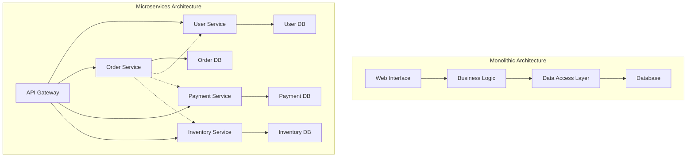
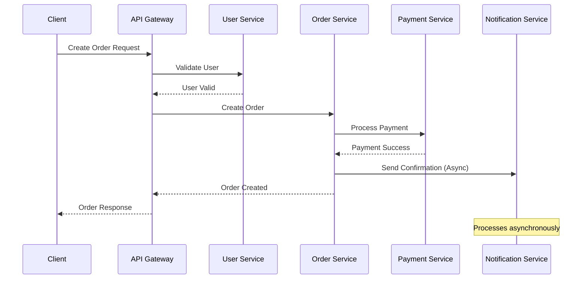
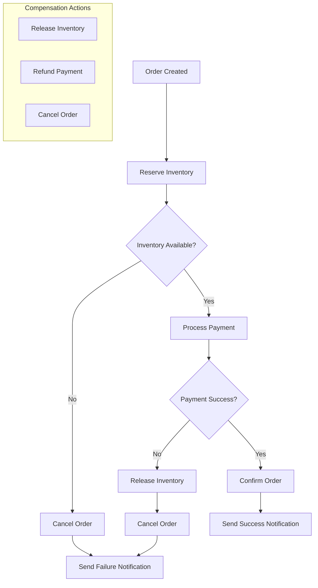
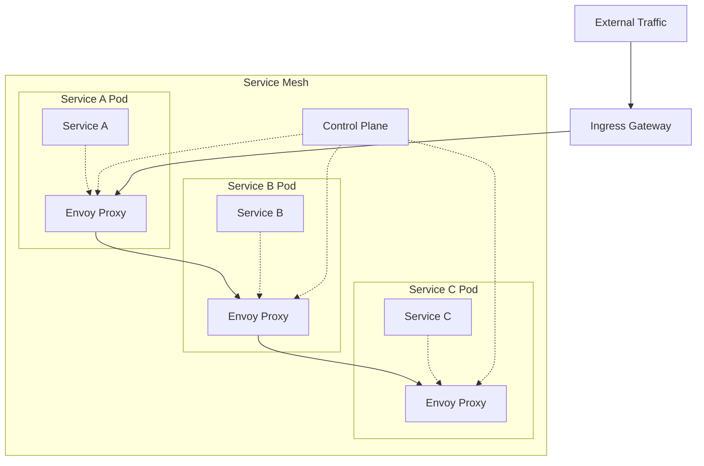
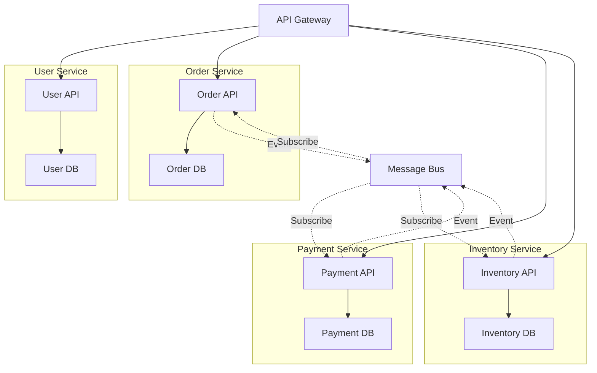

# Microservices Architecture and Design Patterns

## Introduction

Microservices architecture is a method of developing software systems that structures an application as a collection of loosely coupled services. This approach enables organizations to deliver large, complex applications rapidly, frequently, and reliably.

## Core Concepts

### Microservices vs Monolithic Architecture



### Service Communication Patterns



## Advanced Design Patterns

### Event-Driven Architecture

```javascript
// Event Publisher
class EventPublisher {
  constructor(eventBus) {
    this.eventBus = eventBus;
  }

  async publishEvent(eventType, data) {
    const event = {
      id: generateUUID(),
      type: eventType,
      data,
      timestamp: new Date().toISOString(),
      version: '1.0'
    };

    try {
      await this.eventBus.publish(eventType, event);
      console.log(`Event published: ${eventType}`, event.id);
    } catch (error) {
      console.error('Failed to publish event:', error);
      throw error;
    }
  }
}

// Event Subscriber
class OrderEventHandler {
  constructor(eventBus, orderService) {
    this.eventBus = eventBus;
    this.orderService = orderService;
    this.setupSubscriptions();
  }

  setupSubscriptions() {
    this.eventBus.subscribe('user.created', this.handleUserCreated.bind(this));
    this.eventBus.subscribe('payment.processed', this.handlePaymentProcessed.bind(this));
    this.eventBus.subscribe('inventory.updated', this.handleInventoryUpdated.bind(this));
  }

  async handleUserCreated(event) {
    try {
      console.log('Processing user created event:', event.id);
      // Initialize user's order history
      await this.orderService.initializeUserOrderHistory(event.data.userId);
    } catch (error) {
      console.error('Failed to handle user created event:', error);
      // Implement retry logic or dead letter queue
    }
  }

  async handlePaymentProcessed(event) {
    try {
      const { orderId, paymentStatus } = event.data;
      
      if (paymentStatus === 'success') {
        await this.orderService.confirmOrder(orderId);
        
        // Publish order confirmed event
        await this.eventBus.publish('order.confirmed', {
          orderId,
          timestamp: new Date().toISOString()
        });
      } else {
        await this.orderService.cancelOrder(orderId);
      }
    } catch (error) {
      console.error('Failed to handle payment processed event:', error);
    }
  }
}
```

### Saga Pattern for Distributed Transactions



```javascript
// Saga Orchestrator
class OrderSaga {
  constructor(services) {
    this.inventoryService = services.inventory;
    this.paymentService = services.payment;
    this.orderService = services.order;
    this.notificationService = services.notification;
  }

  async executeOrderSaga(orderData) {
    const sagaId = generateUUID();
    const compensations = [];

    try {
      // Step 1: Create Order
      console.log(`Saga ${sagaId}: Creating order`);
      const order = await this.orderService.createOrder(orderData);
      compensations.push(() => this.orderService.cancelOrder(order.id));

      // Step 2: Reserve Inventory
      console.log(`Saga ${sagaId}: Reserving inventory`);
      const reservation = await this.inventoryService.reserveItems(order.items);
      compensations.push(() => this.inventoryService.releaseReservation(reservation.id));

      // Step 3: Process Payment
      console.log(`Saga ${sagaId}: Processing payment`);
      const payment = await this.paymentService.processPayment({
        amount: order.total,
        customerId: order.customerId,
        orderId: order.id
      });
      compensations.push(() => this.paymentService.refundPayment(payment.id));

      // Step 4: Confirm Order
      console.log(`Saga ${sagaId}: Confirming order`);
      await this.orderService.confirmOrder(order.id);

      // Step 5: Send Notification
      await this.notificationService.sendOrderConfirmation(order);

      console.log(`Saga ${sagaId}: Completed successfully`);
      return { success: true, orderId: order.id };

    } catch (error) {
      console.error(`Saga ${sagaId}: Failed, executing compensations`, error);
      
      // Execute compensations in reverse order
      for (let i = compensations.length - 1; i >= 0; i--) {
        try {
          await compensations[i]();
        } catch (compensationError) {
          console.error(`Saga ${sagaId}: Compensation failed`, compensationError);
        }
      }

      return { success: false, error: error.message };
    }
  }
}
```

### Circuit Breaker Pattern

```javascript
class CircuitBreaker {
  constructor(options = {}) {
    this.failureThreshold = options.failureThreshold || 5;
    this.recoveryTimeout = options.recoveryTimeout || 60000;
    this.monitoringPeriod = options.monitoringPeriod || 10000;
    
    this.state = 'CLOSED'; // CLOSED, OPEN, HALF_OPEN
    this.failureCount = 0;
    this.lastFailureTime = null;
    this.successCount = 0;
  }

  async execute(operation) {
    if (this.state === 'OPEN') {
      if (Date.now() - this.lastFailureTime >= this.recoveryTimeout) {
        this.state = 'HALF_OPEN';
        this.successCount = 0;
      } else {
        throw new Error('Circuit breaker is OPEN');
      }
    }

    try {
      const result = await operation();
      this.onSuccess();
      return result;
    } catch (error) {
      this.onFailure();
      throw error;
    }
  }

  onSuccess() {
    this.failureCount = 0;
    
    if (this.state === 'HALF_OPEN') {
      this.successCount++;
      if (this.successCount >= 3) { // Require 3 successes to close
        this.state = 'CLOSED';
      }
    }
  }

  onFailure() {
    this.failureCount++;
    this.lastFailureTime = Date.now();

    if (this.failureCount >= this.failureThreshold) {
      this.state = 'OPEN';
    }
  }

  getState() {
    return {
      state: this.state,
      failureCount: this.failureCount,
      lastFailureTime: this.lastFailureTime
    };
  }
}

// Usage in service
class PaymentService {
  constructor() {
    this.circuitBreaker = new CircuitBreaker({
      failureThreshold: 5,
      recoveryTimeout: 30000
    });
  }

  async processPayment(paymentData) {
    return this.circuitBreaker.execute(async () => {
      // Actual payment processing logic
      const response = await fetch('/api/external-payment', {
        method: 'POST',
        body: JSON.stringify(paymentData),
        timeout: 10000
      });

      if (!response.ok) {
        throw new Error(`Payment failed: ${response.status}`);
      }

      return response.json();
    });
  }
}
```

## Service Mesh Architecture



### Service Discovery and Load Balancing

```javascript
// Service Registry
class ServiceRegistry {
  constructor() {
    this.services = new Map();
    this.healthChecks = new Map();
  }

  registerService(serviceName, instance) {
    if (!this.services.has(serviceName)) {
      this.services.set(serviceName, []);
    }
    
    this.services.get(serviceName).push({
      ...instance,
      registeredAt: Date.now(),
      healthy: true
    });

    // Start health checking
    this.startHealthCheck(serviceName, instance);
    
    console.log(`Service registered: ${serviceName}`, instance);
  }

  deregisterService(serviceName, instanceId) {
    const instances = this.services.get(serviceName);
    if (instances) {
      const index = instances.findIndex(i => i.id === instanceId);
      if (index !== -1) {
        instances.splice(index, 1);
        console.log(`Service deregistered: ${serviceName}/${instanceId}`);
      }
    }
  }

  getHealthyInstances(serviceName) {
    const instances = this.services.get(serviceName) || [];
    return instances.filter(instance => instance.healthy);
  }

  async startHealthCheck(serviceName, instance) {
    const checkInterval = setInterval(async () => {
      try {
        const response = await fetch(`${instance.url}/health`, {
          timeout: 5000
        });
        
        const isHealthy = response.ok;
        this.updateInstanceHealth(serviceName, instance.id, isHealthy);
        
      } catch (error) {
        this.updateInstanceHealth(serviceName, instance.id, false);
      }
    }, 30000); // Check every 30 seconds

    this.healthChecks.set(`${serviceName}/${instance.id}`, checkInterval);
  }

  updateInstanceHealth(serviceName, instanceId, healthy) {
    const instances = this.services.get(serviceName);
    if (instances) {
      const instance = instances.find(i => i.id === instanceId);
      if (instance) {
        instance.healthy = healthy;
        instance.lastHealthCheck = Date.now();
      }
    }
  }
}

// Load Balancer
class LoadBalancer {
  constructor(serviceRegistry) {
    this.serviceRegistry = serviceRegistry;
    this.strategies = {
      'round-robin': this.roundRobin.bind(this),
      'least-connections': this.leastConnections.bind(this),
      'weighted': this.weighted.bind(this)
    };
    this.counters = new Map();
  }

  async route(serviceName, strategy = 'round-robin') {
    const instances = this.serviceRegistry.getHealthyInstances(serviceName);
    
    if (instances.length === 0) {
      throw new Error(`No healthy instances available for ${serviceName}`);
    }

    const selectedInstance = this.strategies[strategy](instances, serviceName);
    return selectedInstance;
  }

  roundRobin(instances, serviceName) {
    if (!this.counters.has(serviceName)) {
      this.counters.set(serviceName, 0);
    }
    
    const counter = this.counters.get(serviceName);
    const instance = instances[counter % instances.length];
    this.counters.set(serviceName, counter + 1);
    
    return instance;
  }

  leastConnections(instances) {
    return instances.reduce((min, current) => 
      (current.activeConnections || 0) < (min.activeConnections || 0) ? current : min
    );
  }

  weighted(instances) {
    const totalWeight = instances.reduce((sum, instance) => sum + (instance.weight || 1), 0);
    let random = Math.random() * totalWeight;
    
    for (const instance of instances) {
      random -= (instance.weight || 1);
      if (random <= 0) {
        return instance;
      }
    }
    
    return instances[0];
  }
}
```

## Data Management Patterns

### Database per Service



### CQRS (Command Query Responsibility Segregation)

```javascript
// Command Side
class OrderCommandHandler {
  constructor(eventStore, orderRepository) {
    this.eventStore = eventStore;
    this.orderRepository = orderRepository;
  }

  async createOrder(command) {
    const { customerId, items, total } = command;
    
    // Validate command
    if (!customerId || !items || items.length === 0) {
      throw new Error('Invalid order command');
    }

    // Create domain event
    const event = {
      type: 'OrderCreated',
      aggregateId: generateUUID(),
      data: {
        customerId,
        items,
        total,
        status: 'pending',
        createdAt: new Date().toISOString()
      },
      version: 1
    };

    // Store event
    await this.eventStore.append(event.aggregateId, [event]);

    // Update write model
    const order = new Order(event.data);
    await this.orderRepository.save(order);

    return { orderId: event.aggregateId };
  }

  async updateOrderStatus(command) {
    const { orderId, status } = command;
    
    // Load events
    const events = await this.eventStore.getEvents(orderId);
    const order = Order.fromEvents(events);
    
    // Apply business logic
    order.updateStatus(status);
    
    // Create new event
    const event = {
      type: 'OrderStatusUpdated',
      aggregateId: orderId,
      data: { status, updatedAt: new Date().toISOString() },
      version: events.length + 1
    };

    // Store event
    await this.eventStore.append(orderId, [event]);
    
    // Update write model
    await this.orderRepository.save(order);
  }
}

// Query Side
class OrderQueryHandler {
  constructor(readDatabase) {
    this.readDatabase = readDatabase;
  }

  async getOrderById(orderId) {
    return this.readDatabase.orders.findById(orderId);
  }

  async getOrdersByCustomer(customerId, filters = {}) {
    const query = { customerId };
    
    if (filters.status) {
      query.status = filters.status;
    }
    
    if (filters.dateFrom) {
      query.createdAt = { $gte: filters.dateFrom };
    }

    return this.readDatabase.orders.find(query)
      .sort({ createdAt: -1 })
      .limit(filters.limit || 50);
  }

  async getOrderStatistics(customerId) {
    return this.readDatabase.orders.aggregate([
      { $match: { customerId } },
      {
        $group: {
          _id: '$status',
          count: { $sum: 1 },
          totalAmount: { $sum: '$total' }
        }
      }
    ]);
  }
}

// Event Projector (Updates Read Models)
class OrderProjector {
  constructor(readDatabase) {
    this.readDatabase = readDatabase;
  }

  async handleOrderCreated(event) {
    const orderView = {
      id: event.aggregateId,
      customerId: event.data.customerId,
      items: event.data.items,
      total: event.data.total,
      status: event.data.status,
      createdAt: event.data.createdAt,
      updatedAt: event.data.createdAt
    };

    await this.readDatabase.orders.insert(orderView);
  }

  async handleOrderStatusUpdated(event) {
    await this.readDatabase.orders.updateOne(
      { id: event.aggregateId },
      {
        $set: {
          status: event.data.status,
          updatedAt: event.data.updatedAt
        }
      }
    );
  }
}
```

## Interview Questions & Answers

### Question 1: What are the main advantages and challenges of microservices architecture?
**Difficulty**: Senior  
**Category**: Architecture Concepts

**Answer**: 

**Advantages**:
- **Independent Deployment**: Services can be deployed independently
- **Technology Diversity**: Different services can use different technologies
- **Scalability**: Scale individual services based on demand
- **Fault Isolation**: Failure in one service doesn't bring down the entire system
- **Team Autonomy**: Teams can work independently on different services

**Challenges**:
- **Distributed System Complexity**: Network latency, partial failures
- **Data Consistency**: Managing transactions across services
- **Service Discovery**: Finding and communicating with services
- **Monitoring and Debugging**: Tracing requests across multiple services
- **Operational Overhead**: More services to deploy and manage

**Code Example**:
```javascript
// Service communication with retry and circuit breaker
class ServiceClient {
  constructor(serviceName, options = {}) {
    this.serviceName = serviceName;
    this.circuitBreaker = new CircuitBreaker(options.circuitBreaker);
    this.retryOptions = options.retry || { attempts: 3, delay: 1000 };
  }

  async call(endpoint, data) {
    return this.circuitBreaker.execute(async () => {
      return this.retryWithBackoff(async () => {
        const serviceUrl = await this.discoverService(this.serviceName);
        const response = await fetch(`${serviceUrl}${endpoint}`, {
          method: 'POST',
          body: JSON.stringify(data),
          headers: { 'Content-Type': 'application/json' },
          timeout: 10000
        });

        if (!response.ok) {
          throw new Error(`Service call failed: ${response.status}`);
        }

        return response.json();
      });
    });
  }

  async retryWithBackoff(operation) {
    let lastError;
    
    for (let attempt = 1; attempt <= this.retryOptions.attempts; attempt++) {
      try {
        return await operation();
      } catch (error) {
        lastError = error;
        
        if (attempt < this.retryOptions.attempts) {
          const delay = this.retryOptions.delay * Math.pow(2, attempt - 1);
          await new Promise(resolve => setTimeout(resolve, delay));
        }
      }
    }
    
    throw lastError;
  }
}
```

### Question 2: How do you handle data consistency in microservices?
**Difficulty**: Expert  
**Category**: Data Management

**Answer**: Data consistency in microservices requires different approaches than traditional ACID transactions:

**Patterns**:
1. **Saga Pattern**: Manage distributed transactions through compensating actions
2. **Event Sourcing**: Store events instead of current state
3. **CQRS**: Separate read and write models
4. **Eventual Consistency**: Accept temporary inconsistency for better availability

**Code Example**:
```javascript
// Saga Pattern Implementation
class OrderSagaOrchestrator {
  async processOrder(orderData) {
    const saga = new Saga('order-processing');
    
    try {
      // Step 1: Validate customer
      await saga.execute(
        () => this.customerService.validateCustomer(orderData.customerId),
        () => this.customerService.releaseCustomerLock(orderData.customerId)
      );

      // Step 2: Reserve inventory
      const reservation = await saga.execute(
        () => this.inventoryService.reserveItems(orderData.items),
        (reservation) => this.inventoryService.cancelReservation(reservation.id)
      );

      // Step 3: Process payment
      const payment = await saga.execute(
        () => this.paymentService.chargeCustomer(orderData.payment),
        (payment) => this.paymentService.refund(payment.id)
      );

      // Step 4: Create order
      const order = await saga.execute(
        () => this.orderService.createOrder({ ...orderData, paymentId: payment.id }),
        (order) => this.orderService.cancelOrder(order.id)
      );

      await saga.complete();
      return order;

    } catch (error) {
      await saga.compensate();
      throw error;
    }
  }
}

class Saga {
  constructor(sagaId) {
    this.sagaId = sagaId;
    this.steps = [];
  }

  async execute(action, compensation) {
    try {
      const result = await action();
      this.steps.push({ compensation, result });
      return result;
    } catch (error) {
      await this.compensate();
      throw error;
    }
  }

  async compensate() {
    // Execute compensations in reverse order
    for (let i = this.steps.length - 1; i >= 0; i--) {
      try {
        await this.steps[i].compensation(this.steps[i].result);
      } catch (compensationError) {
        console.error('Compensation failed:', compensationError);
      }
    }
  }

  async complete() {
    console.log(`Saga ${this.sagaId} completed successfully`);
  }
}
```

### Question 3: How do you implement service discovery in microservices?
**Difficulty**: Senior  
**Category**: Infrastructure

**Answer**: Service discovery enables services to find and communicate with each other dynamically:

**Patterns**:
1. **Client-Side Discovery**: Client queries service registry
2. **Server-Side Discovery**: Load balancer queries service registry
3. **Service Registry**: Central database of service instances

**Code Example**:
```javascript
// Service Registry with Health Checking
class ServiceRegistry {
  constructor() {
    this.services = new Map();
    this.startHealthChecking();
  }

  async register(serviceName, instance) {
    const serviceInstances = this.services.get(serviceName) || [];
    
    const serviceInstance = {
      ...instance,
      id: generateUUID(),
      registeredAt: Date.now(),
      lastHeartbeat: Date.now(),
      healthy: true
    };

    serviceInstances.push(serviceInstance);
    this.services.set(serviceName, serviceInstances);

    console.log(`Service registered: ${serviceName}`, serviceInstance);
    return serviceInstance.id;
  }

  async discover(serviceName) {
    const instances = this.services.get(serviceName) || [];
    return instances.filter(instance => instance.healthy);
  }

  async heartbeat(serviceName, instanceId) {
    const instances = this.services.get(serviceName) || [];
    const instance = instances.find(i => i.id === instanceId);
    
    if (instance) {
      instance.lastHeartbeat = Date.now();
      instance.healthy = true;
    }
  }

  startHealthChecking() {
    setInterval(() => {
      const now = Date.now();
      const healthTimeout = 30000; // 30 seconds

      for (const [serviceName, instances] of this.services) {
        for (const instance of instances) {
          if (now - instance.lastHeartbeat > healthTimeout) {
            instance.healthy = false;
            console.log(`Service unhealthy: ${serviceName}/${instance.id}`);
          }
        }
      }
    }, 10000); // Check every 10 seconds
  }
}

// Service Discovery Client
class ServiceDiscoveryClient {
  constructor(registryUrl) {
    this.registryUrl = registryUrl;
    this.cache = new Map();
    this.cacheTimeout = 30000; // 30 seconds
  }

  async discoverService(serviceName) {
    // Check cache first
    const cached = this.cache.get(serviceName);
    if (cached && Date.now() - cached.timestamp < this.cacheTimeout) {
      return this.selectInstance(cached.instances);
    }

    // Fetch from registry
    const response = await fetch(`${this.registryUrl}/discover/${serviceName}`);
    const instances = await response.json();

    // Update cache
    this.cache.set(serviceName, {
      instances,
      timestamp: Date.now()
    });

    return this.selectInstance(instances);
  }

  selectInstance(instances) {
    if (instances.length === 0) {
      throw new Error('No healthy instances available');
    }

    // Simple round-robin selection
    const randomIndex = Math.floor(Math.random() * instances.length);
    return instances[randomIndex];
  }
}
```

### Question 4: How do you handle distributed tracing in microservices?
**Difficulty**: Senior  
**Category**: Observability

**Answer**: Distributed tracing tracks requests across multiple services to understand system behavior and debug issues:

**Code Example**:
```javascript
// Distributed Tracing Implementation
class TracingMiddleware {
  constructor(serviceName) {
    this.serviceName = serviceName;
  }

  middleware() {
    return (req, res, next) => {
      // Extract or generate trace context
      const traceId = req.headers['x-trace-id'] || this.generateTraceId();
      const spanId = this.generateSpanId();
      const parentSpanId = req.headers['x-parent-span-id'];

      // Create span
      const span = {
        traceId,
        spanId,
        parentSpanId,
        serviceName: this.serviceName,
        operationName: `${req.method} ${req.path}`,
        startTime: Date.now(),
        tags: {
          'http.method': req.method,
          'http.url': req.url,
          'user.id': req.user?.id
        }
      };

      // Add to request context
      req.tracing = { traceId, spanId, span };

      // Set response headers
      res.setHeader('x-trace-id', traceId);

      // Finish span on response
      res.on('finish', () => {
        span.endTime = Date.now();
        span.duration = span.endTime - span.startTime;
        span.tags['http.status_code'] = res.statusCode;
        
        this.sendSpan(span);
      });

      next();
    };
  }

  generateTraceId() {
    return Math.random().toString(36).substring(2, 15) + 
           Math.random().toString(36).substring(2, 15);
  }

  generateSpanId() {
    return Math.random().toString(36).substring(2, 10);
  }

  async sendSpan(span) {
    try {
      await fetch('http://jaeger-collector:14268/api/traces', {
        method: 'POST',
        headers: { 'Content-Type': 'application/json' },
        body: JSON.stringify({
          data: [{
            traceID: span.traceId,
            spanID: span.spanId,
            parentSpanID: span.parentSpanId,
            operationName: span.operationName,
            startTime: span.startTime * 1000, // microseconds
            duration: span.duration * 1000,
            tags: Object.entries(span.tags).map(([key, value]) => ({
              key,
              type: typeof value === 'string' ? 'string' : 'number',
              value: value.toString()
            }))
          }]
        })
      });
    } catch (error) {
      console.error('Failed to send span:', error);
    }
  }
}

// Service-to-service call with tracing
class TracedHttpClient {
  constructor(serviceName) {
    this.serviceName = serviceName;
  }

  async call(url, options = {}, traceContext) {
    const headers = {
      ...options.headers,
      'x-trace-id': traceContext.traceId,
      'x-parent-span-id': traceContext.spanId
    };

    const startTime = Date.now();
    
    try {
      const response = await fetch(url, {
        ...options,
        headers
      });

      // Log successful call
      this.logSpan(traceContext, url, startTime, response.status);
      
      return response;
    } catch (error) {
      // Log failed call
      this.logSpan(traceContext, url, startTime, 0, error);
      throw error;
    }
  }

  logSpan(traceContext, url, startTime, statusCode, error = null) {
    const span = {
      traceId: traceContext.traceId,
      spanId: this.generateSpanId(),
      parentSpanId: traceContext.spanId,
      serviceName: this.serviceName,
      operationName: `HTTP ${url}`,
      startTime,
      endTime: Date.now(),
      tags: {
        'http.url': url,
        'http.status_code': statusCode,
        ...(error && { 'error': true, 'error.message': error.message })
      }
    };

    span.duration = span.endTime - span.startTime;
    this.sendSpan(span);
  }
}
```

### Question 5: How do you implement API versioning in microservices?
**Difficulty**: Senior  
**Category**: API Design

**Answer**: API versioning in microservices requires careful planning to maintain backward compatibility:

**Strategies**:
1. **URL Path Versioning**: `/api/v1/users`, `/api/v2/users`
2. **Header Versioning**: `API-Version: v2`
3. **Content Negotiation**: `Accept: application/vnd.api.v2+json`

**Code Example**:
```javascript
// API Gateway with Version Routing
class APIGateway {
  constructor() {
    this.routes = new Map();
    this.versionStrategies = {
      'path': this.extractVersionFromPath,
      'header': this.extractVersionFromHeader,
      'accept': this.extractVersionFromAccept
    };
  }

  registerRoute(pattern, versions, strategy = 'path') {
    this.routes.set(pattern, { versions, strategy });
  }

  async handleRequest(req, res) {
    const route = this.findRoute(req.path);
    if (!route) {
      return res.status(404).json({ error: 'Route not found' });
    }

    try {
      const version = this.extractVersion(req, route.strategy);
      const handler = route.versions[version] || route.versions.default;
      
      if (!handler) {
        return res.status(400).json({ 
          error: `Unsupported API version: ${version}` 
        });
      }

      await handler(req, res);
    } catch (error) {
      console.error('API Gateway error:', error);
      res.status(500).json({ error: 'Internal server error' });
    }
  }

  extractVersion(req, strategy) {
    return this.versionStrategies[strategy].call(this, req);
  }

  extractVersionFromPath(req) {
    const match = req.path.match(/\/api\/v(\d+)\//);
    return match ? `v${match[1]}` : 'v1';
  }

  extractVersionFromHeader(req) {
    return req.headers['api-version'] || 'v1';
  }

  extractVersionFromAccept(req) {
    const accept = req.headers.accept || '';
    const match = accept.match(/application\/vnd\.api\.v(\d+)\+json/);
    return match ? `v${match[1]}` : 'v1';
  }
}

// Version-aware service implementation
class UserService {
  constructor() {
    this.gateway = new APIGateway();
    this.setupRoutes();
  }

  setupRoutes() {
    this.gateway.registerRoute('/api/v*/users', {
      'v1': this.getUsersV1.bind(this),
      'v2': this.getUsersV2.bind(this),
      'default': this.getUsersV1.bind(this)
    });

    this.gateway.registerRoute('/api/users', {
      'v1': this.getUsersV1.bind(this),
      'v2': this.getUsersV2.bind(this),
      'default': this.getUsersV2.bind(this)
    }, 'header');
  }

  async getUsersV1(req, res) {
    const users = await this.userRepository.findAll();
    
    // V1 response format
    const response = users.map(user => ({
      id: user.id,
      name: user.name,
      email: user.email
    }));

    res.json(response);
  }

  async getUsersV2(req, res) {
    const users = await this.userRepository.findAll();
    
    // V2 response format with additional fields
    const response = {
      data: users.map(user => ({
        id: user.id,
        name: user.name,
        email: user.email,
        profile: {
          avatar: user.avatar,
          bio: user.bio,
          createdAt: user.createdAt
        }
      })),
      meta: {
        total: users.length,
        version: 'v2'
      }
    };

    res.json(response);
  }
}
```

## Key Takeaways

1. **Service Independence**: Each microservice should be independently deployable and scalable
2. **Data Ownership**: Each service owns its data and database schema
3. **Communication Patterns**: Use asynchronous messaging for loose coupling
4. **Failure Handling**: Implement circuit breakers, retries, and graceful degradation
5. **Observability**: Comprehensive logging, monitoring, and distributed tracing
6. **API Design**: Careful versioning and backward compatibility strategies
7. **Security**: Service-to-service authentication and authorization
8. **Testing**: Contract testing and end-to-end testing strategies

## Next Steps

- Learn about [Container Orchestration](./kubernetes-patterns.md)
- Explore [Event-Driven Architecture](./event-driven-systems.md)
- Study [Distributed System Patterns](./distributed-systems.md)