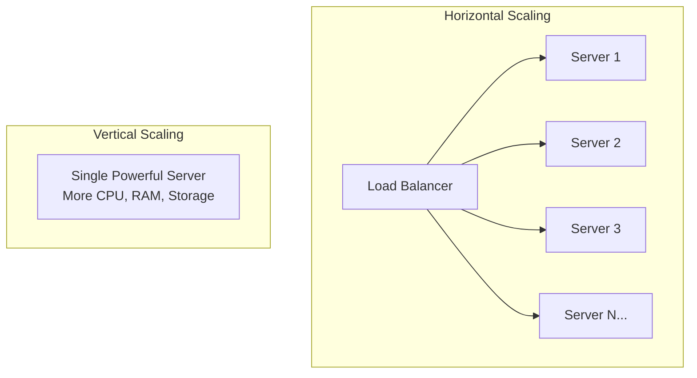
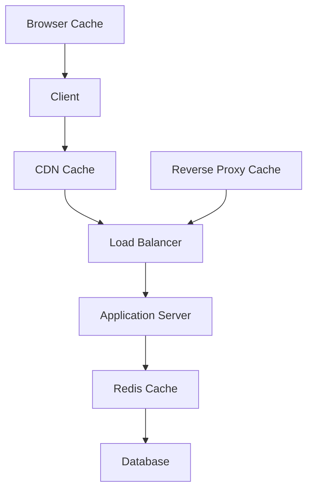
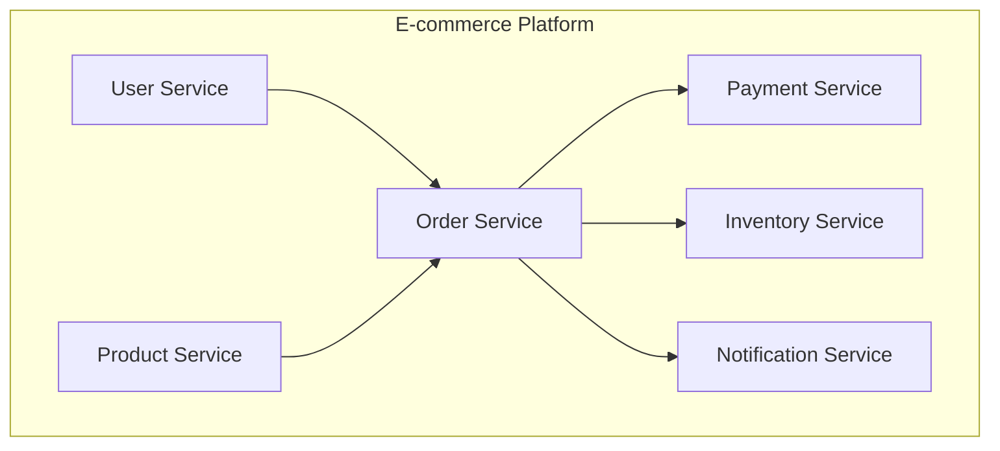
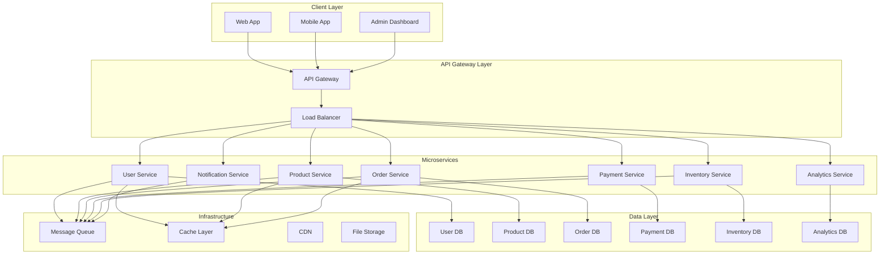
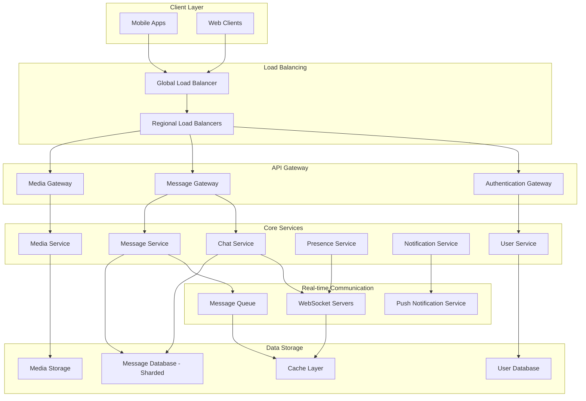

# Scalability Patterns and Microservices Architecture

## Introduction

Scalability patterns and microservices architecture are fundamental concepts for building large-scale, distributed systems that can handle millions of users and massive data volumes. This comprehensive guide covers architectural patterns, design principles, and real-world implementation strategies used by companies like Netflix, Amazon, and Google.

## Core Scalability Patterns

### 1. Horizontal vs Vertical Scaling

**Horizontal Scaling (Scale Out)**
- Adding more servers to handle increased load
- Better fault tolerance and cost-effectiveness
- Requires distributed system design patterns

**Vertical Scaling (Scale Up)**
- Adding more power (CPU, RAM) to existing servers
- Simpler to implement but has physical limits
- Single point of failure concerns



### 2. Database Scaling Patterns

**Read Replicas**
```javascript
// Master-Slave Configuration
const masterDB = new Database({
  host: 'master.db.company.com',
  role: 'write'
});

const readReplicas = [
  new Database({ host: 'replica1.db.company.com', role: 'read' }),
  new Database({ host: 'replica2.db.company.com', role: 'read' }),
  new Database({ host: 'replica3.db.company.com', role: 'read' })
];

class DatabaseRouter {
  async write(query) {
    return await masterDB.execute(query);
  }
  
  async read(query) {
    const replica = this.selectReplica();
    return await replica.execute(query);
  }
  
  selectReplica() {
    // Round-robin or least-connections strategy
    return readReplicas[Math.floor(Math.random() * readReplicas.length)];
  }
}
```

**Database Sharding**
```javascript
class ShardedDatabase {
  constructor() {
    this.shards = {
      shard1: new Database({ host: 'shard1.db.company.com' }),
      shard2: new Database({ host: 'shard2.db.company.com' }),
      shard3: new Database({ host: 'shard3.db.company.com' })
    };
  }
  
  getShardKey(userId) {
    // Hash-based sharding
    return `shard${(userId % 3) + 1}`;
  }
  
  async getUserData(userId) {
    const shardKey = this.getShardKey(userId);
    return await this.shards[shardKey].findUser(userId);
  }
}
```

### 3. Caching Strategies

**Multi-Level Caching Architecture**


**Cache Implementation Patterns**
```javascript
class CacheManager {
  constructor() {
    this.l1Cache = new Map(); // In-memory cache
    this.l2Cache = new RedisClient(); // Distributed cache
  }
  
  async get(key) {
    // L1 Cache check
    if (this.l1Cache.has(key)) {
      return this.l1Cache.get(key);
    }
    
    // L2 Cache check
    const l2Value = await this.l2Cache.get(key);
    if (l2Value) {
      this.l1Cache.set(key, l2Value);
      return l2Value;
    }
    
    // Database fallback
    const dbValue = await this.database.get(key);
    if (dbValue) {
      await this.l2Cache.set(key, dbValue, 3600); // 1 hour TTL
      this.l1Cache.set(key, dbValue);
    }
    
    return dbValue;
  }
}
```

## Microservices Architecture Fundamentals

### 1. Service Decomposition Strategies

**Domain-Driven Design (DDD) Approach**


**Microservice Boundaries**
```javascript
// User Service - Bounded Context
class UserService {
  async createUser(userData) {
    const user = await this.userRepository.create(userData);
    
    // Publish domain event
    await this.eventBus.publish('user.created', {
      userId: user.id,
      email: user.email,
      timestamp: new Date()
    });
    
    return user;
  }
}

// Order Service - Bounded Context
class OrderService {
  async createOrder(orderData) {
    // Validate user exists (via API call or event)
    const userExists = await this.userServiceClient.validateUser(orderData.userId);
    
    if (!userExists) {
      throw new Error('Invalid user');
    }
    
    const order = await this.orderRepository.create(orderData);
    
    // Publish order created event
    await this.eventBus.publish('order.created', {
      orderId: order.id,
      userId: order.userId,
      items: order.items,
      total: order.total
    });
    
    return order;
  }
}
```

### 2. Service Communication Patterns

**Synchronous Communication - REST APIs**
```javascript
class ProductServiceClient {
  constructor(baseUrl) {
    this.baseUrl = baseUrl;
    this.httpClient = new HttpClient({
      timeout: 5000,
      retries: 3,
      circuitBreaker: true
    });
  }
  
  async getProduct(productId) {
    try {
      const response = await this.httpClient.get(
        `${this.baseUrl}/products/${productId}`
      );
      return response.data;
    } catch (error) {
      if (error.code === 'CIRCUIT_BREAKER_OPEN') {
        // Return cached data or default response
        return this.getCachedProduct(productId);
      }
      throw error;
    }
  }
}
```

**Asynchronous Communication - Message Queues**
```javascript
class OrderEventHandler {
  constructor(messageQueue) {
    this.messageQueue = messageQueue;
    this.setupEventHandlers();
  }
  
  setupEventHandlers() {
    // Subscribe to order events
    this.messageQueue.subscribe('order.created', this.handleOrderCreated.bind(this));
    this.messageQueue.subscribe('payment.completed', this.handlePaymentCompleted.bind(this));
  }
  
  async handleOrderCreated(event) {
    const { orderId, userId, items } = event.data;
    
    // Update inventory
    await this.inventoryService.reserveItems(items);
    
    // Send notification
    await this.notificationService.sendOrderConfirmation(userId, orderId);
    
    // Process payment
    await this.paymentService.processPayment(orderId);
  }
  
  async handlePaymentCompleted(event) {
    const { orderId, status } = event.data;
    
    if (status === 'success') {
      await this.fulfillmentService.shipOrder(orderId);
    } else {
      await this.inventoryService.releaseReservation(orderId);
    }
  }
}
```

### 3. Data Consistency Patterns

**Saga Pattern for Distributed Transactions**
```javascript
class OrderSaga {
  constructor() {
    this.steps = [
      { service: 'inventory', action: 'reserve', compensate: 'release' },
      { service: 'payment', action: 'charge', compensate: 'refund' },
      { service: 'shipping', action: 'schedule', compensate: 'cancel' }
    ];
  }
  
  async executeOrder(orderData) {
    const sagaId = generateId();
    const executedSteps = [];
    
    try {
      for (const step of this.steps) {
        const result = await this.executeStep(step, orderData, sagaId);
        executedSteps.push({ step, result });
      }
      
      return { success: true, sagaId };
    } catch (error) {
      // Compensate in reverse order
      await this.compensate(executedSteps.reverse());
      throw error;
    }
  }
  
  async compensate(executedSteps) {
    for (const { step, result } of executedSteps) {
      try {
        await this.executeCompensation(step, result);
      } catch (compensationError) {
        // Log compensation failure for manual intervention
        console.error(`Compensation failed for ${step.service}:`, compensationError);
      }
    }
  }
}
```

**Event Sourcing Pattern**
```javascript
class EventStore {
  constructor() {
    this.events = new Map();
  }
  
  async appendEvent(aggregateId, event) {
    if (!this.events.has(aggregateId)) {
      this.events.set(aggregateId, []);
    }
    
    const eventWithMetadata = {
      ...event,
      eventId: generateId(),
      timestamp: new Date(),
      version: this.events.get(aggregateId).length + 1
    };
    
    this.events.get(aggregateId).push(eventWithMetadata);
    
    // Publish event to message bus
    await this.eventBus.publish(event.type, eventWithMetadata);
  }
  
  async getEvents(aggregateId, fromVersion = 0) {
    const events = this.events.get(aggregateId) || [];
    return events.filter(event => event.version > fromVersion);
  }
}

class OrderAggregate {
  constructor(orderId) {
    this.orderId = orderId;
    this.events = [];
    this.version = 0;
  }
  
  static async fromHistory(orderId, eventStore) {
    const order = new OrderAggregate(orderId);
    const events = await eventStore.getEvents(orderId);
    
    for (const event of events) {
      order.apply(event);
    }
    
    return order;
  }
  
  createOrder(orderData) {
    const event = {
      type: 'OrderCreated',
      data: { orderId: this.orderId, ...orderData }
    };
    
    this.apply(event);
    this.events.push(event);
  }
  
  apply(event) {
    switch (event.type) {
      case 'OrderCreated':
        this.status = 'created';
        this.items = event.data.items;
        this.total = event.data.total;
        break;
      case 'OrderPaid':
        this.status = 'paid';
        this.paymentId = event.data.paymentId;
        break;
      // ... other event handlers
    }
    this.version++;
  }
}
```

## Advanced Scalability Patterns

### 1. CQRS (Command Query Responsibility Segregation)

```javascript
// Command Side - Write Model
class OrderCommandHandler {
  constructor(eventStore) {
    this.eventStore = eventStore;
  }
  
  async handleCreateOrder(command) {
    const order = new OrderAggregate(command.orderId);
    order.createOrder(command.orderData);
    
    // Persist events
    for (const event of order.events) {
      await this.eventStore.appendEvent(command.orderId, event);
    }
  }
}

// Query Side - Read Model
class OrderQueryHandler {
  constructor(readDatabase) {
    this.readDatabase = readDatabase;
  }
  
  async getOrderSummary(orderId) {
    return await this.readDatabase.findOne('order_summaries', { orderId });
  }
  
  async getOrdersByUser(userId) {
    return await this.readDatabase.find('order_summaries', { userId });
  }
}

// Event Handler to update read models
class OrderProjectionHandler {
  constructor(readDatabase) {
    this.readDatabase = readDatabase;
  }
  
  async handleOrderCreated(event) {
    const summary = {
      orderId: event.data.orderId,
      userId: event.data.userId,
      status: 'created',
      total: event.data.total,
      createdAt: event.timestamp
    };
    
    await this.readDatabase.insert('order_summaries', summary);
  }
}
```

### 2. Circuit Breaker Pattern

```javascript
class CircuitBreaker {
  constructor(options = {}) {
    this.failureThreshold = options.failureThreshold || 5;
    this.resetTimeout = options.resetTimeout || 60000;
    this.monitoringPeriod = options.monitoringPeriod || 10000;
    
    this.state = 'CLOSED'; // CLOSED, OPEN, HALF_OPEN
    this.failureCount = 0;
    this.lastFailureTime = null;
    this.successCount = 0;
  }
  
  async execute(operation) {
    if (this.state === 'OPEN') {
      if (Date.now() - this.lastFailureTime >= this.resetTimeout) {
        this.state = 'HALF_OPEN';
        this.successCount = 0;
      } else {
        throw new Error('Circuit breaker is OPEN');
      }
    }
    
    try {
      const result = await operation();
      this.onSuccess();
      return result;
    } catch (error) {
      this.onFailure();
      throw error;
    }
  }
  
  onSuccess() {
    this.failureCount = 0;
    
    if (this.state === 'HALF_OPEN') {
      this.successCount++;
      if (this.successCount >= 3) {
        this.state = 'CLOSED';
      }
    }
  }
  
  onFailure() {
    this.failureCount++;
    this.lastFailureTime = Date.now();
    
    if (this.failureCount >= this.failureThreshold) {
      this.state = 'OPEN';
    }
  }
}

// Usage
const circuitBreaker = new CircuitBreaker({
  failureThreshold: 5,
  resetTimeout: 30000
});

class ExternalServiceClient {
  async callExternalAPI(data) {
    return await circuitBreaker.execute(async () => {
      const response = await fetch('https://external-api.com/endpoint', {
        method: 'POST',
        body: JSON.stringify(data),
        timeout: 5000
      });
      
      if (!response.ok) {
        throw new Error(`API call failed: ${response.status}`);
      }
      
      return response.json();
    });
  }
}
```

### 3. Bulkhead Pattern

```javascript
class ResourcePool {
  constructor(name, maxSize) {
    this.name = name;
    this.maxSize = maxSize;
    this.currentSize = 0;
    this.queue = [];
  }
  
  async acquire() {
    return new Promise((resolve, reject) => {
      if (this.currentSize < this.maxSize) {
        this.currentSize++;
        resolve();
      } else {
        this.queue.push({ resolve, reject });
      }
    });
  }
  
  release() {
    this.currentSize--;
    
    if (this.queue.length > 0) {
      const { resolve } = this.queue.shift();
      this.currentSize++;
      resolve();
    }
  }
}

class BulkheadService {
  constructor() {
    // Separate resource pools for different operations
    this.criticalPool = new ResourcePool('critical', 10);
    this.normalPool = new ResourcePool('normal', 5);
    this.backgroundPool = new ResourcePool('background', 2);
  }
  
  async executeCriticalOperation(operation) {
    await this.criticalPool.acquire();
    try {
      return await operation();
    } finally {
      this.criticalPool.release();
    }
  }
  
  async executeNormalOperation(operation) {
    await this.normalPool.acquire();
    try {
      return await operation();
    } finally {
      this.normalPool.release();
    }
  }
  
  async executeBackgroundOperation(operation) {
    await this.backgroundPool.acquire();
    try {
      return await operation();
    } finally {
      this.backgroundPool.release();
    }
  }
}
```

## Service Mesh and Advanced Communication

### 1. Service Discovery Pattern

```javascript
class ServiceRegistry {
  constructor() {
    this.services = new Map();
    this.healthChecks = new Map();
  }
  
  async registerService(serviceName, instance) {
    if (!this.services.has(serviceName)) {
      this.services.set(serviceName, []);
    }
    
    const serviceInstance = {
      id: generateId(),
      host: instance.host,
      port: instance.port,
      metadata: instance.metadata || {},
      registeredAt: new Date(),
      lastHealthCheck: new Date()
    };
    
    this.services.get(serviceName).push(serviceInstance);
    
    // Start health checking
    this.startHealthCheck(serviceName, serviceInstance);
    
    return serviceInstance.id;
  }
  
  async discoverService(serviceName) {
    const instances = this.services.get(serviceName) || [];
    const healthyInstances = instances.filter(instance => 
      Date.now() - instance.lastHealthCheck.getTime() < 30000
    );
    
    if (healthyInstances.length === 0) {
      throw new Error(`No healthy instances found for service: ${serviceName}`);
    }
    
    // Load balancing - round robin
    return healthyInstances[Math.floor(Math.random() * healthyInstances.length)];
  }
  
  async startHealthCheck(serviceName, instance) {
    const healthCheckInterval = setInterval(async () => {
      try {
        const response = await fetch(`http://${instance.host}:${instance.port}/health`);
        if (response.ok) {
          instance.lastHealthCheck = new Date();
        } else {
          this.removeUnhealthyInstance(serviceName, instance.id);
          clearInterval(healthCheckInterval);
        }
      } catch (error) {
        this.removeUnhealthyInstance(serviceName, instance.id);
        clearInterval(healthCheckInterval);
      }
    }, 10000);
  }
}
```

### 2. API Gateway Pattern

```javascript
class APIGateway {
  constructor() {
    this.routes = new Map();
    this.middleware = [];
    this.rateLimiter = new RateLimiter();
    this.authService = new AuthenticationService();
  }
  
  addRoute(path, serviceConfig) {
    this.routes.set(path, serviceConfig);
  }
  
  use(middleware) {
    this.middleware.push(middleware);
  }
  
  async handleRequest(request) {
    // Apply middleware
    for (const middleware of this.middleware) {
      request = await middleware(request);
    }
    
    // Rate limiting
    await this.rateLimiter.checkLimit(request.clientId);
    
    // Authentication
    const user = await this.authService.authenticate(request.headers.authorization);
    request.user = user;
    
    // Route to appropriate service
    const route = this.findRoute(request.path);
    if (!route) {
      throw new Error('Route not found');
    }
    
    // Load balancing and service discovery
    const serviceInstance = await this.serviceRegistry.discoverService(route.serviceName);
    
    // Forward request
    const response = await this.forwardRequest(request, serviceInstance, route);
    
    // Response transformation
    return this.transformResponse(response, route);
  }
  
  async forwardRequest(request, serviceInstance, route) {
    const targetUrl = `http://${serviceInstance.host}:${serviceInstance.port}${route.targetPath}`;
    
    return await fetch(targetUrl, {
      method: request.method,
      headers: {
        ...request.headers,
        'X-User-Id': request.user.id,
        'X-Request-Id': generateId()
      },
      body: request.body
    });
  }
}
```

## Real-World Architecture Examples

### 1. E-commerce Platform Architecture



### 2. Healthcare Data Processing System

```javascript
// Healthcare-specific microservices architecture
class HealthcareDataPlatform {
  constructor() {
    this.services = {
      patientService: new PatientService(),
      ehrService: new EHRService(), // Electronic Health Records
      hl7Service: new HL7ProcessingService(), // Healthcare data interchange
      analyticsService: new HealthAnalyticsService(),
      complianceService: new HIPAAComplianceService()
    };
    
    this.eventBus = new SecureEventBus();
    this.auditLogger = new AuditLogger();
  }
  
  async processPatientData(patientData) {
    // Audit all data access
    await this.auditLogger.log('patient_data_access', {
      userId: patientData.accessedBy,
      patientId: patientData.patientId,
      timestamp: new Date()
    });
    
    // HIPAA compliance check
    await this.services.complianceService.validateAccess(patientData);
    
    // Process HL7 messages
    const hl7Data = await this.services.hl7Service.parseMessage(patientData.hl7Message);
    
    // Update EHR
    await this.services.ehrService.updateRecord(hl7Data);
    
    // Trigger analytics
    await this.eventBus.publish('patient.data.updated', {
      patientId: hl7Data.patientId,
      dataType: hl7Data.messageType,
      timestamp: new Date()
    });
  }
}

class HL7ProcessingService {
  async parseMessage(hl7Message) {
    // Parse HL7 v2.x message format
    const segments = hl7Message.split('\r');
    const msh = this.parseSegment(segments[0]); // Message Header
    const pid = this.parseSegment(segments.find(s => s.startsWith('PID'))); // Patient ID
    
    return {
      messageType: msh.messageType,
      patientId: pid.patientId,
      timestamp: msh.timestamp,
      data: this.extractClinicalData(segments)
    };
  }
  
  parseSegment(segment) {
    const fields = segment.split('|');
    return {
      segmentType: fields[0],
      messageType: fields[8],
      patientId: fields[3],
      timestamp: new Date(fields[6])
    };
  }
}
```

## Performance Optimization Strategies

### 1. Database Optimization for Scale

```javascript
class OptimizedDatabaseService {
  constructor() {
    this.readReplicas = this.initializeReadReplicas();
    this.writeDatabase = this.initializeWriteDatabase();
    this.queryCache = new QueryCache();
    this.connectionPool = new ConnectionPool({
      min: 10,
      max: 100,
      acquireTimeoutMillis: 30000
    });
  }
  
  async executeQuery(query, params, options = {}) {
    const cacheKey = this.generateCacheKey(query, params);
    
    // Check cache first for read queries
    if (query.toLowerCase().startsWith('select')) {
      const cachedResult = await this.queryCache.get(cacheKey);
      if (cachedResult) {
        return cachedResult;
      }
    }
    
    // Route to appropriate database
    const database = query.toLowerCase().startsWith('select') 
      ? this.selectReadReplica() 
      : this.writeDatabase;
    
    const connection = await this.connectionPool.acquire();
    
    try {
      const result = await database.execute(query, params, { connection });
      
      // Cache read results
      if (query.toLowerCase().startsWith('select')) {
        await this.queryCache.set(cacheKey, result, options.cacheTTL || 300);
      }
      
      return result;
    } finally {
      this.connectionPool.release(connection);
    }
  }
  
  selectReadReplica() {
    // Weighted round-robin based on replica health
    const healthyReplicas = this.readReplicas.filter(replica => replica.isHealthy);
    return healthyReplicas[Math.floor(Math.random() * healthyReplicas.length)];
  }
}
```

### 2. Caching Strategy Implementation

```javascript
class MultiTierCacheStrategy {
  constructor() {
    this.l1Cache = new Map(); // In-memory cache
    this.l2Cache = new RedisCluster(); // Distributed cache
    this.l3Cache = new CDNCache(); // Edge cache
  }
  
  async get(key, options = {}) {
    // L1 Cache (fastest)
    if (this.l1Cache.has(key)) {
      return this.l1Cache.get(key);
    }
    
    // L2 Cache (distributed)
    const l2Value = await this.l2Cache.get(key);
    if (l2Value) {
      // Populate L1 cache
      this.l1Cache.set(key, l2Value);
      this.scheduleL1Eviction(key, options.l1TTL || 60);
      return l2Value;
    }
    
    // L3 Cache (CDN/Edge)
    if (options.useEdgeCache) {
      const l3Value = await this.l3Cache.get(key);
      if (l3Value) {
        // Populate L2 and L1 caches
        await this.l2Cache.set(key, l3Value, options.l2TTL || 3600);
        this.l1Cache.set(key, l3Value);
        return l3Value;
      }
    }
    
    return null;
  }
  
  async set(key, value, options = {}) {
    // Set in all cache levels
    this.l1Cache.set(key, value);
    await this.l2Cache.set(key, value, options.l2TTL || 3600);
    
    if (options.useEdgeCache) {
      await this.l3Cache.set(key, value, options.l3TTL || 86400);
    }
    
    this.scheduleL1Eviction(key, options.l1TTL || 60);
  }
  
  scheduleL1Eviction(key, ttlSeconds) {
    setTimeout(() => {
      this.l1Cache.delete(key);
    }, ttlSeconds * 1000);
  }
}
```

## Interview Questions and Answers

### System Design Questions (Senior Level)

**Question 1: Design a scalable chat application like WhatsApp that can handle 1 billion users.**

**Answer:**


**Key Design Decisions:**
1. **Horizontal Sharding**: Shard messages by chat_id to distribute load
2. **WebSocket Connections**: Maintain persistent connections for real-time messaging
3. **Message Queues**: Use Apache Kafka for reliable message delivery
4. **Caching Strategy**: Redis for active conversations and user presence
5. **CDN**: Global CDN for media files and static content

**Question 2: How would you handle data consistency in a distributed e-commerce system during high-traffic events like Black Friday?**

**Answer:**
```javascript
// Eventual Consistency with Saga Pattern
class BlackFridayOrderSaga {
  constructor() {
    this.steps = [
      {
        service: 'inventory',
        action: 'reserveStock',
        compensate: 'releaseStock',
        timeout: 5000
      },
      {
        service: 'payment',
        action: 'authorizePayment',
        compensate: 'voidPayment',
        timeout: 10000
      },
      {
        service: 'order',
        action: 'createOrder',
        compensate: 'cancelOrder',
        timeout: 3000
      },
      {
        service: 'fulfillment',
        action: 'scheduleShipping',
        compensate: 'cancelShipping',
        timeout: 5000
      }
    ];
  }
  
  async processOrder(orderData) {
    const sagaId = generateId();
    const context = { sagaId, orderData, executedSteps: [] };
    
    try {
      for (const step of this.steps) {
        const result = await this.executeStepWithTimeout(step, context);
        context.executedSteps.push({ step, result, timestamp: new Date() });
        
        // Publish progress event
        await this.eventBus.publish('saga.step.completed', {
          sagaId,
          step: step.service,
          result
        });
      }
      
      // All steps completed successfully
      await this.eventBus.publish('order.completed', {
        sagaId,
        orderId: context.executedSteps.find(s => s.step.service === 'order').result.orderId
      });
      
      return { success: true, sagaId };
      
    } catch (error) {
      // Compensate in reverse order
      await this.compensateTransaction(context);
      throw new Error(`Order processing failed: ${error.message}`);
    }
  }
  
  async executeStepWithTimeout(step, context) {
    return new Promise(async (resolve, reject) => {
      const timeoutId = setTimeout(() => {
        reject(new Error(`Step ${step.service} timed out`));
      }, step.timeout);
      
      try {
        const result = await this.serviceClients[step.service][step.action](context);
        clearTimeout(timeoutId);
        resolve(result);
      } catch (error) {
        clearTimeout(timeoutId);
        reject(error);
      }
    });
  }
}

// Optimistic Locking for Inventory
class InventoryService {
  async reserveStock(productId, quantity) {
    const maxRetries = 3;
    let retries = 0;
    
    while (retries < maxRetries) {
      try {
        const product = await this.getProductWithVersion(productId);
        
        if (product.availableStock < quantity) {
          throw new Error('Insufficient stock');
        }
        
        // Optimistic locking - update with version check
        const updated = await this.updateStockWithVersion(
          productId,
          product.availableStock - quantity,
          product.version
        );
        
        if (updated) {
          return { reserved: quantity, reservationId: generateId() };
        } else {
          // Version conflict, retry
          retries++;
          await this.sleep(Math.random() * 100); // Jitter
        }
      } catch (error) {
        if (error.message === 'Insufficient stock') {
          throw error;
        }
        retries++;
      }
    }
    
    throw new Error('Failed to reserve stock after retries');
  }
}
```

**Question 3: Explain how you would implement a distributed rate limiter for an API gateway.**

**Answer:**
```javascript
class DistributedRateLimiter {
  constructor(redisClient) {
    this.redis = redisClient;
    this.algorithms = {
      'token-bucket': new TokenBucketAlgorithm(redisClient),
      'sliding-window': new SlidingWindowAlgorithm(redisClient),
      'fixed-window': new FixedWindowAlgorithm(redisClient)
    };
  }
  
  async checkLimit(key, limit, windowSize, algorithm = 'sliding-window') {
    const limiter = this.algorithms[algorithm];
    return await limiter.checkLimit(key, limit, windowSize);
  }
}

class SlidingWindowAlgorithm {
  constructor(redisClient) {
    this.redis = redisClient;
  }
  
  async checkLimit(key, limit, windowSizeMs) {
    const now = Date.now();
    const windowStart = now - windowSizeMs;
    
    // Lua script for atomic operations
    const luaScript = `
      local key = KEYS[1]
      local window_start = ARGV[1]
      local now = ARGV[2]
      local limit = ARGV[3]
      
      -- Remove expired entries
      redis.call('ZREMRANGEBYSCORE', key, 0, window_start)
      
      -- Count current requests
      local current_count = redis.call('ZCARD', key)
      
      if current_count < tonumber(limit) then
        -- Add current request
        redis.call('ZADD', key, now, now)
        redis.call('EXPIRE', key, math.ceil(tonumber(ARGV[4]) / 1000))
        return {1, limit - current_count - 1}
      else
        return {0, 0}
      end
    `;
    
    const result = await this.redis.eval(
      luaScript,
      1,
      key,
      windowStart.toString(),
      now.toString(),
      limit.toString(),
      windowSizeMs.toString()
    );
    
    return {
      allowed: result[0] === 1,
      remainingRequests: result[1],
      resetTime: now + windowSizeMs
    };
  }
}

class TokenBucketAlgorithm {
  constructor(redisClient) {
    this.redis = redisClient;
  }
  
  async checkLimit(key, capacity, refillRate) {
    const now = Date.now();
    
    const luaScript = `
      local key = KEYS[1]
      local capacity = tonumber(ARGV[1])
      local refill_rate = tonumber(ARGV[2])
      local now = tonumber(ARGV[3])
      
      local bucket = redis.call('HMGET', key, 'tokens', 'last_refill')
      local tokens = tonumber(bucket[1]) or capacity
      local last_refill = tonumber(bucket[2]) or now
      
      -- Calculate tokens to add based on time elapsed
      local time_elapsed = (now - last_refill) / 1000
      local tokens_to_add = math.floor(time_elapsed * refill_rate)
      tokens = math.min(capacity, tokens + tokens_to_add)
      
      if tokens >= 1 then
        tokens = tokens - 1
        redis.call('HMSET', key, 'tokens', tokens, 'last_refill', now)
        redis.call('EXPIRE', key, 3600)
        return {1, tokens}
      else
        redis.call('HMSET', key, 'tokens', tokens, 'last_refill', now)
        redis.call('EXPIRE', key, 3600)
        return {0, tokens}
      end
    `;
    
    const result = await this.redis.eval(
      luaScript,
      1,
      key,
      capacity.toString(),
      refillRate.toString(),
      now.toString()
    );
    
    return {
      allowed: result[0] === 1,
      remainingTokens: result[1]
    };
  }
}
```

### Additional Interview Questions

**Question 4: How do you handle service discovery in a microservices architecture?**

**Answer:** Service discovery can be implemented using:
1. **Client-side discovery**: Services query a service registry directly
2. **Server-side discovery**: Load balancer queries service registry
3. **Service mesh**: Infrastructure layer handles discovery (Istio, Linkerd)

**Question 5: Explain the CAP theorem and how it applies to distributed systems.**

**Answer:** CAP theorem states you can only guarantee 2 out of 3:
- **Consistency**: All nodes see the same data simultaneously
- **Availability**: System remains operational
- **Partition tolerance**: System continues despite network failures

**Question 6: How would you implement blue-green deployment for microservices?**

**Answer:** Blue-green deployment involves maintaining two identical production environments and switching traffic between them for zero-downtime deployments.

**Question 7: What are the trade-offs between synchronous and asynchronous communication in microservices?**

**Answer:**
- **Synchronous**: Simpler debugging, immediate consistency, but creates coupling and cascading failures
- **Asynchronous**: Better resilience, loose coupling, but eventual consistency and complex debugging

**Question 8: How do you handle distributed transactions across microservices?**

**Answer:** Use patterns like:
1. **Saga Pattern**: Choreography or orchestration-based
2. **Two-Phase Commit**: For strong consistency (rarely used in microservices)
3. **Event Sourcing**: Store events instead of current state

**Question 9: Explain how you would implement caching in a distributed system.**

**Answer:** Multi-level caching strategy with cache-aside, write-through, or write-behind patterns, considering cache coherence and invalidation strategies.

**Question 10: How do you monitor and observe microservices in production?**

**Answer:** Implement the three pillars of observability:
1. **Metrics**: Application and infrastructure metrics
2. **Logging**: Structured logging with correlation IDs
3. **Tracing**: Distributed tracing across service boundaries

## Real-World Case Studies

### Netflix Architecture Evolution

Netflix evolved from a monolithic DVD-by-mail service to a global streaming platform serving 200+ million subscribers. Key architectural decisions:

1. **Microservices Decomposition**: 700+ microservices
2. **Chaos Engineering**: Chaos Monkey for resilience testing
3. **Circuit Breakers**: Hystrix for fault tolerance
4. **Event-Driven Architecture**: Asynchronous processing
5. **Global CDN**: Content delivery optimization

### Amazon's Service-Oriented Architecture

Amazon's transformation to microservices enabled:
1. **Two-Pizza Teams**: Small, autonomous teams
2. **API-First Design**: All services communicate via APIs
3. **Fault Isolation**: Service failures don't cascade
4. **Independent Deployment**: Teams deploy independently
5. **Technology Diversity**: Teams choose appropriate technologies

## Best Practices and Anti-Patterns

### Best Practices

1. **Domain-Driven Design**: Align services with business domains
2. **Database per Service**: Avoid shared databases
3. **API Versioning**: Maintain backward compatibility
4. **Monitoring and Alerting**: Comprehensive observability
5. **Automated Testing**: Unit, integration, and contract tests
6. **Infrastructure as Code**: Reproducible deployments
7. **Security by Design**: Authentication, authorization, encryption

### Common Anti-Patterns

1. **Distributed Monolith**: Tightly coupled services
2. **Chatty Interfaces**: Too many service calls
3. **Shared Database**: Multiple services accessing same DB
4. **Lack of Monitoring**: Poor visibility into system behavior
5. **Synchronous Communication**: Over-reliance on sync calls
6. **God Services**: Services that do too much

## Conclusion

Scalability patterns and microservices architecture are essential for building modern, large-scale distributed systems. Success requires careful consideration of trade-offs, proper implementation of patterns, and continuous monitoring and optimization. The key is to start simple and evolve the architecture as the system grows and requirements change.

Remember that microservices introduce complexity, so they should only be adopted when the benefits outweigh the costs. For many applications, a well-designed monolith might be the better choice initially, with migration to microservices as the system and team mature.